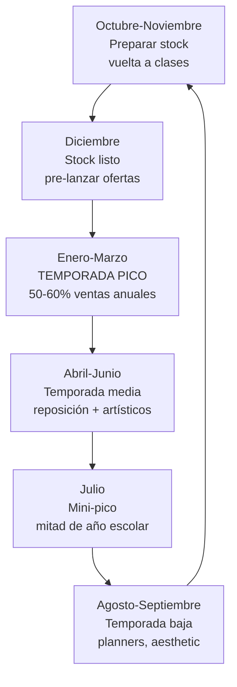
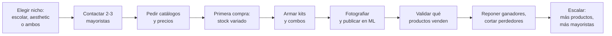

# Papelería y útiles escolares

> **Score: 7.25/10** — Puesto #6 en el ranking de oportunidades

La papelería es un rubro con una infraestructura mayorista **ya establecida y madura**. A diferencia de otros rubros donde tenés que buscar fábricas, acá existen distribuidores mayoristas con décadas de experiencia como Franpapel, Casa Paso, Casa Maer, Malí y Fan Librería que ya están preparados para vender a revendedores. La demanda es **predecible y estacional**, con un pico enorme en la vuelta a clases (enero-marzo).

<Note>
Este rubro es ideal para quienes prefieren un negocio con **menor riesgo y demanda predecible**. La red de mayoristas establecidos hace que empezar sea muy accesible — no necesitás negociar con fábricas ni buscar proveedores ocultos.
</Note>

---

## Score detallado

| # | Criterio | Peso | Puntaje | Ponderado |
|---|----------|------|---------|-----------|
| 1 | **Margen potencial** | 20% | 6/10 | 1.20 |
| 2 | **Demanda de mercado** | 18% | 7/10 | 1.26 |
| 3 | **Capital requerido** | 15% | 8/10 | 1.20 |
| 4 | **Simplicidad legal** | 12% | 9/10 | 1.08 |
| 5 | **Competencia** | 10% | 7/10 | 0.70 |
| 6 | **Facilidad logística** | 8% | 8/10 | 0.64 |
| 7 | **Accesibilidad de fábricas** | 7% | 8/10 | 0.56 |
| 8 | **Escalabilidad** | 5% | 6/10 | 0.30 |
| 9 | **Puente a importación** | 5% | 6/10 | 0.30 |
| | **Total** | **100%** | | **7.24** |

> **Score 7.24/10 — Bueno** — La red mayorista establecida y la baja barrera de entrada lo hacen ideal para principiantes que buscan un negocio predecible.

---

## Por qué está en el puesto #6

El rubro papelería tiene tres fortalezas clave:

1. **Red mayorista consolidada**: Empresas como Franpapel (solo mayorista), Casa Paso (alcance nacional), Fan Librería (35+ años, kits para emprendedores) y Malí (45+ años) tienen catálogos enormes y experiencia vendiendo a revendedores
2. **Estacionalidad predecible**: Sabés exactamente cuándo viene la demanda fuerte (enero-marzo para vuelta a clases, julio para mitad de año), lo que permite planificar stock con anticipación
3. **Logística simple**: Los productos son livianos, apilables, no frágiles y fáciles de enviar — todo lo contrario a decoración o productos frágiles

---

## Productos con mayor potencial

<CardGroup cols={3}>
<Card title="Útiles escolares" icon="pencil">
Cuadernos, carpetas, lápices, gomas, reglas, compases. Base del negocio.
</Card>
<Card title="Artísticos" icon="palette">
Marcadores, acuarelas, crayones, hojas canson, pinceles. Margen más alto.
</Card>
<Card title="Planners y agendas" icon="calendar">
Agendas anuales, planners semanales, bullet journals. Nicho premium.
</Card>
<Card title="Stickers y washi tape" icon="tape">
Stickers decorativos, washi tape, cintas. Tendencia kawaii/aesthetic.
</Card>
<Card title="Resaltadores y lapiceras" icon="highlighter">
Pastel, neón, punta fina. Los más buscados por el público joven.
</Card>
<Card title="Kits escolares" icon="box-open">
Combos armados por nivel (primaria, secundaria). Venta masiva pre-escolar.
</Card>
</CardGroup>

---

## Márgenes esperados

| Tipo de producto | Costo mayorista (ARS) | Precio venta (ARS) | Margen aproximado |
|-----------------|----------------------|--------------------|--------------------|
| Kit escolar primaria completo | $3,000 – $5,000 | $7,000 – $10,000 | 50% – 80% |
| Pack resaltadores pastel x6 | $1,500 – $2,500 | $3,500 – $5,500 | 50% – 70% |
| Agenda/planner premium | $2,000 – $3,000 | $5,000 – $7,000 | 50% – 80% |
| Cuaderno universitario x3 | $2,000 – $3,000 | $4,000 – $6,000 | 40% – 60% |
| Set washi tape x10 | $1,500 – $2,500 | $3,500 – $6,000 | 50% – 80% |
| Stickers decorativos pack | $500 – $1,200 | $1,200 – $3,000 | 50% – 80% |

<Note>
Todos los precios son **aproximados** para principios de 2026 (1 USD ~ 1,200 ARS). Los márgenes en papelería son más bajos que en decoración (40-80% vs. 60-150%), pero se compensan con **mayor volumen** y **menor riesgo**.
</Note>

**Rango general**: Comprás entre **$500 – $3,000 ARS** por item y vendés entre **$1,200 – $7,000 ARS** con márgenes del **40% al 80%**.

---

## Capital inicial necesario

| Nivel | Inversión (ARS) | Inversión (USD aprox.) | Qué podés hacer |
|-------|-----------------|----------------------|-----------------|
| **Mínimo** | $80,000 | ~USD 65 | Stock básico para armar 15-20 kits escolares |
| **Recomendado** | $120,000 | ~USD 100 | Stock variado: kits + productos individuales trendy |
| **Cómodo** | $150,000 | ~USD 125 | Stock profundo para cubrir vuelta a clases completa |

<Tip>
La papelería es uno de los rubros con **menor capital inicial requerido**. Con $80,000 ARS (~USD 65) podés arrancar porque los productos individuales son baratos y los mayoristas aceptan pedidos relativamente pequeños. Algunos como Fan Librería tienen **kits para emprendedores** ya armados.
</Tip>

---

## Mayoristas establecidos

Argentina tiene una red de mayoristas de papelería con **décadas de trayectoria** que están preparados para atender revendedores:

| Mayorista | Antigüedad | Tipo | Ventaja clave |
|-----------|-----------|------|---------------|
| **Franpapel** | Establecido | Solo mayorista | Catálogo completo, precios competitivos |
| **Casa Paso** | Establecido | Nacional | Asesoramiento para negocios nuevos |
| **Casa Maer** | Establecido | Bazar + Librería | Variedad: papelería + bazar |
| **Malí** | 45+ años | Tradicional | Experiencia, supply institucional |
| **Fan Librería** | 35+ años | Emprendedor-friendly | Kits específicos para revendedores |
| **DistriLap** | Establecido | Distribuidor | Marcas principales |
| **Librería Zalez** | Establecido | Variedad | Catálogo amplio online |

Para la guía detallada de cada mayorista, consultá [Proveedores de papelería](/app/paso1-argentina/oportunidades/papeleria/proveedores).

---

## Situación legal

| Aspecto | Requisito |
|---------|-----------|
| **Habilitación especial** | No necesitás |
| **Certificaciones** | No requeridas |
| **Registro de producto** | No aplica |
| **Lo que sí necesitás** | Monotributo, factura, cuenta bancaria |

La papelería tiene una de las **situaciones legales más simples** de todos los rubros. No hay regulaciones especiales, no necesitás permisos adicionales ni certificaciones. Con tu Monotributo activo podés empezar a comprar y revender.

---

## Logística — Punto fuerte del rubro

| Aspecto | Calificación | Detalle |
|---------|-------------|---------|
| **Peso** | Liviano | La mayoría de los productos pesan menos de 1 kg |
| **Fragilidad** | No frágil | Muy raro que algo se dañe en envío |
| **Almacenamiento** | Fácil | Apilable, no necesita condiciones especiales |
| **Envío** | Simple | Cabe en cajas estándar, correo normal |
| **Packaging** | Mínimo | Bolsa + caja, sin necesidad de protección especial |

<Tip>
La logística es uno de los **mayores atractivos** de papelería. No tenés el problema de fragilidad de decoración ni el peso de otros rubros. Un kit escolar completo cabe en una caja de 30x20x15 cm y pesa menos de 2 kg. Esto reduce drásticamente el costo de envío y las devoluciones por daño.
</Tip>

---

## Puente a importación desde China

**Score: 6/10 — Moderado**

Algunos productos de papelería se importan bien desde China, especialmente los de la tendencia aesthetic/kawaii:

| Producto local | Equivalente importable | Viabilidad |
|----------------|----------------------|------------|
| Washi tape | Washi tape (origen: Japón/China) | Alta |
| Stickers decorativos | Stickers en volumen | Alta |
| Resaltadores pastel | Highlighters pastel | Media |
| Planners/agendas | Planners con diseño | Media |
| Cuadernos básicos | Cuadernos genéricos | Baja (marca importa) |
| Lápices/bolígrafos | Bolígrafos genéricos | Baja (dominado por marcas) |

<Note>
Los productos básicos de papelería (cuadernos de marca como Rivadavia, bolígrafos Bic) **no conviene importarlos** porque las marcas locales dominan y la gente las prefiere. El puente a China funciona mejor con **productos de tendencia** (kawaii, aesthetic, washi tape, stickers) donde la marca importa menos.
</Note>

---

## Competencia

| Factor | Descripción |
|--------|-------------|
| **Librerías físicas** | Muchas, pero la mayoría no vende online o lo hace mal |
| **Vendedores online ML** | Presentes pero con listados genéricos sin diferenciación |
| **Tu ventaja** | Kits armados, nicho aesthetic/kawaii, contenido en redes |
| **Diferenciación** | Combos temáticos > productos sueltos |

La competencia en papelería es **media**: hay muchos vendedores de productos genéricos, pero hay espacio para quienes se especializan en **nichos** (papelería kawaii, kits pre-armados, planners premium) y tienen buena presentación online.

---

## Estacionalidad — El factor clave de papelería

La estacionalidad es **el factor más importante** de este rubro. La vuelta a clases (enero-marzo) puede representar el 50-60% de las ventas anuales.

### Calendario de acción

| Mes | Qué hacer |
|-----|-----------|
| **Octubre** | Contactar mayoristas, pedir catálogos actualizados |
| **Noviembre** | Hacer pedidos grandes, negociar precios por volumen |
| **Diciembre** | Recibir stock, armar kits, fotografiar, crear publicaciones |
| **Enero** | Lanzamiento fuerte: kits vuelta a clases en ML |
| **Febrero** | Pico de ventas, reponer stock si es necesario |
| **Marzo** | Últimas ventas escolares, transición a artísticos |
| **Julio** | Mini campaña: "reposición mitad de año" |
| **Todo el año** | Papelería aesthetic/kawaii (demanda constante) |

<Warning>
**Si llegás tarde a la vuelta a clases, perdiste la temporada.** Los mayoristas empiezan a quedarse sin stock de productos populares desde diciembre. Hacé tu pedido grande **en noviembre a más tardar**. En enero, algunos productos ya están agotados en los distribuidores.
</Warning>

---

## El nicho kawaii/aesthetic

<Tip>
La **papelería kawaii/aesthetic** es una tendencia creciente entre el público joven (15-30 años) que busca útiles escolares y de oficina con diseños lindos, colores pastel y estética de redes sociales. Este nicho permite márgenes más altos que la papelería genérica y tiene demanda **todo el año**, no solo en vuelta a clases.
</Tip>

Productos que entran en esta categoría:
- Resaltadores pastel y tonos especiales
- Washi tape decorativo (cintas adhesivas con diseño)
- Stickers para decorar cuadernos y planners
- Bolígrafos de gel con brillantina o formas divertidas
- Post-its con formas y colores especiales
- Planners y bullet journals decorativos
- Clips y accesorios de escritorio con diseño

---

## Flujo del negocio

---

## Preguntas frecuentes

<Accordion title="¿Necesito comprar mucho para empezar?">
No. Con $80,000-$120,000 ARS (~USD 65-100) podés arrancar comprando a mayoristas como Fan Librería que tienen **kits para emprendedores** con surtidos ya armados. No necesitás comprar 500 unidades de cada producto — empezá con variedad y poca profundidad.
</Accordion>

<Accordion title="¿Solo puedo vender en temporada escolar?">
No. La vuelta a clases es el pico, pero la papelería aesthetic/kawaii se vende **todo el año**. Además, los productos artísticos (marcadores, acuarelas) y de oficina (planners, organizadores de escritorio) tienen demanda constante.
</Accordion>

<Accordion title="¿Cuánto puedo ganar por mes?">
Estimación aproximada:
- **Temporada baja** (abril-noviembre): $80,000 – $150,000 ARS/mes (~USD 65-125) vendiendo aesthetic y artísticos
- **Temporada alta** (enero-marzo): $200,000 – $500,000 ARS/mes (~USD 170-420) con kits escolares
- **Promedio anual**: $120,000 – $250,000 ARS/mes (~USD 100-210)

Estas cifras dependen de la inversión inicial y la dedicación.
</Accordion>

<Accordion title="¿Conviene vender productos de marca o genéricos?">
**Ambos, para públicos diferentes.** Los productos de marca (Rivadavia, Faber-Castell, Bic) dan confianza al comprador de kits escolares. Los productos genéricos/importados (washi tape, stickers kawaii) dan mejor margen en el nicho aesthetic. Lo ideal es **mezclar**: kits escolares con marcas conocidas + productos trendy sin marca.
</Accordion>

<Accordion title="¿Los mayoristas entregan a domicilio?">
Varía por mayorista. Casa Paso y Fan Librería ofrecen **envío a todo el país**. Franpapel tiene opciones de retiro y entrega. Otros mayoristas trabajan con transportes de carga que entregan en tu domicilio por un costo adicional. Siempre preguntá las opciones de envío antes de comprar.
</Accordion>

---

## Próximos pasos

<CardGroup cols={2}>
<Card title="Proveedores de papelería" icon="store" href="/app/paso1-argentina/oportunidades/papeleria/proveedores">
Detalle de cada mayorista y cómo comprarles
</Card>
<Card title="Estrategia de venta" icon="bullseye" href="/app/paso1-argentina/oportunidades/papeleria/estrategia-venta">
Cómo vender papelería online aprovechando estacionalidad y tendencias
</Card>
</CardGroup>
