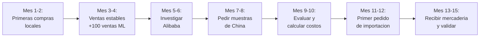
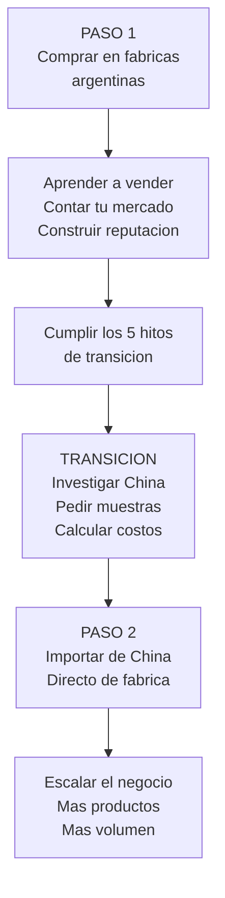

# Puente a la importacion

El Paso 1 (comprar en fabricas argentinas) no es un fin en si mismo. Es una **escuela practica** que te prepara para el Paso 2: importar productos directamente desde China con margenes todavia mejores. Esta pagina explica como hacer esa transicion de forma segura y estrategica.

<Note>
Todos los valores monetarios son aproximados a inicios de 2026 (1 USD ≈ 1200 ARS aproximado). Los tiempos de transicion son estimaciones basadas en dedicacion de 3-5 horas diarias.
</Note>

---

## Por que comprar local primero

Muchos emprendedores quieren saltar directamente a importar de China. Es comprensible: los precios son mucho mas bajos. Pero importar sin experiencia es una receta para perder plata.

**Lo que puede salir mal si importas sin experiencia:**
- Comprar productos que nadie quiere (no conoces tu mercado)
- No saber calcular costos reales (flete, aduana, impuestos)
- Recibir calidad diferente a las muestras
- Quedarte con stock que no podes vender
- No tener estructura para manejar el volumen
- Perder la inversion completa (USD 3,000-10,000)

**Lo que ganas comprando local primero:**
- Conoces tu mercado y tus clientes
- Sabes que productos se venden y cuales no
- Tenes infraestructura de venta funcionando
- Tenes reputacion en MercadoLibre
- Entiendes margenes, logistica y atencion al cliente
- Tu riesgo financiero es 10 veces menor

<Warning>
Importar desde China requiere una inversion minima de **USD 2,000-5,000** (aproximadamente $2,400,000-6,000,000 ARS) entre mercaderia, flete, aduana e impuestos. Si perdes esa plata por falta de experiencia, el golpe es muy fuerte. El Paso 1 te permite aprender con inversiones de USD 25-170.
</Warning>

---

## Habilidades que desarrollas en el Paso 1

Cada mes vendiendo productos de fabricas argentinas te enseña habilidades que son **directamente transferibles** a la importacion:

| Habilidad | Como la aprendes en Paso 1 | Como la usas en Paso 2 |
|-----------|---------------------------|----------------------|
| **Seleccion de productos** | Aprendes que se vende y que no | Elegis productos de China sabiendo que van a funcionar |
| **Negociacion con proveedores** | Negociar con fabricas argentinas | Negociar con fabricas chinas (misma logica, otro idioma) |
| **Control de calidad** | Revisar lo que te entregan vs. lo pedido | Inspeccionar muestras y envios de China |
| **Logistica y envios** | Manejar stock, embalaje, correo | Manejar contenedores, aduana, distribucion |
| **Atencion al cliente** | Responder consultas, manejar reclamos | Lo mismo pero con mayor volumen |
| **Fotografia de producto** | Crear fotos que vendan | Las mismas fotos sirven para productos importados |
| **Calculo de margenes** | Entender costos reales: producto + comision + envio + impuesto | Agregar flete internacional + aduana al calculo |
| **MercadoLibre / Instagram** | Construir reputacion y audiencia | Ya tenes un canal de venta funcionando |

---

## Hitos para hacer la transicion

No transiciones al Paso 2 hasta que hayas cumplido estos **5 hitos**. Cada uno indica que estas listo para dar el siguiente paso:

<Steps>
<Step title="Ventas mensuales consistentes > $500,000 ARS (~USD 415)">
Si no podes facturar $500,000 ARS por mes vendiendo productos locales, tampoco vas a poder venderlos importados. Este hito demuestra que **conoces tu mercado y sabes vender**.

Aproximado: alcanzable entre el **mes 3-6** si reinvertis ganancias.
</Step>

<Step title="Capital ahorrado > USD 3,000 (~$3,600,000 ARS)">
Importar requiere inversion minima de USD 2,000-3,000 para un primer pedido chico. Necesitas tener este capital **disponible** sin comprometer tu operacion local.

Aproximado: alcanzable entre el **mes 4-8** si reinvertis parte de las ganancias.
</Step>

<Step title="Reputacion en ML: 100+ ventas y buenas calificaciones">
Una cuenta de MercadoLibre con 100+ ventas y buenas calificaciones te posiciona mejor en el algoritmo. Cuando empeces a vender productos importados, ya vas a tener la base de reputacion.

Aproximado: alcanzable entre el **mes 3-6** dependiendo del rubro.
</Step>

<Step title="Conocimiento profundo de tus clientes">
Despues de meses vendiendo, deberias saber:
- Que productos tienen mayor demanda
- Que precio estan dispuestos a pagar
- Que reclamos son mas comunes
- Que diferenciacion valoran

Esto te permite pedir exactamente lo correcto a China.
</Step>

<Step title="Infraestructura basica funcionando">
Antes de importar, necesitas tener resuelto:
- **Almacenamiento:** Espacio para recibir un envio grande
- **Envios:** Sistema de despacho eficiente
- **Contabilidad:** Contador que te ayude con el regimen fiscal
- **Facturacion:** Sistema de facturacion funcionando

Si todavia no resolviste esto con tu operacion local, no es momento de importar.
</Step>
</Steps>

---

## Que rubros tienen mejor puente a China

No todos los rubros se benefician igual de la importacion. Estos son los que tienen **mejor puente**:

| Rubro | Score puente | Centro en China | Ventaja al importar |
|-------|-------------|-----------------|-------------------|
| **Bijouterie** | 9 | Yiwu | Los mismos productos cuestan 50-70% menos |
| **Fitness** | 9 | Yiwu / Guangzhou | Bandas, mats y accesorios extremadamente baratos |
| **Mascotas** | 8 | Yiwu / Shenzhen | Juguetes y accesorios a fraccion del costo |
| **Bazar** | 8 | Yiwu / Ningbo | Enorme variedad a precios muy bajos |
| **Packaging** | 8 | Yiwu / Wenzhou | Materiales de packaging a costo minimo |
| **Decoracion** | 8 | Yiwu | Decoracion producida masivamente |
| **Papeleria** | 7 | Yiwu / Ningbo | Buenos precios, pero menor diferencia que otros rubros |
| **Marroquineria** | 7 | Guangzhou / Yiwu | Cuero sintetico muy barato, cuero real menos ventaja |

<Tip>
**Yiwu** aparece en casi todos los rubros porque es la capital mundial de los productos pequeños y de consumo masivo. Si planeas importar, eventualmente vas a tener que conocer Yiwu (virtual o presencialmente).
</Tip>

---

## Comparacion: comprar local vs. importar

<Tabs>
<Tab title="Costo">
| Aspecto | Paso 1 (local) | Paso 2 (China) |
|---------|----------------|----------------|
| Costo del producto | 100% (referencia) | 30-50% del costo local |
| Flete | Incluido o bajo ($500-2,000 ARS) | Alto (USD 500-2,000 por envio) |
| Impuestos importacion | No aplica | 20-35% del valor del producto |
| **Costo final por unidad** | **Referencia** | **40-70% del costo local** |

**Conclusion:** Importar reduce el costo por unidad un 30-60%, pero requiere mayor inversion inicial y mas tiempo.
</Tab>

<Tab title="Tiempo">
| Aspecto | Paso 1 (local) | Paso 2 (China) |
|---------|----------------|----------------|
| Tiempo de pedido | 1-7 dias | 15-30 dias produccion |
| Tiempo de envio | 1-3 dias | 30-60 dias (maritimo) |
| Tiempo de aduana | No aplica | 5-15 dias |
| **Total desde pedido a tu deposito** | **1-7 dias** | **50-105 dias** |

**Conclusion:** Importar tarda 10-15 veces mas. Necesitas planificar con mucha anticipacion.
</Tab>

<Tab title="Riesgo">
| Aspecto | Paso 1 (local) | Paso 2 (China) |
|---------|----------------|----------------|
| Inversion minima | USD 25-170 | USD 2,000-5,000 |
| Riesgo de calidad | Bajo (ves el producto antes) | Medio-alto (no ves hasta que llega) |
| Riesgo regulatorio | Minimo | Medio (aduana puede retener) |
| Riesgo de stock muerto | Bajo (compras poco) | Alto (compras mucho) |
| **Riesgo total** | **Bajo** | **Medio-alto** |

**Conclusion:** El Paso 1 tiene riesgo 10 veces menor. Por eso es la escuela antes de importar.
</Tab>

<Tab title="Margen">
| Aspecto | Paso 1 (local) | Paso 2 (China) |
|---------|----------------|----------------|
| Margen bruto tipico | 50-200% | 100-400% |
| Margen neto tipico | 30-80% | 50-150% |
| Volumen necesario | Bajo (unidades sueltas) | Alto (100+ unidades por SKU) |
| **Ganancia por unidad** | **Buena** | **Excelente** |

**Conclusion:** El margen de importacion es mucho mayor, pero necesitas vender volumen para amortizar los costos fijos.
</Tab>
</Tabs>

---

## Proceso de transicion paso a paso

<Steps>
<Step title="Identificar tus 3 productos mas vendidos">
Despues de meses vendiendo local, identifica los 3 productos con mayor rotacion y mejor margen. Estos son tus candidatos para importar.
</Step>

<Step title="Buscar equivalentes en Alibaba">
Busca los mismos productos (o similares) en Alibaba.com. Compara precios, minimos de compra y especificaciones. No compres todavia, solo investiga.
</Step>

<Step title="Pedir muestras a 3-5 proveedores">
Contacta a 3-5 proveedores chinos por cada producto y pedi muestras. El costo de muestras suele ser USD 10-50 por producto + envio (USD 30-80 por DHL/FedEx). **Inversion total: USD 150-500 en muestras.**
</Step>

<Step title="Evaluar muestras vs. producto local">
Compara las muestras chinas con los productos locales que ya vendes. Evalua: calidad del material, terminado, durabilidad, presentacion. El producto chino no siempre es peor; a veces es igual o mejor.
</Step>

<Step title="Calcular costo total de importacion">
Suma: costo del producto + flete internacional + seguro + aranceles + impuestos internos + despachante de aduana + flete interno. Si el costo total sigue siendo 30%+ menor que comprar local, vale la pena importar.
</Step>

<Step title="Hacer el primer pedido pequeño">
Tu primer pedido de importacion debe ser **chico**: USD 2,000-3,000. Es caro comparado con el Paso 1, pero es la inversion minima para probar el proceso completo.
</Step>

<Step title="Seguir vendiendo local mientras esperas">
La importacion tarda 2-3 meses. Mientras esperas, segui vendiendo tu stock local. Cuando llegue la mercaderia importada, ya tenes clientes esperando.
</Step>
</Steps>

<Warning>
**No dejes de comprar local cuando empieces a importar.** Mantene ambas fuentes de stock durante los primeros 2-3 envios de China. Si algo sale mal con la importacion (demora, calidad, aduana), tu negocio sigue funcionando con producto local.
</Warning>

---

## Timeline sugerido: del Paso 1 al Paso 2

| Periodo | Actividad | Inversion aprox. |
|---------|-----------|-----------------|
| **Mes 1-4** | Comprar local, vender, aprender | USD 50-200 |
| **Mes 5-6** | Investigar China, buscar proveedores | USD 0 (solo tiempo) |
| **Mes 7-8** | Pedir muestras a proveedores chinos | USD 150-500 |
| **Mes 9-10** | Evaluar muestras, calcular costos, decidir | USD 0 (solo tiempo) |
| **Mes 11-12** | Primer pedido de importacion | USD 2,000-5,000 |
| **Mes 13-15** | Recibir, validar, empezar a vender importado | USD 0 (ya invertido) |

<Note>
Este timeline asume dedicacion de 3-5 horas diarias. Si le dedicás mas tiempo, podes acortar a 6-9 meses. Si le dedicas menos, puede tomar 12-18 meses. No hay apuro: es mejor transicionar bien que rapido.
</Note>

---

## Testear productos chinos sin importar

Una estrategia inteligente es **testear productos chinos antes de hacer un pedido grande**:

1. **Pedi muestras** de los productos que queres importar (USD 10-50 c/u)
2. **Publicalos en ML** como si fueran tu stock normal
3. **Medi la respuesta** del mercado: consultas, ventas, feedback
4. Si funcionan, hace el pedido grande. Si no, probaste con riesgo minimo.

<Tip>
Muchos emprendedores exitosos usan esta estrategia: piden 5-10 muestras de China, las venden en ML mezcladas con su stock local, y cuando confirman que se venden bien, hacen un pedido de importacion. **El costo de testeo es de USD 100-300, una fraccion de un pedido de importacion completo.**
</Tip>

---

## Conexion con el Paso 2

Toda la seccion de "Guia" de esta documentacion cubre el proceso de importacion en detalle:

<CardGroup cols={2}>
<Card title="Guia de importacion" icon="book" href="/introduction">
Accede a la guia completa del Paso 2: importar productos desde China y el mundo.
</Card>
<Card title="Ranking general" icon="ranking-star" href="/app/paso1-argentina/oportunidades/ranking-general">
Volvé al ranking de rubros para elegir el que mejor se adapte a tu perfil.
</Card>
</CardGroup>

---

## Preguntas frecuentes

<Accordion title="Puedo importar sin haber vendido local antes?">
**Tecnicamente si, pero no es recomendable.** Importar sin experiencia de venta es como jugar un partido importante sin haber entrenado. Vas a cometer errores costosos que podrias haber evitado con unos meses de practica local.

El Paso 1 te cuesta USD 25-200. El Paso 2 te cuesta USD 2,000-5,000+. Es mas inteligente aprender con la inversion chica.
</Accordion>

<Accordion title="Cuanto capital necesito para importar de China?">
El minimo recomendado es **USD 3,000** (~$3,600,000 ARS aproximado) distribuido asi:

| Concepto | Costo aprox. |
|----------|-------------|
| Mercaderia | USD 1,500-2,500 |
| Flete internacional | USD 300-800 |
| Aduana + impuestos | USD 400-1,000 |
| Despachante de aduana | USD 200-500 |
| Flete interno | USD 50-200 |
| **Total** | **USD 2,450-5,000** |

Estos valores son aproximados y varian segun el tipo de producto, peso, volumen y el tipo de envio.
</Accordion>

<Accordion title="Necesito un despachante de aduana?">
**Si, para tu primera importacion es imprescindible.** Un despachante de aduana es un profesional que gestiona el tramite aduanero por vos. El costo es de USD 200-500 por operacion, y se ahorra muchos problemas.

Cuando tengas experiencia (3-5 importaciones), podes aprender a hacer algunos tramites vos mismo, pero al principio necesitas un profesional.
</Accordion>

<Accordion title="Que pasa si la mercaderia llega con problemas?">
Es uno de los riesgos de importar. Por eso es importante:

1. **Pedir muestras antes** para verificar calidad
2. **Usar Trade Assurance** de Alibaba para proteger tu pago
3. **Contratar inspeccion pre-embarque** (USD 200-400) que revisa la mercaderia en China antes de que salga
4. **Tener seguro de carga** para cubrir daño o perdida en transito

El Paso 1 te enseña control de calidad con riesgo bajo. Aplica lo mismo en el Paso 2 con herramientas mas formales.
</Accordion>

<Accordion title="Cuanto tiempo tarda en llegar un envio de China?">
Tiempos aproximados:

| Tipo de envio | Tiempo | Costo |
|--------------|--------|-------|
| **Aereo (courier)** | 7-15 dias | Alto (USD 15-30/kg) |
| **Aereo (carga)** | 15-25 dias | Medio-alto (USD 8-15/kg) |
| **Maritimo** | 35-60 dias | Bajo (USD 2-5/kg) |
| **Tren** | 25-40 dias | Medio (no siempre disponible) |

A estos tiempos sumale **5-15 dias de aduana** en Argentina. El total desde que pagas hasta que tenes la mercaderia en tu deposito es de **45-90 dias** para envio maritimo.
</Accordion>

---

## Resumen: el camino completo

<Tip>
Recordá: el Paso 1 no es una perdida de tiempo. Es la **inversion mas inteligente** que podes hacer antes de importar. Los emprendedores que mas exito tienen importando son los que primero aprendieron a vender con producto local.
</Tip>
