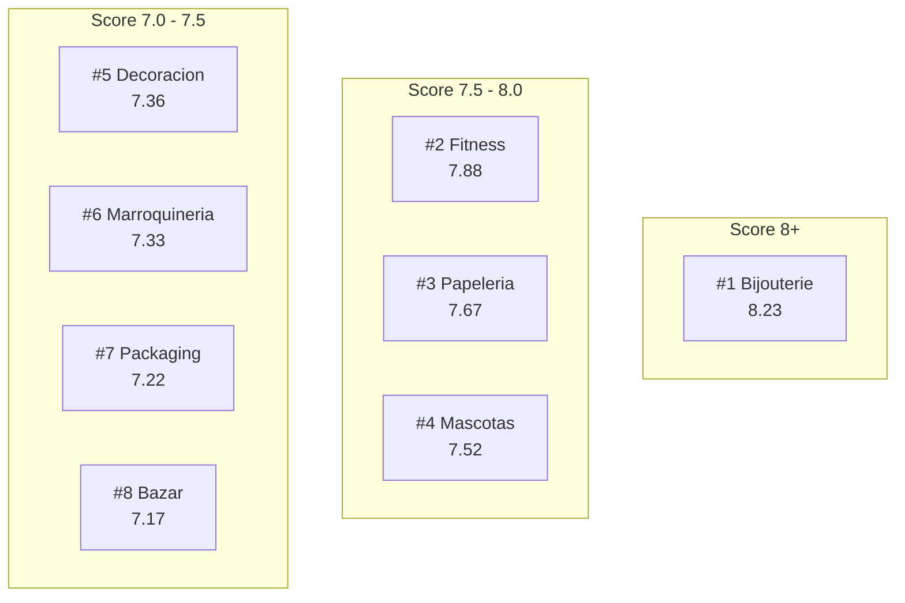
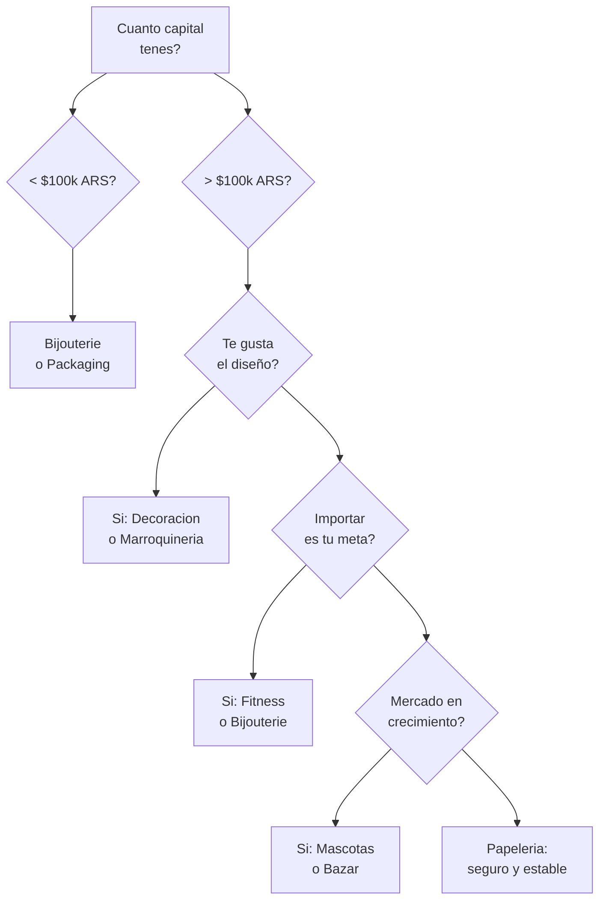

# Ranking general de rubros

Este es el **ranking completo** de los 8 rubros evaluados para comprar en fabricas argentinas y revender. Cada rubro fue analizado usando los [9 criterios ponderados](/app/paso1-argentina/oportunidades/criterios-evaluacion) que miden margen, demanda, capital, legalidad, competencia, logistica, accesibilidad, escalabilidad y puente a importacion.

<Note>
Todos los scores son **aproximados** y pueden variar segun tu ubicacion, habilidades personales y condiciones del mercado. Usá este ranking como guia, no como verdad absoluta.
</Note>

---

## Tabla comparativa completa

| # | Rubro | Margen | Demanda | Capital | Legal | Compet. | Logist. | Acces. | Escal. | Puente | **Score** |
|---|-------|--------|---------|---------|-------|---------|---------|--------|--------|--------|-----------|
| | | 20% | 18% | 15% | 12% | 10% | 8% | 7% | 5% | 5% | |
| 1 | **Bijouterie** | 9.5 | 8.5 | 9 | 9 | 5.5 | 9.5 | 7 | 7 | 9 | **8.23** |
| 2 | **Fitness** | 8 | 8 | 7 | 9 | 7 | 7 | 7 | 8 | 9 | **7.88** |
| 3 | **Papeleria** | 7.5 | 7 | 8.5 | 9 | 7 | 8 | 8 | 6 | 7 | **7.67** |
| 4 | **Mascotas** | 7.5 | 8.5 | 7 | 7 | 6 | 7 | 7 | 8 | 8 | **7.52** |
| 5 | **Decoracion** | 8 | 7 | 6 | 9 | 7 | 5 | 7 | 7 | 8 | **7.36** |
| 6 | **Marroquineria** | 8.5 | 7 | 6 | 8 | 7 | 7 | 6 | 7 | 7 | **7.33** |
| 7 | **Packaging** | 7 | 6 | 9 | 9 | 8 | 5 | 7 | 6 | 8 | **7.22** |
| 8 | **Bazar** | 7 | 8 | 7 | 8 | 6 | 6 | 7 | 7 | 8 | **7.17** |

---

## Metodologia de scoring

Cada criterio se puntua de **1 a 10** y se multiplica por su peso:

| Criterio | Peso | Que mide |
|----------|------|----------|
| **Margen potencial** | 20% | Diferencia entre precio fabrica y precio de venta neto |
| **Demanda de mercado** | 18% | Tamaño del mercado, volumen de ventas |
| **Capital requerido** | 15% | Inversion minima para la primera compra (menos = mejor) |
| **Simplicidad legal** | 12% | Regulaciones necesarias (menos = mejor) |
| **Competencia** | 10% | Fuerza de competidores (menos = mejor) |
| **Facilidad logistica** | 8% | Peso, volumen, fragilidad (mas facil = mejor) |
| **Accesibilidad fabricas** | 7% | Facilidad para encontrar fabricantes |
| **Escalabilidad** | 5% | Potencial de crecimiento |
| **Puente importacion** | 5% | Preparacion para importar de China |

**Score final = suma de (puntaje x peso)**

Para mas detalle de como funciona cada criterio, consulta [Criterios de evaluacion](/app/paso1-argentina/oportunidades/criterios-evaluacion).

---

## Resumen visual

---

## Explora cada rubro en detalle

<CardGroup cols={2}>
<Card title="#1 — Bijouterie y accesorios" icon="gem" href="/app/paso1-argentina/oportunidades/bijouterie/overview">
Score 8.23 — Margenes de 100-300%, capital minimo, logistica perfecta. El mejor rubro para empezar.
</Card>
<Card title="#2 — Fitness y deporte" icon="dumbbell" href="/app/paso1-argentina/oportunidades/fitness/overview">
Score 7.88 — Mercado en crecimiento, productos livianos, excelente puente a China.
</Card>
<Card title="#3 — Papeleria y libreria" icon="pen-ruler" href="/app/paso1-argentina/oportunidades/papeleria/overview">
Score 7.67 — Bajo capital, alta accesibilidad de fabricas, demanda constante.
</Card>
<Card title="#4 — Mascotas" icon="paw" href="/app/paso1-argentina/oportunidades/mascotas/overview">
Score 7.52 — Mercado en fuerte crecimiento, alta recompra, demanda emocional.
</Card>
<Card title="#5 — Decoracion" icon="palette" href="/app/paso1-argentina/oportunidades/decoracion/overview">
Score 7.36 — Margenes altos en diseño, poca regulacion, ideal si te gusta lo visual.
</Card>
<Card title="#6 — Marroquineria" icon="bag-shopping" href="/app/paso1-argentina/oportunidades/marroquineria/overview">
Score 7.33 — Los mejores margenes despues de bijouterie, producto argentino valorado.
</Card>
<Card title="#7 — Packaging y envoltorio" icon="box-open" href="/app/paso1-argentina/oportunidades/packaging/overview">
Score 7.22 — Capital minimo, poca competencia en premium, doble mercado B2C y B2B.
</Card>
<Card title="#8 — Bazar y hogar" icon="house" href="/app/paso1-argentina/oportunidades/bazar/overview">
Score 7.17 — Demanda enorme (+60% en ML), categoria muy amplia con nichos por explotar.
</Card>
</CardGroup>

---

## Recomendacion segun tu perfil

No todos los rubros son ideales para todas las personas. Aca te ayudamos a elegir segun tu situacion:

### "Tengo muy poco capital"

Si tu presupuesto inicial es menor a $100,000 ARS (~USD 85):

| Opcion | Capital minimo | Por que |
|--------|---------------|---------|
| **Bijouterie** | $30,000-80,000 ARS (~USD 25-65) | El capital mas bajo de todos, margenes altisimos |
| **Packaging** | $50,000-100,000 ARS (~USD 40-85) | Segundo mas bajo, cero regulaciones |

### "Quiero algo facil de empezar"

Si priorizas simplicidad en todo el proceso:

| Opcion | Facilidad | Por que |
|--------|-----------|---------|
| **Bijouterie** | Muy alta | Cero regulaciones, logistica perfecta, facil de encontrar proveedores |
| **Papeleria** | Alta | Fabricas accesibles, productos conocidos, sin regulacion |

### "Me importa el puente a China"

Si tu objetivo es usar el Paso 1 como preparacion para importar:

| Opcion | Score puente | Por que |
|--------|-------------|---------|
| **Bijouterie** | 9 | Yiwu es la capital mundial, mismos productos |
| **Fitness** | 9 | Productos de fitness extremadamente baratos en China |

### "Quiero un mercado en crecimiento"

Si buscas rubros con demanda creciente:

| Opcion | Tendencia | Por que |
|--------|-----------|---------|
| **Mascotas** | Fuerte crecimiento | Cada vez mas personas tienen mascotas y gastan en ellas |
| **Bazar** | +60% en ML | Categoria de hogar en expansion constante |

### "Me gusta el diseño"

Si tenes habilidades creativas o visuales:

| Opcion | Componente diseño | Por que |
|--------|-------------------|---------|
| **Decoracion** | Muy alto | El diseño es el diferenciador principal |
| **Marroquineria** | Alto | Diseño artesanal argentino tiene valor percibido |

---

## Arbol de decision

---

## Lo que todos los rubros tienen en comun

Independientemente del rubro que elijas, hay principios que aplican a todos:

1. **Empeza chico, escala rapido** — Primera compra pequeña para testear, despues reinverti
2. **Fotografia es clave** — En cualquier rubro, las fotos hacen el 80% de la venta en ML
3. **Un rubro a la vez** — No intentes arrancar con 3 rubros simultaneamente
4. **Reinverti ganancias** — Los primeros 3-6 meses son de reinversion, no de retiro
5. **Aprendé de las ventas** — Cada venta te enseña algo sobre tu mercado

<Tip>
El consejo mas importante: **elegi UN SOLO rubro y concentrate en el durante al menos 3-6 meses**. Es mejor ser excelente en un rubro que mediocre en tres. Cuando tengas el primero funcionando, podes expandir.
</Tip>

<Warning>
Este ranking es una herramienta de orientacion, no una garantia de resultados. Tu exito depende de la ejecucion: calidad de las fotos, atencion al cliente, seleccion de productos y constancia. Un rubro con score 7 ejecutado bien supera a un rubro con score 8 ejecutado mal.
</Warning>

---

## Siguiente paso

<CardGroup cols={2}>
<Card title="Criterios de evaluacion" icon="star" href="/app/paso1-argentina/oportunidades/criterios-evaluacion">
Entiende en detalle como funciona cada uno de los 9 criterios de scoring.
</Card>
<Card title="Puente a la importacion" icon="bridge" href="/app/paso1-argentina/oportunidades/puente-importacion">
Como el Paso 1 te prepara para importar de China en el Paso 2.
</Card>
</CardGroup>
