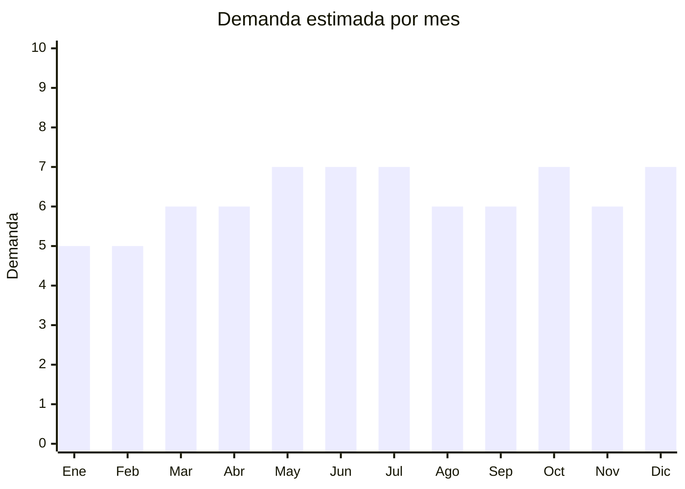

# Aceites esenciales para difusor

> **Capítulo NCM 33** — Aceites esenciales y resinoides; preparaciones de perfumería | **Temporada:** Atemporal

## Qué es y por qué importarlo

Los aceites esenciales para difusor son extractos concentrados de plantas (lavanda, eucalipto, árbol de té, menta, naranja, etc.) que se utilizan en difusores ultrasónicos para aromaterapia y ambientación del hogar. Se venden típicamente en frascos de 10-30 ml, y los formatos más populares son los kits de 6, 8 o 12 frascos con variedad de aromas.

La tendencia de aromaterapia y bienestar se consolidó en Argentina en los últimos años, impulsada por la adopción masiva de difusores ultrasónicos (Cap. 85). Cada difusor vendido genera demanda recurrente de aceites, creando un ciclo de consumo sostenido. El perfil del comprador se expandió más allá del nicho esotérico hacia el público general que busca ambientar su hogar.

China es un productor competitivo de aceites esenciales de grado cosmético y aromaterapia, con hubs de producción en Guangzhou y Jiangxi. Los aceites chinos compiten en precio con los de India y Brasil, y la calidad ha mejorado significativamente en los últimos años.

## Datos clave

| Dato | Valor |
|------|-------|
| **Posiciones NCM típicas** | 3301.29.90 (aceites esenciales excepto cítricos), 3301.12.00 (naranja), 3301.13.00 (limón) |
| **Derecho de importación** | 10 — 14% (DIE, varía por subpartida) + 3% tasa estadística |
| **Rango FOB típico** | USD 0.30 — USD 2.00 por frasco de 10ml |
| **Precio de venta en Argentina** | ARS 2.000 — ARS 15.000 (kits de 6 frascos: ARS 8.000 — 25.000) |
| **Margen bruto estimado** | 200% — 400% |
| **MOQ típico** | 100 — 1,000 frascos |
| **Demanda en MercadoLibre** | Media-Alta |
| **Competencia en MercadoLibre** | Media |
| **Dificultad para importar** | Moderada (requiere ANMAT según composición) |
| **Certificaciones necesarias** | ANMAT (cosmético grado 1 o 2 según composición) |
| **Antidumping** | No |

## Demanda y mercado en Argentina

- **Volumen de mercado:** 335+ resultados activos solo para "difusor aceites esenciales" en MercadoLibre. La categoría de aceites solos es aún mayor.
- **Tendencia:** Creciente — vinculada directamente al aumento de ventas de difusores ultrasónicos. Cada difusor nuevo genera demanda recurrente de aceites.
- **Perfil del comprador:** Público amplio 25-55 años, predominantemente femenino. Incluye consumidores de bienestar, decoración del hogar y practicantes de yoga/meditación.
- **Canales de venta principales:** MercadoLibre, tiendas web de productos naturales, dietéticas, herboristerías, bazares de decoración.

<Note>
Los kits de 6 aceites variados (lavanda, eucalipto, menta, árbol de té, naranja, limón) son el formato más vendido. Permiten al comprador probar varias fragancias y tienen mayor ticket promedio.
</Note>

## Competencia

| Aspecto | Situación |
|---------|-----------|
| **Cantidad de vendedores en ML** | +200 vendedores activos |
| **Hay marcas dominantes** | No hay marca dominante clara. Marcas artesanales locales compiten con importados |
| **Tipo de competidores** | Importadores + productores artesanales locales / Mixto |
| **Rango de precios en ML** | ARS 2.000 — ARS 25.000 |
| **Posibilidad de diferenciarse** | Media-Alta |

**Cómo diferenciarse:**
- Ofrecer kits temáticos: "Relajación", "Energía", "Respiratorio", "Sueño"
- Packaging premium con caja de madera o bambú
- Certificados de pureza y origen botánico (GC/MS analysis)
- Venta combo: difusor + kit de aceites (si se maneja Cap. 85 también)

## Variantes y subtipos más comunes

| Subtipo / Variante | FOB aprox. | Venta AR aprox. | Nota |
|--------------------|-----------|-----------------|------|
| Frasco individual 10ml | USD 0.30 — 1.00 | ARS 2.000 — 5.000 | Reposición |
| Kit 6 frascos x 10ml | USD 2.00 — 5.00 | ARS 8.000 — 18.000 | **Más vendido** |
| Kit 12 frascos x 10ml | USD 4.00 — 8.00 | ARS 15.000 — 25.000 | Pack completo |
| Frasco premium 30ml | USD 1.00 — 3.00 | ARS 5.000 — 12.000 | Para usuarios frecuentes |
| Set regalo con caja de madera | USD 5.00 — 12.00 | ARS 15.000 — 30.000 | Temporada de regalos |

## Regulaciones y requisitos

<Tabs>
  <Tab title="Certificaciones">
    | Organismo | Requiere | Detalle | Costo aprox. | Tiempo aprox. |
    |-----------|----------|---------|-------------|--------------|
    | ARCA (Aduana) | Sí siempre | Despacho de importación | — | — |
    | ANMAT | **Sí** | Los aceites esenciales para uso personal/ambiental pueden clasificar como cosmético (Grado 1 si es solo para difusor, Grado 2 si se promociona uso terapéutico). Desde octubre 2025 hay DJC simplificada | ARS 50,000 — 200,000 (DJC) | 15 — 30 días (DJC simplificada) |
    | ENACOM | No | No es electrónico | — | — |
    | SENASA | No | No es alimento | — | — |

    **Importante:** NO promocionar los aceites con claims terapéuticos ("cura", "trata", "alivia") ya que esto los convierte en producto de Grado 2 o incluso medicamento, con requisitos mucho más estrictos. Venderlos como "aceites para difusor / ambientación" es la vía más simple.
  </Tab>

  <Tab title="Etiquetado">
    | Requisito | Aplica |
    |-----------|--------|
    | Idioma español | Sí |
    | Datos del importador | Sí |
    | Composición / INCI | Sí (nombre botánico del aceite) |
    | Instrucciones de uso | Sí (modo de uso en difusor, precauciones) |
    | Lote y vencimiento | Sí |
    | Precauciones | Sí ("No ingerir", "Mantener fuera del alcance de niños") |
    | Garantía legal 6 meses | Sí |
  </Tab>

  <Tab title="Restricciones">
    - Los aceites esenciales puros son **líquidos inflamables** (punto de inflamación bajo). Esto puede afectar el envío aéreo — verificar clasificación de mercancía peligrosa con el despachante.
    - Si se promocionan como "terapéuticos" o con propiedades medicinales, ANMAT puede reclasificarlos como medicamento.
    - Mantener claims de marketing limitados a "aromaterapia" y "ambientación".
  </Tab>
</Tabs>

## Logística

| Dato | Valor |
|------|-------|
| **Peso típico por kit (6x10ml)** | 0.15 — 0.30 kg |
| **Volumen típico** | Bajo |
| **Fragilidad** | Media (frascos de vidrio — requieren protección) |
| **Envío recomendado** | Marítimo LCL — **atención:** verificar si clasifica como mercancía peligrosa por ser líquido inflamable |
| **Tiempo total estimado** (pedido a depósito) | 50 — 80 días (marítimo) / 20 — 30 días (aéreo, si se permite) |
| **Baterías de litio** | No |
| **Requiere empaque especial** | Sí — frascos de vidrio oscuro (ámbar o azul) con protección anti-golpes |

## Estacionalidad



| Aspecto | Detalle |
|---------|---------|
| **Meses pico** | Mayo-Julio (invierno — se usa más el difusor en ambientes cerrados), Octubre (Día de la Madre — formato regalo), Diciembre (regalos) |
| **Meses valle** | Enero-Febrero — menor uso de difusor en verano |
| **Cuándo pedir para llegar a tiempo** | Marzo-Abril (para stock de invierno, considerando 60-80 días) |

## Ventajas y riesgos

<CardGroup cols={2}>
  <Card title="Ventajas" icon="circle-check">
    - Producto de consumo recurrente (se agota y se repone)
    - Márgenes altos (200-400%)
    - Liviano y compacto
    - Demanda creciente vinculada a tendencia de bienestar
    - Ideal como venta cruzada con difusores ultrasónicos
  </Card>
  <Card title="Riesgos" icon="triangle-exclamation">
    - Requiere registro ANMAT (barrera de entrada moderada)
    - Producto líquido inflamable — puede complicar logística
    - Frascos de vidrio requieren protección en envío
    - Si se hacen claims terapéuticos, la regulación se endurece
  </Card>
</CardGroup>

<Warning>
Los aceites esenciales son **líquidos inflamables** con punto de inflamación bajo. Consultar con el despachante y la naviera/aerolínea sobre requisitos de DGR (Dangerous Goods Regulations) antes de embarcar. Algunos carriers cobran recargos o no aceptan este tipo de carga sin documentación especial.
</Warning>

## Palabras clave para buscar en Alibaba

```
essential oils set wholesale, aromatherapy essential oil kit, essential oils for diffuser,
lavender essential oil bulk, tea tree oil wholesale, essential oil gift set wooden box,
pure essential oils 10ml set, private label essential oils
```

## Fuentes

- [MercadoLibre Argentina — Aceites esenciales](https://listado.mercadolibre.com.ar/aceites-esenciales)
- [MercadoLibre Argentina — Difusores aceites esenciales](https://listado.mercadolibre.com.ar/difusor-aceites-esenciales)
- [Alibaba — Essential oils wholesale](https://www.alibaba.com/showroom/essential-oils-wholesale.html)
