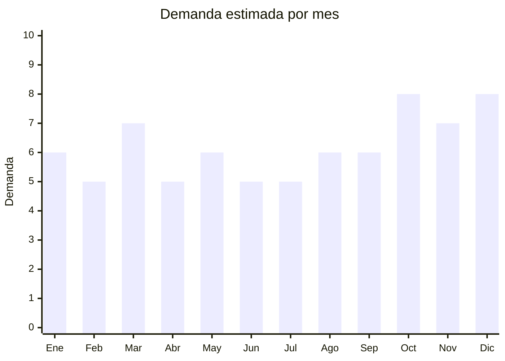

# Brochas y esponjas de maquillaje

> **Capítulo NCM 96** (clasificación real: 9603.29) — Cepillos, brochas y pinceles | **Temporada:** Atemporal

## Qué es y por qué importarlo

Las brochas y esponjas de maquillaje abarcan sets de pinceles para base, polvo, rubor, contorno, ojos y labios, además de esponjas tipo beauty blender para difuminar. Aunque comercialmente se asocian a la cosmética (Cap. 33), su clasificación aduanera real es **Cap. 96** (cepillos y brochas) — lo cual es una ventaja enorme porque **no requieren registro ANMAT** al no ser cosméticos en sí mismos.

Este tipo de producto tiene éxito sostenido en el mercado argentino porque es un consumible de reposición frecuente (las brochas se reemplazan cada 6-12 meses, las esponjas cada 3-6 meses), tiene un público femenino masivo y fidelizado, y los sets con estuche tienen alto valor percibido como regalo.

China domina la producción mundial de brochas de maquillaje. Tianjin es históricamente la capital de fabricación de brochas, mientras que Shenzhen y Dongguan concentran trading companies y ensambladores. El pelo sintético (taklon, fibra PBT) ha reemplazado casi totalmente al pelo natural, lo que reduce costos y facilita el marketing como producto "cruelty-free".

## Datos clave

| Dato | Valor |
|------|-------|
| **Posiciones NCM típicas** | 9603.29.00 (brochas de tocador), 4014.90.90 (esponjas de caucho/látex) |
| **Derecho de importación** | 18% (DIE) + 3% tasa estadística |
| **Rango FOB típico** | USD 0.50 — USD 8.00 por set (según cantidad de piezas) |
| **Precio de venta en Argentina** | ARS 5.500 — ARS 60.000 |
| **Margen bruto estimado** | 150% — 350% |
| **MOQ típico** | 50 — 500 sets (primer pedido); 500+ para etiqueta privada |
| **Demanda en MercadoLibre** | Alta |
| **Competencia en MercadoLibre** | Media-Alta |
| **Dificultad para importar** | Fácil |
| **Certificaciones necesarias** | Ninguna obligatoria (no es cosmético) |
| **Antidumping** | No |

## Demanda y mercado en Argentina

- **Volumen de mercado:** Miles de publicaciones activas en MercadoLibre con vendedores que superan las 10,000 unidades vendidas. Categoría consolidada que no depende de tendencias pasajeras.
- **Tendencia:** Estable-Creciente — impulsada por la cultura de maquillaje en redes sociales (Instagram, TikTok) y el crecimiento del maquillaje profesional freelance.
- **Perfil del comprador:** Mujeres de 16-45 años, tanto consumidoras finales como maquilladoras profesionales. Los sets de 10-15 brochas son el punto dulce entre calidad y precio.
- **Canales de venta principales:** MercadoLibre (dominante), tiendas web propias, mayorista a perfumerías y salones de belleza.

<Note>
Las marcas disponibles en MercadoLibre Argentina incluyen Fascino, Beili, Morphe, Real Techniques, Jessamy, Daikon y City Girls, además de una enorme cantidad de sets genéricos importados directamente de China.
</Note>

## Competencia

| Aspecto | Situación |
|---------|-----------|
| **Cantidad de vendedores en ML** | +500 vendedores activos |
| **Hay marcas dominantes** | No hay una marca claramente dominante. Fascino, Real Techniques y Jessamy tienen presencia pero no monopolizan |
| **Tipo de competidores** | Importadores directos (mayoría) / Algunas marcas con distribución oficial |
| **Rango de precios en ML** | ARS 5.500 — ARS 60.000 |
| **Posibilidad de diferenciarse** | Alta |

**Cómo diferenciarse:**
- Crear marca propia (private label) con packaging premium y logo propio
- Ofrecer sets "cruelty-free" con fibra vegana certificada
- Incluir estuche de cuero sintético enrollable (roll-up) que es el formato más buscado
- Armar kits combo: brochas + esponjas + limpiador de brochas

## Variantes y subtipos más comunes

| Subtipo / Variante | FOB aprox. | Venta AR aprox. | Nota |
|--------------------|-----------|-----------------|------|
| Set 5 brochas básicas | USD 0.50 — 1.50 | ARS 5.500 — 12.000 | Entrada / regalo económico |
| Set 10 brochas con estuche | USD 1.50 — 4.00 | ARS 8.000 — 25.000 | **Más vendido** |
| Set 12-15 brochas profesional | USD 2.50 — 6.00 | ARS 15.000 — 35.000 | Segmento medio-alto |
| Set 20+ brochas completo | USD 3.00 — 8.00 | ARS 25.000 — 60.000 | Profesional / MUAs |
| Esponjas beauty blender (pack x3-5) | USD 0.15 — 0.80/u | ARS 3.000 — 8.000 | Consumible de alta rotación |
| Brocha kabuki individual | USD 0.30 — 1.00 | ARS 3.000 — 10.000 | Complemento / upsell |

## Regulaciones y requisitos

<Tabs>
  <Tab title="Certificaciones">
    | Organismo | Requiere | Detalle | Costo aprox. | Tiempo aprox. |
    |-----------|----------|---------|-------------|--------------|
    | ARCA (Aduana) | Sí siempre | Despacho de importación estándar | — | — |
    | ANMAT | **No** | Las brochas son accesorios/herramientas (Cap. 96), no cosméticos. Solo se requiere ANMAT si el set incluye productos cosméticos (sombras, labiales, etc.) | — | — |
    | ENACOM | No | No es dispositivo electrónico | — | — |
    | INTI | No | No es textil ni calzado | — | — |

    **Nota estratégica:** Esta es la principal ventaja del producto. Al no ser cosmético, evita el costoso y lento proceso de registro ANMAT. Si se incluyen cosméticos en el set (sombras, rubor), el set completo pasa a requerir ANMAT Grado 1 (DJC simplificada).
  </Tab>

  <Tab title="Etiquetado">
    | Requisito | Aplica |
    |-----------|--------|
    | Idioma español | Sí |
    | Datos del importador | Sí (razón social, CUIT, dirección) |
    | Composición / materiales | Sí (tipo de fibra: sintética, taklon, etc.) |
    | Instrucciones de uso | No obligatorio pero recomendado |
    | País de origen | Sí ("Industria China" o "Made in China") |
    | Garantía legal 6 meses | Sí |
  </Tab>

  <Tab title="Restricciones">
    Sin restricciones especiales para este tipo de producto. No hay antidumping, no hay licencias previas, no hay cupos de importación. Es uno de los productos con menor barrera regulatoria dentro de la categoría de belleza.
  </Tab>
</Tabs>

## Logística

| Dato | Valor |
|------|-------|
| **Peso típico por set** | 0.08 — 0.60 kg (según cantidad de brochas) |
| **Volumen típico** | Bajo |
| **Fragilidad** | Baja |
| **Envío recomendado** | Marítimo LCL (consolidado) para pedidos grandes; Courier/aéreo para muestras o pedidos chicos |
| **Tiempo total estimado** (pedido a depósito) | 45 — 75 días (marítimo) / 15 — 25 días (aéreo) |
| **Baterías de litio** | No |
| **Requiere empaque especial** | No — producto resistente. Estuches protegen las brochas |

## Estacionalidad



| Aspecto | Detalle |
|---------|---------|
| **Meses pico** | Marzo (vuelta a clases/actividades), Octubre (Día de la Madre), Noviembre-Diciembre (regalos de fin de año, CyberMonday) |
| **Meses valle** | Febrero, Abril, Junio — demanda base estable |
| **Cuándo pedir para llegar a tiempo** | Agosto-Septiembre (para capturar pico Oct-Dic, considerando 60-75 días de lead time marítimo) |

## Ventajas y riesgos

<CardGroup cols={2}>
  <Card title="Ventajas" icon="circle-check">
    - No requiere ANMAT (barrera regulatoria mínima)
    - Producto liviano y compacto (bajo costo de flete)
    - Márgenes muy altos (200-350%)
    - Demanda constante todo el año
    - Ideal para marca propia (private label)
    - Bajo MOQ para primer pedido
  </Card>
  <Card title="Riesgos" icon="triangle-exclamation">
    - Competencia alta en ML con precios agresivos
    - Calidad variable entre proveedores chinos (pedir muestras siempre)
    - Brochas de baja calidad pierden pelo y generan devoluciones
    - Si se incluyen cosméticos en el set, se activa requisito ANMAT
  </Card>
</CardGroup>

<Warning>
La calidad de las brochas varía enormemente entre proveedores. **Siempre pedir muestras** antes de hacer un pedido grande. Las brochas de mala calidad pierden pelo al primer uso y generan reclamos masivos en MercadoLibre, arruinando la reputación del vendedor. Verificar que la fibra no se desprenda, que los casquillos (férulas) estén bien prensados y que los mangos no se aflojen.
</Warning>

## Palabras clave para buscar en Alibaba

```
makeup brush set wholesale, cosmetic brush set private label, vegan makeup brush set,
makeup brush set 10pcs with bag, synthetic hair makeup brush set, kabuki brush wholesale,
beauty blender sponge wholesale, makeup sponge set bulk
```

## Fuentes

- [MercadoLibre Argentina — Sets de brochas de maquillaje](https://listado.mercadolibre.com.ar/set-de-brochas-maquillaje)
- [Alibaba — Makeup brush sets wholesale](https://www.alibaba.com/showroom/makeup-brush-set.html)
- [ACAVIR — Notas explicativas partida 96.03](https://www.acavir.com/comercio-exterior/sistema-armonizado/notas-explicativas/partida-9603)
