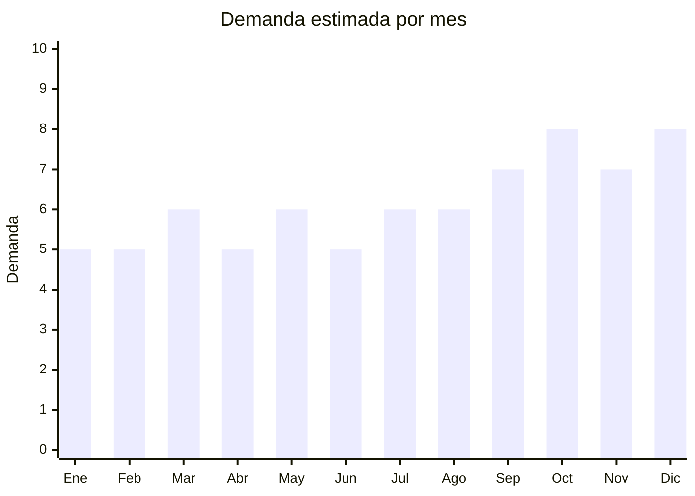

# Esmaltes y accesorios de nail art

> **Capítulo NCM 33** — Aceites esenciales y resinoides; preparaciones de perfumería, de tocador | **Temporada:** Atemporal

## Qué es y por qué importarlo

El nail art abarca esmaltes semipermanentes (gel UV/LED), lámparas de curado UV/LED, tips, extensiones de gel, stickers, herramientas (limas, cortacutículas, pinzas) y accesorios decorativos (brillos, piedras, foils). Es una categoría amplia donde el esmalte gel es el producto ancla y los accesorios complementan con alta rentabilidad.

El mercado argentino de nail art creció exponencialmente con el boom de los esmaltes semipermanentes, que pasaron de ser exclusivos de salones a adoptarse masivamente para uso doméstico. Los kits completos (lámpara + esmaltes + herramientas) son el formato estrella en MercadoLibre, con precios que van desde ARS 29.000 hasta ARS 80.000.

Guangzhou (China) es el centro mundial de producción de nail art, con marcas como ROSALIND, UR SUGAR, BORN PRETTY y LILYCUTE que exportan globalmente a precios FOB extremadamente competitivos.

## Datos clave

| Dato | Valor |
|------|-------|
| **Posiciones NCM típicas** | 3304.30.00 (esmaltes de uñas), 8543.70.99 (lámpara UV/LED), 9603.29 (limas/herramientas) |
| **Derecho de importación** | 18% (esmaltes, DIE) + 3% TE; 20% (lámparas) + 3% TE |
| **Rango FOB típico** | USD 0.30 — USD 1.50 por esmalte; USD 3 — USD 10 por lámpara; USD 5 — USD 20 por kit completo |
| **Precio de venta en Argentina** | ARS 3.000 — ARS 8.000 (esmalte individual); ARS 29.000 — ARS 80.000 (kit completo) |
| **Margen bruto estimado** | 150% — 350% |
| **MOQ típico** | 50 — 200 unidades (esmaltes); 20 — 100 (lámparas) |
| **Demanda en MercadoLibre** | Alta |
| **Competencia en MercadoLibre** | Alta |
| **Dificultad para importar** | Moderada (esmaltes requieren ANMAT; lámparas pueden requerir S-Mark) |
| **Certificaciones necesarias** | ANMAT (esmaltes — cosmético Grado 1 DJC simplificada), posible S-Mark (lámparas eléctricas) |
| **Antidumping** | No |

## Demanda y mercado en Argentina

- **Volumen de mercado:** Kits de esmalte semipermanente con lámpara se venden a ARS 29.106 (set x6 esmaltes) hasta ARS 79.990 (kit completo profesional con torno, cabina, esmaltes y herramientas).
- **Tendencia:** Creciente-Estable — el semipermanente ya se consolidó como mainstream. La novedad ahora son los polygel, press-on nails y extensiones de gel.
- **Perfil del comprador:** Mujeres 20-50 años (uso personal), manicuristas profesionales (compra de insumos), emprendedoras de uñas (kits para empezar el negocio).
- **Canales de venta principales:** MercadoLibre (dominante), tiendas web especializadas, venta mayorista a centros de estética.

<Note>
Los kits completos para principiantes ("starter kits") que incluyen lámpara UV/LED + 6 esmaltes + herramientas básicas son el producto más vendido. Permiten al comprador empezar a hacerse las uñas en casa y generan compras recurrentes de esmaltes adicionales.
</Note>

## Competencia

| Aspecto | Situación |
|---------|-----------|
| **Cantidad de vendedores en ML** | +500 vendedores activos |
| **Hay marcas dominantes** | Sí: Vanta, Meline, IBD tienen fuerte presencia. Marcas chinas directas también |
| **Tipo de competidores** | Importadores directos + distribuidores locales / Mixto |
| **Rango de precios en ML** | ARS 3.000 — ARS 80.000 |
| **Posibilidad de diferenciarse** | Media |

**Cómo diferenciarse:**
- Armar kits "todo incluido" bien curados con packaging profesional
- Ofrecer colores de tendencia actualizada por temporada
- Incluir tutoriales en video (QR en packaging)
- Especializarse en tendencia polygel o press-on nails (menos competencia)

## Variantes y subtipos más comunes

| Subtipo / Variante | FOB aprox. | Venta AR aprox. | Nota |
|--------------------|-----------|-----------------|------|
| Esmalte gel UV individual (15ml) | USD 0.30 — 1.50 | ARS 3.000 — 8.000 | Reposición constante |
| Set x6 esmaltes gel | USD 2.00 — 6.00 | ARS 15.000 — 30.000 | Formato popular |
| Lámpara UV/LED 36-48W | USD 3.00 — 10.00 | ARS 15.000 — 35.000 | Producto ancla |
| Kit completo (lámpara + esmaltes + tools) | USD 5.00 — 20.00 | ARS 29.000 — 80.000 | **Más vendido** |
| Tips/extensiones + gel constructor | USD 1.00 — 5.00 | ARS 5.000 — 20.000 | Tendencia creciente |
| Stickers, foils, decoraciones | USD 0.05 — 0.50/hoja | ARS 500 — 3.000 | Alta rotación, margen alto |

## Regulaciones y requisitos

<Tabs>
  <Tab title="Certificaciones">
    | Organismo | Requiere | Detalle | Costo aprox. | Tiempo aprox. |
    |-----------|----------|---------|-------------|--------------|
    | ARCA (Aduana) | Sí siempre | Despacho de importación | — | — |
    | ANMAT | **Sí para esmaltes** | Esmaltes de uñas son cosmético Grado 1. DJC simplificada desde oct 2025 | ARS 50,000 — 200,000 | 15 — 30 días |
    | S-Mark / IRAM | **Posible para lámparas** | Lámparas eléctricas UV/LED pueden requerir certificación de seguridad eléctrica S-Mark + QR (obligatorio desde oct 2025) | USD 200 — 500 | 4 — 8 semanas |
    | ENACOM | **Solo si tiene WiFi/BT** | La mayoría de lámparas NO tiene conectividad | — | — |

    **Estrategia:** Los accesorios no cosméticos (limas, herramientas, tips plásticos, stickers) NO requieren ANMAT. Se puede empezar importando solo accesorios y agregar esmaltes cuando se tenga el registro.
  </Tab>

  <Tab title="Etiquetado">
    | Requisito | Aplica |
    |-----------|--------|
    | Idioma español | Sí |
    | Datos del importador | Sí |
    | Composición / INCI | Sí (para esmaltes — lista de ingredientes INCI) |
    | Instrucciones de uso | Sí |
    | Lote y vencimiento | Sí (esmaltes) |
    | Precauciones | Sí ("Solo uso externo", "Curar bajo lámpara UV/LED") |
    | Garantía legal 6 meses | Sí |
  </Tab>

  <Tab title="Restricciones">
    - Esmaltes de uñas contienen solventes que pueden clasificar como **líquidos inflamables** para transporte.
    - Verificar clasificación DGR para envío aéreo.
    - Lámparas UV/LED con voltaje 220V deben ser compatibles con la red argentina o incluir adaptador.
    - Fórmulas "3-free", "5-free" o "10-free" (sin formaldehído, tolueno, DBP) son preferidas por consumidores y facilitan registro ANMAT.
  </Tab>
</Tabs>

## Logística

| Dato | Valor |
|------|-------|
| **Peso típico por kit completo** | 1.5 — 3.0 kg |
| **Volumen típico** | Medio |
| **Fragilidad** | Media (frascos de esmalte son de vidrio/plástico, lámparas son electrónicas) |
| **Envío recomendado** | Marítimo LCL para pedidos grandes; Aéreo para muestras |
| **Tiempo total estimado** (pedido a depósito) | 50 — 80 días (marítimo) |
| **Baterías de litio** | No (lámparas se enchufan, no tienen batería) |
| **Requiere empaque especial** | Sí — protección para frascos de esmalte y lámparas. Esmaltes pueden requerir etiqueta de mercancía peligrosa |

## Estacionalidad



| Aspecto | Detalle |
|---------|---------|
| **Meses pico** | Octubre (Día de la Madre), Noviembre-Diciembre (fiestas, CyberMonday) |
| **Meses valle** | Enero-Febrero — demanda base estable |
| **Cuándo pedir para llegar a tiempo** | Julio-Agosto para pico de fin de año |

## Ventajas y riesgos

<CardGroup cols={2}>
  <Card title="Ventajas" icon="circle-check">
    - Mercado grande y en crecimiento
    - Kits generan compras recurrentes de esmaltes
    - FOB muy bajo para esmaltes individuales
    - Múltiples accesorios sin regulación que se pueden vender
    - Alta demanda de kits "starter" para emprendedoras
  </Card>
  <Card title="Riesgos" icon="triangle-exclamation">
    - Esmaltes requieren ANMAT (barrera de entrada)
    - Lámparas pueden requerir S-Mark
    - Competencia alta con marcas establecidas (Vanta, Meline)
    - Esmaltes son líquidos inflamables — complicación logística
    - Calidad de gel variable (curado incompleto = reclamos)
  </Card>
</CardGroup>

<Warning>
Los esmaltes semipermanentes gel requieren **registro ANMAT como cosmético Grado 1** (DJC simplificada). Sin este registro, la Aduana puede retener el envío. Para empezar sin ANMAT, se pueden importar solo los accesorios (lámparas, herramientas, tips, stickers) y comprar esmaltes de marcas ya registradas localmente.
</Warning>

## Palabras clave para buscar en Alibaba

```
gel nail polish wholesale, UV LED nail lamp 48W, nail art kit complete set,
polygel nail kit, press on nails wholesale, nail art stickers wholesale,
ROSALIND gel polish, nail extension tips wholesale, nail drill machine
```

## Fuentes

- [MercadoLibre Argentina — Kit esmalte semipermanente lámpara UV](https://listado.mercadolibre.com.ar/kit-esmalte-semipermanente-lampara-uv)
- [MercadoLibre Argentina — Esmaltes semipermanentes](https://listado.mercadolibre.com.ar/belleza-y-cuidado-personal/manicuria-y-pedicuria/esmaltes/esmaltes-semipermanentes)
- [Alibaba — Gel nail polish wholesale](https://www.alibaba.com/showroom/gel-nail-polish-wholesale.html)
