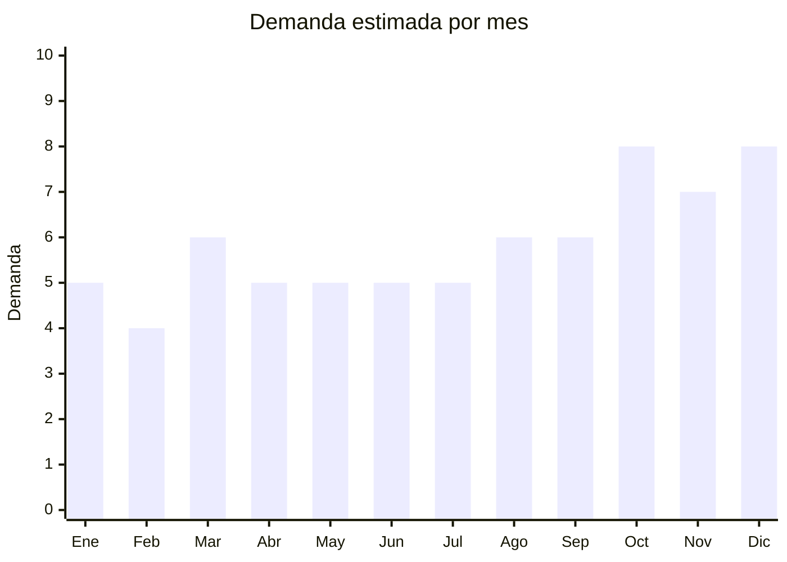

# Organizadores y estuches de cosmética

> **Capítulo NCM 42** — Manufacturas de cuero; artículos de viaje, bolsos de mano | **Temporada:** Atemporal

## Qué es y por qué importarlo

Los organizadores de cosmética abarcan neceseres de viaje, organizadores de escritorio para maquillaje, estuches profesionales de maquilladora, y porta-brochas. Aunque se venden en el contexto de la cosmética (Cap. 33), su clasificación aduanera real es **Cap. 42** (artículos de viaje, bolsos) si son de cuero/similcuero, o Cap. 39 (plástico) si son de acrílico transparente.

La gran ventaja de este producto es que **no requiere ninguna certificación especial** — no es cosmético, no es eléctrico, no tiene componentes regulados. Es un producto complementario ideal que se vende junto con brochas, esmaltes y maquillaje, y tiene un público comprador masivo.

Yiwu (China) es el hub mundial de este tipo de productos, con miles de fabricantes que ofrecen desde neceseres básicos hasta organizadores giratorios de acrílico con cajones.

## Datos clave

| Dato | Valor |
|------|-------|
| **Posiciones NCM típicas** | 4202.92.00 (estuches/neceseres textil/similcuero), 3924.90.00 (organizadores plástico/acrílico) |
| **Derecho de importación** | 20% (DIE Cap. 42) / 18% (DIE Cap. 39) + 3% tasa estadística |
| **Rango FOB típico** | USD 0.80 — USD 8.00 por unidad |
| **Precio de venta en Argentina** | ARS 5.000 — ARS 30.000 |
| **Margen bruto estimado** | 150% — 300% |
| **MOQ típico** | 50 — 500 unidades |
| **Demanda en MercadoLibre** | Media |
| **Competencia en MercadoLibre** | Media |
| **Dificultad para importar** | Fácil |
| **Certificaciones necesarias** | Ninguna |
| **Antidumping** | No |

## Demanda y mercado en Argentina

- **Volumen de mercado:** Demanda constante vinculada al mercado de cosmética y maquillaje. Producto de compra impulsiva y regalo frecuente.
- **Tendencia:** Estable — crece junto con la categoría de maquillaje general.
- **Perfil del comprador:** Mujeres 18-50 años, compradoras de maquillaje, viajeras frecuentes, maquilladoras profesionales.
- **Canales de venta principales:** MercadoLibre, venta combo con otros productos de belleza, bazares.

<Note>
Este producto funciona muy bien como **venta cruzada** con brochas y esmaltes. Armar combos "set de brochas + neceser" o "kit nail art + organizador" aumenta el ticket promedio y la percepción de valor.
</Note>

## Competencia

| Aspecto | Situación |
|---------|-----------|
| **Cantidad de vendedores en ML** | +200 vendedores activos |
| **Hay marcas dominantes** | No — mercado fragmentado con productos genéricos |
| **Tipo de competidores** | Importadores directos |
| **Rango de precios en ML** | ARS 5.000 — ARS 30.000 |
| **Posibilidad de diferenciarse** | Alta |

**Cómo diferenciarse:**
- Organizadores giratorios de acrílico transparente (tendencia decorativa)
- Neceseres con espejo incorporado y compartimientos divididos
- Estuches profesionales tipo maletín para maquilladoras
- Diseños de tendencia (mármol, minimalista, colores pastel)

## Variantes y subtipos más comunes

| Subtipo / Variante | FOB aprox. | Venta AR aprox. | Nota |
|--------------------|-----------|-----------------|------|
| Neceser de viaje basic | USD 0.80 — 2.00 | ARS 5.000 — 10.000 | Alta rotación |
| Neceser grande con compartimientos | USD 2.00 — 5.00 | ARS 8.000 — 18.000 | Popular para regalo |
| Organizador acrílico de escritorio | USD 3.00 — 8.00 | ARS 10.000 — 25.000 | **Tendencia decorativa** |
| Organizador giratorio con cajones | USD 5.00 — 10.00 | ARS 15.000 — 30.000 | Premium |
| Porta-brochas enrollable | USD 1.00 — 3.00 | ARS 5.000 — 12.000 | Complemento ideal |

## Regulaciones y requisitos

<Tabs>
  <Tab title="Certificaciones">
    | Organismo | Requiere | Detalle | Costo aprox. | Tiempo aprox. |
    |-----------|----------|---------|-------------|--------------|
    | ARCA (Aduana) | Sí siempre | Despacho estándar | — | — |
    | ANMAT | No | No es cosmético ni producto sanitario | — | — |
    | ENACOM | No | No es electrónico | — | — |
    | INTI | No | No es textil regulado | — | — |

    **Sin barreras regulatorias.** Este es uno de los productos más simples de importar.
  </Tab>

  <Tab title="Etiquetado">
    | Requisito | Aplica |
    |-----------|--------|
    | Idioma español | Sí |
    | Datos del importador | Sí |
    | Composición / materiales | Sí (PU, poliéster, acrílico, etc.) |
    | Instrucciones de uso | No obligatorio |
    | País de origen | Sí |
    | Garantía legal 6 meses | Sí |
  </Tab>

  <Tab title="Restricciones">
    Sin restricciones especiales. Producto de importación libre sin licencias previas, antidumping ni cupos.
  </Tab>
</Tabs>

## Logística

| Dato | Valor |
|------|-------|
| **Peso típico por unidad** | 0.1 — 0.8 kg |
| **Volumen típico** | Bajo-Medio (los organizadores de acrílico ocupan más espacio) |
| **Fragilidad** | Baja (neceseres) / Media (acrílico — puede rayarse o quebrarse) |
| **Envío recomendado** | Marítimo LCL |
| **Tiempo total estimado** (pedido a depósito) | 45 — 75 días (marítimo) |
| **Baterías de litio** | No |
| **Requiere empaque especial** | Solo para acrílico (protección anti-rayaduras y golpes) |

## Estacionalidad



| Aspecto | Detalle |
|---------|---------|
| **Meses pico** | Octubre (Día de la Madre), Noviembre-Diciembre (regalos, CyberMonday) |
| **Meses valle** | Febrero — demanda base estable |
| **Cuándo pedir para llegar a tiempo** | Agosto para pico de fin de año |

## Ventajas y riesgos

<CardGroup cols={2}>
  <Card title="Ventajas" icon="circle-check">
    - Cero barreras regulatorias
    - Producto liviano y resistente al envío
    - Ideal como venta cruzada con otros productos de belleza
    - Bueno como producto de regalo (Día de la Madre, Navidad)
    - Margen alto con bajo riesgo
  </Card>
  <Card title="Riesgos" icon="triangle-exclamation">
    - Mercado con competencia de precios bajos
    - Organizadores de acrílico pueden rayarse o quebrarse en transporte
    - Neceseres de baja calidad (cierres que se rompen, costuras flojas)
    - No es un producto de alta rotación como consumibles
  </Card>
</CardGroup>

<Warning>
Verificar la calidad de cierres, costuras y materiales antes de hacer un pedido grande. Los neceseres con cierres de mala calidad son la principal causa de devoluciones. Pedir muestras y verificar que el cierre funcione correctamente después de 50+ aperturas.
</Warning>

## Palabras clave para buscar en Alibaba

```
cosmetic organizer wholesale, makeup bag travel, acrylic makeup organizer rotating,
makeup brush holder roll up, cosmetic case professional, makeup storage box wholesale,
PU leather cosmetic bag, clear acrylic cosmetic display
```

## Fuentes

- [MercadoLibre Argentina — Organizadores de cosmética](https://listado.mercadolibre.com.ar/organizador-cosmeticos)
- [Alibaba — Cosmetic organizer wholesale](https://www.alibaba.com/showroom/cosmetic-organizer.html)
