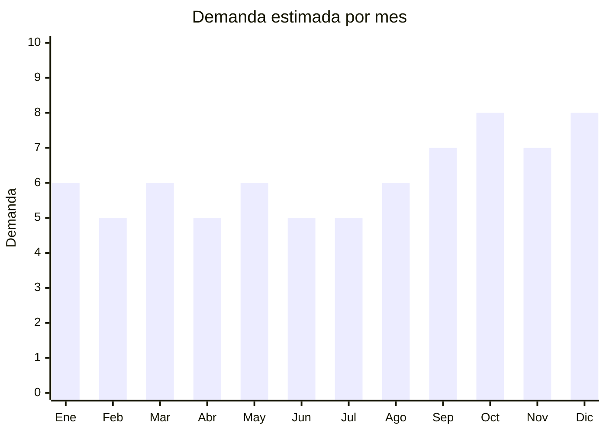

# Pestañas postizas

> **Capítulo NCM 67** — Plumas y plumón preparados; flores artificiales; manufacturas de cabello | **Temporada:** Atemporal

## Qué es y por qué importarlo

Las pestañas postizas abarcan tiras completas (strips), pestañas individuales/clusters, pestañas magnéticas con delineador y extensiones profesionales. Aunque comercialmente se venden junto a cosmética (Cap. 33), su clasificación aduanera real es **Cap. 67** (NCM 6704.19) para las de fibra sintética — lo cual las separa del régimen ANMAT de cosméticos.

El mercado argentino de pestañas postizas está en crecimiento sostenido, impulsado por la cultura de belleza en redes sociales y la tendencia global de "lash extensions" y "DIY lash clusters" que se viralizó en TikTok. El producto tiene una relación valor/peso excepcional: un par pesa apenas 2-5 gramos y se vende a márgenes de 300-500%.

**Qingdao (Shandong, China)** es la capital mundial de pestañas postizas, concentrando aproximadamente el 70% de la producción global. Las ciudades de Pingdu y Jiaozhou en esa zona tienen miles de fábricas especializadas, lo que permite acceder a una cadena de suministro madura y competitiva.

## Datos clave

| Dato | Valor |
|------|-------|
| **Posiciones NCM típicas** | 6704.19.00 (sintéticas), 6704.20.00 (cabello humano) |
| **Derecho de importación** | 20% (DIE) + 3% tasa estadística |
| **Rango FOB típico** | USD 0.10 — USD 3.00 por par/kit |
| **Precio de venta en Argentina** | ARS 1.500 — ARS 15.000 |
| **Margen bruto estimado** | 200% — 500% |
| **MOQ típico** | 50 — 500 cajas (primer pedido) |
| **Demanda en MercadoLibre** | Alta |
| **Competencia en MercadoLibre** | Media-Alta |
| **Dificultad para importar** | Fácil (sin pegamento) / Moderada (con pegamento — requiere ANMAT) |
| **Certificaciones necesarias** | Ninguna para pestañas solas. ANMAT si incluye adhesivo |
| **Antidumping** | No |

## Demanda y mercado en Argentina

- **Volumen de mercado:** Miles de publicaciones activas en MercadoLibre. Categoría con alta rotación y compra recurrente (las pestañas de tira son mayormente descartables o de pocos usos).
- **Tendencia:** Creciente — impulsada por tendencias globales de belleza, especialmente los clusters DIY que se viralizaron en 2024-2025 y siguen en alza.
- **Perfil del comprador:** Mujeres 18-40 años (consumo personal), maquilladoras profesionales (extensiones por bandeja), salones de belleza (compra mayorista).
- **Canales de venta principales:** MercadoLibre, tiendas web especializadas en belleza (Parfumerie, DeBelleza), venta mayorista a salones.

<Note>
El producto tiene una de las mejores relaciones valor/peso de cualquier importación: un envío de 1,000 cajas puede pesar apenas 50-80 kg. El costo de flete por unidad es prácticamente despreciable.
</Note>

## Competencia

| Aspecto | Situación |
|---------|-----------|
| **Cantidad de vendedores en ML** | +300 vendedores activos |
| **Hay marcas dominantes** | Parcialmente: Ardell, Kiss y Eylure tienen presencia premium. Pero marcas genéricas chinas dominan en volumen |
| **Tipo de competidores** | Importadores directos (mayoría) / Distribuidores de marcas internacionales |
| **Rango de precios en ML** | ARS 1.500 — ARS 15.000 |
| **Posibilidad de diferenciarse** | Alta |

**Cómo diferenciarse:**
- Marca propia con packaging premium (caja magnética con espejo)
- Kits completos: pestañas + aplicador + pegamento (si se gestiona ANMAT)
- Especializarse en tendencia DIY clusters (segmento en explosión)
- Ofrecer variedad amplia de estilos (natural, dramático, wispy, cat eye)

## Variantes y subtipos más comunes

| Subtipo / Variante | FOB aprox. | Venta AR aprox. | Nota |
|--------------------|-----------|-----------------|------|
| Tiras sintéticas básicas (3D, 5D) | USD 0.10 — 0.50/par | ARS 1.500 — 4.000 | Alta rotación, descartable |
| Faux mink (visón sintético) | USD 0.30 — 1.00/par | ARS 3.500 — 10.000 | **Tendencia fuerte** — cruelty-free |
| Pack x3-5 pares variados | USD 0.30 — 1.50/pack | ARS 3.000 — 8.000 | Formato popular |
| Clusters/individuales DIY | USD 0.15 — 0.60/set | ARS 2.500 — 7.000 | Tendencia viral TikTok |
| Kit magnéticas con delineador | USD 0.80 — 3.00/kit | ARS 5.000 — 15.000 | Mayor ticket promedio |
| Extensiones profesionales (bandeja) | USD 2.00 — 8.00/bandeja | ARS 8.000 — 25.000 | Nicho profesional |

## Regulaciones y requisitos

<Tabs>
  <Tab title="Certificaciones">
    | Organismo | Requiere | Detalle | Costo aprox. | Tiempo aprox. |
    |-----------|----------|---------|-------------|--------------|
    | ARCA (Aduana) | Sí siempre | Despacho de importación estándar | — | — |
    | ANMAT | **Solo si incluye adhesivo** | Las pestañas solas son manufactura Cap. 67, no cosmético. El pegamento/adhesivo SÍ es cosmético y requiere registro ANMAT | USD 500 — 2,000 | 2 — 6 meses |
    | ENACOM | No | No es dispositivo electrónico | — | — |
    | SENASA | No | Faux mink no es producto animal real | — | — |

    **Estrategia recomendada:** Importar pestañas SIN pegamento en un primer momento. El pegamento puede comprarse localmente (hay marcas ya registradas como DUO) o gestionarse el registro ANMAT por separado cuando el negocio ya esté funcionando.
  </Tab>

  <Tab title="Etiquetado">
    | Requisito | Aplica |
    |-----------|--------|
    | Idioma español | Sí |
    | Datos del importador | Sí (razón social, CUIT, dirección) |
    | Composición / materiales | Sí ("Fibra sintética PBT" / "Seda sintética") |
    | Instrucciones de uso | Recomendado (cómo aplicar y retirar) |
    | País de origen | Sí |
    | Garantía legal 6 meses | Sí |
  </Tab>

  <Tab title="Restricciones">
    Sin restricciones especiales para pestañas de fibra sintética. No hay antidumping, no hay licencias previas.

    **Atención con visón real:** Si se importan pestañas de pelo animal real (mink genuino), podría requerirse certificado CITES. Se recomienda usar faux mink (sintético) que no tiene esta restricción y es la tendencia de mercado por ser "cruelty-free".
  </Tab>
</Tabs>

## Logística

| Dato | Valor |
|------|-------|
| **Peso típico por par** | 2 — 5 gramos |
| **Volumen típico** | Muy bajo |
| **Fragilidad** | Media (la forma de la pestaña puede deformarse si se aplasta) |
| **Envío recomendado** | Aéreo/Courier para pedidos chicos; Marítimo LCL para grandes |
| **Tiempo total estimado** (pedido a depósito) | 15 — 25 días (aéreo) / 45 — 75 días (marítimo) |
| **Baterías de litio** | No |
| **Requiere empaque especial** | Sí — las cajas individuales deben mantener la forma. Evitar aplastamiento en contenedor |

## Estacionalidad



| Aspecto | Detalle |
|---------|---------|
| **Meses pico** | Octubre (Día de la Madre), Noviembre-Diciembre (fiestas, CyberMonday, Navidad/Año Nuevo), Septiembre (Primavera) |
| **Meses valle** | Febrero, Abril, Junio — demanda base estable |
| **Cuándo pedir para llegar a tiempo** | Julio-Agosto para capturar pico de fiestas (considerando 60-75 días marítimo) |

## Ventajas y riesgos

<CardGroup cols={2}>
  <Card title="Ventajas" icon="circle-check">
    - Relación valor/peso excepcional (casi sin costo de flete por unidad)
    - Márgenes de 200-500%
    - Sin ANMAT si no incluye adhesivo
    - Producto de alta rotación y compra recurrente
    - MOQ bajo para primer pedido de prueba
    - Tendencia en alza (DIY clusters, faux mink)
  </Card>
  <Card title="Riesgos" icon="triangle-exclamation">
    - Calidad variable — pestañas baratas pueden tener banda rígida o fibra que irrita
    - Si incluye pegamento, se activa requisito ANMAT
    - Competencia alta con precios agresivos en ML
    - Producto sensible al almacenamiento (deformación por calor/humedad)
  </Card>
</CardGroup>

<Warning>
**No importar pestañas con adhesivo incluido sin registro ANMAT.** El adhesivo para pestañas es un cosmético de aplicación en zona ocular y la Aduana puede retener el envío completo si detecta componentes cosméticos sin registro. Importar las pestañas solas y vender el pegamento por separado (de marca con registro vigente) es la estrategia más segura para empezar.
</Warning>

## Palabras clave para buscar en Alibaba

```
false eyelashes wholesale, 3D mink lashes, faux mink eyelashes, DIY lash clusters,
magnetic eyelashes kit, strip lashes wholesale, private label lashes,
eyelash extensions volume, custom lash box packaging
```

## Fuentes

- [MercadoLibre Argentina — Pestañas postizas](https://listado.mercadolibre.com.ar/pestanas-postizas)
- [Alibaba — False eyelashes wholesale](https://www.alibaba.com/showroom/false-eyelashes.html)
- [Parfumerie Argentina — Pestañas postizas](https://www.parfumerie.com.ar/maquillaje/ojos/pestanias-postizas)
