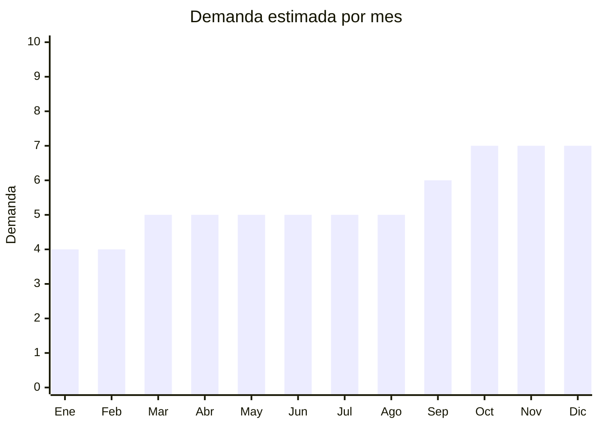

# Barras de cera para sellado

> **Capítulo NCM 34** — Jabones, agentes de superficie orgánicos, ceras | **Temporada:** Atemporal

## Qué es y por qué importarlo

La cera de sellado es un producto de nicho que se usa para crear sellos decorativos en invitaciones, sobres, packaging premium, papelería artesanal y proyectos de manualidades. Incluye barras de cera (para pistola de silicona), perlas/granos de cera (para cuchara de derretir), sellos metálicos con diseños grabados, y kits completos para principiantes.

Aunque es un producto de nicho, tiene un crecimiento sostenido en Argentina impulsado por la tendencia de papelería artesanal (journaling, bullet journal), invitaciones de boda personalizadas, packaging premium para emprendedores, y manualidades en redes sociales. El margen es excepcional porque el costo FOB es muy bajo y el valor percibido es alto.

China (especialmente Yiwu y Guangzhou) concentra la producción mundial de cera de sellado y sellos metálicos, con una variedad enorme de diseños, colores y kits.

## Datos clave

| Dato | Valor |
|------|-------|
| **Posiciones NCM típicas** | 3404.90.29 (ceras artificiales y preparadas), 8310.00.00 (placas indicadoras/sellos metálicos) |
| **Derecho de importación** | 14% (DIE cera) / 18% (sellos metal) + 3% tasa estadística |
| **Rango FOB típico** | USD 0.02 — USD 0.10 por perla; USD 1.00 — USD 5.00 por kit completo |
| **Precio de venta en Argentina** | ARS 3.000 — ARS 8.000 (perlas/barras); ARS 8.000 — ARS 25.000 (kits con sello) |
| **Margen bruto estimado** | 300% — 600% |
| **MOQ típico** | 50 — 200 kits; 500 — 2,000 bolsas de perlas |
| **Demanda en MercadoLibre** | Baja-Media (nicho) |
| **Competencia en MercadoLibre** | Baja |
| **Dificultad para importar** | Fácil |
| **Certificaciones necesarias** | Ninguna |
| **Antidumping** | No |

## Demanda y mercado en Argentina

- **Volumen de mercado:** Nicho en crecimiento. Menor volumen que productos masivos pero con márgenes excepcionales y competencia baja.
- **Tendencia:** Creciente — impulsada por tendencias de papelería artesanal, journaling, invitaciones personalizadas y packaging de emprendimientos.
- **Perfil del comprador:** Artesanas/manualistas, diseñadoras gráficas, emprendedores de packaging premium, novias/organizadoras de eventos, community de journaling.
- **Canales de venta principales:** MercadoLibre, tiendas de insumos artísticos, tiendas de papelería, Instagram/ferias de emprendedores.

<Note>
El nicho de cera de sellado tiene una comunidad activa en Instagram y TikTok que comparte técnicas, lo que genera demanda orgánica. Los kits "starter" con sello + cera + cuchara son el producto de entrada ideal para captar nuevos clientes.
</Note>

## Competencia

| Aspecto | Situación |
|---------|-----------|
| **Cantidad de vendedores en ML** | +50 vendedores activos |
| **Hay marcas dominantes** | No — mercado de nicho sin marca líder |
| **Tipo de competidores** | Importadores pequeños / Artesanas que revenden |
| **Rango de precios en ML** | ARS 3.000 — ARS 25.000 |
| **Posibilidad de diferenciarse** | Muy alta |

**Cómo diferenciarse:**
- Kits completos bien curados con instrucciones en español
- Sellos con diseños exclusivos o personalizables
- Paleta amplia de colores de cera (dorado, rosa, bordeaux, mármol)
- Perlas de cera multicolor (mezclas decorativas)
- Videos tutoriales (QR en packaging)

## Variantes y subtipos más comunes

| Subtipo / Variante | FOB aprox. | Venta AR aprox. | Nota |
|--------------------|-----------|-----------------|------|
| Perlas de cera (bolsa x100g) | USD 0.50 — 1.50 | ARS 3.000 — 6.000 | Reposición |
| Barras de cera p/pistola (pack x5) | USD 0.30 — 1.00 | ARS 2.000 — 5.000 | Alternativa a perlas |
| Sello metálico con mango | USD 1.00 — 3.00 | ARS 5.000 — 12.000 | Producto ancla |
| Kit starter (sello + perlas + cuchara) | USD 2.00 — 5.00 | ARS 8.000 — 18.000 | **Más vendido** |
| Kit premium (sello + perlas + sobre + cera) | USD 3.00 — 8.00 | ARS 12.000 — 25.000 | Regalo |
| Set de perlas multicolor (6-8 colores) | USD 2.00 — 5.00 | ARS 6.000 — 15.000 | Para artesanas |

## Regulaciones y requisitos

<Tabs>
  <Tab title="Certificaciones">
    | Organismo | Requiere | Detalle | Costo aprox. | Tiempo aprox. |
    |-----------|----------|---------|-------------|--------------|
    | ARCA (Aduana) | Sí siempre | Despacho estándar | — | — |
    | ANMAT | No | No es cosmético ni alimento | — | — |
    | ENACOM | No | No es electrónico | — | — |

    Producto sin barreras regulatorias. Importación directa sin certificaciones especiales.
  </Tab>

  <Tab title="Etiquetado">
    | Requisito | Aplica |
    |-----------|--------|
    | Idioma español | Sí |
    | Datos del importador | Sí |
    | Composición / materiales | Sí (tipo de cera, materiales del sello) |
    | Instrucciones de uso | Recomendado (no obligatorio) |
    | País de origen | Sí |
    | Garantía legal 6 meses | Sí |
  </Tab>

  <Tab title="Restricciones">
    Sin restricciones especiales. La cera de sellado no clasifica como mercancía peligrosa en condiciones normales de transporte (sólida a temperatura ambiente).
  </Tab>
</Tabs>

## Logística

| Dato | Valor |
|------|-------|
| **Peso típico por kit** | 0.15 — 0.40 kg |
| **Volumen típico** | Bajo |
| **Fragilidad** | Baja (cera es sólida resistente, sellos metálicos son durables) |
| **Envío recomendado** | Marítimo LCL o Courier/aéreo (liviano, bajo volumen) |
| **Tiempo total estimado** (pedido a depósito) | 45 — 75 días (marítimo) / 15 — 25 días (aéreo) |
| **Baterías de litio** | No |
| **Requiere empaque especial** | No |

## Estacionalidad



| Aspecto | Detalle |
|---------|---------|
| **Meses pico** | Octubre-Diciembre (temporada de casamientos, fiestas, regalos navideños) |
| **Meses valle** | Enero-Febrero — demanda base baja pero estable |
| **Cuándo pedir para llegar a tiempo** | Agosto para temporada de casamientos y fiestas de fin de año |

## Ventajas y riesgos

<CardGroup cols={2}>
  <Card title="Ventajas" icon="circle-check">
    - Márgenes excepcionales (300-600%)
    - Competencia muy baja en Argentina
    - Producto liviano y fácil de enviar
    - Sin barreras regulatorias
    - Nicho con comunidad activa en RRSS
    - Bajo capital inicial necesario
  </Card>
  <Card title="Riesgos" icon="triangle-exclamation">
    - Mercado de nicho con volumen limitado
    - La cera puede derretirse en verano si no se almacena correctamente
    - Depende de tendencias de papelería artesanal
    - No es producto de primera necesidad (sensible a recesión)
  </Card>
</CardGroup>

<Warning>
La cera de sellado se reblandece con calor. **En verano argentino** (diciembre-marzo), almacenar en lugar fresco y enviar con precaución. Las perlas de cera pueden fusionarse entre sí si se exponen a temperaturas superiores a 40°C durante el almacenamiento o transporte.
</Warning>

## Palabras clave para buscar en Alibaba

```
sealing wax beads wholesale, wax seal stamp custom, sealing wax sticks,
wax seal kit gift set, sealing wax pearls multicolor, custom wax seal stamp,
wax seal spoon melting, vintage wax seal set wholesale
```

## Fuentes

- [MercadoLibre Argentina — Cera sellado](https://listado.mercadolibre.com.ar/cera-sellado)
- [Alibaba — Sealing wax wholesale](https://www.alibaba.com/showroom/sealing-wax-beads-wholesale.html)
