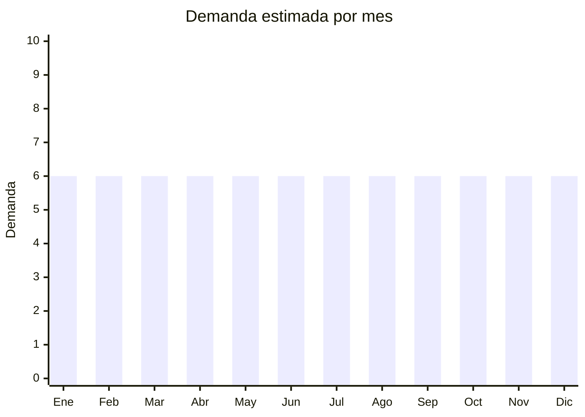

# Esponjas de melamina y accesorios de limpieza

> **Capítulo NCM 39** — Plástico y sus manufacturas (melamina es resina plástica) | **Temporada:** Atemporal

## Qué es y por qué importarlo

Las esponjas de melamina (conocidas comercialmente como "esponjas mágicas" o "magic erasers") son esponjas de resina de melamina-formaldehído con estructura microporosa que actúa como un abrasivo suave, capaz de limpiar manchas difíciles solo con agua. Se venden en packs de 10 a 50 unidades y son un producto de consumo recurrente con alta rotación.

Complementariamente, los paños de microfibra especializados (para vidrio, acero inoxidable, pisos) también tienen demanda masiva y se importan desde China a precios FOB irrisorios (USD 0.10-0.30 por paño).

Este tipo de producto tiene éxito sostenido porque es un consumible que se agota rápidamente (cada esponja dura 5-10 usos), tiene un público masivo (todo hogar necesita productos de limpieza), y el margen es muy atractivo dado el FOB extremadamente bajo.

China es el mayor productor mundial de esponjas de melamina, con fábricas que ofrecen precios desde USD 0.03 por esponja en volumen.

## Datos clave

| Dato | Valor |
|------|-------|
| **Posiciones NCM típicas** | 3924.90.00 (artículos de plástico para uso doméstico — melamina), 6307.10.00 (paños de microfibra) |
| **Derecho de importación** | 18% (DIE Cap. 39) + 3% tasa estadística |
| **Rango FOB típico** | USD 0.03 — USD 0.15 por esponja; USD 0.10 — USD 0.30 por paño microfibra |
| **Precio de venta en Argentina** | ARS 2.000 — ARS 8.000 (pack x10 esponjas); ARS 3.000 — ARS 10.000 (pack x5 paños) |
| **Margen bruto estimado** | 200% — 500% |
| **MOQ típico** | 500 — 5,000 packs |
| **Demanda en MercadoLibre** | Alta |
| **Competencia en MercadoLibre** | Media |
| **Dificultad para importar** | Fácil |
| **Certificaciones necesarias** | Ninguna |
| **Antidumping** | No |

## Demanda y mercado en Argentina

- **Volumen de mercado:** Demanda masiva. Las esponjas de melamina son un producto de uso doméstico universal con miles de búsquedas en MercadoLibre.
- **Tendencia:** Estable — producto consolidado de consumo recurrente. No depende de modas.
- **Perfil del comprador:** Todo tipo de hogar. También B2B: empresas de limpieza, hoteles, restaurantes, lavaderos de autos (la melamina es popular para limpieza de tapizados).
- **Canales de venta principales:** MercadoLibre (packs), mayorista a ferreterías y limpieza profesional, bazares.

<Note>
La clave del negocio con esponjas de melamina es el **volumen**. El margen por unidad es bajo pero la rotación es altísima. Los packs de 50-100 unidades para venta mayorista/B2B son los más rentables.
</Note>

## Competencia

| Aspecto | Situación |
|---------|-----------|
| **Cantidad de vendedores en ML** | +200 vendedores activos |
| **Hay marcas dominantes** | No — producto commodity dominado por genéricos |
| **Tipo de competidores** | Importadores directos |
| **Rango de precios en ML** | ARS 2.000 — ARS 10.000 |
| **Posibilidad de diferenciarse** | Baja-Media |

**Cómo diferenciarse:**
- Packs con forma/tamaño especial (esponjas con mango, formato grueso)
- Combos: esponjas + paños de microfibra + guantes de limpieza
- Marca propia con packaging en español y tips de uso
- Canal B2B: packs de 50-100 para empresas de limpieza

## Variantes y subtipos más comunes

| Subtipo / Variante | FOB aprox. | Venta AR aprox. | Nota |
|--------------------|-----------|-----------------|------|
| Pack x10 esponjas melamina std (10x6x2cm) | USD 0.30 — 0.80 | ARS 2.000 — 5.000 | **Más vendido** |
| Pack x20 esponjas melamina | USD 0.50 — 1.20 | ARS 3.500 — 7.000 | Mejor relación precio/unidad |
| Pack x50 esponjas (mayorista) | USD 1.50 — 3.00 | ARS 6.000 — 12.000 | B2B / reventa |
| Esponjas con mango | USD 0.15 — 0.40/u | ARS 1.000 — 3.000/u | Más prácticas |
| Esponjas gruesas (doble capa) | USD 0.08 — 0.20/u | ARS 500 — 1.500/u | Mayor durabilidad |
| Pack x5 paños microfibra | USD 0.50 — 1.50 | ARS 3.000 — 8.000 | Complemento |

## Regulaciones y requisitos

<Tabs>
  <Tab title="Certificaciones">
    | Organismo | Requiere | Detalle | Costo aprox. | Tiempo aprox. |
    |-----------|----------|---------|-------------|--------------|
    | ARCA (Aduana) | Sí siempre | Despacho estándar | — | — |
    | ANMAT | No | No es cosmético ni alimento | — | — |
    | ENACOM | No | No es electrónico | — | — |

    Producto sin barreras regulatorias. Importación libre.
  </Tab>

  <Tab title="Etiquetado">
    | Requisito | Aplica |
    |-----------|--------|
    | Idioma español | Sí |
    | Datos del importador | Sí |
    | Composición / materiales | Sí ("Resina de melamina-formaldehído" / "Microfibra poliéster") |
    | Instrucciones de uso | Recomendado (indicar superficies aptas y no aptas) |
    | País de origen | Sí |
    | Garantía legal 6 meses | Sí |
  </Tab>

  <Tab title="Restricciones">
    Sin restricciones especiales. Producto de importación libre sin licencias previas, antidumping ni cupos.

    **Nota:** Las esponjas de melamina no deben usarse en superficies pintadas brillantes o barnizadas porque las raya. Incluir esta advertencia en el packaging para evitar reclamos.
  </Tab>
</Tabs>

## Logística

| Dato | Valor |
|------|-------|
| **Peso típico por pack x10** | 0.05 — 0.10 kg |
| **Volumen típico** | Medio (las esponjas son ultralivianas pero ocupan espacio — baja densidad) |
| **Fragilidad** | Baja (material flexible) |
| **Envío recomendado** | Marítimo LCL — producto de bajo valor/peso que justifica marítimo solo en volumen |
| **Tiempo total estimado** (pedido a depósito) | 45 — 75 días (marítimo) |
| **Baterías de litio** | No |
| **Requiere empaque especial** | No — comprimir al vacío para reducir volumen es práctica común |

## Estacionalidad



| Aspecto | Detalle |
|---------|---------|
| **Meses pico** | Demanda estable todo el año — producto de consumo básico |
| **Meses valle** | No hay valle significativo |
| **Cuándo pedir para llegar a tiempo** | Cualquier momento — mantener stock permanente |

## Ventajas y riesgos

<CardGroup cols={2}>
  <Card title="Ventajas" icon="circle-check">
    - FOB irrisorio (desde USD 0.03/unidad)
    - Demanda masiva y constante
    - Producto de consumo recurrente (alta recompra)
    - Sin barreras regulatorias
    - Canal B2B rentable (empresas de limpieza)
    - Ultraliviano para su volumen
  </Card>
  <Card title="Riesgos" icon="triangle-exclamation">
    - Producto commodity — guerra de precios
    - Bajo ticket promedio (necesita volumen para ser rentable)
    - Ocupa más espacio del que pesa (baja densidad = flete por volumen)
    - Calidad variable (esponjas muy blandas se deshacen rápido)
  </Card>
</CardGroup>

<Warning>
Este es un negocio de **volumen, no de margen unitario**. El flete marítimo se cobra por volumen (CBM) no por peso, y las esponjas de melamina son muy voluminosas para su peso. Calcular bien el costo de flete por CBM antes de pedir. Pedir las esponjas **comprimidas al vacío** reduce significativamente el volumen de envío.
</Warning>

## Palabras clave para buscar en Alibaba

```
melamine sponge wholesale, magic eraser sponge bulk, melamine foam cleaning sponge,
compressed melamine sponge, magic sponge with handle, microfiber cloth wholesale,
cleaning sponge bulk pack, nano sponge wholesale
```

## Fuentes

- [MercadoLibre Argentina — Esponja mágica melamina](https://listado.mercadolibre.com.ar/esponja-magica-melamina)
- [MercadoLibre Argentina — Esponja de melamina](https://listado.mercadolibre.com.ar/esponja-de-melamina)
- [Alibaba — Melamine sponge wholesale](https://www.alibaba.com/showroom/melamine-sponge-wholesale.html)
