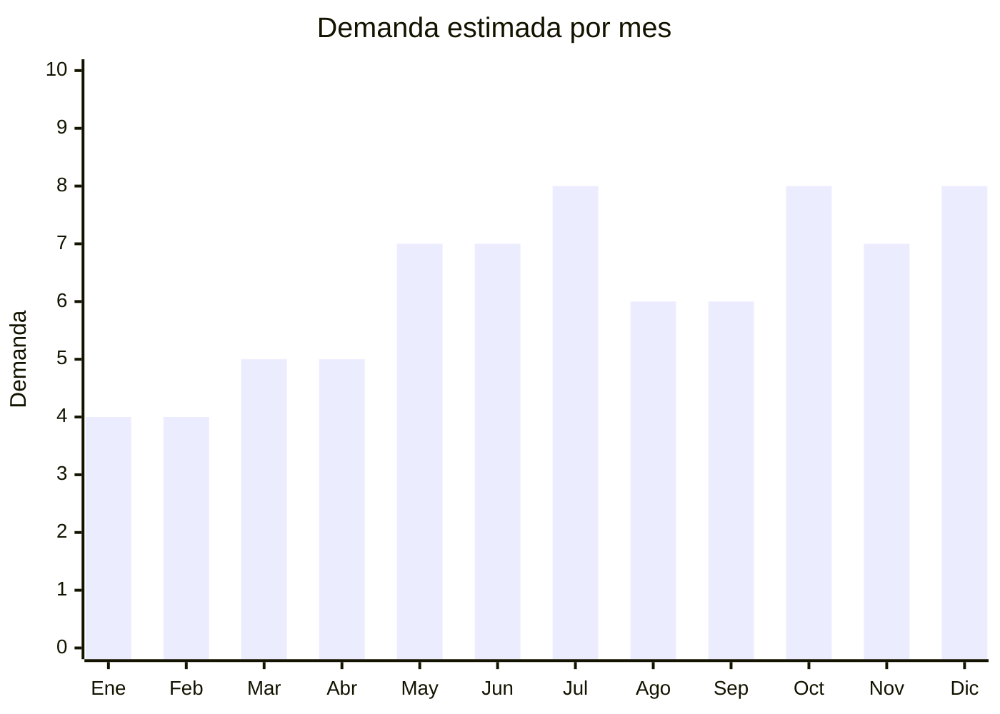

# Velas aromáticas y decorativas

> **Capítulo NCM 34** — Jabones, ceras, velas | **Temporada:** Atemporal

## Qué es y por qué importarlo

Las velas aromáticas y decorativas incluyen velas de soja, parafina perfumada, cera de abeja y mezclas con aceites esenciales, presentadas en frascos de vidrio, latas metálicas o envolturas decorativas. Los formatos más populares son las velas en frasco con tapa, las velas con mecha de madera (que producen un crepitar relajante) y los sets de 3-6 velas de diferentes aromas.

La tendencia de self-care, decoración boho y ambientación del hogar consolidó las velas aromáticas como un producto atemporal de alta demanda en Argentina. Los precios en MercadoLibre van desde ARS 9.500 hasta más de ARS 60.000 para sets premium, lo que indica un mercado con espacio tanto para productos de entrada como premium.

Ningbo y Qingdao (China) son los principales hubs de producción de velas, con fábricas capaces de producir velas con aromas personalizados, packaging premium y etiqueta privada a precios FOB de USD 0.50-3.00 por unidad.

## Datos clave

| Dato | Valor |
|------|-------|
| **Posiciones NCM típicas** | 3406.00.00 (velas, cirios y artículos similares) |
| **Derecho de importación** | 18% (DIE) + 3% tasa estadística |
| **Rango FOB típico** | USD 0.50 — USD 5.00 por unidad |
| **Precio de venta en Argentina** | ARS 5.000 — ARS 25.000 (individual); ARS 15.000 — ARS 60.000 (sets) |
| **Margen bruto estimado** | 200% — 400% |
| **MOQ típico** | 100 — 500 unidades |
| **Demanda en MercadoLibre** | Media-Alta |
| **Competencia en MercadoLibre** | Media (muchos productores artesanales locales) |
| **Dificultad para importar** | Fácil |
| **Certificaciones necesarias** | Ninguna obligatoria |
| **Antidumping** | No |

## Demanda y mercado en Argentina

- **Volumen de mercado:** Miles de publicaciones activas en MercadoLibre. El rango de precios va desde ARS 9.500 hasta más de ARS 60.000 según calidad y presentación.
- **Tendencia:** Estable-Creciente — impulsada por la cultura de self-care, home decor y la tendencia "hygge" (bienestar danés).
- **Perfil del comprador:** Mujeres 25-55 años, amantes de la decoración y el bienestar, compradores de regalos. Alto componente de compra impulsiva y obsequio.
- **Canales de venta principales:** MercadoLibre, tiendas de decoración, bazares, regalerías, venta directa por redes sociales.

<Note>
Las velas aromáticas artesanales son un fuerte competidor local. La diferenciación al importar pasa por ofrecer velas con packaging premium importado, aromas exclusivos y presentaciones que los productores artesanales locales no pueden igualar en precio/calidad (sets en caja regalo, frascos de vidrio grabado, etc.).
</Note>

## Competencia

| Aspecto | Situación |
|---------|-----------|
| **Cantidad de vendedores en ML** | +400 vendedores activos (incluye artesanales locales) |
| **Hay marcas dominantes** | No — mercado muy fragmentado entre artesanales e importados |
| **Tipo de competidores** | Productores artesanales locales (mayoría) + Importadores |
| **Rango de precios en ML** | ARS 5.000 — ARS 60.000 |
| **Posibilidad de diferenciarse** | Alta |

**Cómo diferenciarse:**
- Packaging premium que los artesanales locales no pueden replicar (frasco grabado, caja regalo)
- Velas con mecha de madera (tendencia: crepitar relajante)
- Sets temáticos: "Relajación", "Spa en casa", "Romance"
- Marca propia con diseño profesional (los artesanales suelen tener branding informal)

## Variantes y subtipos más comunes

| Subtipo / Variante | FOB aprox. | Venta AR aprox. | Nota |
|--------------------|-----------|-----------------|------|
| Vela en lata metálica (4oz) | USD 0.50 — 1.50 | ARS 5.000 — 10.000 | Entrada / viaje |
| Vela en frasco de vidrio (8oz) | USD 1.00 — 3.00 | ARS 8.000 — 18.000 | **Más vendido** |
| Vela con mecha de madera | USD 1.50 — 4.00 | ARS 10.000 — 22.000 | Tendencia premium |
| Set x3 velas variadas | USD 3.00 — 8.00 | ARS 15.000 — 35.000 | Formato regalo |
| Set x6 velas en caja regalo | USD 5.00 — 12.00 | ARS 25.000 — 60.000 | Premium / regalos corporativos |
| Vela grande en frasco (16oz+) | USD 2.50 — 6.00 | ARS 15.000 — 30.000 | Duración larga |

## Regulaciones y requisitos

<Tabs>
  <Tab title="Certificaciones">
    | Organismo | Requiere | Detalle | Costo aprox. | Tiempo aprox. |
    |-----------|----------|---------|-------------|--------------|
    | ARCA (Aduana) | Sí siempre | Despacho estándar | — | — |
    | ANMAT | No | Las velas no son cosméticos ni alimentos | — | — |
    | ENACOM | No | No es electrónico | — | — |
    | INTI | No | No es textil ni calzado | — | — |

    Las velas aromáticas NO están reguladas por ANMAT. Esto las convierte en uno de los productos más simples de importar dentro de la categoría de bienestar/hogar.
  </Tab>

  <Tab title="Etiquetado">
    | Requisito | Aplica |
    |-----------|--------|
    | Idioma español | Sí |
    | Datos del importador | Sí |
    | Composición / materiales | Sí (tipo de cera: soja, parafina, mezcla) |
    | Instrucciones de uso | Recomendado (no obligatorio) |
    | Precauciones | Sí ("No dejar sin supervisión", "Mantener lejos de materiales inflamables") |
    | País de origen | Sí |
    | Garantía legal 6 meses | Sí |
  </Tab>

  <Tab title="Restricciones">
    - Las velas contienen cera que es combustible sólido. Generalmente **no clasifica como mercancía peligrosa** para transporte marítimo, pero verificar con la naviera.
    - Para envío aéreo, algunos carriers pueden tener restricciones.
    - Sin antidumping, sin licencias previas, sin cupos.
  </Tab>
</Tabs>

## Logística

| Dato | Valor |
|------|-------|
| **Peso típico por unidad (frasco 8oz)** | 0.3 — 0.5 kg |
| **Volumen típico** | Medio (los frascos ocupan más espacio que su peso) |
| **Fragilidad** | Media (frascos de vidrio) |
| **Envío recomendado** | Marítimo LCL — producto pesado para su valor, marítimo es más rentable |
| **Tiempo total estimado** (pedido a depósito) | 50 — 80 días (marítimo) |
| **Baterías de litio** | No |
| **Requiere empaque especial** | Sí — protección para frascos de vidrio. Separadores entre unidades |

## Estacionalidad



| Aspecto | Detalle |
|---------|---------|
| **Meses pico** | Mayo-Julio (invierno — ambientación de espacios cerrados), Octubre (Día de la Madre — formato regalo), Diciembre (regalos de fin de año) |
| **Meses valle** | Enero-Febrero — menor uso en verano |
| **Cuándo pedir para llegar a tiempo** | Marzo-Abril para stock de invierno; Agosto para pico de fin de año |

## Ventajas y riesgos

<CardGroup cols={2}>
  <Card title="Ventajas" icon="circle-check">
    - Sin barreras regulatorias (no ANMAT, no ENACOM)
    - Producto de compra impulsiva y regalo
    - Márgenes altos (200-400%)
    - Packaging premium como diferenciación
    - Consumible — se agota y se repone
    - Marca propia viable con MOQ bajo
  </Card>
  <Card title="Riesgos" icon="triangle-exclamation">
    - Competencia fuerte de artesanales locales (que no pagan aranceles)
    - Producto pesado/voluminoso para su valor (costo de flete relevante)
    - Frascos de vidrio pueden romperse en transporte
    - Aromas que no gustan al mercado argentino = stock difícil de mover
  </Card>
</CardGroup>

<Warning>
**Investigar bien los aromas preferidos por el mercado argentino antes de pedir.** Lavanda, vainilla y canela son los más seguros. Aromas demasiado "exóticos" o florales fuertes pueden no tener aceptación local. Pedir muestras de aroma antes del pedido grande y testear con potenciales compradores.
</Warning>

## Palabras clave para buscar en Alibaba

```
scented candles wholesale, soy wax candle jar, wooden wick candle, candle gift set box,
aromatherapy candle private label, candle tin wholesale, luxury candle glass jar,
candle set 3 pack gift, custom label candle manufacturer
```

## Fuentes

- [MercadoLibre Argentina — Velas aromáticas decorativas](https://listado.mercadolibre.com.ar/velas-aromaticas-decorativas)
- [MercadoLibre Argentina — Set de velas aromáticas](https://listado.mercadolibre.com.ar/set-de-velas-aromaticas)
- [Alibaba — Scented candles wholesale](https://www.alibaba.com/showroom/scented-candles-wholesale.html)
