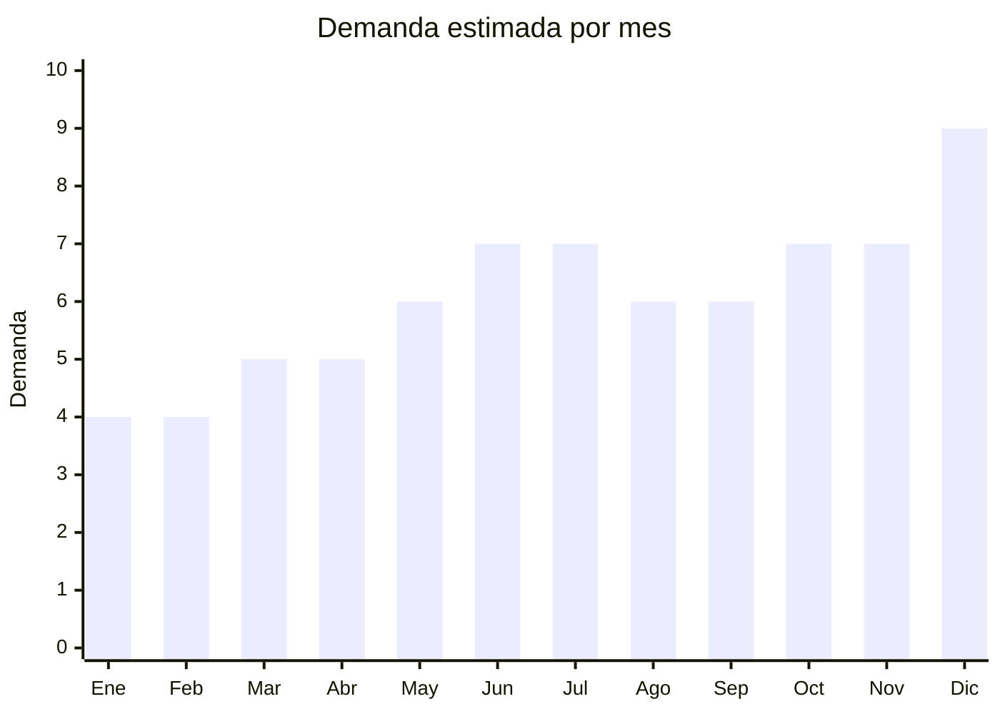

# Velas LED decorativas

> **Capítulo NCM 94** — Muebles; aparatos de alumbrado | **Temporada:** Atemporal

## Qué es y por qué importarlo

Las velas LED (también llamadas flameless candles o velas eléctricas) son dispositivos decorativos que imitan la apariencia de una vela real con llama LED parpadeante, sin fuego real. Se venden típicamente en sets de 3, 6 o 12 unidades con control remoto y función timer (4 u 8 horas). Están fabricadas en cera real (exterior) con mecanismo LED interior a pilas.

Aunque comercialmente se asocian con velas (Cap. 34), su clasificación real es **Cap. 94** (aparatos de alumbrado, NCM 9405.40) por ser dispositivos de iluminación eléctrica. Tienen demanda creciente en Argentina porque son seguras para hogares con niños/mascotas, reutilizables, y populares para eventos, gastronomía y decoración de temporada.

China domina la producción mundial de velas LED, con fábricas en Ningbo y Shantou que ofrecen precios FOB extremadamente competitivos.

## Datos clave

| Dato | Valor |
|------|-------|
| **Posiciones NCM típicas** | 9405.40.90 (aparatos eléctricos de alumbrado) |
| **Derecho de importación** | 20% (DIE) + 3% tasa estadística |
| **Rango FOB típico** | USD 0.30 — USD 3.00 por unidad; USD 2.00 — USD 8.00 por set |
| **Precio de venta en Argentina** | ARS 5.000 — ARS 20.000 (set x3-6); ARS 10.000 — ARS 35.000 (set x12 con control remoto) |
| **Margen bruto estimado** | 200% — 350% |
| **MOQ típico** | 100 — 500 sets |
| **Demanda en MercadoLibre** | Media |
| **Competencia en MercadoLibre** | Baja-Media |
| **Dificultad para importar** | Fácil-Moderada (verificar si requiere S-Mark) |
| **Certificaciones necesarias** | Posible S-Mark si se clasifica como luminaria eléctrica |
| **Antidumping** | No |

## Demanda y mercado en Argentina

- **Volumen de mercado:** Demanda en crecimiento. Menor volumen que velas reales pero con público específico: hoteles, restaurantes, eventos y hogares con niños/mascotas.
- **Tendencia:** Creciente — la tendencia de decoración "segura" y reutilizable gana terreno. Los modelos con control remoto y timer son los más buscados.
- **Perfil del comprador:** Decoradores de interiores, gastronomía (bares, restaurantes), event planners, hogares con niños pequeños.
- **Canales de venta principales:** MercadoLibre, bazares de decoración, mayorista a sector gastronómico/hotelero.

<Note>
El mercado gastronómico es un canal B2B interesante: restaurantes y bares compran sets de 12-24 velas LED para sus mesas. Un solo cliente gastronómico puede generar pedidos recurrentes.
</Note>

## Competencia

| Aspecto | Situación |
|---------|-----------|
| **Cantidad de vendedores en ML** | +100 vendedores activos |
| **Hay marcas dominantes** | No — mercado poco concentrado |
| **Tipo de competidores** | Importadores directos |
| **Rango de precios en ML** | ARS 5.000 — ARS 35.000 |
| **Posibilidad de diferenciarse** | Alta |

**Cómo diferenciarse:**
- Sets con control remoto + timer (funcionalidad premium)
- Velas de cera real con exterior realista (no plástico barato)
- Tamaños variados en un mismo set (efecto decorativo escalado)
- Packaging para regalo o gastronomía

## Variantes y subtipos más comunes

| Subtipo / Variante | FOB aprox. | Venta AR aprox. | Nota |
|--------------------|-----------|-----------------|------|
| Set x3 velas LED básicas (sin control) | USD 1.00 — 2.50 | ARS 5.000 — 12.000 | Entrada |
| Set x3 con control remoto y timer | USD 2.00 — 4.00 | ARS 8.000 — 18.000 | **Más vendido** |
| Set x6 con control remoto | USD 3.50 — 6.00 | ARS 12.000 — 25.000 | Popular |
| Set x12 con control remoto | USD 5.00 — 10.00 | ARS 18.000 — 35.000 | Gastronómico / eventos |
| Vela LED pilar grande (15-20cm) | USD 2.00 — 5.00 | ARS 8.000 — 20.000 | Decorativo premium |
| Tea lights LED (pack x24) | USD 2.00 — 5.00 | ARS 5.000 — 15.000 | Eventos / gastronomía |

## Regulaciones y requisitos

<Tabs>
  <Tab title="Certificaciones">
    | Organismo | Requiere | Detalle | Costo aprox. | Tiempo aprox. |
    |-----------|----------|---------|-------------|--------------|
    | ARCA (Aduana) | Sí siempre | Despacho estándar | — | — |
    | S-Mark / IRAM | **Posible** | Si clasifica como luminaria eléctrica puede requerir certificación. Las velas LED a pilas suelen estar exentas. Las que se enchufan a 220V sí requieren | Verificar | Verificar |
    | ENACOM | No | No tiene WiFi/Bluetooth (la mayoría) | — | — |
    | ANMAT | No | No es cosmético ni alimento | — | — |

    **Nota:** Las velas LED alimentadas por pilas (baterías CR2032 o AA/AAA) generalmente tienen menos requisitos que las que se enchufan a la red. Priorizar modelos a pilas para simplificar la importación.
  </Tab>

  <Tab title="Etiquetado">
    | Requisito | Aplica |
    |-----------|--------|
    | Idioma español | Sí |
    | Datos del importador | Sí |
    | Composición / materiales | Sí (cera + LED + plástico) |
    | Instrucciones de uso | Sí (cómo insertar pilas, usar control remoto) |
    | Tipo de pilas necesarias | Sí (indicar tipo y cantidad) |
    | País de origen | Sí |
    | Garantía legal 6 meses | Sí |
  </Tab>

  <Tab title="Restricciones">
    - Si incluyen pilas (baterías), verificar regulación de transporte de baterías.
    - Pilas CR2032 (botón de litio) están reguladas para envío aéreo.
    - Enviar sin pilas incluidas y recomendar compra local es opción segura.
    - Sin antidumping, sin licencias previas.
  </Tab>
</Tabs>

## Logística

| Dato | Valor |
|------|-------|
| **Peso típico por set (x3)** | 0.3 — 0.6 kg |
| **Volumen típico** | Medio |
| **Fragilidad** | Baja (cera con plástico interior — resistente) |
| **Envío recomendado** | Marítimo LCL |
| **Tiempo total estimado** (pedido a depósito) | 45 — 75 días (marítimo) |
| **Baterías de litio** | Posible (pilas CR2032 son litio). Enviar sin pilas para simplificar |
| **Requiere empaque especial** | No — producto resistente |

## Estacionalidad



| Aspecto | Detalle |
|---------|---------|
| **Meses pico** | Junio-Julio (invierno — decoración indoor), Octubre (Día de la Madre), Diciembre (decoración navideña, regalos) |
| **Meses valle** | Enero-Febrero |
| **Cuándo pedir para llegar a tiempo** | Abril para invierno; Septiembre para Navidad |

## Ventajas y riesgos

<CardGroup cols={2}>
  <Card title="Ventajas" icon="circle-check">
    - Producto reutilizable y seguro (sin fuego)
    - Buena relación valor/peso
    - Mercado menos saturado que velas reales
    - Canal B2B (gastronomía, hoteles) con pedidos recurrentes
    - Producto ideal para regalo y decoración
  </Card>
  <Card title="Riesgos" icon="triangle-exclamation">
    - Posible requisito S-Mark si clasifica como luminaria
    - Pilas de litio pueden complicar logística
    - Mercado más chico que velas aromáticas reales
    - Modelos baratos con luz LED poco realista generan devoluciones
  </Card>
</CardGroup>

<Warning>
La calidad de la luz LED es crítica. Las velas LED baratas tienen una luz fría y estática que se ve artificial. Los modelos con LED de "llama oscilante" (flickering flame) son mucho más realistas y se venden mejor. **Siempre pedir muestras** y verificar que la llama LED se vea convincente antes de hacer un pedido grande.
</Warning>

## Palabras clave para buscar en Alibaba

```
LED candle flameless wholesale, flickering LED candle set remote control,
real wax LED candle timer, battery operated candle wholesale, tea light LED candle bulk,
flameless candle set remote, pillar LED candle wholesale, restaurant LED candle
```

## Fuentes

- [MercadoLibre Argentina — Velas LED decorativas](https://listado.mercadolibre.com.ar/velas-led-decorativas)
- [Alibaba — Flameless LED candles wholesale](https://www.alibaba.com/showroom/flameless-led-candles.html)
