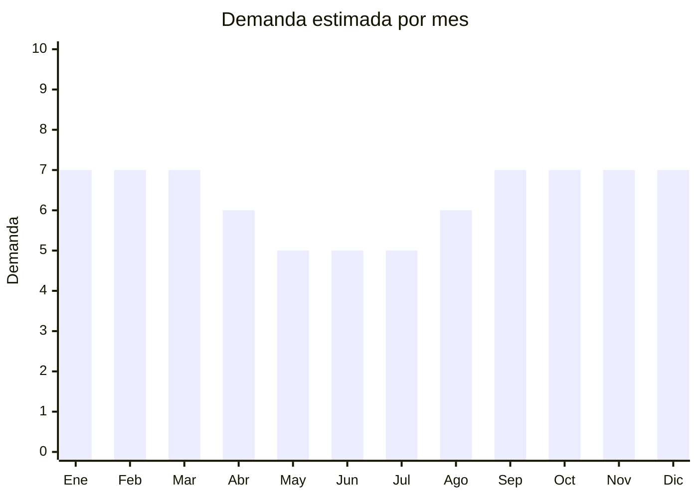

# Botellas reutilizables libre de BPA

> **Capítulo NCM 39** — Plástico y sus manufacturas | **Temporada:** Atemporal

## Qué es y por qué importarlo

Las botellas reutilizables abarcan botellas deportivas de plástico Tritan (libre de BPA), shakers de proteína con resorte mezclador, botellas con infusor de frutas, botellas motivacionales con marcas de hora, y botellas plegables de silicona. La tendencia eco-friendly (reemplazo de botellas descartables) y el boom del fitness mantienen esta categoría en crecimiento sostenido.

El material estrella es el **Tritan** (copoliéster libre de BPA fabricado por Eastman), que es transparente, resistente, apto para lavavajillas y no retiene olores. Los shakers de proteína (con compartimentos y resorte mezclador) son un sub-segmento propio con público fitness fidelizado.

China concentra la producción mundial de botellas plásticas reutilizables, con hubs en Yongkang (Zhejiang) — la capital de la botella deportiva — y Shantou (Guangdong).

## Datos clave

| Dato | Valor |
|------|-------|
| **Posiciones NCM típicas** | 3924.10.00 (vajilla y artículos de cocina de plástico), 3923.30.00 (botellones/frascos plásticos) |
| **Derecho de importación** | 18% (DIE) + 3% tasa estadística |
| **Rango FOB típico** | USD 0.50 — USD 3.00 por unidad |
| **Precio de venta en Argentina** | ARS 5.000 — ARS 20.000 |
| **Margen bruto estimado** | 150% — 300% |
| **MOQ típico** | 100 — 500 unidades |
| **Demanda en MercadoLibre** | Alta |
| **Competencia en MercadoLibre** | Alta |
| **Dificultad para importar** | Fácil |
| **Certificaciones necesarias** | Recomendable certificación "BPA Free" del proveedor |
| **Antidumping** | No |

## Demanda y mercado en Argentina

- **Volumen de mercado:** Miles de publicaciones activas en MercadoLibre. Los shakers y botellas deportivas son bestsellers permanentes con vendedores que superan 5,000+ unidades.
- **Tendencia:** Creciente — impulsada por consciencia ambiental y cultura fitness. Las botellas motivacionales (con horarios impresos) son tendencia viral.
- **Perfil del comprador:** Deportistas (gym, running, crossfit), público eco-consciente, oficinistas, estudiantes.
- **Canales de venta principales:** MercadoLibre, tiendas de artículos deportivos, gimnasios (B2B), supermercados.

<Note>
Las **botellas motivacionales** con marcas de hora ("8am - Good Morning", "12pm - Keep Going") son una tendencia viral de TikTok que se trasladó al mercado argentino. Tienen mayor ticket promedio y se venden como herramienta de bienestar, no solo como botella.
</Note>

## Competencia

| Aspecto | Situación |
|---------|-----------|
| **Cantidad de vendedores en ML** | +400 vendedores activos |
| **Hay marcas dominantes** | Parcialmente: marcas como Zulu, CamelBak tienen presencia premium. Genéricos importados dominan el volumen |
| **Tipo de competidores** | Importadores directos (mayoría) |
| **Rango de precios en ML** | ARS 5.000 — ARS 20.000 |
| **Posibilidad de diferenciarse** | Media-Alta |

**Cómo diferenciarse:**
- Marca propia con diseño y packaging profesional
- Botellas motivacionales con texto en español
- Shakers con compartimentos innovadores (pastillero, proteína)
- Material Tritan certificado como punto de venta
- Colores de tendencia (pastel, degradé)

## Variantes y subtipos más comunes

| Subtipo / Variante | FOB aprox. | Venta AR aprox. | Nota |
|--------------------|-----------|-----------------|------|
| Botella deportiva básica 750ml | USD 0.50 — 1.50 | ARS 5.000 — 10.000 | Alta rotación |
| Botella Tritan 1L con tapa flip | USD 1.00 — 2.50 | ARS 7.000 — 15.000 | **Más vendido** |
| Shaker proteína con resorte | USD 0.80 — 2.00 | ARS 5.000 — 12.000 | Público fitness |
| Botella motivacional con horas | USD 1.00 — 2.50 | ARS 8.000 — 18.000 | Tendencia viral |
| Botella con infusor de frutas | USD 1.50 — 3.00 | ARS 8.000 — 15.000 | Diferencial |
| Botella plegable silicona | USD 1.00 — 2.50 | ARS 6.000 — 12.000 | Viajeros |

## Regulaciones y requisitos

<Tabs>
  <Tab title="Certificaciones">
    | Organismo | Requiere | Detalle |
    |-----------|----------|---------|
    | ARCA (Aduana) | Sí siempre | Despacho estándar |
    | ANMAT | No obligatorio | Si se comercializa para alimentos, idealmente tener certificado "food grade" del proveedor |
    | ENACOM | No | No es electrónico |

    **Recomendación:** Solicitar al proveedor chino certificado de material "Food Grade" y "BPA Free" (test FDA o equivalente). Aunque no es obligatorio para la importación, es un fuerte argumento de venta y protección legal.
  </Tab>

  <Tab title="Etiquetado">
    | Requisito | Aplica |
    |-----------|--------|
    | Idioma español | Sí |
    | Datos del importador | Sí |
    | Composición / materiales | Sí ("Tritan libre de BPA", "PP grado alimentario") |
    | Capacidad en ml | Sí |
    | Instrucciones de limpieza | Recomendado |
    | País de origen | Sí |
    | Garantía legal 6 meses | Sí |
  </Tab>

  <Tab title="Restricciones">
    Sin restricciones especiales. No hay antidumping ni licencias previas.

    **Atención:** Si las botellas contienen aislamiento térmico de doble pared con vacío, podrían clasificar en Cap. 73 (acero) o Cap. 76 (aluminio) en lugar de Cap. 39.
  </Tab>
</Tabs>

## Logística

| Dato | Valor |
|------|-------|
| **Peso típico por unidad** | 0.10 — 0.30 kg |
| **Volumen típico** | Medio (las botellas son huecas — volumen mayor que su peso) |
| **Fragilidad** | Baja (Tritan y PP son muy resistentes) |
| **Envío recomendado** | Marítimo LCL |
| **Tiempo total estimado** | 45 — 75 días (marítimo) |
| **Baterías de litio** | No |
| **Requiere empaque especial** | No |

## Estacionalidad



| Aspecto | Detalle |
|---------|---------|
| **Meses pico** | Enero-Marzo (verano, actividad deportiva), Septiembre-Diciembre (primavera, vuelta al gym, regalos) |
| **Meses valle** | Mayo-Julio (invierno — menor actividad outdoor) |
| **Cuándo pedir** | Noviembre para tener stock en enero (pico verano) |

## Ventajas y riesgos

<CardGroup cols={2}>
  <Card title="Ventajas" icon="circle-check">
    - Demanda creciente (eco-friendly + fitness)
    - Sin barreras regulatorias complejas
    - Producto liviano y resistente
    - Ideal para marca propia
    - Compra recurrente (se pierden, rompen, regalan)
  </Card>
  <Card title="Riesgos" icon="triangle-exclamation">
    - Competencia alta con precios agresivos
    - Botellas baratas con fugas en tapa generan devoluciones
    - Volumen hueco = flete por CBM significativo
    - Copias de marcas conocidas pueden generar problemas de propiedad intelectual
  </Card>
</CardGroup>

<Warning>
**Verificar hermeticidad de las tapas.** La causa #1 de devoluciones en botellas importadas es la fuga por tapa mal sellada. Pedir muestras y probar intensivamente la hermeticidad (voltear con agua caliente 24hs) antes de hacer un pedido grande.
</Warning>

## Palabras clave para buscar en Alibaba

```
water bottle BPA free wholesale, Tritan water bottle, protein shaker bottle wholesale,
motivational water bottle time marker, fruit infuser water bottle, sports bottle bulk,
silicone collapsible water bottle, gym shaker bottle
```

## Fuentes

- [MercadoLibre Argentina — Botellas deportivas reutilizables](https://listado.mercadolibre.com.ar/botella-deportiva-reutilizable)
- [Alibaba — BPA free water bottle wholesale](https://www.alibaba.com/showroom/bpa-free-water-bottle.html)
