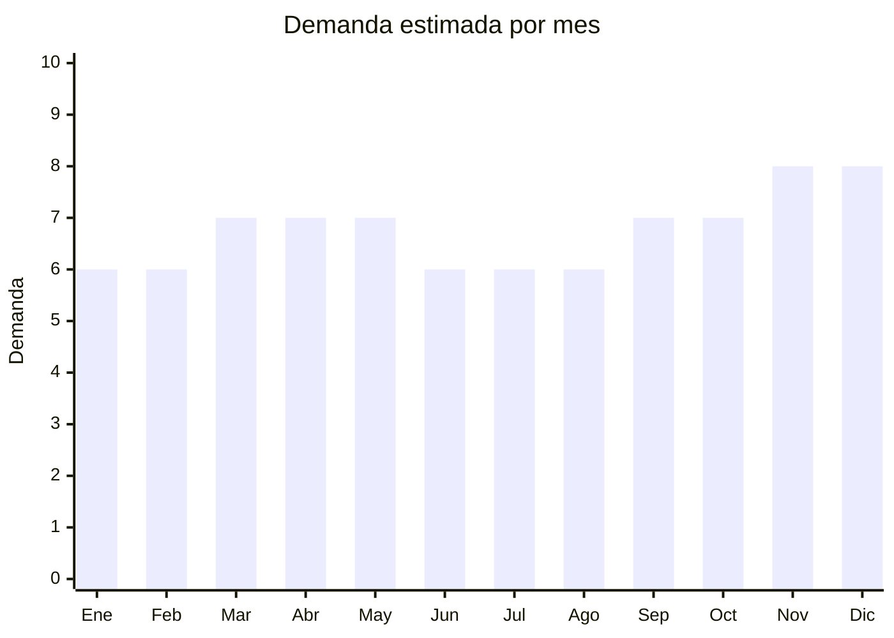

# Descartables para gastronomía y delivery

> **Capítulo NCM 39** — Plástico y sus manufacturas | **Temporada:** Atemporal

## Qué es y por qué importarlo

Los artículos descartables para gastronomía incluyen contenedores con tapa para delivery (rectangulares, redondos, compartimentados), vasos de plástico con tapa y sorbete, cubiertos descartables reforzados, bowls para ensaladas con tapa transparente, y bandejas sushi. La demanda de estos productos explotó con el crecimiento de apps de delivery (PedidosYa, Rappi) y dark kitchens.

El mercado argentino está en constante expansión porque más restaurantes, kioscos y emprendimientos gastronómicos adoptan el formato delivery/takeaway. Cada local gastronómico es un potencial cliente B2B recurrente que consume cientos o miles de envases mensuales.

China (especialmente Taizhou, Zhejiang) es el mayor productor mundial de envases descartables de PP y PET, con precios FOB que permiten competir o mejorar a la oferta local.

## Datos clave

| Dato | Valor |
|------|-------|
| **Posiciones NCM típicas** | 3923.10.90 (cajas y envases plásticos), 3924.10.00 (vajilla de plástico) |
| **Derecho de importación** | 18% (DIE) + 3% tasa estadística |
| **Rango FOB típico** | USD 0.02 — USD 0.15 por unidad |
| **Precio de venta en Argentina** | ARS 50 — ARS 300 por unidad (se venden por pack de 50-100) |
| **Margen bruto estimado** | 100% — 250% |
| **MOQ típico** | 5,000 — 50,000 unidades |
| **Demanda en MercadoLibre** | Alta |
| **Competencia en MercadoLibre** | Media-Alta |
| **Dificultad para importar** | Fácil |
| **Certificaciones necesarias** | Recomendable certificación apto contacto alimentario |
| **Antidumping** | No |

## Demanda y mercado en Argentina

- **Volumen de mercado:** Demanda masiva y en crecimiento. El delivery gastronómico creció exponencialmente y cada local necesita envases descartables de forma recurrente.
- **Tendencia:** Creciente — más restaurantes adoptan delivery. Dark kitchens (cocinas solo delivery) son un fenómeno en expansión.
- **Perfil del comprador:** Restaurantes, bares, dark kitchens, catering, food trucks, kioscos, emprendimientos gastronómicos.
- **Canales de venta principales:** MercadoLibre (packs mayoristas), venta directa B2B a gastronómicos, distribuidores mayoristas.

<Note>
Este es fundamentalmente un **negocio B2B**. Los clientes gastronómicos compran en volumen de forma recurrente (semanal o mensual). Un solo restaurante con delivery puede consumir 500-2,000 envases por mes. La fidelización del cliente es clave.
</Note>

## Competencia

| Aspecto | Situación |
|---------|-----------|
| **Cantidad de vendedores en ML** | +200 vendedores activos |
| **Hay marcas dominantes** | Fabricantes locales como Descartables Zona Norte, Zima, Papelera del Plata |
| **Tipo de competidores** | Fabricantes locales + Importadores + Distribuidores |
| **Rango de precios en ML** | ARS 3.000 — ARS 20.000 (por pack 50-100 unidades) |
| **Posibilidad de diferenciarse** | Media |

**Cómo diferenciarse:**
- Envases con diseño premium (líneas negras elegantes, transparentes)
- Envases compartimentados (2, 3 divisiones) para menú completo
- Materiales especializados: PP apto microondas, PET cristal transparente
- Línea eco-friendly (bagazo de caña, PLA biodegradable)
- Servicio de entrega recurrente a clientes B2B

## Variantes y subtipos más comunes

| Subtipo / Variante | FOB aprox. | Venta AR aprox. | Nota |
|--------------------|-----------|-----------------|------|
| Contenedor PP rectangular con tapa (750ml) | USD 0.03 — 0.08/u | ARS 80 — 200/u | **Más vendido** |
| Contenedor 2-3 compartimentos | USD 0.05 — 0.12/u | ARS 100 — 250/u | Menú ejecutivo |
| Bowl ensalada PET con tapa (500ml) | USD 0.04 — 0.10/u | ARS 80 — 180/u | Comida saludable |
| Vaso PP con tapa (400-500ml) | USD 0.02 — 0.06/u | ARS 50 — 120/u | Bebidas/jugos |
| Cubiertos reforzados (kit cuchillo+tenedor+servilleta) | USD 0.01 — 0.03/u | ARS 30 — 80/u | Complemento |
| Bandeja sushi PET transparente | USD 0.05 — 0.15/u | ARS 100 — 300/u | Nicho premium |

## Regulaciones y requisitos

<Tabs>
  <Tab title="Certificaciones">
    | Organismo | Requiere | Detalle |
    |-----------|----------|---------|
    | ARCA (Aduana) | Sí siempre | Despacho estándar |
    | ANMAT | Recomendable | Envases en contacto con alimentos idealmente deben cumplir normas de aptitud alimentaria. Solicitar certificado "food grade" al proveedor |
    | ENACOM | No | No es electrónico |
    | SENASA | No | No es alimento en sí |

    **Recomendación:** Solicitar al proveedor certificados de material "Food Contact Safe" (FDA o EU/CE). Aunque no es estrictamente obligatorio para la importación del envase vacío, es un requisito práctico para clientes gastronómicos profesionales.
  </Tab>

  <Tab title="Etiquetado">
    | Requisito | Aplica |
    |-----------|--------|
    | Idioma español | Sí |
    | Datos del importador | Sí |
    | Composición / materiales | Sí (PP, PET, PS — con símbolo de reciclaje) |
    | Apto microondas | Indicar si aplica (PP sí, PET no) |
    | País de origen | Sí |
  </Tab>

  <Tab title="Restricciones">
    Sin restricciones especiales de importación.

    **Nota ambiental:** Argentina tiene regulación creciente sobre plásticos de un solo uso a nivel municipal (CABA, Rosario). Monitorear legislación local que puede restringir ciertos descartables. La tendencia hacia materiales biodegradables es una oportunidad.
  </Tab>
</Tabs>

## Logística

| Dato | Valor |
|------|-------|
| **Peso típico por pack de 100 unidades** | 0.5 — 2.0 kg |
| **Volumen típico** | Alto (envases apilables pero voluminosos) |
| **Fragilidad** | Baja |
| **Envío recomendado** | Marítimo FCL o LCL — producto voluminoso |
| **Tiempo total estimado** | 50 — 80 días (marítimo) |
| **Baterías de litio** | No |
| **Requiere empaque especial** | No — se apilan y embalan en cajas de cartón |

<Warning>
**Negocio de volumen.** El margen por unidad es bajo (ARS 30-150 por envase). La rentabilidad depende del volumen. Pedidos mínimos rentables suelen ser de 10,000+ unidades. Calcular flete por CBM ya que el producto es voluminoso.
</Warning>

## Estacionalidad



| Aspecto | Detalle |
|---------|---------|
| **Meses pico** | Marzo-Mayo (vuelta a rutina, más pedidos delivery), Noviembre-Diciembre (fiestas, catering, eventos) |
| **Meses valle** | Enero-Febrero (vacaciones — menor actividad gastronómica) |
| **Cuándo pedir** | Mantener stock permanente — demanda constante |

## Ventajas y riesgos

<CardGroup cols={2}>
  <Card title="Ventajas" icon="circle-check">
    - Demanda masiva y creciente (boom delivery)
    - Clientes B2B con compra recurrente mensual
    - FOB extremadamente bajo
    - Sin regulación compleja
    - Fidelización alta de clientes gastronómicos
  </Card>
  <Card title="Riesgos" icon="triangle-exclamation">
    - Negocio de volumen (bajo margen unitario)
    - Producto muy voluminoso (flete por CBM alto)
    - Competencia con fabricantes locales establecidos
    - Legislación anti-plástico creciente en Argentina
    - Necesita capital inicial significativo por el volumen
  </Card>
</CardGroup>

## Palabras clave para buscar en Alibaba

```
disposable food container wholesale, PP food container with lid, takeaway container,
meal prep container, PET salad bowl lid, disposable cup with lid, sushi tray PET,
compartment food container, biodegradable food container
```

## Fuentes

- [MercadoLibre Argentina — Envases descartables gastronomía](https://listado.mercadolibre.com.ar/envases-descartables-gastronomia)
- [Alibaba — Disposable food container wholesale](https://www.alibaba.com/showroom/disposable-food-container.html)
