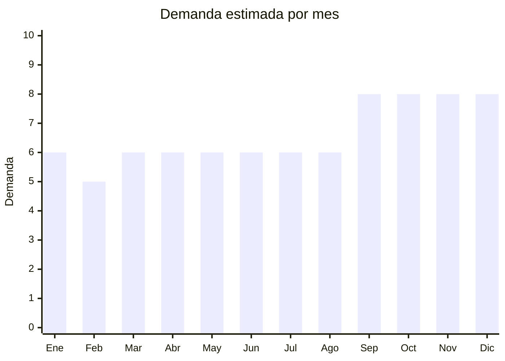

# Fundas y estuches para celulares

> **Capítulo NCM 39** — Plástico y sus manufacturas | **Temporada:** Atemporal

## Qué es y por qué importarlo

Las fundas para celulares son uno de los productos de importación más populares del mundo. Incluyen cases de silicona, TPU (poliuretano termoplástico), policarbonato rígido, fundas tipo wallet (con portadorocumentos), fundas magnéticas con MagSafe y diseños personalizados. Aunque se venden junto a electrónica (Cap. 85), su clasificación aduanera real es **Cap. 39** (manufactura plástica) cuando son de silicona/TPU/PC.

Este producto tiene una demanda perpetua porque cada teléfono nuevo genera un ciclo completo de compra de fundas. Cada lanzamiento de iPhone, Samsung Galaxy o Motorola crea un pico de demanda inmediato. Además, muchos usuarios compran múltiples fundas para variar el look de su teléfono.

Shenzhen y Guangzhou (China) concentran la producción mundial de fundas para celulares, con miles de fábricas que pueden producir diseños personalizados desde 100 unidades.

## Datos clave

| Dato | Valor |
|------|-------|
| **Posiciones NCM típicas** | 3926.90.90 (otras manufacturas de plástico), 4016.99.90 (si es de caucho/silicona) |
| **Derecho de importación** | 18% (DIE) + 3% tasa estadística |
| **Rango FOB típico** | USD 0.20 — USD 3.00 por unidad |
| **Precio de venta en Argentina** | ARS 3.000 — ARS 20.000 |
| **Margen bruto estimado** | 200% — 500% |
| **MOQ típico** | 50 — 500 unidades por modelo |
| **Demanda en MercadoLibre** | Muy alta |
| **Competencia en MercadoLibre** | Muy alta |
| **Dificultad para importar** | Fácil |
| **Certificaciones necesarias** | Ninguna |
| **Antidumping** | No |

## Demanda y mercado en Argentina

- **Volumen de mercado:** Decenas de miles de publicaciones activas. Es una de las categorías con mayor volumen de ventas en MercadoLibre Argentina.
- **Tendencia:** Perpetua — cada nuevo modelo de celular renueva la demanda. Los modelos más demandados siguen el ciclo de lanzamiento de Apple, Samsung y Motorola.
- **Perfil del comprador:** Universal — todo poseedor de smartphone (90%+ de la población).
- **Canales de venta principales:** MercadoLibre (dominante), locales de accesorios de celulares, ferias, venta callejera.

<Note>
Los modelos más demandados en Argentina son para **iPhone** (todos los modelos desde iPhone 11 en adelante), **Samsung Galaxy A** (serie económica, muy popular: A14, A15, A25, A54, A55), **Motorola** (Moto G series, muy fuerte en Argentina) y **Xiaomi** (presencia creciente).
</Note>

## Competencia

| Aspecto | Situación |
|---------|-----------|
| **Cantidad de vendedores en ML** | +2,000 vendedores activos |
| **Hay marcas dominantes** | No en genéricos. Spigen, OtterBox en premium |
| **Tipo de competidores** | Importadores masivos, locales de accesorios |
| **Rango de precios en ML** | ARS 3.000 — ARS 20.000 |
| **Posibilidad de diferenciarse** | Media |

**Cómo diferenciarse:**
- Diseños exclusivos (artwork, humor argentino, equipos de fútbol)
- Fundas con funcionalidades (kickstand, portadorocumentos, MagSafe)
- Marca propia con packaging profesional
- Cobertura rápida de modelos nuevos (ser primero en tener fundas para el último lanzamiento)

## Variantes y subtipos más comunes

| Subtipo / Variante | FOB aprox. | Venta AR aprox. | Nota |
|--------------------|-----------|-----------------|------|
| Funda TPU transparente básica | USD 0.20 — 0.50 | ARS 3.000 — 5.000 | Volumen puro |
| Funda silicona colores (tipo Apple) | USD 0.30 — 1.00 | ARS 4.000 — 8.000 | **Más vendido** |
| Funda rígida con diseño impreso | USD 0.40 — 1.50 | ARS 5.000 — 10.000 | Diferenciación |
| Funda tipo wallet/billetera | USD 1.00 — 3.00 | ARS 7.000 — 15.000 | Mayor ticket |
| Funda militar/armor (anti-golpes) | USD 0.50 — 2.00 | ARS 5.000 — 12.000 | Público masculino |
| Funda MagSafe compatible | USD 0.80 — 2.50 | ARS 6.000 — 15.000 | Tendencia Apple |
| Funda con anillo/kickstand | USD 0.30 — 1.50 | ARS 4.000 — 10.000 | Funcional |

## Regulaciones y requisitos

<Tabs>
  <Tab title="Certificaciones">
    | Organismo | Requiere | Detalle |
    |-----------|----------|---------|
    | ARCA (Aduana) | Sí siempre | Despacho estándar |
    | ANMAT | No | No es cosmético ni alimento |
    | ENACOM | No | No es electrónico (es accesorio pasivo) |
    | INTI | No | No es textil ni calzado |

    Producto sin barreras regulatorias.
  </Tab>

  <Tab title="Etiquetado">
    | Requisito | Aplica |
    |-----------|--------|
    | Idioma español | Sí |
    | Datos del importador | Sí |
    | Modelo compatible | Sí (indicar modelo de celular) |
    | Composición / materiales | Sí (TPU, silicona, policarbonato) |
    | País de origen | Sí |
    | Garantía legal 6 meses | Sí |
  </Tab>

  <Tab title="Restricciones">
    Sin restricciones. **Atención con marcas registradas:** No importar fundas con logos de Apple, Samsung, Nike, etc. sin licencia — es infracción de marca y la Aduana puede retener el envío.
  </Tab>
</Tabs>

## Logística

| Dato | Valor |
|------|-------|
| **Peso típico por unidad** | 0.02 — 0.08 kg |
| **Volumen típico** | Muy bajo |
| **Fragilidad** | Baja |
| **Envío recomendado** | Aéreo/Courier para lotes chicos; Marítimo LCL para volumen |
| **Tiempo total estimado** | 10 — 20 días (aéreo) / 45 — 75 días (marítimo) |
| **Baterías de litio** | No |
| **Requiere empaque especial** | No |

<Warning>
**No importar fundas con logos de marcas sin licencia.** La Aduana argentina retiene mercadería con falsificación de marca (Apple, Samsung, Nike, Disney, etc.). Usar diseños propios o genéricos.
</Warning>

## Estacionalidad



| Aspecto | Detalle |
|---------|---------|
| **Meses pico** | Septiembre-Diciembre (lanzamientos de iPhone, CyberMonday, Navidad — regalo de celular = compra de funda) |
| **Meses valle** | Febrero — demanda base siempre fuerte |
| **Cuándo pedir** | Agosto para cubrir lanzamientos de septiembre; Octubre para CyberMonday/Navidad |

## Ventajas y riesgos

<CardGroup cols={2}>
  <Card title="Ventajas" icon="circle-check">
    - Demanda perpetua vinculada a smartphones
    - Ultraliviano (flete mínimo)
    - Márgenes de 200-500%
    - Sin regulaciones
    - MOQ muy bajo para probar
    - Fácil de almacenar (ocupa poco espacio)
  </Card>
  <Card title="Riesgos" icon="triangle-exclamation">
    - Competencia brutal (miles de vendedores)
    - Necesidad de cubrir muchos modelos de celular
    - Modelos viejos = stock muerto
    - Riesgo de marcas falsificadas en la Aduana
    - Guerra de precios constante
  </Card>
</CardGroup>

## Palabras clave para buscar en Alibaba

```
phone case wholesale, TPU phone case clear, silicone phone case iPhone,
phone case custom design, magnetic phone case MagSafe, wallet phone case,
Samsung Galaxy case wholesale, Motorola phone case bulk
```

## Fuentes

- [MercadoLibre Argentina — Fundas celular](https://listado.mercadolibre.com.ar/fundas-celular)
- [Alibaba — Phone case wholesale](https://www.alibaba.com/showroom/phone-case-wholesale.html)
