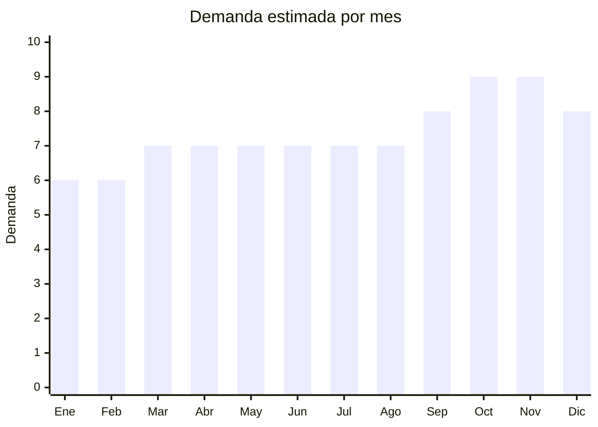

# Fundas para celulares

> **Capítulo NCM 39** — Plástico y sus manufacturas (clasificación principal: 3926.90) | **Temporada:** Atemporal

## Qué es y por qué importarlo

Las fundas para celulares (cases, carcasas, covers) son accesorios de protección y personalización para smartphones. Incluyen desde fundas de silicona transparente y TPU anti-shock hasta modelos premium de fibra de carbono, MagSafe y flip covers con soporte. Es uno de los productos con mayor rotación en todo el comercio electrónico argentino.

La demanda es perpetua y está directamente vinculada al parque de celulares activos. Cada vez que se lanza un nuevo modelo de iPhone, Samsung Galaxy, Motorola o Xiaomi, se genera una ola de demanda de fundas compatibles. Argentina tiene más de 60 millones de líneas móviles activas, lo que garantiza un mercado de reposición constante (las fundas se desgastan, se cambian por moda, se compran de repuesto).

China (Shenzhen, Guangzhou, Yiwu) produce más del 95% de las fundas del mundo. Los costos FOB son extremadamente bajos (desde USD 0.20/unidad) y los márgenes en Argentina son de los más altos del mercado de accesorios: **300% a 600%**. Ruddercel fue uno de los vendedores líderes en MercadoLibre en 2024 en esta categoría. No requiere ninguna certificación especial (ni ENACOM ni S-Mark), lo que la convierte en un producto ideal para importadores principiantes.

## Datos clave

| Dato | Valor |
|------|-------|
| **Posiciones NCM típicas** | 3926.90.90 (manufacturas de plástico n.e.p.), 4202.32.00 (estuches, fundas con superficie exterior de plástico/textil) |
| **Derecho de importación** | 18-20% (DIE) + 3% tasa estadística |
| **Rango FOB típico** | USD 0.20 — USD 2.00 por unidad |
| **Precio de venta en Argentina** | ARS 3.000 — ARS 15.000 |
| **Margen bruto estimado** | 300% — 600% |
| **MOQ típico** | 100 — 1,000 unidades (por modelo de celular) |
| **Demanda en MercadoLibre** | Muy Alta |
| **Competencia en MercadoLibre** | Muy Alta |
| **Dificultad para importar** | Fácil |
| **Certificaciones necesarias** | Ninguna |
| **Antidumping** | No |

## Demanda y mercado en Argentina

- **Volumen de mercado:** Es una de las categorías con mayor cantidad de publicaciones en MercadoLibre Argentina. Decenas de miles de listings activos. Los sellers top mueven miles de unidades por mes.
- **Tendencia:** Estable-Creciente. Se renueva con cada lanzamiento de smartphone. La tendencia actual es hacia fundas MagSafe (iPhone) y anti-shock premium.
- **Perfil del comprador:** Cualquier persona con celular (masivo). Desde el comprador que busca la funda más barata hasta quien quiere protección premium anti-golpes.
- **Canales de venta principales:** MercadoLibre, Instagram/redes sociales, accesorios de celular, kioscos, ferias.

<Note>
La clave del negocio de fundas es **la variedad de modelos compatibles**. Un vendedor exitoso tiene fundas para los 20-30 modelos de celular más vendidos del momento. Cada lanzamiento de iPhone o Samsung genera un pico de demanda que dura 3-6 meses. Tener stock del modelo nuevo antes que la competencia es la ventaja principal.
</Note>

## Competencia

| Aspecto | Situación |
|---------|-----------|
| **Cantidad de vendedores en ML** | +2,000 vendedores activos |
| **Hay marcas dominantes** | Pocas marcas dominan; es un mercado de importadores con marca propia o genéricos |
| **Tipo de competidores** | Importadores directos (mayoría) |
| **Rango de precios en ML** | ARS 3.000 — ARS 15.000 |
| **Posibilidad de diferenciarse** | Media-Alta (por diseño, calidad y velocidad) |

**Cómo diferenciarse:**
- Ser el primero en tener fundas para modelos nuevos recién lanzados
- Fundas con diseños exclusivos o licencias (anime, series, deportes)
- Packaging premium (blister profesional con tu marca)
- Combos: funda + vidrio templado + limpiador
- Fundas de nicho: ultra-slim, con soporte ring, wallet case

## Variantes y subtipos más comunes

| Subtipo / Variante | FOB aprox. | Venta AR aprox. | Nota |
|--------------------|-----------|-----------------|------|
| Silicona transparente TPU | USD 0.20 — 0.50 | ARS 3.000 — 6.000 | **Mayor volumen** — producto de entrada |
| TPU anti-shock reforzada | USD 0.50 — 1.00 | ARS 5.000 — 10.000 | Protección extra, bordes elevados |
| Fibra de carbono texturizada | USD 0.80 — 1.50 | ARS 6.000 — 12.000 | Look premium, liviana |
| MagSafe compatible (iPhone) | USD 1.00 — 2.00 | ARS 8.000 — 15.000 | **Tendencia creciente** |
| Flip cover / wallet case | USD 0.80 — 1.50 | ARS 5.000 — 12.000 | Con porta-tarjetas |
| Con soporte ring / kickstand | USD 0.50 — 1.00 | ARS 4.000 — 10.000 | Funcionalidad agregada |

## Regulaciones y requisitos

<Tabs>
  <Tab title="Certificaciones">
    | Organismo | Requiere | Detalle |
    |-----------|----------|---------|
    | ARCA (Aduana) | Sí siempre | Despacho de importación estándar |
    | ENACOM | No | No es dispositivo electrónico |
    | S-Mark | No | No aplica a accesorios pasivos |
    | INTI | No | No requiere certificación |
    | ANMAT | No | No es producto de salud |

    **Las fundas de celular no requieren ninguna certificación especial** más allá del despacho aduanero estándar. Es uno de los productos más simples de importar desde el punto de vista regulatorio.
  </Tab>

  <Tab title="Etiquetado">
    | Requisito | Aplica |
    |-----------|--------|
    | Idioma español | Sí (mínimo) |
    | Datos del importador | Sí |
    | Composición / material | Recomendado ("TPU", "Silicona", "PC + TPU") |
    | Modelo de celular compatible | Sí (crítico para la venta) |
    | País de origen | Sí |
    | Garantía legal 6 meses | Sí |
  </Tab>

  <Tab title="Restricciones">
    Sin restricciones especiales para fundas de celular. No hay antidumping vigente, no hay licencias previas, no hay intervención de organismos especiales.

    **Atención con propiedad intelectual:**
    - No importar fundas con logos de marcas registradas sin licencia (Apple, Nike, Disney, etc.)
    - Las fundas "tipo" o "compatible con" son legales; las que copian el logo de la marca no
    - MercadoLibre es estricto con reclamos de propiedad intelectual y puede dar de baja publicaciones
  </Tab>
</Tabs>

## Logística

| Dato | Valor |
|------|-------|
| **Peso típico por unidad** | 0.02 — 0.08 kg |
| **Volumen típico** | Muy bajo |
| **Fragilidad** | Muy baja (flexible, no se rompe) |
| **Envío recomendado** | Aéreo / Courier (producto ideal por ser ultraliviano) |
| **Tiempo total estimado** | 10 — 20 días (aéreo/courier) / 45 — 70 días (marítimo) |
| **Baterías de litio** | No |
| **Requiere empaque especial** | No — empaque básico en bolsas OPP individuales |

<Tip>
**Producto ideal para envío aéreo.** Por su peso casi nulo (20-80 gramos por unidad), las fundas son de los pocos productos donde el envío aéreo sale económico incluso en volumen. Un pedido de 1,000 fundas pesa apenas 30-50 kg. Esto permite reposición rápida y estar siempre actualizado con los modelos de celular más nuevos.
</Tip>

## Estacionalidad



| Aspecto | Detalle |
|---------|---------|
| **Meses pico** | Septiembre-Noviembre (lanzamiento iPhone nuevo + CyberMonday + Black Friday), Diciembre (regalos) |
| **Meses valle** | Enero-Febrero — demanda base siempre presente |
| **Cuándo pedir** | Agosto para tener stock de fundas del iPhone nuevo en septiembre. Reponer cada 4-6 semanas por la velocidad de aéreo. |

## Ventajas y riesgos

<CardGroup cols={2}>
  <Card title="Ventajas" icon="circle-check">
    - Márgenes excepcionales de 300-600%
    - Ultraliviano — ideal para envío aéreo económico
    - Sin certificaciones ni regulaciones especiales
    - Demanda perpetua vinculada al parque de celulares
    - Inversión inicial baja (desde USD 200-500)
    - Ideal para importadores principiantes
    - Rotación altísima
  </Card>
  <Card title="Riesgos" icon="triangle-exclamation">
    - Competencia extremadamente alta en MercadoLibre
    - Márgenes se comprimen por guerra de precios
    - Necesidad de estar siempre actualizado con modelos nuevos
    - Stock de modelos viejos pierde valor rápidamente
    - Riesgo de propiedad intelectual con diseños/logos
    - Calidad variable (fundas que amarillean rápido = devoluciones)
  </Card>
</CardGroup>

## Palabras clave para buscar en Alibaba

```
phone case wholesale, TPU phone cover, silicone phone case transparent,
MagSafe case iPhone, carbon fiber phone case, flip cover wallet case,
phone case with ring holder, anti-shock phone case, custom phone case OEM,
bulk phone cases manufacturer Shenzhen
```

## Fuentes

- [MercadoLibre Argentina — Fundas celulares](https://listado.mercadolibre.com.ar/fundas-celulares)
- [Alibaba — Phone case wholesale](https://www.alibaba.com/showroom/phone-case-wholesale.html)
