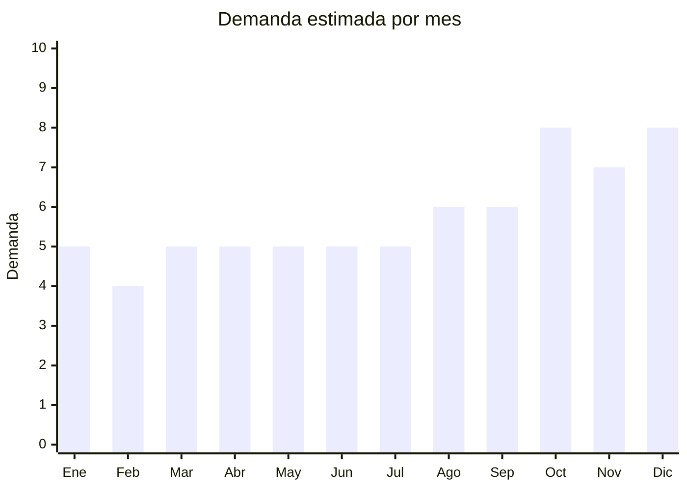

# Organizadores de cosméticos en acrílico

> **Capítulo NCM 39** — Plástico y sus manufacturas | **Temporada:** Atemporal

## Qué es y por qué importarlo

Los organizadores de cosméticos en acrílico son estructuras transparentes fabricadas en PMMA (polimetilmetacrilato), comúnmente llamado acrílico o plexiglass, diseñadas para almacenar y exhibir maquillaje, skincare, perfumes y accesorios de belleza. Vienen en múltiples configuraciones: giratorios con compartimientos, tipo cajón con divisiones, porta-labiales, porta-brochas, de pared, y torres multinivel. Su principal atractivo es la transparencia cristalina que permite ver todo el contenido y que funciona como elemento decorativo en tocadores y baños.

La demanda de estos productos en Argentina es constante y creciente, impulsada por la cultura del skincare y maquillaje que se expandió enormemente a través de Instagram, TikTok y YouTube. El concepto de "vanity" o tocador organizado se convirtió en tendencia estética: las compradoras no solo buscan organizar sino exhibir su colección de productos de belleza. Esto genera compras recurrentes, ya que quien compra un organizador suele volver por piezas complementarias para armar un sistema completo.

China produce virtualmente el 100% de los organizadores de acrílico del mundo, con centros de fabricación concentrados en Yiwu (Zhejiang) y Shenzhen (Guangdong). Los precios FOB son extremadamente bajos — un organizador giratorio que se vende a ARS 15.000-25.000 en Argentina tiene un costo FOB de USD 3-6. No existe fabricación local significativa de este tipo de producto, lo que elimina la competencia de marcas nacionales y deja el mercado prácticamente exclusivo para importadores.

## Datos clave

| Dato | Valor |
|------|-------|
| **Posiciones NCM típicas** | 3926.90.90 (otras manufacturas de plástico) |
| **Derecho de importación** | 18% (DIE) + 3% tasa estadística |
| **Rango FOB típico** | USD 1.00 — USD 10.00 por unidad |
| **Precio de venta en Argentina** | ARS 5.000 — ARS 35.000 |
| **Margen bruto estimado** | 200% — 400% |
| **MOQ típico** | 100 — 500 unidades |
| **Demanda en MercadoLibre** | Alta |
| **Competencia en MercadoLibre** | Media |
| **Dificultad para importar** | Fácil |
| **Certificaciones necesarias** | Ninguna obligatoria |
| **Antidumping** | No |

## Demanda y mercado en Argentina

- **Volumen de mercado:** Cientos de publicaciones activas en MercadoLibre con alta rotación. Producto de compra aspiracional vinculado al crecimiento del mercado de cosmética.
- **Tendencia:** Creciente — impulsada por tendencias de organización estética (vanity, skincare routines) y contenido de redes sociales.
- **Perfil del comprador:** Mujeres 18-45 años, entusiastas de maquillaje y skincare, maquilladoras profesionales, compradoras de regalos (Día de la Madre, cumpleaños).
- **Canales de venta principales:** MercadoLibre, tiendas online de accesorios de belleza, bazares, ferias de emprendedores.

<Note>
Los organizadores de acrílico transparente funcionan como producto **aspiracional y decorativo**, no solo funcional. Las publicaciones con fotos de vanity organizado generan más ventas que las que muestran el organizador vacío. Invertir en fotografía de producto con cosméticos incluidos aumenta significativamente la conversión.
</Note>

## Competencia

| Aspecto | Situación |
|---------|-----------|
| **Cantidad de vendedores en ML** | +300 vendedores activos |
| **Hay marcas dominantes** | No — mercado fragmentado, sin marcas nacionales de referencia |
| **Tipo de competidores** | Importadores directos, revendedores |
| **Rango de precios en ML** | ARS 5.000 — ARS 35.000 |
| **Posibilidad de diferenciarse** | Alta |

**Cómo diferenciarse:**
- Ofrecer sistemas modulares combinables (cajones + giratorio + porta-brochas como set)
- Acrílico de mayor espesor (3mm+) con acabado cristalino superior
- Kits armados con piezas complementarias a precio especial
- Marca propia con logo grabado láser en el acrílico

## Variantes y subtipos más comunes

| Subtipo / Variante | FOB aprox. | Venta AR aprox. | Nota |
|--------------------|-----------|-----------------|------|
| Organizador giratorio (rotating) | USD 3.00 — 6.00 | ARS 12.000 — 25.000 | **Más vendido** — 360 grados, múltiples niveles |
| Organizador con cajones (2-4 niveles) | USD 4.00 — 10.00 | ARS 15.000 — 35.000 | Premium, mayor ticket promedio |
| Porta-labiales / porta-esmaltes | USD 1.00 — 2.50 | ARS 5.000 — 10.000 | Producto de entrada, venta complementaria |
| Organizador de pared / baño | USD 2.00 — 5.00 | ARS 8.000 — 20.000 | Tendencia creciente, ahorra espacio |
| Torre multinivel (5+ niveles) | USD 5.00 — 10.00 | ARS 18.000 — 35.000 | Producto premium para coleccionistas |
| Organizador compacto de viaje | USD 1.00 — 3.00 | ARS 5.000 — 12.000 | Portátil, más resistente |

## Regulaciones y requisitos

<Tabs>
  <Tab title="Certificaciones">
    | Organismo | Requiere | Detalle |
    |-----------|----------|---------|
    | ARCA (Aduana) | Sí siempre | Despacho estándar |
    | ANMAT | No | No es cosmético, alimento ni producto sanitario |
    | ENACOM | No | No es electrónico |
    | INTI | No | No es textil ni calzado |

    Producto sin barreras regulatorias. El acrílico (PMMA) no está sujeto a ninguna certificación obligatoria cuando se comercializa como artículo de organización para el hogar.
  </Tab>

  <Tab title="Etiquetado">
    | Requisito | Aplica |
    |-----------|--------|
    | Idioma español | Sí |
    | Datos del importador | Sí |
    | Composición / materiales | Sí (PMMA / Acrílico) |
    | Instrucciones de uso | No obligatorio |
    | País de origen | Sí |
    | Garantía legal 6 meses | Sí |
  </Tab>

  <Tab title="Restricciones">
    Sin restricciones especiales. Producto de importación libre sin licencias previas, antidumping ni cupos.

    **Nota sobre calidad:** Si bien no hay restricciones legales, el acrílico de baja calidad (menos de 2mm de espesor) es propenso a fisuras y roturas durante el transporte. Esto no es un problema regulatorio sino comercial: genera devoluciones y reclamos.
  </Tab>
</Tabs>

## Logística

| Dato | Valor |
|------|-------|
| **Peso típico por unidad** | 0.3 — 2.0 kg |
| **Volumen típico** | Medio (las formas con cajones y giratorios ocupan espacio) |
| **Fragilidad** | Media — el acrílico puede fisurarse o rayarse con golpes |
| **Envío recomendado** | Marítimo LCL — producto voluminoso que justifica marítimo |
| **Tiempo total estimado** | 45 — 75 días (marítimo) |
| **Baterías de litio** | No |
| **Requiere empaque especial** | Sí — papel burbuja individual, separadores de espuma, caja reforzada |

<Tip>
**Espesor del acrílico = calidad percibida y durabilidad.** Solicitar siempre un mínimo de **3mm de espesor** en las paredes del organizador. El acrílico de 2mm o menos se fisura con facilidad durante el transporte y genera devoluciones. Pedir muestras antes de comprar volumen y verificar que la transparencia sea cristalina (sin tono amarillento). Especificar en la orden "virgin PMMA, no recycled material" para garantizar claridad óptica.
</Tip>

<Warning>
**Empaque crítico:** El acrílico se raya con facilidad si las piezas se tocan entre sí durante el envío. Exigir al proveedor que cada unidad tenga **film protector en ambas caras**, envuelto individual en papel burbuja y separadores de espuma dentro de la caja máster. Un empaque deficiente puede dañar el 20-30% de un envío.
</Warning>

## Estacionalidad



| Aspecto | Detalle |
|---------|---------|
| **Meses pico** | Octubre (Día de la Madre — regalo ideal), Noviembre-Diciembre (CyberMonday, Navidad, regalos de fin de año) |
| **Meses valle** | Febrero — demanda base estable todo el año |
| **Cuándo pedir para llegar a tiempo** | Julio-Agosto para cubrir el pico de octubre a diciembre (considerar 60-75 días de lead time total) |

## Ventajas y riesgos

<CardGroup cols={2}>
  <Card title="Ventajas" icon="circle-check">
    - Márgenes altos (200-400%) con FOB muy bajo
    - Cero barreras regulatorias ni certificaciones
    - Producto de tendencia impulsado por redes sociales
    - Sin competencia de fabricantes locales
    - Compra recurrente (el cliente vuelve por piezas complementarias)
    - Ideal como regalo (Día de la Madre, cumpleaños, Navidad)
    - Posibilidad de crear marca propia con grabado láser
  </Card>
  <Card title="Riesgos" icon="triangle-exclamation">
    - Fragilidad: el acrílico delgado se fisura y raya en transporte
    - Volumen medio-alto incrementa costo de flete por CBM
    - Competencia creciente de importadores en MercadoLibre
    - Versiones baratas con acrílico reciclado tienen tono amarillento
    - Expectativa alta del cliente: buscan transparencia cristalina perfecta
    - Roturas generan devoluciones costosas en MercadoLibre
  </Card>
</CardGroup>

## Palabras clave para buscar en Alibaba

```
acrylic makeup organizer wholesale, clear cosmetic storage box acrylic,
rotating makeup organizer acrylic 360, acrylic drawer organizer cosmetic,
acrylic lipstick holder display, acrylic makeup brush holder,
clear acrylic skincare organizer, PMMA cosmetic display box wholesale,
acrylic vanity organizer, acrylic bathroom organizer wall mount
```

## Fuentes

- [ARCA — Nomenclador Común del Mercosur](https://www.arca.gob.ar)
- [MercadoLibre Argentina — Organizadores acrílico maquillaje](https://listado.mercadolibre.com.ar/organizador-acrilico-maquillaje)
- [Alibaba — Acrylic makeup organizer wholesale](https://www.alibaba.com/showroom/acrylic-makeup-organizer.html)
