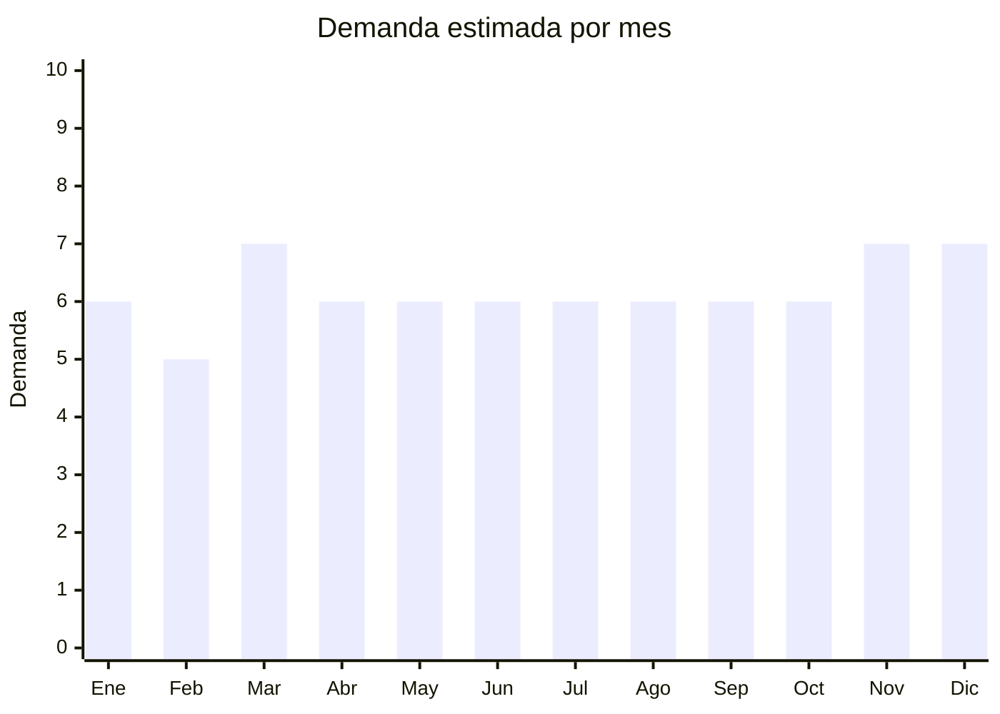

# Organizadores plásticos para hogar

> **Capítulo NCM 39** — Plástico y sus manufacturas | **Temporada:** Atemporal

## Qué es y por qué importarlo

Los organizadores plásticos para hogar abarcan cajas organizadoras con tapa, cajones apilables modulares, contenedores transparentes, separadores de cajones, organizadores de bajo-cama y sistemas de almacenamiento por módulos. Es una categoría amplia donde la tendencia de organización del hogar (impulsada por influencers como Marie Kondo y el movimiento "decluttering") mantiene la demanda constante.

China es el mayor productor mundial de manufacturas plásticas, con hubs en Taizhou (Zhejiang) — la capital china del plástico para hogar — y Dongguan (Guangdong). Los precios FOB son extremadamente competitivos, permitiendo márgenes atractivos incluso compitiendo con fabricantes locales como Colombraro y Plasutil.

El producto tiene demanda permanente porque todo hogar, oficina y comercio necesita soluciones de organización. La compra es recurrente: quien compra un organizador suele volver por más del mismo sistema modular.

## Datos clave

| Dato | Valor |
|------|-------|
| **Posiciones NCM típicas** | 3924.90.00 (artículos de uso doméstico de plástico), 3926.90.90 (otras manufacturas plásticas) |
| **Derecho de importación** | 18% (DIE) + 3% tasa estadística |
| **Rango FOB típico** | USD 0.50 — USD 5.00 por unidad (según tamaño) |
| **Precio de venta en Argentina** | ARS 5.000 — ARS 30.000 |
| **Margen bruto estimado** | 100% — 250% |
| **MOQ típico** | 200 — 1,000 unidades |
| **Demanda en MercadoLibre** | Alta |
| **Competencia en MercadoLibre** | Alta (marcas locales fuertes) |
| **Dificultad para importar** | Fácil |
| **Certificaciones necesarias** | Ninguna obligatoria |
| **Antidumping** | No |

## Demanda y mercado en Argentina

- **Volumen de mercado:** Miles de publicaciones activas en MercadoLibre. Categoría consolidada con ventas masivas todo el año.
- **Tendencia:** Estable — impulsada por tendencia de organización del hogar, mudanzas, cambios de estación (rotación de ropa), home office.
- **Perfil del comprador:** Amas de casa, parejas jóvenes amueblando, personas en mudanza, comercios (depósitos, oficinas).
- **Canales de venta principales:** MercadoLibre, bazares, ferreterías, mayoristas de bazar.

<Note>
Las marcas locales como **Colombraro, Plasutil, Sanremo y Wenco** tienen fuerte presencia. La diferenciación al importar pasa por diseños modernos (transparentes, colores nórdicos), sistemas modulares apilables y relación precio-calidad superior.
</Note>

## Competencia

| Aspecto | Situación |
|---------|-----------|
| **Cantidad de vendedores en ML** | +500 vendedores activos |
| **Hay marcas dominantes** | Sí: Colombraro, Plasutil, Sanremo tienen fuerte distribución local |
| **Tipo de competidores** | Fabricantes locales + Importadores |
| **Rango de precios en ML** | ARS 5.000 — ARS 30.000 |
| **Posibilidad de diferenciarse** | Media |

**Cómo diferenciarse:**
- Diseños modernos estilo nórdico/minimalista (colores pastel, transparentes)
- Sistemas modulares que los fabricantes locales no ofrecen
- Organizadores especializados (para zapatos, ropa interior, maquillaje, herramientas)
- Sets completos con medidas coordinadas

## Variantes y subtipos más comunes

| Subtipo / Variante | FOB aprox. | Venta AR aprox. | Nota |
|--------------------|-----------|-----------------|------|
| Caja organizadora con tapa (15L) | USD 0.80 — 2.00 | ARS 5.000 — 12.000 | Producto base |
| Caja transparente apilable (30L) | USD 1.50 — 3.50 | ARS 8.000 — 18.000 | **Más vendido** |
| Set cajones apilables modulares | USD 3.00 — 8.00 | ARS 12.000 — 30.000 | Sistema modular |
| Organizador de bajo-cama | USD 1.50 — 3.00 | ARS 6.000 — 15.000 | Muy popular |
| Separadores de cajón (set) | USD 0.50 — 2.00 | ARS 3.000 — 8.000 | Complemento |
| Organizador de zapatos (caja x6) | USD 2.00 — 5.00 | ARS 8.000 — 20.000 | Tendencia |

## Regulaciones y requisitos

<Tabs>
  <Tab title="Certificaciones">
    | Organismo | Requiere | Detalle |
    |-----------|----------|---------|
    | ARCA (Aduana) | Sí siempre | Despacho estándar |
    | ANMAT | No | No es cosmético ni alimento |
    | ENACOM | No | No es electrónico |
    | INTI | No | No es textil ni calzado |

    Producto sin barreras regulatorias. Importación libre y directa.
  </Tab>

  <Tab title="Etiquetado">
    | Requisito | Aplica |
    |-----------|--------|
    | Idioma español | Sí |
    | Datos del importador | Sí |
    | Composición / materiales | Sí (PP, PE, PS — indicar tipo de plástico) |
    | País de origen | Sí |
    | Garantía legal 6 meses | Sí |
  </Tab>

  <Tab title="Restricciones">
    Sin restricciones especiales. Producto de importación libre.

    **Nota:** Si los organizadores están destinados a contacto con alimentos (ej: organizadores de heladera), podrían requerir certificación de apto para contacto alimentario. Evitar esta complejidad comercializándolos como "uso general / organización".
  </Tab>
</Tabs>

## Logística

| Dato | Valor |
|------|-------|
| **Peso típico por unidad** | 0.3 — 2.0 kg |
| **Volumen típico** | Alto (producto voluminoso para su peso — se cobra flete por CBM) |
| **Fragilidad** | Baja (plástico resistente) |
| **Envío recomendado** | Marítimo LCL o FCL — producto voluminoso, necesita marítimo |
| **Tiempo total estimado** | 50 — 80 días (marítimo) |
| **Baterías de litio** | No |
| **Requiere empaque especial** | No |

<Warning>
**Cuidado con el volumen:** Los organizadores plásticos son muy voluminosos para su peso. El flete marítimo se cobra por CBM (metro cúbico), no por peso. Calcular bien el costo de flete por volumen antes de pedir. Buscar modelos que se apilan o anidan para optimizar el espacio en contenedor.
</Warning>

## Estacionalidad



| Aspecto | Detalle |
|---------|---------|
| **Meses pico** | Marzo (vuelta a clases, reorganización post-vacaciones), Noviembre-Diciembre (CyberMonday, regalos, cambio de estación) |
| **Meses valle** | Febrero — demanda estable todo el año |
| **Cuándo pedir** | Cualquier momento — mantener stock permanente |

## Ventajas y riesgos

<CardGroup cols={2}>
  <Card title="Ventajas" icon="circle-check">
    - Demanda masiva y permanente
    - Sin barreras regulatorias
    - Producto resistente al transporte
    - Compra recurrente (sistemas modulares)
    - FOB muy competitivo
  </Card>
  <Card title="Riesgos" icon="triangle-exclamation">
    - Competencia fuerte de fabricantes locales (Colombraro, etc.)
    - Producto muy voluminoso (flete alto por CBM)
    - Márgenes menores que productos más pequeños
    - Requiere volumen para ser rentable
  </Card>
</CardGroup>

## Palabras clave para buscar en Alibaba

```
plastic storage box wholesale, stackable storage container, clear plastic organizer,
drawer organizer set, under bed storage box, shoe storage box clear,
modular storage system, plastic bins wholesale
```

## Fuentes

- [MercadoLibre Argentina — Organizadores plásticos hogar](https://listado.mercadolibre.com.ar/organizador-plastico)
- [Alibaba — Plastic storage box wholesale](https://www.alibaba.com/showroom/plastic-storage-box-wholesale.html)
