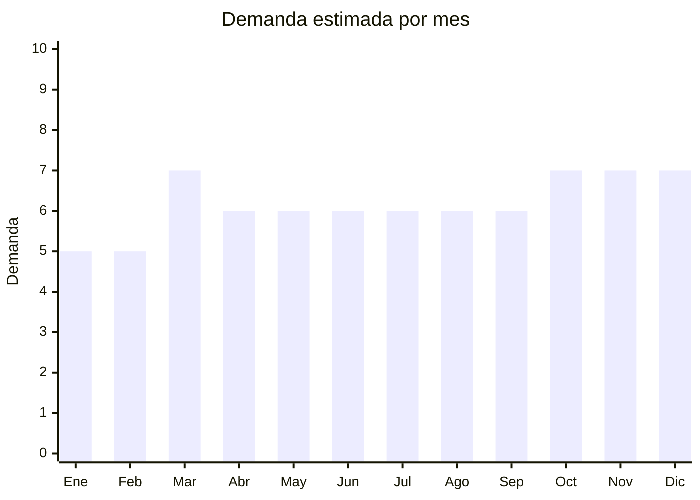

# Tappers y recipientes herméticos

> **Capítulo NCM 39** — Plástico y sus manufacturas | **Temporada:** Atemporal

## Qué es y por qué importarlo

Los tappers y recipientes herméticos son contenedores de plástico con tapa hermética (clip o snap-lock) para almacenar alimentos en heladera, freezer o para llevar comida al trabajo/estudio. Se venden típicamente en sets de 5 a 20 piezas de diferentes tamaños. El genérico de "Tupperware" es un producto de consumo masivo que todo hogar necesita y repone periódicamente.

Con la quiebra de Tupperware en 2024, el mercado quedó más fragmentado y abierto a nuevas marcas. Las alternativas genéricas importadas de China en PP (polipropileno) libre de BPA son el segmento con mayor crecimiento.

China (Taizhou, Zhejiang) es el principal productor mundial de recipientes herméticos de plástico, con fábricas que ofrecen sets completos desde USD 2 FOB, con moldes modernos y cierre snap-lock de calidad comparable a las marcas premium.

## Datos clave

| Dato | Valor |
|------|-------|
| **Posiciones NCM típicas** | 3924.10.00 (vajilla y demás artículos para servicio de mesa o cocina, de plástico) |
| **Derecho de importación** | 18% (DIE) + 3% tasa estadística |
| **Rango FOB típico** | USD 2.00 — USD 8.00 por set (5-20 piezas) |
| **Precio de venta en Argentina** | ARS 10.000 — ARS 35.000 por set |
| **Margen bruto estimado** | 150% — 300% |
| **MOQ típico** | 200 — 1,000 sets |
| **Demanda en MercadoLibre** | Alta |
| **Competencia en MercadoLibre** | Alta |
| **Dificultad para importar** | Fácil |
| **Certificaciones necesarias** | Recomendable certificado "Food Grade" / "BPA Free" |
| **Antidumping** | No |

## Demanda y mercado en Argentina

- **Volumen de mercado:** Miles de publicaciones activas en MercadoLibre. Sets de contenedores herméticos son un producto básico de hogar con demanda permanente.
- **Tendencia:** Estable-Creciente — impulsada por el meal prep (preparación semanal de comidas), tendencia fitness y la necesidad de llevar vianda al trabajo.
- **Perfil del comprador:** Universal — todo hogar necesita recipientes. Público intensivo: personas que llevan vianda, adeptos al meal prep, familias.
- **Canales de venta principales:** MercadoLibre, supermercados, bazares, ferias de hogar.

<Note>
La quiebra de Tupperware (2024) dejó un hueco en el mercado premium que marcas genéricas importadas están llenando. Los consumidores buscan alternativas de buena calidad a menor precio. Es una oportunidad de timing para posicionar una marca propia.
</Note>

## Competencia

| Aspecto | Situación |
|---------|-----------|
| **Cantidad de vendedores en ML** | +300 vendedores activos |
| **Hay marcas dominantes** | Locales: Colombraro, Mica, FIT. Tupperware debilitada post-quiebra |
| **Tipo de competidores** | Fabricantes locales + Importadores |
| **Rango de precios en ML** | ARS 10.000 — ARS 35.000 |
| **Posibilidad de diferenciarse** | Media-Alta |

**Cómo diferenciarse:**
- Sets con diseño moderno (colores coordinados, transparentes con tapa color)
- Material Tritan para los recipientes premium (apto lavavajillas)
- Sets especializados: "kit vianda" (contenedor + cubiertos + bolsa térmica)
- Recipientes para meal prep con compartimentos
- Sets para freezer (aptos congelamiento, con indicador de fecha)

## Variantes y subtipos más comunes

| Subtipo / Variante | FOB aprox. | Venta AR aprox. | Nota |
|--------------------|-----------|-----------------|------|
| Set x5 recipientes básicos PP | USD 2.00 — 3.50 | ARS 10.000 — 15.000 | Entrada |
| Set x10 recipientes con tapas | USD 3.00 — 5.00 | ARS 15.000 — 22.000 | **Más vendido** |
| Set x17-20 piezas completo | USD 5.00 — 8.00 | ARS 20.000 — 35.000 | Premium/familia |
| Recipientes para meal prep x5 | USD 2.00 — 4.00 | ARS 8.000 — 18.000 | Tendencia fitness |
| Set vidrio borosilicato con tapa PP | USD 4.00 — 10.00 | ARS 18.000 — 40.000 | Premium — Cap. 70 |
| Recipientes para freezer apilables | USD 2.50 — 5.00 | ARS 10.000 — 20.000 | Especializado |

## Regulaciones y requisitos

<Tabs>
  <Tab title="Certificaciones">
    | Organismo | Requiere | Detalle |
    |-----------|----------|---------|
    | ARCA (Aduana) | Sí siempre | Despacho estándar |
    | ANMAT | Recomendable | Recipientes para alimentos idealmente deben tener certificado de aptitud alimentaria. Solicitar certificado "Food Grade" al proveedor chino |
    | ENACOM | No | No es electrónico |

    **Recomendación:** Solicitar certificados FDA o EU Food Contact al proveedor. También solicitar test de migración (que no libere sustancias tóxicas al alimento). Esto es un argumento de venta fuerte.
  </Tab>

  <Tab title="Etiquetado">
    | Requisito | Aplica |
    |-----------|--------|
    | Idioma español | Sí |
    | Datos del importador | Sí |
    | Composición / materiales | Sí ("PP libre de BPA", con símbolo de reciclaje #5) |
    | Apto microondas | Indicar claramente si aplica |
    | Apto freezer | Indicar si aplica |
    | Apto lavavajillas | Indicar si aplica |
    | País de origen | Sí |
    | Garantía legal 6 meses | Sí |
  </Tab>

  <Tab title="Restricciones">
    Sin restricciones de importación.

    **Recomendación:** Asegurar que el material sea PP (polipropileno, reciclaje #5) que es el más seguro para contacto alimentario y microondas. Evitar PS (poliestireno, #6) y PC (policarbonato, #7) que pueden contener BPA.
  </Tab>
</Tabs>

## Logística

| Dato | Valor |
|------|-------|
| **Peso típico por set (x10)** | 0.5 — 1.5 kg |
| **Volumen típico** | Alto (recipientes son huecos y voluminosos) |
| **Fragilidad** | Baja (PP es resistente a golpes) |
| **Envío recomendado** | Marítimo LCL o FCL — producto voluminoso |
| **Tiempo total estimado** | 50 — 80 días (marítimo) |
| **Baterías de litio** | No |
| **Requiere empaque especial** | No |

<Warning>
Los recipientes herméticos son **muy voluminosos** para su peso porque son huecos. Buscar sets que se **aniden** (cada recipiente encaja dentro del siguiente) para optimizar el espacio de envío y reducir costos de flete por CBM.
</Warning>

## Estacionalidad



| Aspecto | Detalle |
|---------|---------|
| **Meses pico** | Marzo (vuelta a clases/trabajo — viandas), Octubre-Diciembre (Día de la Madre, regalos, mudanzas) |
| **Meses valle** | Enero-Febrero — demanda base estable |
| **Cuándo pedir** | Enero para stock de marzo (vuelta a clases) |

## Ventajas y riesgos

<CardGroup cols={2}>
  <Card title="Ventajas" icon="circle-check">
    - Demanda masiva y permanente
    - Producto básico de hogar que todo el mundo necesita
    - Oportunidad post-quiebra de Tupperware
    - Sin regulación compleja
    - Ideal para marca propia
  </Card>
  <Card title="Riesgos" icon="triangle-exclamation">
    - Competencia con fabricantes locales (Colombraro, etc.)
    - Producto muy voluminoso (flete por CBM alto)
    - Tapas de mala calidad = fugas = devoluciones
    - Si no es "BPA Free" certificado, pierde confianza del consumidor
  </Card>
</CardGroup>

## Palabras clave para buscar en Alibaba

```
food storage container set, airtight food container PP, BPA free container set,
meal prep container wholesale, snap lock container, plastic food container set,
PP food container microwave safe, nestable storage container set
```

## Fuentes

- [MercadoLibre Argentina — Set contenedores herméticos](https://listado.mercadolibre.com.ar/set-contenedores-hermeticos)
- [Alibaba — Food storage container set](https://www.alibaba.com/showroom/food-storage-container-set.html)
