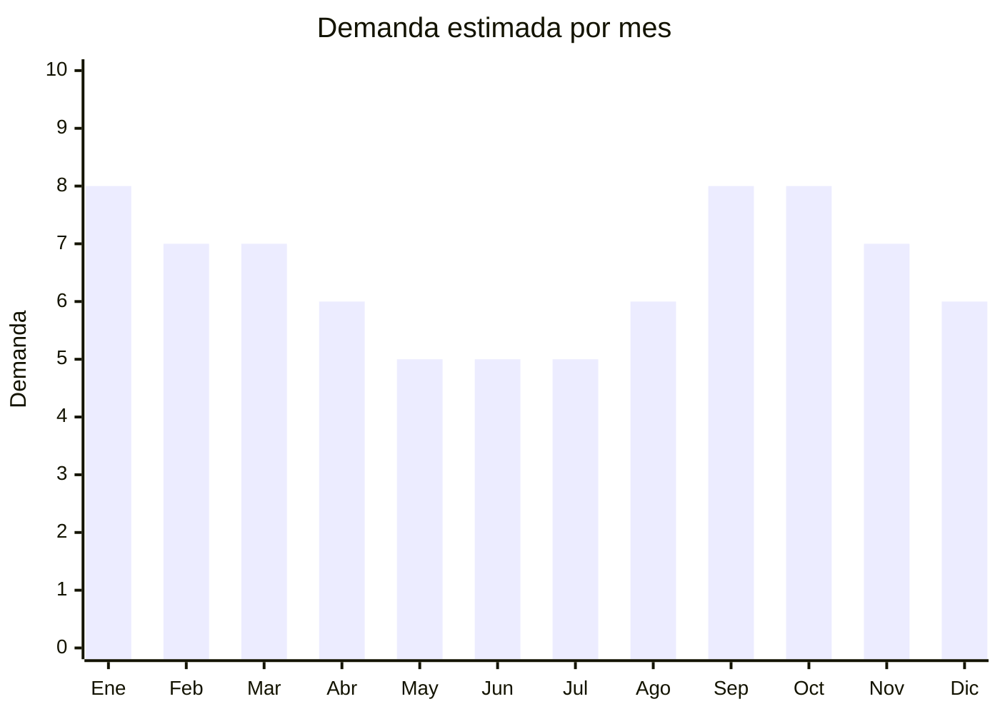

# Bandas elásticas de fitness

> **Capítulo NCM 40** — Caucho y sus manufacturas | **Temporada:** Atemporal

## Qué es y por qué importarlo

Las bandas elásticas de fitness (resistance bands) son accesorios de entrenamiento de caucho/látex natural o TPE que se usan para ejercicios de fuerza, rehabilitación y estiramientos. Se venden típicamente en sets de 3 a 5 bandas con diferentes niveles de resistencia (codificados por color), en formatos de mini-band (loop cerrado para piernas/glúteos) o bandas largas tubulares con manijas.

El mercado de home workout se consolidó después de la pandemia y se mantiene estable. Las bandas elásticas son el accesorio de fitness más versátil, portátil y económico, lo que las convierte en producto de entrada para cualquier persona que quiera entrenar en casa. El público es tanto amateur como profesional (fisioterapeutas, personal trainers).

China produce la gran mayoría de las bandas elásticas del mundo, con precios FOB que permiten márgenes de 200-400% vendiendo en Argentina.

## Datos clave

| Dato | Valor |
|------|-------|
| **Posiciones NCM típicas** | 4016.99.90 (otras manufacturas de caucho vulcanizado), 4014.90.90 (otros artículos de higiene/caucho) |
| **Derecho de importación** | 14-18% (DIE, varía por subpartida) + 3% tasa estadística |
| **Rango FOB típico** | USD 0.80 — USD 4.00 por set (3-5 bandas) |
| **Precio de venta en Argentina** | ARS 5.000 — ARS 20.000 |
| **Margen bruto estimado** | 200% — 400% |
| **MOQ típico** | 100 — 500 sets |
| **Demanda en MercadoLibre** | Alta |
| **Competencia en MercadoLibre** | Alta |
| **Dificultad para importar** | Fácil |
| **Certificaciones necesarias** | Ninguna |
| **Antidumping** | No |

## Demanda y mercado en Argentina

- **Volumen de mercado:** Miles de publicaciones activas en MercadoLibre. Vendedores top con +5,000 unidades vendidas. Categoría consolidada de fitness.
- **Tendencia:** Estable — demanda post-pandemia se mantuvo sólida. Home workout es hábito permanente para millones.
- **Perfil del comprador:** Personas que entrenan en casa, asistentes a gym, pacientes en rehabilitación (fisioterapia), personal trainers, adultos mayores (ejercicio suave).
- **Canales de venta principales:** MercadoLibre, tiendas deportivas, gimnasios, clínicas de fisioterapia.

<Note>
Los **mini-bands** (loops cerrados para glúteos) son el formato más vendido, impulsados por influencers fitness femeninas. Los sets de 3 mini-bands (suave, medio, fuerte) son el formato ideal para empezar.
</Note>

## Competencia

| Aspecto | Situación |
|---------|-----------|
| **Cantidad de vendedores en ML** | +300 vendedores activos |
| **Hay marcas dominantes** | No hay marca dominante clara. Genéricos chinos lideran volumen |
| **Tipo de competidores** | Importadores directos (mayoría) |
| **Rango de precios en ML** | ARS 5.000 — ARS 20.000 |
| **Posibilidad de diferenciarse** | Media |

**Cómo diferenciarse:**
- Marca propia con guía de ejercicios incluida (QR a video)
- Sets con bolsa de transporte premium
- Bandas de tela (fabric bands) como alternativa a látex (menos alergénico)
- Combos: bandas + tobilleras + ancla de puerta
- Bandas de diferentes espesores para fisioterapia (con receta de ejercicios)

## Variantes y subtipos más comunes

| Subtipo / Variante | FOB aprox. | Venta AR aprox. | Nota |
|--------------------|-----------|-----------------|------|
| Mini-bands set x3 (látex) | USD 0.80 — 1.50 | ARS 5.000 — 9.000 | **Más vendido** |
| Mini-bands set x5 (látex) | USD 1.00 — 2.50 | ARS 7.000 — 12.000 | Set completo |
| Mini-bands de tela (fabric) set x3 | USD 2.00 — 4.00 | ARS 8.000 — 18.000 | Premium, no enrolla |
| Bandas tubulares con manijas set x5 | USD 3.00 — 6.00 | ARS 12.000 — 25.000 | Entrenamiento completo |
| Banda larga única (power band) | USD 1.00 — 3.00 | ARS 5.000 — 15.000 | Dominadas, crossfit |
| Kit completo (bandas + tobilleras + ancla) | USD 4.00 — 8.00 | ARS 15.000 — 30.000 | Kit premium |

## Regulaciones y requisitos

<Tabs>
  <Tab title="Certificaciones">
    | Organismo | Requiere | Detalle |
    |-----------|----------|---------|
    | ARCA (Aduana) | Sí siempre | Despacho estándar |
    | ANMAT | No | No es producto médico (salvo que se venda como dispositivo de rehabilitación médica) |
    | ENACOM | No | No es electrónico |
    | INTI | No | No es textil ni calzado |

    Producto sin barreras regulatorias para uso deportivo.
  </Tab>

  <Tab title="Etiquetado">
    | Requisito | Aplica |
    |-----------|--------|
    | Idioma español | Sí |
    | Datos del importador | Sí |
    | Composición / materiales | Sí ("Látex natural" / "TPE" / "Tela + látex") |
    | Niveles de resistencia | Sí (indicar nivel de cada banda) |
    | Advertencias de uso | Recomendado ("No usar con látex dañado", "Consulte a su médico") |
    | País de origen | Sí |
    | Garantía legal 6 meses | Sí |
  </Tab>

  <Tab title="Restricciones">
    Sin restricciones especiales.

    **Nota sobre alergia al látex:** Indicar claramente si el material contiene látex natural, ya que algunas personas son alérgicas. Las bandas de TPE (elastómero termoplástico) son la alternativa hipoalergénica.
  </Tab>
</Tabs>

## Logística

| Dato | Valor |
|------|-------|
| **Peso típico por set (x5)** | 0.15 — 0.40 kg |
| **Volumen típico** | Muy bajo |
| **Fragilidad** | Baja |
| **Envío recomendado** | Aéreo/Courier para lotes chicos; Marítimo LCL para volumen |
| **Tiempo total estimado** | 15 — 25 días (aéreo) / 45 — 75 días (marítimo) |
| **Baterías de litio** | No |
| **Requiere empaque especial** | No — incluir bolsa de transporte como parte del producto |

## Estacionalidad



| Aspecto | Detalle |
|---------|---------|
| **Meses pico** | Enero-Marzo (propósitos de año nuevo, vuelta al gym, operación verano), Septiembre-Octubre (pre-verano, vuelta al entrenamiento) |
| **Meses valle** | Mayo-Julio (invierno — menor motivación fitness) |
| **Cuándo pedir** | Noviembre para tener stock en enero (pico de año nuevo) |

## Ventajas y riesgos

<CardGroup cols={2}>
  <Card title="Ventajas" icon="circle-check">
    - Ultraliviano (flete mínimo por unidad)
    - Márgenes altos (200-400%)
    - Sin regulación
    - Demanda consolidada
    - Ideal para marca propia
    - Compra recurrente (las bandas se deterioran y se reponen)
  </Card>
  <Card title="Riesgos" icon="triangle-exclamation">
    - Competencia alta con precios agresivos
    - Bandas de baja calidad se rompen y generan reclamos/lesiones
    - Mercado puede saturarse
    - Riesgo de alergia al látex (usar TPE como alternativa)
  </Card>
</CardGroup>

<Warning>
La calidad del látex es crítica. Bandas de baja calidad se **rompen durante el uso** y pueden causar lesiones. Siempre pedir muestras y probar intensivamente (estiramiento repetido 500+ veces). El látex de buena calidad no debe blanquearse ni agrietarse al estirarse.
</Warning>

## Palabras clave para buscar en Alibaba

```
resistance bands set wholesale, mini band loop latex, fitness band set 5 levels,
fabric resistance bands, exercise band set with bag, power band pull up,
TPE resistance band, booty band set wholesale
```

## Fuentes

- [MercadoLibre Argentina — Bandas elásticas fitness](https://listado.mercadolibre.com.ar/bandas-elasticas-fitness)
- [Alibaba — Resistance bands wholesale](https://www.alibaba.com/showroom/resistance-bands-set-wholesale.html)
