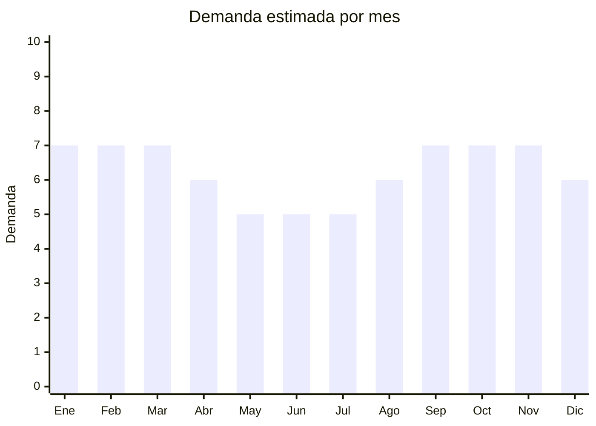

# Colchonetas y mats de yoga/gym

> **Capítulo NCM 40** — Caucho y sus manufacturas | **Temporada:** Atemporal

## Qué es y por qué importarlo

Las colchonetas deportivas (yoga mats, exercise mats) son superficies acolchadas de NBR (caucho nitrilo), TPE (elastómero termoplástico) o caucho natural que se usan para yoga, pilates, gimnasia, ejercicios de piso y meditación. Los espesores más populares son 6mm (yoga), 10mm (pilates/gym) y 15mm (ejercicio general / adultos mayores).

Argentina tiene una demanda permanente de colchonetas impulsada por yoga, pilates, crossfit y home workout. Las alfombrillas para auto y tapetes de caucho para gimnasios profesionales son sub-segmentos complementarios.

China produce la gran mayoría de las colchonetas del mundo, con fábricas especializadas en Hebei y Fujian que ofrecen personalización de color, grosor, textura y logo.

## Datos clave

| Dato | Valor |
|------|-------|
| **Posiciones NCM típicas** | 4016.91.00 (revestimientos de caucho para pisos), 4016.99.90 (otras manufacturas de caucho) |
| **Derecho de importación** | 14-18% (DIE) + 3% tasa estadística |
| **Rango FOB típico** | USD 1.50 — USD 6.00 por unidad |
| **Precio de venta en Argentina** | ARS 10.000 — ARS 35.000 |
| **Margen bruto estimado** | 150% — 300% |
| **MOQ típico** | 100 — 500 unidades |
| **Demanda en MercadoLibre** | Alta |
| **Competencia en MercadoLibre** | Alta |
| **Dificultad para importar** | Fácil-Moderada (producto pesado/voluminoso) |
| **Certificaciones necesarias** | Ninguna obligatoria |
| **Antidumping** | No |

## Demanda y mercado en Argentina

- **Volumen de mercado:** Colchonetas NBR 10-15mm para yoga/gym son bestsellers permanentes con miles de publicaciones activas.
- **Tendencia:** Estable — demanda consolidada por yoga, pilates, crossfit, funcional. El home workout mantuvo la demanda post-pandemia.
- **Perfil del comprador:** Practicantes de yoga/pilates, personas que entrenan en casa, gimnasios (compra B2B), estudios de yoga/pilates, adultos mayores (rehabilitación).
- **Canales de venta principales:** MercadoLibre, tiendas deportivas, mayorista a gimnasios/estudios.

<Note>
Las colchonetas de **TPE** (más ecológicas, sin olor, hipoalergénicas) están ganando terreno sobre las de **NBR** (más económicas pero con olor químico inicial). Posicionar una línea TPE como premium es una buena estrategia de diferenciación.
</Note>

## Competencia

| Aspecto | Situación |
|---------|-----------|
| **Cantidad de vendedores en ML** | +400 vendedores activos |
| **Hay marcas dominantes** | Parcialmente: Ranbak, Drb, Ruster tienen presencia. Genéricos dominan volumen |
| **Tipo de competidores** | Importadores directos + marcas deportivas locales |
| **Rango de precios en ML** | ARS 10.000 — ARS 35.000 |
| **Posibilidad de diferenciarse** | Media |

**Cómo diferenciarse:**
- Material TPE premium (sin olor, ecológico, hipoalergénico)
- Marca propia con diseños estampados (mandalas, guías de alineación)
- Incluir correa de transporte y bolsa
- Colchonetas extra-anchas (80cm vs standard 60cm)
- Espesor 15mm para confort de adultos mayores

## Variantes y subtipos más comunes

| Subtipo / Variante | FOB aprox. | Venta AR aprox. | Nota |
|--------------------|-----------|-----------------|------|
| Colchoneta NBR 10mm (183x60cm) | USD 1.50 — 3.00 | ARS 10.000 — 18.000 | **Más vendido** |
| Colchoneta NBR 15mm (183x60cm) | USD 2.00 — 4.00 | ARS 12.000 — 22.000 | Mayor confort |
| Mat yoga TPE 6mm (183x61cm) | USD 3.00 — 6.00 | ARS 15.000 — 30.000 | Premium/yoga |
| Mat caucho natural 5mm | USD 5.00 — 12.00 | ARS 25.000 — 50.000 | Ultra-premium |
| Colchoneta extra-ancha 80cm | USD 2.50 — 5.00 | ARS 15.000 — 28.000 | Diferencial |
| Alfombrilla auto universal (juego x4) | USD 2.00 — 5.00 | ARS 10.000 — 25.000 | Segmento auto |

## Regulaciones y requisitos

<Tabs>
  <Tab title="Certificaciones">
    | Organismo | Requiere | Detalle |
    |-----------|----------|---------|
    | ARCA (Aduana) | Sí siempre | Despacho estándar |
    | ANMAT | No | No es producto sanitario |
    | ENACOM | No | No es electrónico |

    Producto sin barreras regulatorias.
  </Tab>

  <Tab title="Etiquetado">
    | Requisito | Aplica |
    |-----------|--------|
    | Idioma español | Sí |
    | Datos del importador | Sí |
    | Composición / materiales | Sí (NBR, TPE, caucho natural) |
    | Dimensiones | Sí (largo x ancho x espesor) |
    | Instrucciones de cuidado | Recomendado |
    | País de origen | Sí |
    | Garantía legal 6 meses | Sí |
  </Tab>

  <Tab title="Restricciones">
    Sin restricciones de importación. No hay antidumping ni licencias previas.

    **Nota sobre olor:** Las colchonetas de NBR suelen tener un olor químico fuerte inicial. Indicar en la publicación "ventilar 24-48 horas antes del primer uso". Las de TPE tienen mucho menos olor.
  </Tab>
</Tabs>

## Logística

| Dato | Valor |
|------|-------|
| **Peso típico por unidad** | 0.6 — 1.5 kg (según grosor) |
| **Volumen típico** | Alto (enrolladas miden ~60cm largo x 15cm diámetro) |
| **Fragilidad** | Baja |
| **Envío recomendado** | Marítimo LCL o FCL — producto pesado y voluminoso |
| **Tiempo total estimado** | 50 — 80 días (marítimo) |
| **Baterías de litio** | No |
| **Requiere empaque especial** | No — se enrollan con film o cinta |

<Warning>
Las colchonetas son **pesadas y voluminosas**. Calcular bien el flete por CBM y por peso. Un pedido de 500 colchonetas de 10mm puede pesar ~500 kg y ocupar ~5 CBM. Es un producto donde el flete impacta significativamente en el margen.
</Warning>

## Estacionalidad



| Aspecto | Detalle |
|---------|---------|
| **Meses pico** | Enero-Marzo (propósitos de año nuevo, vuelta al gym), Septiembre-Noviembre (pre-verano, vuelta al entrenamiento) |
| **Meses valle** | Mayo-Julio (invierno — menor motivación) |
| **Cuándo pedir** | Noviembre para tener stock en enero |

## Ventajas y riesgos

<CardGroup cols={2}>
  <Card title="Ventajas" icon="circle-check">
    - Demanda permanente (yoga, pilates, gym)
    - Múltiples segmentos (hogar, gym, auto)
    - Marca propia viable con diseños exclusivos
    - Sin regulación
    - Canal B2B (gimnasios, estudios)
  </Card>
  <Card title="Riesgos" icon="triangle-exclamation">
    - Producto pesado y voluminoso (flete alto)
    - Olor químico en NBR genera reclamos
    - Competencia alta con precios agresivos
    - Requiere espacio de almacenamiento significativo
    - Colchonetas baratas se deshacen rápido (calidad variable)
  </Card>
</CardGroup>

## Palabras clave para buscar en Alibaba

```
yoga mat wholesale, NBR exercise mat 10mm, TPE yoga mat 6mm, eco yoga mat,
exercise mat thick 15mm, custom printed yoga mat, natural rubber yoga mat,
fitness mat wholesale, car mat universal rubber
```

## Fuentes

- [MercadoLibre Argentina — Colchonetas yoga gym](https://listado.mercadolibre.com.ar/colchoneta-yoga-gym)
- [Alibaba — Yoga mat wholesale](https://www.alibaba.com/showroom/yoga-mat-wholesale.html)
