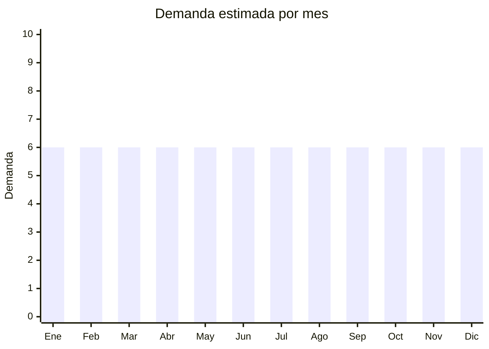

# Guantes de látex y nitrilo

> **Capítulo NCM 40** — Caucho y sus manufacturas | **Temporada:** Atemporal

## Qué es y por qué importarlo

Los guantes descartables de látex, nitrilo y vinilo son productos de consumo masivo utilizados en limpieza doméstica, industria alimentaria, peluquerías, talleres mecánicos, laboratorios y otros usos no médicos. Se venden en cajas de 100 unidades en talles S, M, L y XL.

Es importante distinguir entre **guantes de uso general** (limpieza, industria, alimentos) y **guantes de uso médico** (cirugía, examen). Los de uso médico requieren registro ANMAT como dispositivo médico, lo cual es un proceso costoso y largo. La estrategia recomendada es importar guantes para **uso general/industrial** que no requieren ANMAT.

China es uno de los mayores productores mundiales de guantes de nitrilo (junto con Malasia y Tailandia), con fábricas en Shandong y Jiangsu que ofrecen precios FOB competitivos.

## Datos clave

| Dato | Valor |
|------|-------|
| **Posiciones NCM típicas** | 4015.19.00 (guantes de caucho vulcanizado — uso general), 4015.11.00 (guantes para cirugía — NO recomendado) |
| **Derecho de importación** | 14% (DIE) + 3% tasa estadística |
| **Rango FOB típico** | USD 3.00 — USD 8.00 por caja de 100 unidades |
| **Precio de venta en Argentina** | ARS 8.000 — ARS 25.000 por caja de 100 |
| **Margen bruto estimado** | 100% — 200% |
| **MOQ típico** | 500 — 5,000 cajas |
| **Demanda en MercadoLibre** | Alta |
| **Competencia en MercadoLibre** | Alta |
| **Dificultad para importar** | Fácil (uso general) / Difícil (uso médico — requiere ANMAT) |
| **Certificaciones necesarias** | Ninguna para uso general. ANMAT para uso médico |
| **Antidumping** | No |

## Demanda y mercado en Argentina

- **Volumen de mercado:** Demanda masiva y permanente. Producto de consumo recurrente en múltiples industrias.
- **Tendencia:** Estable — la conciencia de higiene post-pandemia mantuvo la demanda elevada de guantes descartables incluso fuera del ámbito médico.
- **Perfil del comprador:** Empresas de limpieza, restaurantes/gastronomía, peluquerías, talleres mecánicos, laboratorios, hogares.
- **Canales de venta principales:** MercadoLibre (cajas individuales), mayorista a distribuidores de limpieza, B2B a empresas.

<Warning>
**No importar guantes etiquetados como "uso médico" o "examen" sin registro ANMAT.** La Aduana retiene guantes con packaging que indique uso médico/quirúrgico sin el registro correspondiente. Comercializar siempre como "uso general", "limpieza", "industria alimentaria" o "multiuso".
</Warning>

## Competencia

| Aspecto | Situación |
|---------|-----------|
| **Cantidad de vendedores en ML** | +300 vendedores activos |
| **Hay marcas dominantes** | Parcialmente: marcas como Supermax, Medline tienen presencia. Genéricos dominan |
| **Tipo de competidores** | Importadores + distribuidores de limpieza/industria |
| **Rango de precios en ML** | ARS 8.000 — ARS 25.000 por caja x100 |
| **Posibilidad de diferenciarse** | Baja-Media |

**Cómo diferenciarse:**
- Nitrilo premium (más grueso, 4-5 mil) vs básico (3 mil)
- Guantes texturizados en dedos (mejor agarre)
- Colores variados (negro para mecánicos/peluquería, azul para alimentos)
- Packs combo: caja x100 + dispensador
- Canal B2B con entrega recurrente

## Variantes y subtipos más comunes

| Subtipo / Variante | FOB aprox. | Venta AR aprox. | Nota |
|--------------------|-----------|-----------------|------|
| Nitrilo azul 3 mil x100 | USD 3.00 — 5.00/caja | ARS 8.000 — 15.000 | **Más vendido** |
| Nitrilo negro 4-5 mil x100 | USD 4.00 — 7.00/caja | ARS 12.000 — 22.000 | Mecánicos, peluquería |
| Látex natural x100 | USD 3.00 — 5.00/caja | ARS 7.000 — 14.000 | Económico (riesgo alergia) |
| Vinilo transparente x100 | USD 2.00 — 4.00/caja | ARS 5.000 — 10.000 | Más económico |
| Guantes de limpieza reutilizables (par) | USD 0.20 — 0.60/par | ARS 2.000 — 5.000 | Producto complementario |

## Regulaciones y requisitos

<Tabs>
  <Tab title="Certificaciones">
    | Organismo | Requiere | Detalle |
    |-----------|----------|---------|
    | ARCA (Aduana) | Sí siempre | Despacho estándar |
    | ANMAT | **Solo si uso médico** | Guantes para examen o cirugía son dispositivos médicos Clase I o II. Para uso general (limpieza, industria) NO requiere ANMAT |
    | ENACOM | No | No es electrónico |

    **Estrategia clave:** Importar y comercializar EXCLUSIVAMENTE como guantes de uso general, limpieza o industria alimentaria. Nunca usar palabras como "médico", "quirúrgico", "examen", "hospital" en el packaging ni en la publicación.
  </Tab>

  <Tab title="Etiquetado">
    | Requisito | Aplica |
    |-----------|--------|
    | Idioma español | Sí |
    | Datos del importador | Sí |
    | Composición / materiales | Sí ("Nitrilo", "Látex natural", "Vinilo/PVC") |
    | Talles disponibles | Sí (S, M, L, XL) |
    | Uso previsto | Sí ("Uso general / limpieza / industria alimentaria") |
    | Advertencia de alergia | Sí si contiene látex natural |
    | País de origen | Sí |
  </Tab>

  <Tab title="Restricciones">
    - **No comercializar como uso médico sin ANMAT.**
    - Si contiene látex natural, indicar advertencia de alergia.
    - Verificar que no contengan polvo de maíz/almidón (algunos mercados lo restringen por riesgo alérgico).
    - Los guantes sin polvo (powder-free) son preferidos.
  </Tab>
</Tabs>

## Logística

| Dato | Valor |
|------|-------|
| **Peso típico por caja x100** | 0.3 — 0.5 kg |
| **Volumen típico** | Bajo-Medio |
| **Fragilidad** | Baja |
| **Envío recomendado** | Marítimo LCL para volumen significativo |
| **Tiempo total estimado** | 50 — 80 días (marítimo) |
| **Baterías de litio** | No |
| **Requiere empaque especial** | No — mantener en lugar seco y fresco |

## Estacionalidad



| Aspecto | Detalle |
|---------|---------|
| **Meses pico** | Demanda constante todo el año — producto de consumo básico |
| **Meses valle** | No hay valle significativo |
| **Cuándo pedir** | Mantener stock permanente |

## Ventajas y riesgos

<CardGroup cols={2}>
  <Card title="Ventajas" icon="circle-check">
    - Demanda masiva y permanente
    - Producto de consumo recurrente (se agota y se repone)
    - Múltiples industrias compradoras
    - Sin ANMAT para uso general
    - Canal B2B con clientes recurrentes
  </Card>
  <Card title="Riesgos" icon="triangle-exclamation">
    - Márgenes menores que otros productos (negocio de volumen)
    - Si se etiqueta como "médico" sin ANMAT, la Aduana retiene
    - Competencia con Malasia/Tailandia que también son productores fuertes
    - Calidad variable (guantes que se rompen fácilmente = reclamos)
    - Riesgo de alergia al látex (preferirir nitrilo)
  </Card>
</CardGroup>

## Palabras clave para buscar en Alibaba

```
nitrile gloves wholesale, disposable nitrile gloves powder free, black nitrile gloves,
latex gloves wholesale, vinyl gloves food service, examination gloves non medical,
nitrile gloves 100pcs box, cleaning gloves wholesale
```

## Fuentes

- [MercadoLibre Argentina — Guantes nitrilo descartables](https://listado.mercadolibre.com.ar/guantes-nitrilo-descartables)
- [Alibaba — Nitrile gloves wholesale](https://www.alibaba.com/showroom/nitrile-gloves-wholesale.html)
