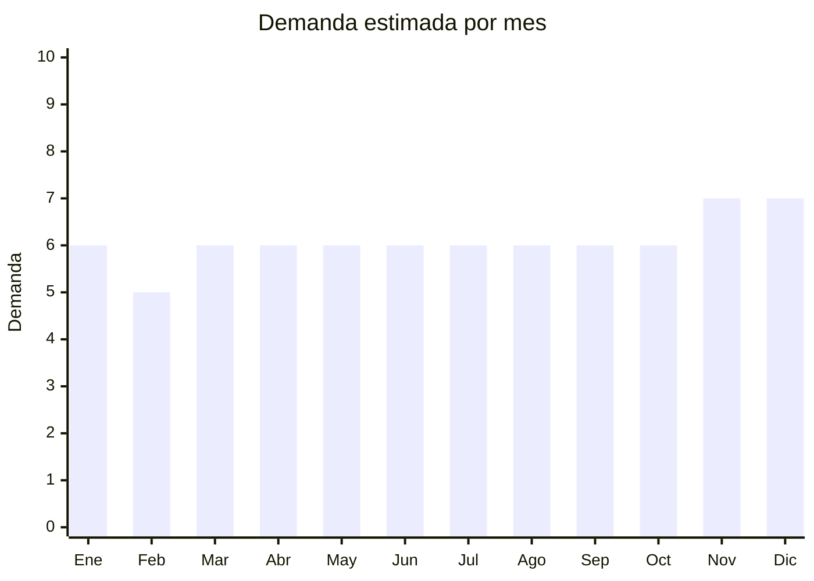

# Ruedas de caucho para muebles

> **Capítulo NCM 40/83** — Caucho y manufacturas / Manufacturas diversas de metal | **Temporada:** Atemporal

## Qué es y por qué importarlo

Las ruedas para muebles abarcan rueditas de repuesto para sillas de oficina y gaming (el segmento más grande), ruedas giratorias para muebles con freno, ruedas de goma silenciosa para pisos de madera/porcelanato, y ruedas industriales para carros y estanterías. Se venden en sets de 4-5 unidades.

Este es un producto de **reposición constante**: las ruedas de sillas de oficina y gaming se desgastan cada 1-2 años y necesitan reemplazo. Con el boom del home office y las sillas gamer, el mercado se expandió significativamente. Además, las ruedas de silicona/poliuretano (que no rayan pisos) son tendencia como upgrade sobre las ruedas plásticas originales.

China fabrica la gran mayoría de las ruedas para muebles del mundo, con precios FOB desde USD 0.30 por rueda que permiten márgenes atractivos.

## Datos clave

| Dato | Valor |
|------|-------|
| **Posiciones NCM típicas** | 8302.20.00 (ruedas para muebles — metal con caucho), 4016.99.90 (si predomina el caucho) |
| **Derecho de importación** | 18-20% (DIE) + 3% tasa estadística |
| **Rango FOB típico** | USD 0.30 — USD 1.50 por rueda; USD 1.50 — USD 7.00 por set x5 |
| **Precio de venta en Argentina** | ARS 5.000 — ARS 20.000 por set x5 |
| **Margen bruto estimado** | 200% — 350% |
| **MOQ típico** | 200 — 1,000 sets |
| **Demanda en MercadoLibre** | Media-Alta |
| **Competencia en MercadoLibre** | Media |
| **Dificultad para importar** | Fácil |
| **Certificaciones necesarias** | Ninguna |
| **Antidumping** | No |

## Demanda y mercado en Argentina

- **Volumen de mercado:** Demanda constante vinculada al parque instalado de sillas de oficina y gaming. Ruedas de repuesto para silla gamer/oficina son las más buscadas.
- **Tendencia:** Creciente — impulsada por home office y sillas gaming. Las ruedas de silicona/PU (que no rayan pisos) son el upgrade más solicitado.
- **Perfil del comprador:** Trabajadores remotos (home office), gamers, oficinas (compra B2B), carpinteros/muebleros (repuesto).
- **Canales de venta principales:** MercadoLibre, ferreterías, mayorista a fabricantes de muebles/sillas.

<Note>
Las **ruedas de poliuretano/silicona "silenciosas"** que no rayan pisos son el producto más demandado dentro de esta categoría. Se venden como upgrade de las ruedas plásticas originales de las sillas y tienen mayor ticket promedio.
</Note>

## Competencia

| Aspecto | Situación |
|---------|-----------|
| **Cantidad de vendedores en ML** | +150 vendedores activos |
| **Hay marcas dominantes** | No — mercado fragmentado |
| **Tipo de competidores** | Importadores directos, ferreterías |
| **Rango de precios en ML** | ARS 5.000 — ARS 20.000 por set x5 |
| **Posibilidad de diferenciarse** | Media-Alta |

**Cómo diferenciarse:**
- Ruedas de silicona/PU transparentes o de colores (estética gamer)
- Compatibilidad garantizada con modelos populares de sillas
- Packaging con instrucciones de instalación claras
- Ruedas con freno de bloqueo (premium)
- Sets con herramienta de extracción incluida

## Variantes y subtipos más comunes

| Subtipo / Variante | FOB aprox. | Venta AR aprox. | Nota |
|--------------------|-----------|-----------------|------|
| Ruedas nylon básicas x5 (reemplazo std) | USD 1.50 — 2.50/set | ARS 5.000 — 8.000 | Económico |
| Ruedas PU silenciosas x5 (no rayan) | USD 2.00 — 4.00/set | ARS 8.000 — 15.000 | **Más vendido** |
| Ruedas silicona transparente x5 | USD 3.00 — 5.00/set | ARS 10.000 — 18.000 | Premium/gamer |
| Ruedas con freno x5 | USD 3.00 — 6.00/set | ARS 10.000 — 20.000 | Oficina premium |
| Ruedas giratorias planas para muebles x4 | USD 1.00 — 3.00/set | ARS 4.000 — 10.000 | Muebles en general |
| Ruedas industriales pesadas (unitaria) | USD 1.00 — 5.00/u | ARS 5.000 — 15.000/u | Estanterías/carros |

## Regulaciones y requisitos

<Tabs>
  <Tab title="Certificaciones">
    | Organismo | Requiere | Detalle |
    |-----------|----------|---------|
    | ARCA (Aduana) | Sí siempre | Despacho estándar |
    | ANMAT | No | No aplica |
    | ENACOM | No | No es electrónico |
    | INTI | No | No es textil ni calzado |

    Producto sin barreras regulatorias.
  </Tab>

  <Tab title="Etiquetado">
    | Requisito | Aplica |
    |-----------|--------|
    | Idioma español | Sí |
    | Datos del importador | Sí |
    | Composición / materiales | Sí (PU, silicona, nylon, caucho) |
    | Compatibilidad | Sí (indicar diámetro de vástago: 10mm, 11mm estándar) |
    | Capacidad de carga | Recomendado (kg por rueda) |
    | País de origen | Sí |
    | Garantía legal 6 meses | Sí |
  </Tab>

  <Tab title="Restricciones">
    Sin restricciones. Producto de importación libre.
  </Tab>
</Tabs>

## Logística

| Dato | Valor |
|------|-------|
| **Peso típico por set x5** | 0.4 — 1.0 kg |
| **Volumen típico** | Bajo-Medio |
| **Fragilidad** | Baja (producto muy resistente) |
| **Envío recomendado** | Marítimo LCL para volumen; Aéreo/Courier para primeras pruebas |
| **Tiempo total estimado** | 45 — 75 días (marítimo) / 15 — 25 días (aéreo) |
| **Baterías de litio** | No |
| **Requiere empaque especial** | No |

## Estacionalidad



| Aspecto | Detalle |
|---------|---------|
| **Meses pico** | Noviembre-Diciembre (CyberMonday — compras de sillas nuevas y upgrades, regalos gamer) |
| **Meses valle** | Febrero — demanda base estable |
| **Cuándo pedir** | Septiembre para pico de fin de año |

## Ventajas y riesgos

<CardGroup cols={2}>
  <Card title="Ventajas" icon="circle-check">
    - Producto de reposición con demanda recurrente
    - Sin regulaciones
    - Resistente al transporte
    - Márgenes atractivos (200-350%)
    - Mercado menos saturado que otros productos
    - Compatible con tendencia gamer/home office
  </Card>
  <Card title="Riesgos" icon="triangle-exclamation">
    - Compatibilidad de vástago (si no encaja en la silla = devolución)
    - Calidad variable (ruedas que crujen o se traban)
    - Mercado más chico que productos de consumo masivo
    - Peso puede ser significativo en pedidos grandes
  </Card>
</CardGroup>

<Warning>
**Verificar compatibilidad de vástago.** El vástago estándar universal es de 11mm de diámetro, pero algunos modelos de sillas usan 10mm o medidas especiales. Indicar claramente en la publicación el diámetro del vástago y ofrecer medición antes de la compra para evitar devoluciones.
</Warning>

## Palabras clave para buscar en Alibaba

```
office chair caster wheels wholesale, PU chair wheels silent, rubber furniture casters,
gaming chair wheels replacement, silicone chair caster, swivel caster wheels furniture,
brake caster wheel, 11mm stem chair caster
```

## Fuentes

- [MercadoLibre Argentina — Ruedas silla oficina](https://listado.mercadolibre.com.ar/ruedas-silla-oficina)
- [Alibaba — Office chair caster wheels wholesale](https://www.alibaba.com/showroom/office-chair-caster-wheels.html)
