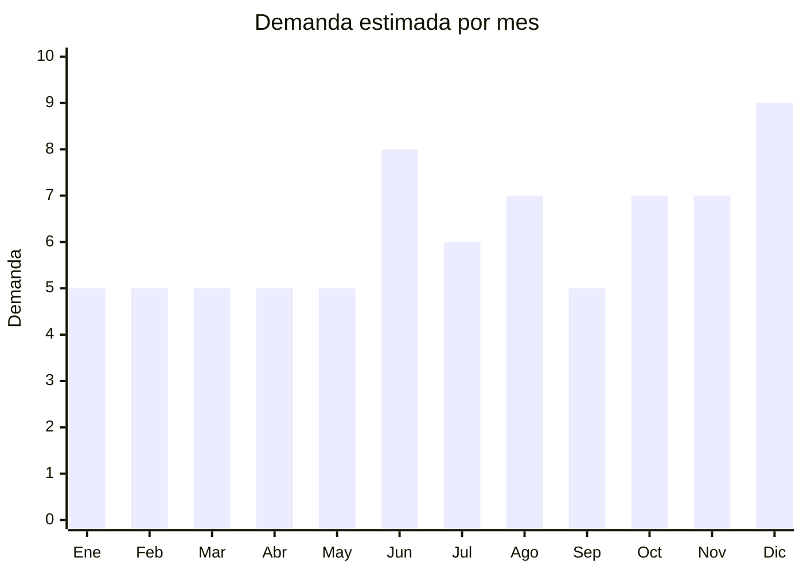

# Billeteras y tarjeteros RFID

> **Capítulo NCM 42** — Manufacturas de cuero; artículos de viaje, bolsos | **Temporada:** Atemporal

## Qué es y por qué importarlo

Las billeteras y tarjeteros incluyen billeteras clásicas de cuero sintético PU, tarjeteros de aluminio con bloqueo RFID, card holders minimalistas y money clips. Los tarjeteros RFID (que protegen las tarjetas de pagos contactless no autorizados) son la tendencia más fuerte del segmento.

El producto tiene FOB bajo, es ultraliviano, tiene demanda permanente como regalo y uso personal, y permite márgenes atractivos. China produce la enorme mayoría de billeteras genéricas del mercado global.

## Datos clave

| Dato | Valor |
|------|-------|
| **Posiciones NCM típicas** | 4202.31.00 (billeteras de cuero), 4202.32.00 (superficie plástica/PU), 7616.99 (tarjetero aluminio) |
| **Derecho de importación** | 20% (DIE) + 3% tasa estadística |
| **Rango FOB típico** | USD 1.00 — USD 5.00 por unidad |
| **Precio de venta en Argentina** | ARS 5.000 — ARS 20.000 |
| **Margen bruto estimado** | 200% — 400% |
| **MOQ típico** | 50 — 300 unidades |
| **Demanda en MercadoLibre** | Media-Alta |
| **Competencia en MercadoLibre** | Media |
| **Dificultad para importar** | Fácil |
| **Certificaciones necesarias** | Ninguna |
| **Antidumping** | No |

## Demanda y mercado en Argentina

- **Volumen de mercado:** Demanda constante como producto de regalo y uso personal. Los tarjeteros RFID crecieron fuertemente con el pago contactless.
- **Tendencia:** Estable-Creciente — los tarjeteros minimalistas y RFID son tendencia en alza. El formato "cartera fina" (slim wallet) gana terreno sobre billeteras voluminosas.
- **Perfil del comprador:** Universal — toda persona necesita billetera. Fuerte componente de regalo (Día del Padre, Navidad, cumpleaños).
- **Canales de venta principales:** MercadoLibre, regalerías, bazares, tiendas de accesorios.

## Variantes y subtipos más comunes

| Subtipo / Variante | FOB aprox. | Venta AR aprox. | Nota |
|--------------------|-----------|-----------------|------|
| Billetera PU clásica hombre | USD 1.50 — 3.00 | ARS 6.000 — 12.000 | Producto base |
| Tarjetero aluminio RFID | USD 1.00 — 3.00 | ARS 5.000 — 12.000 | **Tendencia fuerte** |
| Slim wallet / card holder PU | USD 1.50 — 4.00 | ARS 6.000 — 15.000 | Minimalista |
| Billetera mujer con cierre | USD 2.00 — 5.00 | ARS 8.000 — 20.000 | Formato largo |
| Money clip + tarjetero | USD 1.00 — 2.50 | ARS 5.000 — 10.000 | Elegante |

## Regulaciones y requisitos

<Tabs>
  <Tab title="Certificaciones">
    Sin certificaciones especiales. Producto de importación libre.
  </Tab>
  <Tab title="Etiquetado">
    | Requisito | Aplica |
    |-----------|--------|
    | Idioma español | Sí |
    | Datos del importador | Sí |
    | Composición / materiales | Sí ("PU leather" / "Aluminio" — **nunca decir "cuero genuino" si es PU**) |
    | País de origen | Sí |
    | Garantía legal 6 meses | Sí |
  </Tab>
  <Tab title="Restricciones">
    **Atención:** Nunca comercializar billeteras de PU (cuero sintético) como "cuero genuino" o "cuero real". Esto es publicidad engañosa y puede generar problemas legales y reclamos masivos.
  </Tab>
</Tabs>

## Logística

| Dato | Valor |
|------|-------|
| **Peso típico por unidad** | 0.05 — 0.20 kg |
| **Volumen típico** | Muy bajo |
| **Fragilidad** | Baja |
| **Envío recomendado** | Aéreo/Courier para lotes chicos; Marítimo LCL para volumen |
| **Tiempo total estimado** | 15 — 25 días (aéreo) / 45 — 75 días (marítimo) |

## Estacionalidad



| Aspecto | Detalle |
|---------|---------|
| **Meses pico** | Junio (Día del Padre), Agosto (Día del Amigo), Octubre (Día de la Madre), Diciembre (Navidad) |
| **Meses valle** | Enero-Abril — demanda base estable |

## Ventajas y riesgos

<CardGroup cols={2}>
  <Card title="Ventajas" icon="circle-check">
    - Ultraliviano (flete mínimo)
    - Producto de regalo con demanda constante
    - Márgenes altos (200-400%)
    - Sin regulaciones
    - Ideal para combos (billetera + cinturón)
  </Card>
  <Card title="Riesgos" icon="triangle-exclamation">
    - PU de baja calidad se descascara rápido
    - Nunca vender PU como "cuero genuino"
    - Competencia con locales de marroquinería
  </Card>
</CardGroup>

## Palabras clave para buscar en Alibaba

```
wallet wholesale PU leather, RFID blocking card holder, aluminum card case wholesale,
slim wallet men, women wallet zipper, money clip wallet, minimalist card holder,
custom logo wallet
```

## Fuentes

- [MercadoLibre Argentina — Billeteras y tarjeteros](https://listado.mercadolibre.com.ar/billeteras-tarjeteros)
- [Alibaba — Wallet wholesale](https://www.alibaba.com/showroom/wallet-wholesale.html)
