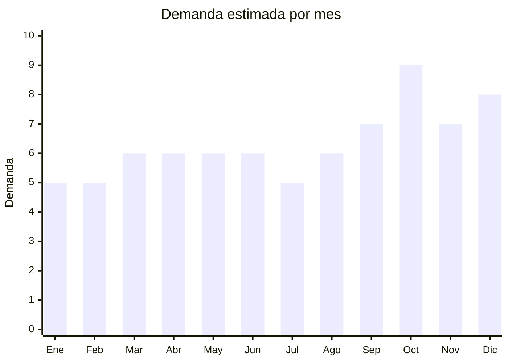

# Carteras y bolsos de mujer

> **Capítulo NCM 42** — Manufacturas de cuero; artículos de viaje, bolsos | **Temporada:** Atemporal

## Qué es y por qué importarlo

Las carteras y bolsos de mujer en PU (cuero sintético) son uno de los productos de importación más populares desde China. Guangzhou (distrito Shiling/Sanyuanli) es reconocida como la capital mundial de bolsos de cuero sintético, con miles de fábricas y showrooms que producen diseños que siguen las tendencias europeas a precios FOB de USD 3-15.

El mercado argentino tiene demanda permanente de carteras importadas, con un público femenino amplio que renueva su bolso con la moda de cada temporada. La clave es ofrecer diseños actualizados, calidad de PU que no se descascare y nunca vender PU como cuero genuino.

## Datos clave

| Dato | Valor |
|------|-------|
| **Posiciones NCM típicas** | 4202.21.00 (bolsos de mano con superficie de cuero), 4202.22.20 (superficie PU/plástico), 4202.29.00 (otros materiales) |
| **Derecho de importación** | 20% (DIE) + 3% tasa estadística |
| **Rango FOB típico** | USD 3.00 — USD 15.00 por unidad |
| **Precio de venta en Argentina** | ARS 15.000 — ARS 60.000 |
| **Margen bruto estimado** | 150% — 300% |
| **MOQ típico** | 30 — 200 unidades por modelo/color |
| **Demanda en MercadoLibre** | Alta |
| **Competencia en MercadoLibre** | Alta |
| **Dificultad para importar** | Fácil |
| **Certificaciones necesarias** | Ninguna |
| **Antidumping** | No |

## Demanda y mercado en Argentina

- **Volumen de mercado:** Categoría enorme con miles de publicaciones y vendedores activos.
- **Tendencia:** Estable — la moda de carteras rota por temporada pero la categoría siempre tiene demanda.
- **Perfil del comprador:** Mujeres 20-55 años, todo nivel socioeconómico. Fuerte componente de regalo.
- **Canales de venta principales:** MercadoLibre, locales de marroquinería, ferias, Instagram, showrooms.

<Warning>
**NUNCA publicar carteras de PU como "cuero genuino" o "cuero real".** Esto es publicidad engañosa y genera reclamos masivos, penalizaciones en MercadoLibre y posibles acciones legales. Siempre usar "eco-cuero", "cuero sintético", "PU leather" o "cuero vegano".
</Warning>

## Variantes y subtipos más comunes

| Subtipo / Variante | FOB aprox. | Venta AR aprox. | Nota |
|--------------------|-----------|-----------------|------|
| Cartera tote mediana | USD 3.00 — 8.00 | ARS 15.000 — 35.000 | **Más vendido** |
| Bandolera/crossbody mujer | USD 2.00 — 6.00 | ARS 10.000 — 25.000 | Casual/diario |
| Cartera grande shopper | USD 5.00 — 12.00 | ARS 20.000 — 45.000 | Oficina/trabajo |
| Clutch/sobre de noche | USD 2.00 — 5.00 | ARS 8.000 — 20.000 | Eventos/salidas |
| Set 2-3 carteras (madre-hija) | USD 6.00 — 15.00 | ARS 25.000 — 60.000 | Alto ticket |
| Mini bag / micro cartera | USD 2.00 — 5.00 | ARS 8.000 — 20.000 | Tendencia |

## Regulaciones y requisitos

<Tabs>
  <Tab title="Certificaciones">
    Sin certificaciones especiales. Producto de importación libre.
  </Tab>
  <Tab title="Etiquetado">
    | Requisito | Aplica |
    |-----------|--------|
    | Idioma español | Sí |
    | Datos del importador | Sí |
    | Composición / materiales | Sí ("Cuero sintético PU", "Eco-cuero", "Poliéster") |
    | País de origen | Sí |
    | Garantía legal 6 meses | Sí |
  </Tab>
  <Tab title="Restricciones">
    No importar carteras con logos de marcas registradas (Louis Vuitton, Gucci, Prada, etc.). La Aduana retiene mercadería falsificada y puede iniciar causas penales.
  </Tab>
</Tabs>

## Logística

| Dato | Valor |
|------|-------|
| **Peso típico por unidad** | 0.3 — 0.8 kg |
| **Volumen típico** | Medio |
| **Fragilidad** | Baja |
| **Envío recomendado** | Marítimo LCL |
| **Tiempo total estimado** | 50 — 80 días (marítimo) |

## Estacionalidad



| Aspecto | Detalle |
|---------|---------|
| **Meses pico** | Octubre (Día de la Madre — pico máximo de carteras), Noviembre-Diciembre (regalos, CyberMonday) |
| **Meses valle** | Enero-Febrero |

## Ventajas y riesgos

<CardGroup cols={2}>
  <Card title="Ventajas" icon="circle-check">
    - Demanda masiva y permanente
    - Guangzhou ofrece variedad infinita
    - Ideal para marca propia
    - Alto valor percibido vs FOB bajo
    - Producto estrella para Día de la Madre
  </Card>
  <Card title="Riesgos" icon="triangle-exclamation">
    - PU de baja calidad se descascara en 3-6 meses
    - Nunca vender como cuero genuino si es PU
    - Riesgo de falsificación de marcas
    - Moda cambia rápido (riesgo de stock obsoleto)
    - Competencia alta
  </Card>
</CardGroup>

## Palabras clave para buscar en Alibaba

```
women handbag wholesale, PU leather tote bag, crossbody bag women, fashion bag wholesale,
clutch bag evening, shoulder bag women, custom logo handbag, Guangzhou bag factory
```

## Fuentes

- [MercadoLibre Argentina — Carteras mujer](https://listado.mercadolibre.com.ar/carteras-mujer)
- [Alibaba — Women handbag wholesale](https://www.alibaba.com/showroom/women-handbag-wholesale.html)
