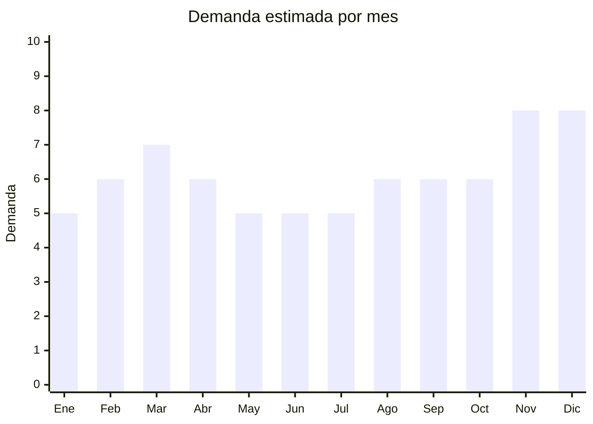

# Estuches y fundas para laptop/tablet

> **Capítulo NCM 42** — Manufacturas de cuero; artículos de viaje, bolsos | **Temporada:** Atemporal

## Qué es y por qué importarlo

Las fundas para laptop incluyen estuches acolchados tipo sleeve (13", 14", 15.6"), maletines portanotebook, fundas con compartimentos para cargador y mouse, y fundas para iPad/tablet. Son el accesorio complementario indispensable para la venta de notebooks y tablets.

La demanda es directamente proporcional a las ventas de notebooks, que en Argentina se mantienen altas por home office, educación y entretenimiento. Las fundas de 15.6" (tamaño más común de notebooks en Argentina) y 14" (tendencia de notebooks más compactos) son las más buscadas.

## Datos clave

| Dato | Valor |
|------|-------|
| **Posiciones NCM típicas** | 4202.12.20 (maletín/portadocumentos superficie plástica), 4202.92.00 (estuche superficie textil) |
| **Derecho de importación** | 20% (DIE) + 3% tasa estadística |
| **Rango FOB típico** | USD 1.50 — USD 8.00 por unidad |
| **Precio de venta en Argentina** | ARS 8.000 — ARS 30.000 |
| **Margen bruto estimado** | 150% — 300% |
| **MOQ típico** | 50 — 300 unidades |
| **Demanda en MercadoLibre** | Alta |
| **Competencia en MercadoLibre** | Media-Alta |
| **Dificultad para importar** | Fácil |
| **Certificaciones necesarias** | Ninguna |
| **Antidumping** | No |

## Demanda y mercado en Argentina

- **Volumen de mercado:** Demanda vinculada directamente a ventas de notebooks. Cada notebook nueva genera potencial compra de funda.
- **Tendencia:** Estable — el home office mantuvo las ventas de notebooks y accesorios.
- **Perfil del comprador:** Profesionales, estudiantes universitarios, trabajadores remotos, gamers (fundas para notebooks gaming).

## Variantes y subtipos más comunes

| Subtipo / Variante | FOB aprox. | Venta AR aprox. | Nota |
|--------------------|-----------|-----------------|------|
| Sleeve básico neopreno 15.6" | USD 1.50 — 3.00 | ARS 8.000 — 15.000 | **Más vendido** |
| Sleeve acolchado 14" con bolsillo | USD 2.00 — 4.00 | ARS 10.000 — 18.000 | Tendencia |
| Sleeve 13" tipo MacBook | USD 2.00 — 5.00 | ARS 10.000 — 22.000 | Público Apple |
| Maletín portanotebook | USD 4.00 — 8.00 | ARS 15.000 — 30.000 | Profesional |
| Funda iPad/tablet 10-11" | USD 1.50 — 4.00 | ARS 6.000 — 15.000 | Complemento |

## Regulaciones y requisitos

<Tabs>
  <Tab title="Certificaciones">
    Sin certificaciones. Producto de importación libre (es accesorio, no electrónico).
  </Tab>
  <Tab title="Etiquetado">
    Estándar: idioma español, datos del importador, composición, tamaño compatible, país de origen, garantía 6 meses.
  </Tab>
  <Tab title="Restricciones">
    Sin restricciones.
  </Tab>
</Tabs>

## Logística

| Dato | Valor |
|------|-------|
| **Peso típico por unidad** | 0.15 — 0.50 kg |
| **Volumen típico** | Bajo |
| **Fragilidad** | Baja |
| **Envío recomendado** | Marítimo LCL |
| **Tiempo total estimado** | 45 — 75 días (marítimo) |

## Estacionalidad



| Aspecto | Detalle |
|---------|---------|
| **Meses pico** | Marzo (vuelta a clases/universidad), Noviembre-Diciembre (CyberMonday — compras de notebooks + accesorios) |

## Ventajas y riesgos

<CardGroup cols={2}>
  <Card title="Ventajas" icon="circle-check">
    - Demanda vinculada a venta de notebooks (mercado grande)
    - Liviano y compacto
    - Sin regulaciones
    - Venta cruzada con electrónica
    - Marca propia viable
  </Card>
  <Card title="Riesgos" icon="triangle-exclamation">
    - Competencia con fundas genéricas a precios bajos
    - Tamaños incorrectos = devoluciones
    - Acolchado insuficiente = daños a notebooks
  </Card>
</CardGroup>

## Palabras clave para buscar en Alibaba

```
laptop sleeve wholesale, notebook case 15.6 inch, laptop bag waterproof,
MacBook sleeve 13 inch, tablet case wholesale, laptop briefcase, neoprene laptop sleeve,
padded laptop case custom logo
```

## Fuentes

- [MercadoLibre Argentina — Fundas notebook](https://listado.mercadolibre.com.ar/funda-notebook)
- [Alibaba — Laptop sleeve wholesale](https://www.alibaba.com/showroom/laptop-sleeve-wholesale.html)
