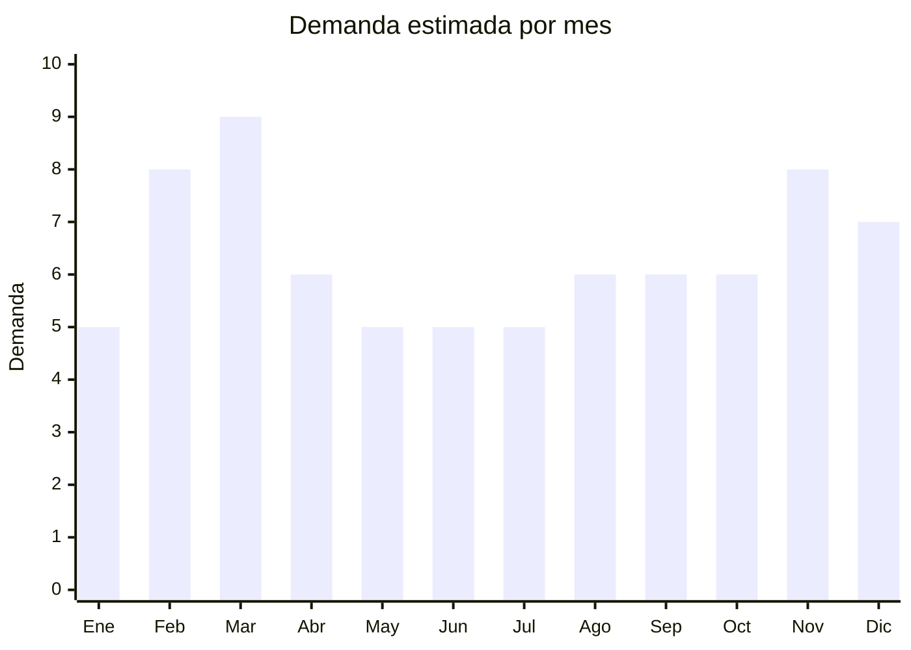

# Mochilas urbanas y antirrobo

> **Capítulo NCM 42** — Manufacturas de cuero; artículos de viaje, bolsos | **Temporada:** Atemporal

## Qué es y por qué importarlo

Las mochilas abarcan modelos urbanos, escolares, deportivos, de viaje y antirrobo. Las mochilas antirrobo con puerto USB integrado son una tendencia consolidada que se originó en China (marcas como Ozuko, Bopai, KAKA) y se adoptó masivamente en Argentina. El material predominante es el poliéster/nylon con cuero sintético PU, no cuero genuino.

Guangzhou y Baigou (Hebei) son los principales centros de producción de mochilas en China. Guangzhou (distrito de Shiling/Sanyuanli) concentra la mayor variedad de fábricas y trading companies, con acceso a personalización completa: logo, colores, materiales, compartimentos.

El producto tiene demanda permanente con picos estacionales claros (vuelta a clases en marzo, Black Friday/CyberMonday), y permite excelente personalización para marca propia.

## Datos clave

| Dato | Valor |
|------|-------|
| **Posiciones NCM típicas** | 4202.92.00 (bolsos con superficie exterior de materia textil), 4202.22.20 (con superficie de plástico/PU) |
| **Derecho de importación** | 20% (DIE) + 3% tasa estadística |
| **Rango FOB típico** | USD 3.00 — USD 15.00 por unidad |
| **Precio de venta en Argentina** | ARS 15.000 — ARS 60.000 |
| **Margen bruto estimado** | 150% — 300% |
| **MOQ típico** | 50 — 300 unidades (primer pedido); 200+ para private label |
| **Demanda en MercadoLibre** | Muy alta |
| **Competencia en MercadoLibre** | Alta |
| **Dificultad para importar** | Fácil |
| **Certificaciones necesarias** | Ninguna |
| **Antidumping** | No |

## Demanda y mercado en Argentina

- **Volumen de mercado:** Miles de publicaciones activas. Mochilas son una de las categorías más vendidas en MercadoLibre, especialmente en temporada escolar.
- **Tendencia:** Estable-Creciente — las mochilas antirrobo con USB siguen como tendencia consolidada. Mochilas de viaje tipo "carry-on" (que entran como equipaje de mano) son tendencia creciente.
- **Perfil del comprador:** Estudiantes (primario a universidad), trabajadores urbanos, viajeros, gamers (mochilas porta-notebook).
- **Canales de venta principales:** MercadoLibre, librerías (canal escolar), tiendas deportivas, venta B2B a empresas (regalos corporativos).

<Note>
Las mochilas con **puerto USB integrado** y **compartimento anti-robo** en la espalda fueron la revolución del segmento. Marcas chinas como Ozuko y Bopai establecieron esta tendencia que ahora es copiada por cientos de fabricantes. El FOB de una mochila antirrobo con USB es apenas USD 5-10.
</Note>

## Competencia

| Aspecto | Situación |
|---------|-----------|
| **Cantidad de vendedores en ML** | +1,000 vendedores activos |
| **Hay marcas dominantes** | Parcialmente: Samsonite/Totto en premium, genéricos chinos en volumen |
| **Tipo de competidores** | Importadores directos (mayoría) + Marcas internacionales |
| **Rango de precios en ML** | ARS 15.000 — ARS 60.000 |
| **Posibilidad de diferenciarse** | Media |

**Cómo diferenciarse:**
- Marca propia con diseño exclusivo y packaging profesional
- Mochilas expandibles de viaje (35L → 45L) que sirven como carry-on
- Modelos específicos: gaming (porta-auriculares), fotografía (compartimentos), maternidad
- Garantía extendida (diferencial vs genéricos sin garantía)

## Variantes y subtipos más comunes

| Subtipo / Variante | FOB aprox. | Venta AR aprox. | Nota |
|--------------------|-----------|-----------------|------|
| Mochila urbana básica | USD 3.00 — 6.00 | ARS 15.000 — 25.000 | Volumen |
| Mochila antirrobo con USB | USD 5.00 — 10.00 | ARS 20.000 — 40.000 | **Más vendido** |
| Mochila escolar infantil | USD 3.00 — 8.00 | ARS 12.000 — 30.000 | Pico marzo |
| Mochila notebook 15.6" | USD 4.00 — 10.00 | ARS 18.000 — 35.000 | Oficina/universidad |
| Mochila expandible viaje | USD 8.00 — 15.00 | ARS 30.000 — 60.000 | Tendencia creciente |
| Mochila deportiva/gym | USD 4.00 — 8.00 | ARS 15.000 — 30.000 | Público fitness |

## Regulaciones y requisitos

<Tabs>
  <Tab title="Certificaciones">
    | Organismo | Requiere | Detalle |
    |-----------|----------|---------|
    | ARCA (Aduana) | Sí siempre | Despacho estándar |
    | ANMAT | No | No es cosmético ni alimento |
    | ENACOM | No | El puerto USB no es electrónico activo (es solo un cable pasivo) |
    | INTI | No | No es textil regulado (Cap. 61-62) ni calzado |

    Producto sin barreras regulatorias.
  </Tab>

  <Tab title="Etiquetado">
    | Requisito | Aplica |
    |-----------|--------|
    | Idioma español | Sí |
    | Datos del importador | Sí |
    | Composición / materiales | Sí (poliéster, nylon, PU) |
    | Dimensiones | Recomendado (alto x ancho x profundidad) |
    | Capacidad en litros | Recomendado |
    | País de origen | Sí |
    | Garantía legal 6 meses | Sí |
  </Tab>

  <Tab title="Restricciones">
    Sin restricciones especiales. **Atención con marcas:** No importar mochilas con logos de marcas registradas (Nike, Adidas, Disney, etc.) sin licencia.
  </Tab>
</Tabs>

## Logística

| Dato | Valor |
|------|-------|
| **Peso típico por unidad** | 0.5 — 1.2 kg |
| **Volumen típico** | Medio-Alto (las mochilas son voluminosas incluso colapsadas) |
| **Fragilidad** | Baja |
| **Envío recomendado** | Marítimo LCL |
| **Tiempo total estimado** | 50 — 80 días (marítimo) |
| **Baterías de litio** | No (el puerto USB es solo un cable pasivo, sin batería) |
| **Requiere empaque especial** | No — se comprimen en bolsas para reducir volumen |

## Estacionalidad



| Aspecto | Detalle |
|---------|---------|
| **Meses pico** | Febrero-Marzo (vuelta a clases — pico máximo), Noviembre (CyberMonday/Black Friday) |
| **Meses valle** | Mayo-Julio |
| **Cuándo pedir** | Diciembre para tener stock en febrero (vuelta a clases); Septiembre para CyberMonday |

## Ventajas y riesgos

<CardGroup cols={2}>
  <Card title="Ventajas" icon="circle-check">
    - Demanda masiva y permanente
    - Ideal para marca propia
    - Sin regulaciones
    - Múltiples nichos (escolar, viaje, gaming, oficina)
    - Personalización fácil en China
  </Card>
  <Card title="Riesgos" icon="triangle-exclamation">
    - Competencia muy alta
    - Producto voluminoso (flete por CBM)
    - Cierres de mala calidad = devoluciones
    - Estacional (pico concentrado en marzo)
    - Copias de marcas = retención en Aduana
  </Card>
</CardGroup>

<Warning>
**Verificar calidad de cierres (zippers).** La causa #1 de devoluciones en mochilas importadas son los cierres que se traban o rompen. Pedir siempre muestras y probar los cierres intensivamente (500+ aperturas). Los cierres YKK o SBS son los más confiables.
</Warning>

## Palabras clave para buscar en Alibaba

```
backpack wholesale, anti theft backpack USB, school backpack wholesale,
laptop backpack 15.6 inch, travel backpack expandable, custom logo backpack,
nylon backpack waterproof, business backpack men
```

## Fuentes

- [MercadoLibre Argentina — Mochilas](https://listado.mercadolibre.com.ar/mochilas)
- [Alibaba — Backpack wholesale](https://www.alibaba.com/showroom/backpack-wholesale.html)
