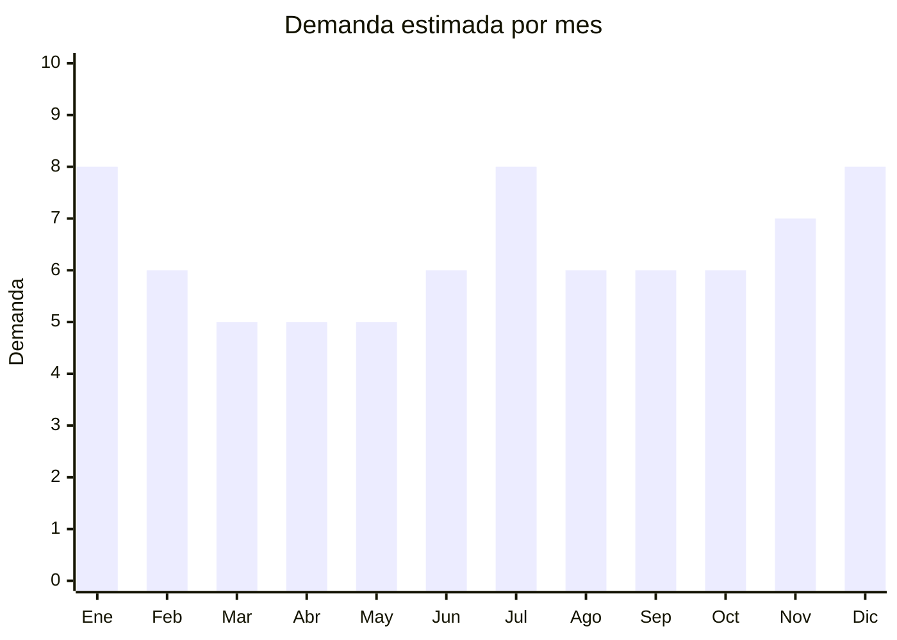

# Neceseres y organizadores de viaje

> **Capítulo NCM 42** — Manufacturas de cuero; artículos de viaje, bolsos | **Temporada:** Atemporal

## Qué es y por qué importarlo

Los organizadores de viaje incluyen packing cubes (cubos organizadores para valija), neceseres impermeables, portazapatos, bolsas para ropa sucia, organizadores de cables y fundas de documentos. El formato estrella es el set de 6-8 piezas (3-4 packing cubes de diferentes tamaños + neceser + portazapatos + bolsa lavandería).

La tendencia de viajes post-pandemia y la cultura de organización impulsaron este segmento. Los packing cubes resuelven un problema real (organizar la valija) y una vez que el usuario los prueba, no vuelve a viajar sin ellos.

## Datos clave

| Dato | Valor |
|------|-------|
| **Posiciones NCM típicas** | 4202.92.00 (bolsos/estuches con superficie textil) |
| **Derecho de importación** | 20% (DIE) + 3% tasa estadística |
| **Rango FOB típico** | USD 1.50 — USD 5.00 por set (6-8 piezas) |
| **Precio de venta en Argentina** | ARS 10.000 — ARS 30.000 |
| **Margen bruto estimado** | 200% — 400% |
| **MOQ típico** | 100 — 500 sets |
| **Demanda en MercadoLibre** | Media-Alta |
| **Competencia en MercadoLibre** | Media |
| **Dificultad para importar** | Fácil |
| **Certificaciones necesarias** | Ninguna |
| **Antidumping** | No |

## Demanda y mercado en Argentina

- **Volumen de mercado:** Sets de 6-8 piezas son bestsellers con vendedores que superan miles de unidades. La categoría creció con la reactivación del turismo.
- **Tendencia:** Creciente — más argentinos viajan al exterior y adoptan packing cubes. Tendencia de organización/minimalismo impulsa el segmento.
- **Perfil del comprador:** Viajeros frecuentes, personas que se mudan, público organizado, compradores de regalos.

## Variantes y subtipos más comunes

| Subtipo / Variante | FOB aprox. | Venta AR aprox. | Nota |
|--------------------|-----------|-----------------|------|
| Set 6 piezas básico (cubes + neceser) | USD 1.50 — 3.00 | ARS 10.000 — 18.000 | **Más vendido** |
| Set 8 piezas completo | USD 2.50 — 5.00 | ARS 15.000 — 25.000 | Premium |
| Neceser impermeable individual | USD 1.00 — 3.00 | ARS 5.000 — 12.000 | Complemento |
| Organizador de cables/electrónica | USD 1.50 — 3.00 | ARS 6.000 — 15.000 | Nicho tech |
| Portadocumentos/pasaporte RFID | USD 1.00 — 2.50 | ARS 5.000 — 10.000 | Complemento viaje |

## Regulaciones y requisitos

<Tabs>
  <Tab title="Certificaciones">
    Sin certificaciones especiales. Producto de importación libre.
  </Tab>
  <Tab title="Etiquetado">
    Estándar: idioma español, datos del importador, composición, país de origen, garantía 6 meses.
  </Tab>
  <Tab title="Restricciones">
    Sin restricciones.
  </Tab>
</Tabs>

## Logística

| Dato | Valor |
|------|-------|
| **Peso típico por set** | 0.20 — 0.50 kg |
| **Volumen típico** | Bajo (se comprimen fácilmente) |
| **Fragilidad** | Baja |
| **Envío recomendado** | Marítimo LCL |
| **Tiempo total estimado** | 45 — 75 días (marítimo) |

## Estacionalidad



| Aspecto | Detalle |
|---------|---------|
| **Meses pico** | Enero (vacaciones verano), Julio (vacaciones invierno), Noviembre-Diciembre (regalos, preparación vacaciones) |

## Ventajas y riesgos

<CardGroup cols={2}>
  <Card title="Ventajas" icon="circle-check">
    - FOB muy bajo para sets completos
    - Liviano y comprimible
    - Alto valor percibido (set de 6-8 piezas)
    - Ideal para marca propia
    - Producto de regalo
  </Card>
  <Card title="Riesgos" icon="triangle-exclamation">
    - Cierres de mala calidad = reclamos
    - Telas que se deshilachan o no son impermeables
    - Mercado puede saturarse
  </Card>
</CardGroup>

## Palabras clave para buscar en Alibaba

```
packing cubes set wholesale, travel organizer set 6 piece, toiletry bag waterproof,
shoe bag travel, cable organizer bag, luggage organizer set, compression packing cubes,
travel accessories set wholesale
```

## Fuentes

- [MercadoLibre Argentina — Organizadores de viaje](https://listado.mercadolibre.com.ar/organizador-viaje-valija)
- [Alibaba — Packing cubes wholesale](https://www.alibaba.com/showroom/packing-cubes-wholesale.html)
