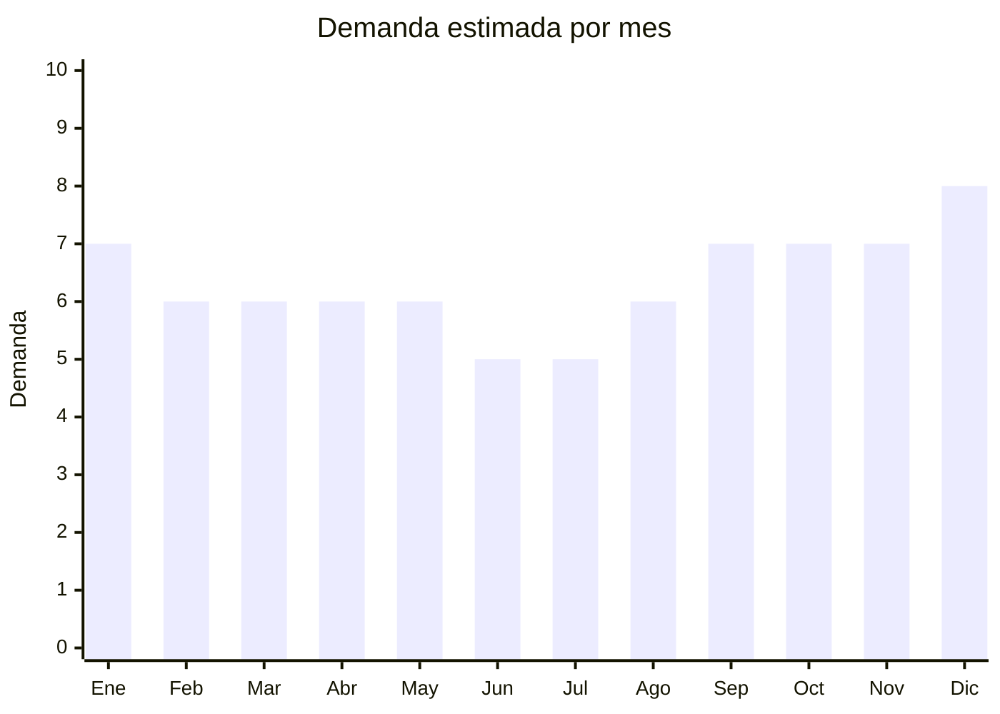

# Riñoneras y bananos

> **Capítulo NCM 42** — Manufacturas de cuero; artículos de viaje, bolsos | **Temporada:** Atemporal

## Qué es y por qué importarlo

Las riñoneras (también llamadas bananos, canguros o crossbody bags) son bolsos compactos que se llevan cruzados al cuerpo o en la cintura. Pasaron de ser un accesorio "retro" a un básico de moda urbana, tanto para hombres como mujeres. Los modelos deportivos, urbanos y de diseño mantienen demanda constante.

El producto tiene un FOB extremadamente bajo (USD 1-5), es ultraliviano, fácil de personalizar con marca propia y tiene alta rotación. Guangzhou (China) concentra la producción con miles de opciones de diseño.

## Datos clave

| Dato | Valor |
|------|-------|
| **Posiciones NCM típicas** | 4202.92.00 (bolsos con superficie de materia textil), 4202.22.20 (superficie PU/plástico) |
| **Derecho de importación** | 20% (DIE) + 3% tasa estadística |
| **Rango FOB típico** | USD 1.00 — USD 5.00 por unidad |
| **Precio de venta en Argentina** | ARS 8.000 — ARS 25.000 |
| **Margen bruto estimado** | 200% — 400% |
| **MOQ típico** | 50 — 300 unidades |
| **Demanda en MercadoLibre** | Alta |
| **Competencia en MercadoLibre** | Media-Alta |
| **Dificultad para importar** | Fácil |
| **Certificaciones necesarias** | Ninguna |
| **Antidumping** | No |

## Demanda y mercado en Argentina

- **Volumen de mercado:** Demanda sostenida en MercadoLibre. Producto de compra impulsiva y regalo frecuente.
- **Tendencia:** Estable — la riñonera se consolidó como básico de moda urbana. Los modelos crossbody (cruzados al pecho) son los más populares.
- **Perfil del comprador:** Jóvenes 16-35 años (ambos géneros), deportistas, viajeros, festivales/eventos.
- **Canales de venta principales:** MercadoLibre, ferias de moda, tiendas deportivas, Instagram.

## Competencia

| Aspecto | Situación |
|---------|-----------|
| **Cantidad de vendedores en ML** | +300 vendedores activos |
| **Hay marcas dominantes** | No — mercado fragmentado |
| **Tipo de competidores** | Importadores directos |
| **Rango de precios en ML** | ARS 8.000 — ARS 25.000 |
| **Posibilidad de diferenciarse** | Alta |

## Variantes y subtipos más comunes

| Subtipo / Variante | FOB aprox. | Venta AR aprox. | Nota |
|--------------------|-----------|-----------------|------|
| Riñonera deportiva básica | USD 1.00 — 2.00 | ARS 8.000 — 12.000 | Alta rotación |
| Crossbody bag urbano | USD 2.00 — 4.00 | ARS 12.000 — 20.000 | **Más vendido** |
| Riñonera impermeable running | USD 1.50 — 3.00 | ARS 8.000 — 15.000 | Público deportivo |
| Banano PU diseño premium | USD 3.00 — 5.00 | ARS 15.000 — 25.000 | Moda/tendencia |
| Riñonera táctica/militar | USD 2.00 — 4.00 | ARS 10.000 — 20.000 | Público masculino |

## Regulaciones y requisitos

<Tabs>
  <Tab title="Certificaciones">
    Sin certificaciones especiales. Producto de importación libre.
  </Tab>
  <Tab title="Etiquetado">
    | Requisito | Aplica |
    |-----------|--------|
    | Idioma español | Sí |
    | Datos del importador | Sí |
    | Composición / materiales | Sí (nylon, poliéster, PU) |
    | País de origen | Sí |
    | Garantía legal 6 meses | Sí |
  </Tab>
  <Tab title="Restricciones">
    Sin restricciones. No importar con logos de marcas registradas sin licencia.
  </Tab>
</Tabs>

## Logística

| Dato | Valor |
|------|-------|
| **Peso típico por unidad** | 0.10 — 0.30 kg |
| **Volumen típico** | Bajo |
| **Fragilidad** | Baja |
| **Envío recomendado** | Aéreo para lotes chicos; Marítimo LCL para volumen |
| **Tiempo total estimado** | 15 — 25 días (aéreo) / 45 — 75 días (marítimo) |
| **Baterías de litio** | No |
| **Requiere empaque especial** | No |

## Estacionalidad



| Aspecto | Detalle |
|---------|---------|
| **Meses pico** | Septiembre-Diciembre (primavera/verano, eventos, regalos), Enero (vacaciones/viajes) |
| **Meses valle** | Junio-Julio |

## Ventajas y riesgos

<CardGroup cols={2}>
  <Card title="Ventajas" icon="circle-check">
    - FOB muy bajo (desde USD 1)
    - Ultraliviano (flete mínimo)
    - Márgenes altos (200-400%)
    - Ideal para marca propia
    - Producto de compra impulsiva
  </Card>
  <Card title="Riesgos" icon="triangle-exclamation">
    - Competencia alta con precios agresivos
    - Cierres de mala calidad = reclamos
    - Producto de moda (estilos cambian)
  </Card>
</CardGroup>

## Palabras clave para buscar en Alibaba

```
waist bag wholesale, crossbody bag men, fanny pack wholesale, belt bag fashion,
chest bag sling, running waist bag, waterproof fanny pack, custom logo waist bag
```

## Fuentes

- [MercadoLibre Argentina — Riñoneras](https://listado.mercadolibre.com.ar/rinoneras)
- [Alibaba — Waist bag wholesale](https://www.alibaba.com/showroom/waist-bag-wholesale.html)
