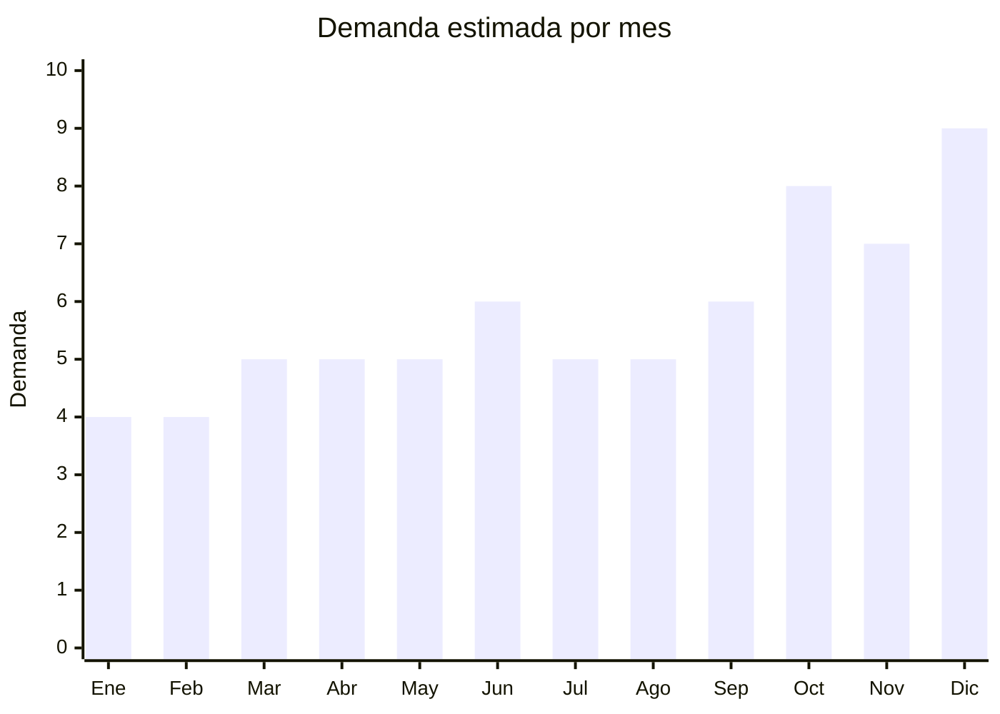

# Cajas y cofres decorativos de madera

> **Capítulo NCM 44** — Madera y sus manufacturas | **Temporada:** Atemporal

## Qué es y por qué importarlo

Las cajas decorativas de madera incluyen cajas de té con divisiones (4, 6 u 8 compartimentos), cofres de joyería, cajas para vinos, cajas para packaging premium de regalos y cajas organizadoras con tapa. Son productos con alta percepción de valor que se usan como regalo, decoración y packaging de productos premium.

El segmento de packaging premium es un canal B2B interesante: emprendimientos de chocolate, vinos, cosmética y otros productos premium buscan cajas de madera/bambú para elevar la presentación de sus productos.

## Datos clave

| Dato | Valor |
|------|-------|
| **Posiciones NCM típicas** | 4420.90.00 (marquetería/taracea), 4421.99.00 (otras manufacturas de madera) |
| **Derecho de importación** | 14% (DIE) + 3% tasa estadística |
| **Rango FOB típico** | USD 1.00 — USD 8.00 por unidad |
| **Precio de venta en Argentina** | ARS 6.000 — ARS 25.000 |
| **Margen bruto estimado** | 200% — 350% |
| **MOQ típico** | 100 — 500 unidades |
| **Demanda en MercadoLibre** | Media |
| **Competencia en MercadoLibre** | Baja-Media |
| **Dificultad para importar** | Fácil-Moderada (posible SENASA) |
| **Certificaciones necesarias** | Posible ISPM-15 |
| **Antidumping** | No |

## Variantes y subtipos más comunes

| Subtipo / Variante | FOB aprox. | Venta AR aprox. | Nota |
|--------------------|-----------|-----------------|------|
| Caja de té bambú 6 compartimentos | USD 2.00 — 4.00 | ARS 8.000 — 18.000 | **Más vendido** (regalo) |
| Cofre joyería madera con espejo | USD 3.00 — 8.00 | ARS 12.000 — 25.000 | Regalo premium |
| Caja para vino (1-2 botellas) | USD 2.00 — 5.00 | ARS 8.000 — 18.000 | Nicho vinos |
| Caja packaging premium (personalizable) | USD 1.00 — 4.00 | ARS 5.000 — 15.000 | B2B emprendimientos |
| Caja decorativa con tapa gravada | USD 1.50 — 5.00 | ARS 6.000 — 20.000 | Decoración |

## Regulaciones y requisitos

<Tabs>
  <Tab title="Certificaciones">
    Posible inspección fitosanitaria SENASA. Madera/bambú procesado (barnizado, laminado) generalmente no tiene problema.
  </Tab>
  <Tab title="Etiquetado">
    Estándar: idioma español, datos importador, composición, país de origen, garantía 6 meses.
  </Tab>
  <Tab title="Restricciones">
    Sin restricciones especiales más allá de la posible inspección fitosanitaria.
  </Tab>
</Tabs>

## Logística

| Dato | Valor |
|------|-------|
| **Peso típico por unidad** | 0.3 — 1.0 kg |
| **Volumen típico** | Medio |
| **Fragilidad** | Baja-Media |
| **Envío recomendado** | Marítimo LCL |
| **Tiempo total estimado** | 50 — 80 días (marítimo) |

## Estacionalidad



| Aspecto | Detalle |
|---------|---------|
| **Meses pico** | Octubre (Día de la Madre), Diciembre (regalos Navidad — pico máximo de cajas regalo) |

## Ventajas y riesgos

<CardGroup cols={2}>
  <Card title="Ventajas" icon="circle-check">
    - Alto valor percibido vs FOB bajo
    - Canal B2B (packaging premium)
    - Personalizable con grabado láser
    - Ideal para regalos (cajas de té, joyería)
    - Menor competencia
  </Card>
  <Card title="Riesgos" icon="triangle-exclamation">
    - Mercado de nicho (volumen limitado)
    - Posible inspección fitosanitaria
    - Sensible a humedad
    - Producto pesado para su valor
  </Card>
</CardGroup>

## Palabras clave para buscar en Alibaba

```
wooden tea box wholesale, bamboo tea chest 6 compartment, wooden jewelry box,
wine box wood, gift box wood, custom wooden box laser engraving, bamboo gift box,
wooden storage box with lid
```

## Fuentes

- [MercadoLibre Argentina — Caja té madera](https://listado.mercadolibre.com.ar/caja-te-madera)
- [Alibaba — Wooden tea box wholesale](https://www.alibaba.com/showroom/wooden-tea-box-wholesale.html)
