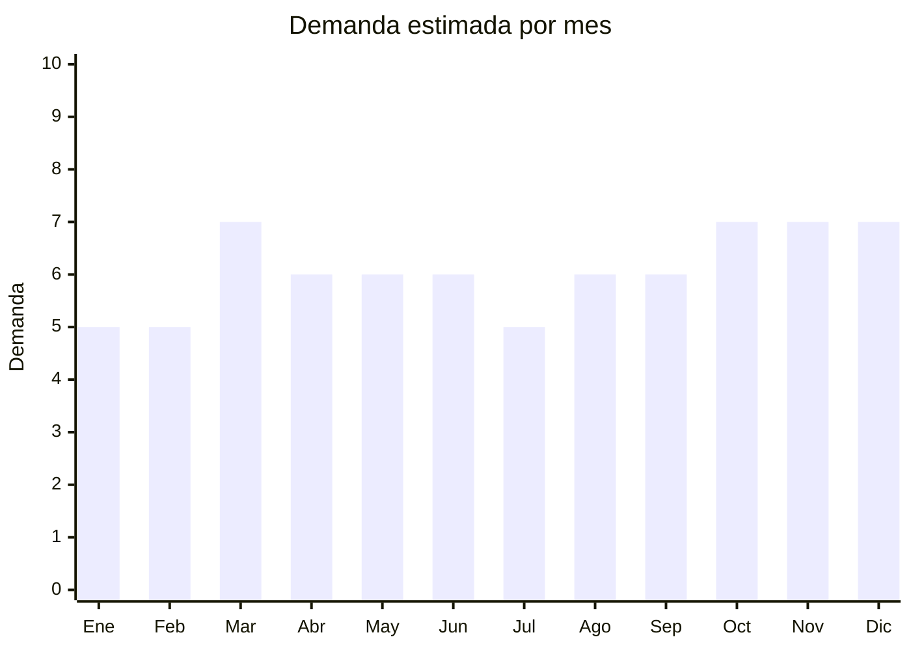

# Organizadores de escritorio en bambú

> **Capítulo NCM 44** — Madera y sus manufacturas | **Temporada:** Atemporal

## Qué es y por qué importarlo

Los organizadores de escritorio en bambú/madera incluyen portacelulares, organizadores con compartimentos múltiples (para lapiceras, tarjetas, clips), soportes elevadores para monitor/notebook, estaciones de carga (sin electrónica, solo soporte físico) y bandejas apilables para documentos.

La tendencia de home office post-pandemia impulsó fuertemente este segmento. El bambú tiene una percepción premium ("natural", "eco", "zen") que permite cobrar más que el plástico equivalente, a pesar de que el FOB en China es similar. El material bambú está asociado a productividad, minimalismo y bienestar.

## Datos clave

| Dato | Valor |
|------|-------|
| **Posiciones NCM típicas** | 4421.99.00 (otras manufacturas de madera/bambú) |
| **Derecho de importación** | 14% (DIE) + 3% tasa estadística |
| **Rango FOB típico** | USD 1.00 — USD 5.00 por unidad |
| **Precio de venta en Argentina** | ARS 8.000 — ARS 25.000 |
| **Margen bruto estimado** | 200% — 350% |
| **MOQ típico** | 100 — 500 unidades |
| **Demanda en MercadoLibre** | Media |
| **Competencia en MercadoLibre** | Baja-Media |
| **Dificultad para importar** | Fácil-Moderada (posible SENASA) |
| **Certificaciones necesarias** | Posible ISPM-15 |
| **Antidumping** | No |

## Demanda y mercado en Argentina

- **Volumen de mercado:** Demanda creciente vinculada a home office. Menor volumen que productos masivos pero con público dispuesto a pagar por diseño.
- **Tendencia:** Creciente — home office permanente + tendencia minimalista/zen en escritorios.
- **Perfil del comprador:** Trabajadores remotos, diseñadores, programadores, oficinas que renuevan equipamiento.

## Variantes y subtipos más comunes

| Subtipo / Variante | FOB aprox. | Venta AR aprox. | Nota |
|--------------------|-----------|-----------------|------|
| Portacelular/tablet bambú | USD 1.00 — 2.00 | ARS 5.000 — 10.000 | Complemento |
| Organizador escritorio multicompartimento | USD 2.00 — 5.00 | ARS 10.000 — 20.000 | **Más vendido** |
| Soporte elevador monitor/notebook bambú | USD 3.00 — 8.00 | ARS 15.000 — 30.000 | Tendencia ergonomía |
| Bandeja organizadora bambú | USD 1.50 — 3.00 | ARS 6.000 — 12.000 | Complemento |
| Estación de carga bambú (soporte) | USD 2.00 — 4.00 | ARS 8.000 — 18.000 | Nicho tech |

## Regulaciones y requisitos

<Tabs>
  <Tab title="Certificaciones">
    | Organismo | Requiere | Detalle |
    |-----------|----------|---------|
    | SENASA | Posible | Inspección fitosanitaria. Bambú procesado (laminado/barnizado) generalmente no tiene problema |
    | ANMAT | No | No es alimento ni cosmético |
    | ENACOM | No | No es electrónico |
  </Tab>
  <Tab title="Etiquetado">
    Estándar: idioma español, datos importador, composición ("Bambú natural"), país de origen, garantía 6 meses.
  </Tab>
  <Tab title="Restricciones">
    Posible inspección SENASA. Sin antidumping ni licencias.
  </Tab>
</Tabs>

## Logística

| Dato | Valor |
|------|-------|
| **Peso típico por unidad** | 0.3 — 1.5 kg |
| **Volumen típico** | Medio |
| **Fragilidad** | Baja-Media (bambú resiste pero puede rayarse) |
| **Envío recomendado** | Marítimo LCL |
| **Tiempo total estimado** | 50 — 80 días (marítimo) |

## Estacionalidad



| Aspecto | Detalle |
|---------|---------|
| **Meses pico** | Marzo (vuelta al trabajo/home office), Octubre-Diciembre (regalos, CyberMonday) |

## Ventajas y riesgos

<CardGroup cols={2}>
  <Card title="Ventajas" icon="circle-check">
    - Percepción premium (bambú = eco/natural)
    - Menor competencia que plástico
    - Tendencia home office consolidada
    - Ideal para marca propia premium
    - Buen margen (200-350%)
  </Card>
  <Card title="Riesgos" icon="triangle-exclamation">
    - Posible inspección SENASA
    - Sensible a humedad en transporte
    - Mercado más chico que organizadores plásticos
    - Producto pesado para su valor
  </Card>
</CardGroup>

## Palabras clave para buscar en Alibaba

```
bamboo desk organizer wholesale, wood phone holder, bamboo monitor stand,
desktop organizer bamboo, bamboo pen holder, bamboo laptop stand,
bamboo office accessories, wood desk organizer
```

## Fuentes

- [MercadoLibre Argentina — Organizador escritorio bambú](https://listado.mercadolibre.com.ar/organizador-escritorio-bambu)
- [Alibaba — Bamboo desk organizer](https://www.alibaba.com/showroom/bamboo-desk-organizer.html)
