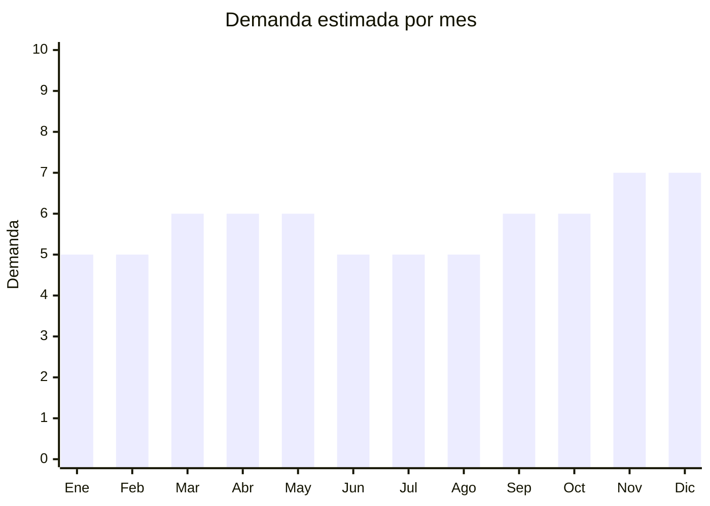

# Percheros y perchas de madera

> **Capítulo NCM 44** — Madera y sus manufacturas | **Temporada:** Atemporal

## Qué es y por qué importarlo

Los percheros y perchas de madera incluyen percheros de pared tipo nórdico/minimalista (con ganchos de madera), percheros de pie tipo árbol, y perchas de madera por pack (10-20 unidades) para armario. La tendencia de decoración nórdica/escandinava y minimalismo impulsa la demanda de estos productos.

Las perchas de madera por pack son un producto de compra recurrente: se compran cada vez que se renueva el armario, en mudanzas, o como upgrade de perchas plásticas. Los percheros de pared nórdicos son un producto de decoración con alto valor percibido.

## Datos clave

| Dato | Valor |
|------|-------|
| **Posiciones NCM típicas** | 4421.99.00 (otras manufacturas de madera) |
| **Derecho de importación** | 14% (DIE) + 3% tasa estadística |
| **Rango FOB típico** | USD 0.20 — USD 0.80 por percha; USD 2.00 — USD 8.00 por perchero de pared |
| **Precio de venta en Argentina** | ARS 5.000 — ARS 12.000 (pack perchas x10); ARS 8.000 — ARS 25.000 (perchero pared) |
| **Margen bruto estimado** | 150% — 300% |
| **MOQ típico** | 200 — 1,000 unidades (perchas); 100 — 300 (percheros) |
| **Demanda en MercadoLibre** | Media-Alta |
| **Competencia en MercadoLibre** | Media |
| **Dificultad para importar** | Fácil-Moderada (posible SENASA) |
| **Certificaciones necesarias** | Posible ISPM-15 |
| **Antidumping** | No |

## Variantes y subtipos más comunes

| Subtipo / Variante | FOB aprox. | Venta AR aprox. | Nota |
|--------------------|-----------|-----------------|------|
| Pack x10 perchas madera natural | USD 2.00 — 4.00 | ARS 5.000 — 10.000 | **Más vendido** |
| Pack x20 perchas madera | USD 3.50 — 7.00 | ARS 8.000 — 15.000 | Mayor valor |
| Perchas madera con pinza (faldas) | USD 0.30 — 0.60/u | ARS 800 — 1.500/u | Complemento |
| Perchero pared nórdico (3-5 ganchos) | USD 2.00 — 5.00 | ARS 8.000 — 18.000 | Decoración |
| Perchero de pie tipo árbol | USD 5.00 — 12.00 | ARS 15.000 — 35.000 | Decorativo |

## Regulaciones y requisitos

<Tabs>
  <Tab title="Certificaciones">
    Posible inspección fitosanitaria SENASA. Madera procesada (barnizada, pintada) generalmente no tiene problema.
  </Tab>
  <Tab title="Etiquetado">
    Estándar: idioma español, datos importador, composición, país de origen, garantía 6 meses.
  </Tab>
  <Tab title="Restricciones">
    Sin restricciones especiales.
  </Tab>
</Tabs>

## Logística

| Dato | Valor |
|------|-------|
| **Peso típico** | 0.05 — 0.15 kg por percha; 0.5 — 2.0 kg por perchero |
| **Volumen típico** | Medio (perchas se agrupan; percheros pueden ser voluminosos) |
| **Fragilidad** | Baja |
| **Envío recomendado** | Marítimo LCL |
| **Tiempo total estimado** | 50 — 80 días (marítimo) |

## Estacionalidad



| Aspecto | Detalle |
|---------|---------|
| **Meses pico** | Noviembre-Diciembre (mudanzas, renovación hogar, regalos) |

## Ventajas y riesgos

<CardGroup cols={2}>
  <Card title="Ventajas" icon="circle-check">
    - Perchas son compra recurrente
    - Tendencia nórdica/minimalista
    - Buen margen
    - Producto resistente al envío
  </Card>
  <Card title="Riesgos" icon="triangle-exclamation">
    - Perchas son pesadas en volumen (flete)
    - Posible inspección SENASA
    - Competencia con perchas plásticas más baratas
  </Card>
</CardGroup>

## Palabras clave para buscar en Alibaba

```
wooden hanger wholesale, wood coat hanger bulk, wall hook rack wood,
coat rack tree stand, wooden hanger with clip, natural wood hanger set,
nordic wall hooks, bamboo coat rack
```

## Fuentes

- [MercadoLibre Argentina — Perchas madera](https://listado.mercadolibre.com.ar/perchas-madera)
- [Alibaba — Wooden hanger wholesale](https://www.alibaba.com/showroom/wooden-hanger-wholesale.html)
