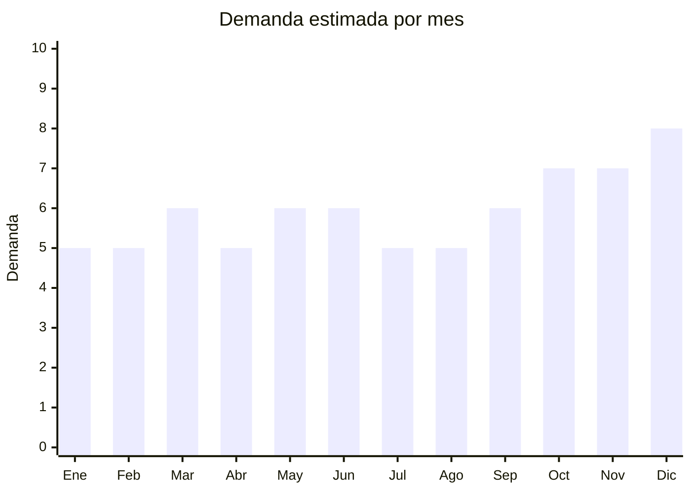

# Tablas de cocina de bambú y madera

> **Capítulo NCM 44** — Madera y sus manufacturas | **Temporada:** Atemporal

## Qué es y por qué importarlo

Las tablas de cocina abarcan tablas de cortar de bambú (material estrella), tablas de madera maciza (acacia, caucho), tablas con surco para jugos, tablas de servir/presentación y sets de múltiples tamaños. China (Anji, Zhejiang) es el mayor productor mundial de bambú y sus manufacturas, con precios FOB imbatibles.

La tendencia de cocina gourmet y presentación de alimentos en redes sociales impulsó la demanda de tablas decorativas de bambú. Las tablas se usan tanto para cortar como para servir quesos, fiambres y aperitivos, lo que amplía el mercado más allá de la cocina funcional.

## Datos clave

| Dato | Valor |
|------|-------|
| **Posiciones NCM típicas** | 4419.12.00 (tablas de cortar de bambú), 4419.19.00 (de otras maderas) |
| **Derecho de importación** | 14% (DIE) + 3% tasa estadística |
| **Rango FOB típico** | USD 1.00 — USD 5.00 por unidad |
| **Precio de venta en Argentina** | ARS 8.000 — ARS 30.000 |
| **Margen bruto estimado** | 150% — 300% |
| **MOQ típico** | 200 — 1,000 unidades |
| **Demanda en MercadoLibre** | Alta |
| **Competencia en MercadoLibre** | Media-Alta |
| **Dificultad para importar** | Fácil-Moderada (posible inspección fitosanitaria SENASA) |
| **Certificaciones necesarias** | Posible tratamiento fitosanitario ISPM-15 |
| **Antidumping** | No |

## Demanda y mercado en Argentina

- **Volumen de mercado:** Demanda sostenida. Tablas de bambú superaron a las de madera maciza en popularidad por mejor relación precio-calidad.
- **Tendencia:** Estable-Creciente — impulsada por cocina gourmet, food styling en redes sociales, y tendencia de materiales naturales/eco.
- **Perfil del comprador:** Hogares (producto básico de cocina), amantes de la cocina, gastronomía (restaurantes), compradores de regalos.
- **Canales de venta principales:** MercadoLibre, bazares, tiendas de cocina, regalerías.

<Note>
Los **sets de 3 tablas** de diferentes tamaños son el formato más vendido. Las tablas con **surco para jugos** y **mango integrado** tienen mayor ticket promedio. Las tablas de **servir/presentación** (con borde decorativo) son un segmento de mayor margen.
</Note>

## Competencia

| Aspecto | Situación |
|---------|-----------|
| **Cantidad de vendedores en ML** | +300 vendedores activos |
| **Hay marcas dominantes** | No — mercado fragmentado |
| **Tipo de competidores** | Importadores directos + artesanos locales |
| **Rango de precios en ML** | ARS 8.000 — ARS 30.000 |
| **Posibilidad de diferenciarse** | Media-Alta |

**Cómo diferenciarse:**
- Tablas de servir con diseños exclusivos (forma de país, animal, etc.)
- Sets con soporte/organizador incluido
- Grabado láser personalizado (logo, frases)
- Tablas combinadas: bambú + acero inoxidable (surco recolector)

## Variantes y subtipos más comunes

| Subtipo / Variante | FOB aprox. | Venta AR aprox. | Nota |
|--------------------|-----------|-----------------|------|
| Tabla bambú individual (30x20cm) | USD 1.00 — 2.00 | ARS 5.000 — 10.000 | Producto base |
| Set x3 tablas bambú (S/M/L) | USD 2.50 — 5.00 | ARS 12.000 — 22.000 | **Más vendido** |
| Tabla grande con surco (40x30cm) | USD 2.00 — 4.00 | ARS 10.000 — 20.000 | Cocina gourmet |
| Tabla de servir/presentación | USD 2.00 — 5.00 | ARS 10.000 — 25.000 | Deco/gastronomía |
| Set tabla + accesorios (cuchillo queso) | USD 3.00 — 8.00 | ARS 15.000 — 30.000 | Regalo |

## Regulaciones y requisitos

<Tabs>
  <Tab title="Certificaciones">
    | Organismo | Requiere | Detalle |
    |-----------|----------|---------|
    | ARCA (Aduana) | Sí siempre | Despacho estándar |
    | SENASA | **Posible** | Productos de madera/bambú pueden requerir inspección fitosanitaria. El bambú procesado (laminado, barnizado) generalmente no tiene problemas. Madera cruda puede requerir tratamiento ISPM-15 |
    | ANMAT | No | No es alimento (es utensilio) |

    **Recomendación:** Solicitar al proveedor certificado de tratamiento térmico (HT — Heat Treatment) que cumple ISPM-15. El bambú laminado y barnizado rara vez tiene problemas fitosanitarios.
  </Tab>

  <Tab title="Etiquetado">
    | Requisito | Aplica |
    |-----------|--------|
    | Idioma español | Sí |
    | Datos del importador | Sí |
    | Composición / materiales | Sí ("Bambú natural", "Madera de acacia") |
    | Instrucciones de cuidado | Recomendado ("Lavar a mano, no lavavajillas, aceitar periódicamente") |
    | Apto contacto alimentos | Recomendado (solicitar certificado "Food Safe" al proveedor) |
    | País de origen | Sí |
    | Garantía legal 6 meses | Sí |
  </Tab>

  <Tab title="Restricciones">
    - Posible inspección fitosanitaria de SENASA en Aduana.
    - Madera cruda (sin tratar) puede ser retenida. Preferir bambú laminado/procesado.
    - Sin antidumping, sin licencias previas.
  </Tab>
</Tabs>

## Logística

| Dato | Valor |
|------|-------|
| **Peso típico por set (x3)** | 1.0 — 2.5 kg |
| **Volumen típico** | Medio |
| **Fragilidad** | Baja (madera/bambú es resistente) |
| **Envío recomendado** | Marítimo LCL |
| **Tiempo total estimado** | 50 — 80 días (marítimo) |
| **Baterías de litio** | No |
| **Requiere empaque especial** | No — protección básica contra humedad |

<Warning>
La madera y el bambú son sensibles a la **humedad**. En contenedores marítimos puede haber condensación. Solicitar al proveedor empaque con desecante (bolsas de sílica gel) y film protector para evitar manchas de humedad o hongos durante el tránsito.
</Warning>

## Estacionalidad



| Aspecto | Detalle |
|---------|---------|
| **Meses pico** | Octubre (Día de la Madre — formato regalo), Noviembre-Diciembre (CyberMonday, regalos Navidad, sets de cocina) |
| **Meses valle** | Enero-Febrero — demanda base estable |

## Ventajas y riesgos

<CardGroup cols={2}>
  <Card title="Ventajas" icon="circle-check">
    - Producto de alta calidad percibida (bambú = natural/eco)
    - Demanda permanente (cocina básica)
    - Buen margen (150-300%)
    - Ideal para sets regalo
    - Personalizable con grabado láser
  </Card>
  <Card title="Riesgos" icon="triangle-exclamation">
    - Posible inspección fitosanitaria SENASA
    - Producto pesado (flete significativo)
    - Sensible a humedad en transporte
    - Competencia con artesanos locales
  </Card>
</CardGroup>

## Palabras clave para buscar en Alibaba

```
bamboo cutting board wholesale, bamboo chopping board set, wood cutting board kitchen,
bamboo serving board, bamboo board with juice groove, cutting board set 3 pieces,
bamboo cheese board set, custom bamboo cutting board laser
```

## Fuentes

- [MercadoLibre Argentina — Tablas bambú cocina](https://listado.mercadolibre.com.ar/tabla-bambu-cocina)
- [Alibaba — Bamboo cutting board wholesale](https://www.alibaba.com/showroom/bamboo-cutting-board-wholesale.html)
