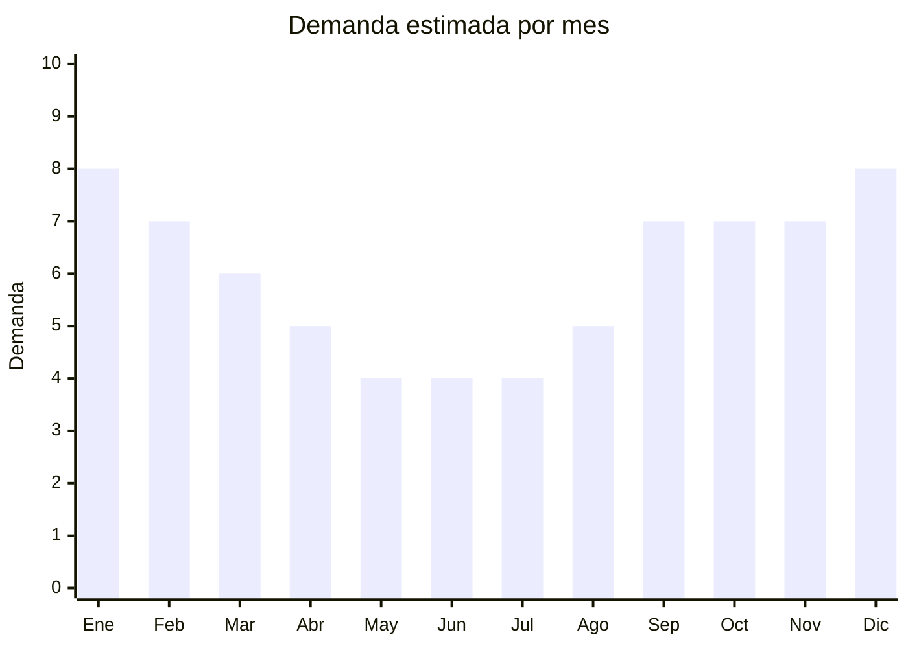

# Bolsos de ratán y paja

> **Capítulo NCM 46** — Manufacturas de espartería o cestería | **Temporada:** Atemporal (con pico verano)

## Qué es y por qué importarlo

Los bolsos de ratán, paja y mimbre incluyen el icónico bolso redondo de ratán estilo Bali, carteras de paja trenzada, clutches de rafia y totes de mimbre. Aunque tienen mayor demanda en verano, la tendencia boho los convirtió en un accesorio atemporal que se vende todo el año como pieza de moda y decoración.

El bolso redondo de ratán tipo Bali es un bestseller global desde 2019. China e Indonesia son los principales proveedores, con FOB que permiten márgenes excepcionales.

## Datos clave

| Dato | Valor |
|------|-------|
| **Posiciones NCM típicas** | 4602.19.00 (artículos de cestería de materia vegetal) |
| **Derecho de importación** | 20% (DIE) + 3% tasa estadística |
| **Rango FOB típico** | USD 2.00 — USD 8.00 por unidad |
| **Precio de venta en Argentina** | ARS 10.000 — ARS 30.000 |
| **Margen bruto estimado** | 200% — 400% |
| **MOQ típico** | 50 — 300 unidades |
| **Demanda en MercadoLibre** | Media |
| **Competencia en MercadoLibre** | Baja-Media |
| **Dificultad para importar** | Moderada (SENASA) |
| **Certificaciones necesarias** | Posible inspección SENASA |
| **Antidumping** | No |

## Variantes y subtipos más comunes

| Subtipo / Variante | FOB aprox. | Venta AR aprox. | Nota |
|--------------------|-----------|-----------------|------|
| Bolso redondo ratán tipo Bali | USD 3.00 — 6.00 | ARS 12.000 — 25.000 | **Bestseller** |
| Tote de paja trenzada | USD 2.00 — 5.00 | ARS 10.000 — 20.000 | Verano/playa |
| Clutch de rafia | USD 2.00 — 4.00 | ARS 8.000 — 18.000 | Eventos |
| Bolso bandolera ratán | USD 3.00 — 7.00 | ARS 12.000 — 28.000 | Uso diario |
| Bolso de mimbre con tapa | USD 4.00 — 8.00 | ARS 15.000 — 30.000 | Premium |

## Regulaciones y requisitos

<Tabs>
  <Tab title="Certificaciones">
    Posible inspección fitosanitaria SENASA por fibras naturales. Solicitar certificado de fumigación al proveedor.
  </Tab>
  <Tab title="Etiquetado">
    Estándar: composición ("Ratán natural" / "Paja trenzada"), datos importador, país de origen, garantía 6 meses.
  </Tab>
  <Tab title="Restricciones">
    Sin restricciones más allá de SENASA fitosanitario.
  </Tab>
</Tabs>

## Logística

| Dato | Valor |
|------|-------|
| **Peso típico por unidad** | 0.2 — 0.5 kg |
| **Volumen típico** | Medio-Alto (los bolsos redondos no se comprimen) |
| **Fragilidad** | Media (el ratán puede agrietarse si se aplasta) |
| **Envío recomendado** | Marítimo LCL |
| **Tiempo total estimado** | 50 — 80 días (marítimo) |

## Estacionalidad



| Aspecto | Detalle |
|---------|---------|
| **Meses pico** | Octubre-Diciembre (primavera/verano + regalos), Enero-Febrero (pleno verano) |
| **Meses valle** | Mayo-Julio (invierno) |
| **Cuándo pedir** | Agosto para tener stock en octubre (inicio temporada) |

## Ventajas y riesgos

<CardGroup cols={2}>
  <Card title="Ventajas" icon="circle-check">
    - Alto valor percibido (artesanal/natural)
    - Tendencia boho consolidada
    - Márgenes excepcionales (200-400%)
    - Producto de moda con público fidelizado
  </Card>
  <Card title="Riesgos" icon="triangle-exclamation">
    - Posible SENASA fitosanitario
    - Producto estacional (más verano)
    - Voluminoso y difícil de comprimir
    - Ratán puede agrietarse en transporte
  </Card>
</CardGroup>

## Palabras clave para buscar en Alibaba

```
rattan bag wholesale, round rattan bag Bali, straw bag tote, wicker handbag,
raffia clutch bag, natural fiber bag, rattan crossbody bag, boho straw bag
```

## Fuentes

- [MercadoLibre Argentina — Bolso ratán](https://listado.mercadolibre.com.ar/bolso-ratan)
- [Alibaba — Rattan bag wholesale](https://www.alibaba.com/showroom/rattan-bag-wholesale.html)
