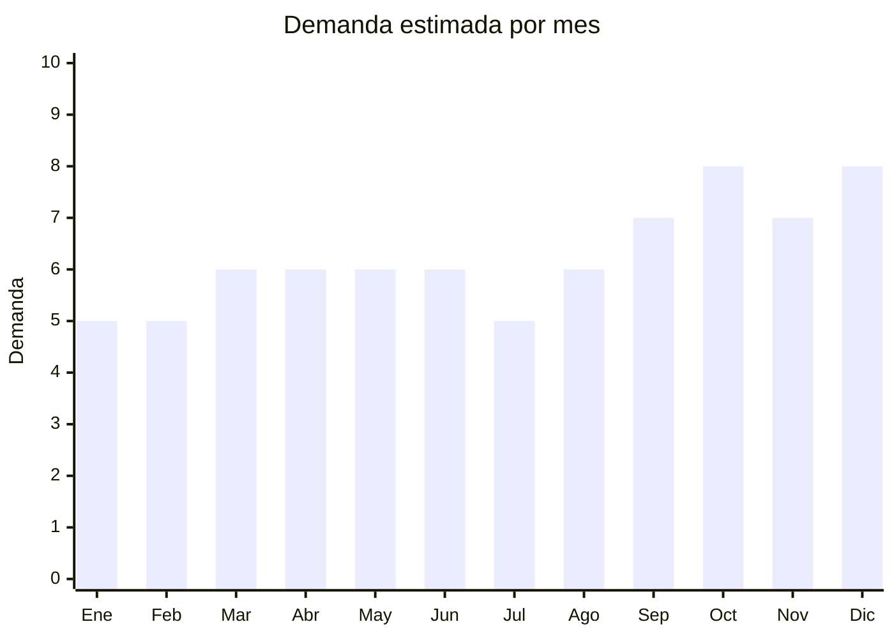

# Cestos organizadores de fibra natural

> **Capítulo NCM 46** — Manufacturas de espartería o cestería | **Temporada:** Atemporal

## Qué es y por qué importarlo

Los cestos de fibra natural incluyen cestos de seagrass (pasto marino), junco, ratán, mimbre y yute utilizados para organización del hogar (ropa, juguetes, revistas), porta-macetas decorativos, cestos para leña y cestos de lavandería. La tendencia de decoración boho/natural los convirtió en un producto estrella de decoración de interiores.

El producto tiene una relación costo-valor percibido excepcional: un cesto de seagrass con FOB de USD 2-3 se vende en Argentina a ARS 10.000-25.000 porque se percibe como producto artesanal/natural premium. China (especialmente Shandong y Guangxi) e Indonesia/Vietnam son los principales productores.

## Datos clave

| Dato | Valor |
|------|-------|
| **Posiciones NCM típicas** | 4602.19.00 (artículos de cestería de materia vegetal) |
| **Derecho de importación** | 20% (DIE) + 3% tasa estadística |
| **Rango FOB típico** | USD 1.00 — USD 8.00 por unidad |
| **Precio de venta en Argentina** | ARS 8.000 — ARS 30.000 |
| **Margen bruto estimado** | 200% — 400% |
| **MOQ típico** | 100 — 500 unidades |
| **Demanda en MercadoLibre** | Alta |
| **Competencia en MercadoLibre** | Media |
| **Dificultad para importar** | Moderada (posible inspección fitosanitaria SENASA) |
| **Certificaciones necesarias** | Posible inspección SENASA |
| **Antidumping** | No |

## Demanda y mercado en Argentina

- **Volumen de mercado:** Demanda creciente. Cestos de seagrass para ropa son bestsellers. Se venden individual o en sets de 3 tamaños.
- **Tendencia:** Creciente — decoración boho/natural es tendencia sólida que no muestra señales de bajar. Complementa plantas, macramé y fibras naturales.
- **Perfil del comprador:** Decoradores, mujeres 25-50 años, amantes del estilo boho/natural, público de Instagram/Pinterest.

<Note>
Los **sets de 3 cestos** (S/M/L) son el formato más vendido. Los cestos con **asas de cuero** o asas de algodón trenzado tienen mayor ticket. Los porta-macetas son un segmento con alta demanda vinculado al boom de plantas de interior.
</Note>

## Variantes y subtipos más comunes

| Subtipo / Variante | FOB aprox. | Venta AR aprox. | Nota |
|--------------------|-----------|-----------------|------|
| Cesto seagrass mediano individual | USD 2.00 — 4.00 | ARS 8.000 — 15.000 | Producto base |
| Set x3 cestos seagrass (S/M/L) | USD 5.00 — 12.00 | ARS 18.000 — 40.000 | **Más vendido** |
| Cesto lavandería grande | USD 4.00 — 8.00 | ARS 12.000 — 25.000 | Funcional |
| Porta-maceta seagrass/yute | USD 1.00 — 3.00 | ARS 5.000 — 12.000 | Tendencia plantas |
| Cesto con tapa (almacenamiento) | USD 3.00 — 6.00 | ARS 10.000 — 22.000 | Decorativo |

## Regulaciones y requisitos

<Tabs>
  <Tab title="Certificaciones">
    | Organismo | Requiere | Detalle |
    |-----------|----------|---------|
    | SENASA | **Posible** | Fibras naturales pueden requerir inspección fitosanitaria. Solicitar certificado de fumigación al proveedor |
    | ANMAT | No | No es alimento ni cosmético |
  </Tab>
  <Tab title="Etiquetado">
    Estándar: idioma español, datos importador, composición ("Seagrass" / "Junco" / "Ratán"), país de origen, garantía 6 meses.
  </Tab>
  <Tab title="Restricciones">
    Posible inspección fitosanitaria de SENASA por ser fibra natural. Solicitar al proveedor certificado de fumigación y tratamiento.
  </Tab>
</Tabs>

## Logística

| Dato | Valor |
|------|-------|
| **Peso típico por unidad** | 0.3 — 1.5 kg |
| **Volumen típico** | Alto (cestos son huecos y voluminosos) |
| **Fragilidad** | Baja-Media (fibras naturales son flexibles pero pueden deformarse) |
| **Envío recomendado** | Marítimo LCL — producto voluminoso |
| **Tiempo total estimado** | 50 — 80 días (marítimo) |

<Warning>
Los cestos de fibra natural son **extremadamente voluminosos** para su peso. El flete se cobra por CBM. Un contenedor de cestos pesa poco pero ocupa mucho espacio. Buscar cestos que se aniden (uno dentro del otro) para optimizar volumen.
</Warning>

## Estacionalidad



| Aspecto | Detalle |
|---------|---------|
| **Meses pico** | Septiembre-Octubre (primavera, renovación deco), Octubre (Día de la Madre), Noviembre-Diciembre (regalos, mudanzas) |

## Ventajas y riesgos

<CardGroup cols={2}>
  <Card title="Ventajas" icon="circle-check">
    - Alto valor percibido vs FOB bajo
    - Tendencia boho consolidada
    - Producto de compra impulsiva
    - Ideal para Instagram/deco
    - Múltiples usos (organización, deco, plantas)
  </Card>
  <Card title="Riesgos" icon="triangle-exclamation">
    - Extremadamente voluminoso (flete por CBM alto)
    - Posible inspección SENASA
    - Fibras naturales pueden tener insectos/moho
    - Sensible a humedad en transporte
  </Card>
</CardGroup>

## Palabras clave para buscar en Alibaba

```
seagrass basket wholesale, woven storage basket, rattan basket set, jute basket planter,
wicker laundry basket, natural fiber basket, seagrass belly basket, boho storage basket
```

## Fuentes

- [MercadoLibre Argentina — Cestos organizadores seagrass](https://listado.mercadolibre.com.ar/cesto-seagrass)
- [Alibaba — Seagrass basket wholesale](https://www.alibaba.com/showroom/seagrass-basket-wholesale.html)
