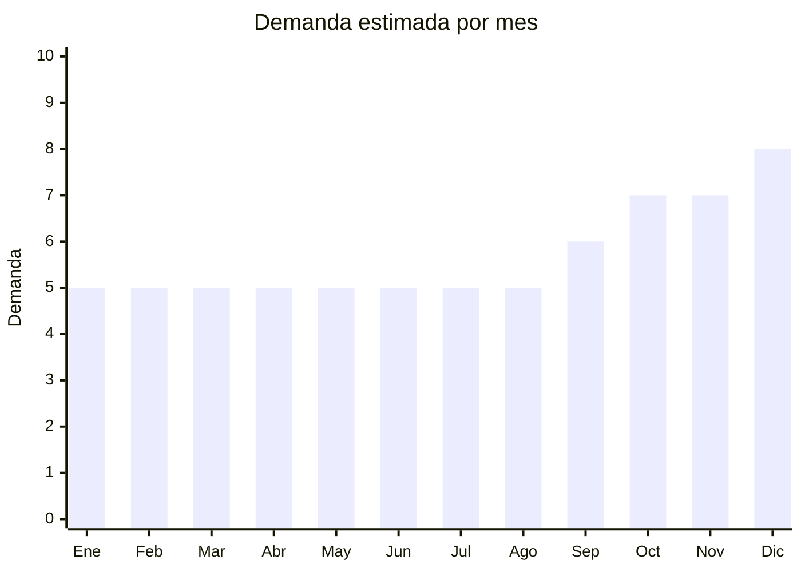

# Individuales y manteles de bambú/ratán

> **Capítulo NCM 46** — Manufacturas de espartería o cestería | **Temporada:** Atemporal

## Qué es y por qué importarlo

Los individuales de bambú/ratán trenzado son accesorios de mesa que se colocan bajo los platos para proteger la superficie y decorar. Se venden en sets de 4-6 unidades. Complementan vajilla (Cap. 69) y cubiertos (Cap. 82). El FOB es bajo, la demanda es recurrente y el producto tiene buena percepción como material natural.

## Datos clave

| Dato | Valor |
|------|-------|
| **Posiciones NCM típicas** | 4601.94.00 (trenzas de material vegetal), 4602.19.00 (cestería) |
| **Derecho de importación** | 20% (DIE) + 3% tasa estadística |
| **Rango FOB típico** | USD 0.30 — USD 2.00 por individual |
| **Precio de venta en Argentina** | ARS 3.000 — ARS 12.000 (set x4-6) |
| **Margen bruto estimado** | 200% — 350% |
| **MOQ típico** | 200 — 1,000 sets |
| **Demanda en MercadoLibre** | Media |
| **Competencia en MercadoLibre** | Baja-Media |
| **Dificultad para importar** | Fácil-Moderada (posible SENASA) |
| **Certificaciones necesarias** | Posible inspección SENASA |
| **Antidumping** | No |

## Variantes y subtipos más comunes

| Subtipo / Variante | FOB aprox. | Venta AR aprox. | Nota |
|--------------------|-----------|-----------------|------|
| Set x4 individuales bambú redondos | USD 1.50 — 3.00 | ARS 4.000 — 8.000 | **Más vendido** |
| Set x6 individuales bambú | USD 2.00 — 4.00 | ARS 6.000 — 12.000 | Set completo |
| Individuales ratán/seagrass | USD 0.50 — 1.50/u | ARS 1.500 — 4.000/u | Estilo boho |
| Camino de mesa bambú trenzado | USD 2.00 — 5.00 | ARS 6.000 — 15.000 | Decorativo |

## Regulaciones y requisitos

<Tabs>
  <Tab title="Certificaciones">
    Posible inspección SENASA por fibras naturales. Sin otras certificaciones.
  </Tab>
  <Tab title="Etiquetado">
    Estándar: composición, datos importador, país de origen.
  </Tab>
  <Tab title="Restricciones">
    Sin restricciones especiales.
  </Tab>
</Tabs>

## Logística

| Dato | Valor |
|------|-------|
| **Peso típico por set x4** | 0.2 — 0.6 kg |
| **Volumen típico** | Bajo-Medio (planos, se apilan) |
| **Fragilidad** | Baja |
| **Envío recomendado** | Marítimo LCL |
| **Tiempo total estimado** | 50 — 80 días (marítimo) |

## Estacionalidad



| Aspecto | Detalle |
|---------|---------|
| **Meses pico** | Octubre-Diciembre (regalos, renovación mesa para fiestas) |

## Ventajas y riesgos

<CardGroup cols={2}>
  <Card title="Ventajas" icon="circle-check">
    - FOB muy bajo
    - Producto de compra recurrente
    - Complementa otros productos (vajilla, cubiertos)
    - Sin regulación compleja
  </Card>
  <Card title="Riesgos" icon="triangle-exclamation">
    - Mercado chico
    - Posible SENASA
    - Ticket promedio bajo
  </Card>
</CardGroup>

## Palabras clave para buscar en Alibaba

```
bamboo placemat wholesale, woven placemat set, rattan placemat round,
natural placemat table, seagrass placemat, bamboo table mat set
```

## Fuentes

- [MercadoLibre Argentina — Individuales bambú](https://listado.mercadolibre.com.ar/individuales-bambu)
- [Alibaba — Bamboo placemat wholesale](https://www.alibaba.com/showroom/bamboo-placemat-wholesale.html)
