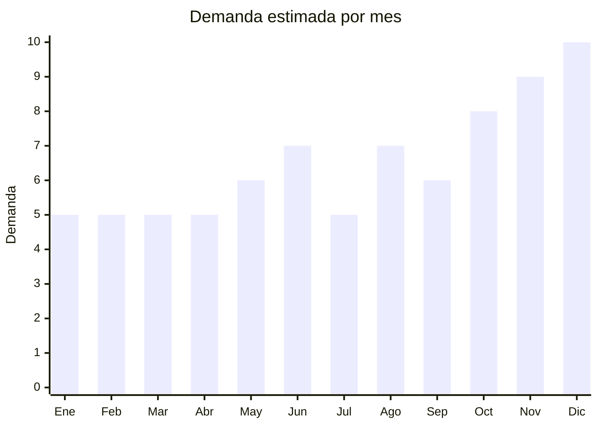

# Cajas de cartón para packaging y envíos

> **Capítulo NCM 48** — Papel y cartón; manufacturas de pasta de celulosa | **Temporada:** Atemporal

## Qué es y por qué importarlo

Las cajas de cartón para packaging incluyen cajas de envío e-commerce (corrugadas), cajas regalo con diseño (rígidas, con ventana, magnéticas), cajas para productos específicos (cosmética, joyería, electrónica) y packaging de marca (custom boxes con impresión). La demanda es enorme por el boom del e-commerce.

<Warning>
**Evaluación crítica:** Las cajas corrugadas lisas (sin impresión) tienen una relación peso-volumen/valor **muy desfavorable** para importar desde China. El flete marítimo consume el margen. **Solo justifica importar cajas impresas premium, cajas regalo con diseño o packaging luxury.** Las cajas corrugadas lisas deben comprarse a fabricantes locales argentinos.
</Warning>

## Datos clave

| Dato | Valor |
|------|-------|
| **Posiciones NCM típicas** | 4819.10.00 (cajas de cartón corrugado), 4819.20.00 (cajas plegables de cartón sin corrugar) |
| **Derecho de importación** | 16% (DIE) + 3% tasa estadística |
| **Rango FOB típico** | USD 0.10 — USD 3.00 por unidad (según tipo) |
| **Precio de venta en Argentina** | ARS 500 — ARS 5.000 por unidad |
| **Margen bruto estimado** | 100% — 250% |
| **MOQ típico** | 500 — 5,000 unidades |
| **Demanda en MercadoLibre** | Alta (cajas envío) / Media (cajas regalo) |
| **Competencia en MercadoLibre** | Alta (cajas lisas) / Media (cajas premium) |
| **Dificultad para importar** | Fácil |
| **Certificaciones necesarias** | Ninguna |
| **Antidumping** | No |

## Demanda y mercado en Argentina

- **Volumen de mercado:** Demanda masiva por e-commerce. Emprendedores y marcas buscan packaging diferenciado.
- **Tendencia:** Creciente — el packaging es parte de la experiencia de marca. Unboxing experience, packaging sustentable e instagrameable impulsan demanda de cajas premium.
- **Perfil del comprador:** E-commerce (vendedores ML, Shopify), marcas de cosmética, joyerías, regalerías, empresas.
- **Canales principales:** MercadoLibre (mayorista), venta directa a marcas/emprendedores.

<Note>
El negocio más rentable de este producto es **cajas regalo premium** (rígidas, con cierre magnético, con ventana) y **packaging de marca** (cajas impresas con logo). Las cajas corrugadas lisas se consiguen localmente a menor costo que importar.
</Note>

## Variantes y subtipos más comunes

| Subtipo / Variante | FOB aprox. | Venta AR aprox. | Nota |
|--------------------|-----------|-----------------|------|
| Caja regalo rígida con cierre magnético | USD 0.80 — 3.00 | ARS 2.000 — 5.000 | **Mayor margen** |
| Caja cartulina plegable con ventana x100 | USD 0.10 — 0.40/u | ARS 400 — 1.500/u | Cosmética, joyería |
| Caja kraft regalo con lazo x50 | USD 0.15 — 0.50/u | ARS 500 — 2.000/u | Regalería |
| Caja corrugada impresa personalizada | USD 0.20 — 1.00/u | ARS 800 — 3.000/u | Marca propia |
| Caja corrugada lisa (e-commerce) | USD 0.05 — 0.20/u | ARS 200 — 800/u | **Mejor comprar local** |

## Regulaciones y requisitos

<Tabs>
  <Tab title="Certificaciones">
    Sin certificaciones especiales requeridas.
  </Tab>
  <Tab title="Etiquetado">
    No requiere etiquetado especial (el producto no es para uso final del consumidor, es packaging).
  </Tab>
  <Tab title="Restricciones">
    Sin restricciones. Si las cajas usan tintas para contacto alimentario, solicitar certificado de food-safe inks al proveedor.
  </Tab>
</Tabs>

## Logística

| Dato | Valor |
|------|-------|
| **Peso típico por unidad** | 0.05 — 0.50 kg |
| **Volumen típico** | **Muy alto** (cajas vacías ocupan mucho espacio) |
| **Fragilidad** | Media (cajas rígidas pueden aplastarse) |
| **Envío recomendado** | Marítimo LCL/FCL |
| **Tiempo total estimado** | 50 — 80 días (marítimo) |

<Warning>
Las cajas vacías tienen la peor relación **volumen/valor** posible. Un contenedor de 20' cabe miles de cajas pero su valor es bajo. Solo importar si: (1) son cajas premium con alto margen, (2) se importan plegadas/flat-packed para minimizar volumen, (3) el pedido es lo suficientemente grande para justificar el flete.
</Warning>

## Estacionalidad



| Aspecto | Detalle |
|---------|---------|
| **Meses pico** | Junio-Agosto (días del Padre, Amigo, Madre), Noviembre-Diciembre (CyberMonday, Navidad — demanda masiva de packaging regalo) |
| **Meses valle** | Enero-Abril — demanda base e-commerce se mantiene |

## Ventajas y riesgos

<CardGroup cols={2}>
  <Card title="Ventajas" icon="circle-check">
    - Demanda masiva por e-commerce
    - Personalizable (impresión, diseño)
    - Cajas regalo premium tienen buen margen
    - Sin regulaciones
    - Producto de consumo recurrente
  </Card>
  <Card title="Riesgos" icon="triangle-exclamation">
    - **Relación volumen/valor muy desfavorable**
    - Cajas lisas se consiguen local más barato
    - Sensible a humedad
    - MOQ alto para personalización
    - Flete por CBM encarece significativamente
  </Card>
</CardGroup>

## Palabras clave para buscar en Alibaba

```
rigid gift box magnetic, custom packaging box printing, kraft gift box wholesale,
luxury packaging box, cardboard box with window, custom shipping box printing,
jewelry box packaging, cosmetic packaging box
```

## Fuentes

- [MercadoLibre Argentina — Cajas cartón envíos](https://listado.mercadolibre.com.ar/cajas-carton-envios)
- [Alibaba — Custom packaging box](https://www.alibaba.com/showroom/custom-packaging-box.html)
