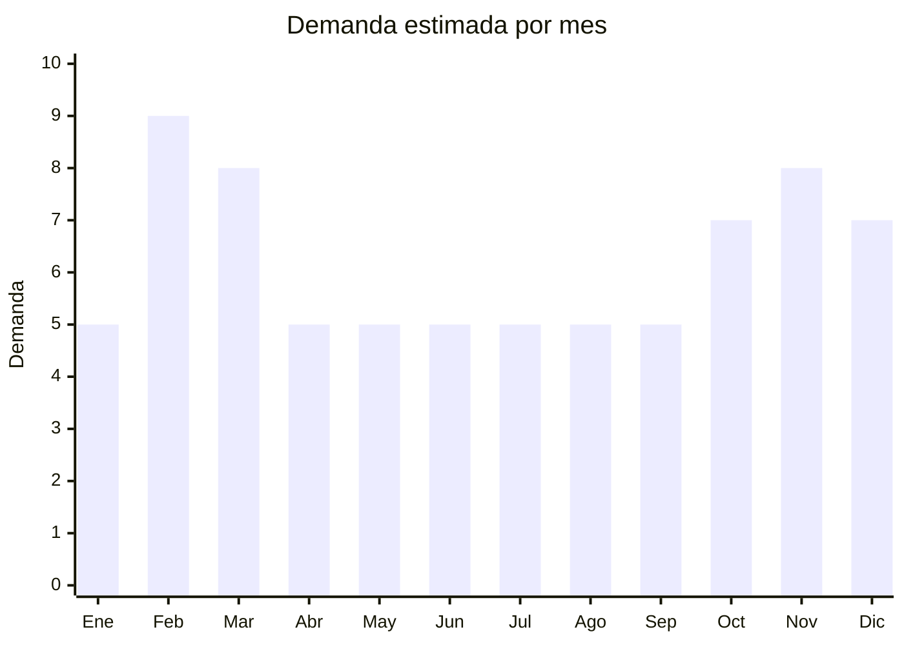

# Cuadernos, agendas y planners

> **Capítulo NCM 48** — Papel y cartón; manufacturas de pasta de celulosa | **Temporada:** Atemporal (con pico febrero-marzo y noviembre-diciembre)

## Qué es y por qué importarlo

Esta categoría incluye cuadernos tapa dura premium (A5, B5), bullet journals con páginas punteadas, planners/agendas anuales, cuadernos de dibujo y sketch, journals de gratitud y diarios personales. China (especialmente Wenzhou, Zhejiang) es un centro mundial de producción de artículos de papelería con FOB muy competitivo y capacidad de personalización.

La tendencia de productividad personal, bullet journaling y planificación impulsa demanda sostenida. Los cuadernos de tapa dura con diseño premium tienen alta percepción de valor.

## Datos clave

| Dato | Valor |
|------|-------|
| **Posiciones NCM típicas** | 4820.10.00 (cuadernos, blocs de notas) |
| **Derecho de importación** | 16% (DIE) + 3% tasa estadística |
| **Rango FOB típico** | USD 0.80 — USD 5.00 por unidad |
| **Precio de venta en Argentina** | ARS 5.000 — ARS 20.000 |
| **Margen bruto estimado** | 150% — 300% |
| **MOQ típico** | 200 — 1,000 unidades |
| **Demanda en MercadoLibre** | Media-Alta |
| **Competencia en MercadoLibre** | Media-Alta |
| **Dificultad para importar** | Fácil |
| **Certificaciones necesarias** | Ninguna |
| **Antidumping** | No |

## Demanda y mercado en Argentina

- **Volumen de mercado:** Demanda sostenida con picos en vuelta a clases (febrero-marzo) y fin de año (planners/agendas para el año siguiente).
- **Tendencia:** Estable-Creciente — bullet journaling, productividad personal y journaling son tendencias consolidadas.
- **Perfil del comprador:** Estudiantes (vuelta a clases), profesionales (planners), comunidad bullet journal, público general (regalos).
- **Canales principales:** MercadoLibre, librerías, bazares, regalerías.

<Note>
Los **bullet journals con páginas punteadas (dotted)** son el formato premium más buscado. Papel de 100-120g/m² (que no traspase tinta de marcadores) tiene mayor ticket. La personalización con grabado o impresión del nombre es un diferenciador.
</Note>

## Competencia

| Aspecto | Situación |
|---------|-----------|
| **Cantidad de vendedores en ML** | +300 vendedores activos |
| **Hay marcas dominantes** | Sí parcial — Mooving, Éxito, Ledesma dominan cuadernos escolares, pero nicho premium/bullet journal está más abierto |
| **Tipo de competidores** | Marcas establecidas (segmento escolar) + importadores (segmento premium) |
| **Rango de precios en ML** | ARS 3.000 — ARS 20.000 |
| **Posibilidad de diferenciarse** | Media-Alta (segmento premium/bullet journal) |

## Variantes y subtipos más comunes

| Subtipo / Variante | FOB aprox. | Venta AR aprox. | Nota |
|--------------------|-----------|-----------------|------|
| Bullet journal A5 punteado tapa dura | USD 1.50 — 4.00 | ARS 6.000 — 15.000 | **Tendencia fuerte** |
| Cuaderno tapa dura premium A5 | USD 1.00 — 3.00 | ARS 5.000 — 12.000 | Base |
| Planner/agenda anual tapa dura | USD 2.00 — 5.00 | ARS 8.000 — 20.000 | Pico nov-dic |
| Cuaderno de dibujo/sketch A4 | USD 1.00 — 3.00 | ARS 5.000 — 12.000 | Nicho artístico |
| Set cuaderno + bolígrafo (regalo) | USD 2.00 — 6.00 | ARS 8.000 — 18.000 | Formato regalo |

## Regulaciones y requisitos

<Tabs>
  <Tab title="Certificaciones">
    Sin certificaciones especiales. Si se comercializa como "cuaderno escolar", verificar si hay normas IRAM aplicables al papel escolar.
  </Tab>
  <Tab title="Etiquetado">
    Estándar: datos importador, país de origen, cantidad de hojas, tipo de papel si se especifica.
  </Tab>
  <Tab title="Restricciones">
    Sin restricciones especiales. **Nota:** Libros impresos tienen IVA 0% (Ley 25.446), pero cuadernos en blanco tributan IVA normal 21%.
  </Tab>
</Tabs>

## Logística

| Dato | Valor |
|------|-------|
| **Peso típico por unidad** | 0.25 — 0.60 kg |
| **Volumen típico** | Medio (se apilan bien) |
| **Fragilidad** | Baja (las tapas duras protegen) |
| **Envío recomendado** | Marítimo LCL |
| **Tiempo total estimado** | 50 — 80 días (marítimo) |

<Warning>
El papel es sensible a la humedad. Solicitar empaque con **film shrink individual** y desecante en las cajas para evitar ondulación del papel por condensación en contenedor marítimo.
</Warning>

## Estacionalidad



| Aspecto | Detalle |
|---------|---------|
| **Meses pico** | Febrero-Marzo (vuelta a clases), Octubre-Diciembre (planners/agendas año siguiente, regalos) |
| **Meses valle** | Abril-Septiembre — demanda base de bullet journals y cuadernos premium se mantiene |
| **Cuándo pedir** | Noviembre para stock en febrero (vuelta a clases); Agosto para stock en octubre (planners) |

## Ventajas y riesgos

<CardGroup cols={2}>
  <Card title="Ventajas" icon="circle-check">
    - Demanda sostenida todo el año
    - Personalizable (logo, diseño, nombre)
    - Producto regalo ideal
    - Nicho bullet journal en crecimiento
    - Se apila bien (logística eficiente)
  </Card>
  <Card title="Riesgos" icon="triangle-exclamation">
    - Competencia con marcas establecidas (Mooving, Éxito)
    - Sensible a humedad en transporte
    - Producto pesado para su valor (papel)
    - Calidad de papel variable entre proveedores
  </Card>
</CardGroup>

## Palabras clave para buscar en Alibaba

```
hardcover notebook wholesale, bullet journal dotted A5, custom notebook printing,
planner agenda wholesale, leather journal notebook, sketch book wholesale,
PU cover notebook custom logo, Wenzhou notebook factory
```

## Fuentes

- [MercadoLibre Argentina — Bullet journal punteado](https://listado.mercadolibre.com.ar/bullet-journal-punteado)
- [Alibaba — Hardcover notebook wholesale](https://www.alibaba.com/showroom/hardcover-notebook-wholesale.html)
