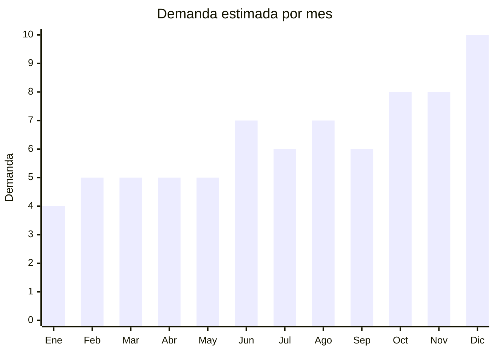

# Papel de regalo y packaging decorativo

> **Capítulo NCM 48** — Papel y cartón; manufacturas de pasta de celulosa | **Temporada:** Atemporal (con picos en fechas comerciales)

## Qué es y por qué importarlo

Esta categoría incluye bolsas de papel kraft con manija (tendencia packaging ecológico para comercios), papel de regalo en rollos y hojas, bolsas de regalo decorativas, tissue paper (papel de seda), y packaging premium (cajas regalo con ventana, sobres decorativos). La demanda es permanente por regalos todo el año, y las bolsas kraft tienen demanda adicional de comercios que reemplazan bolsas plásticas.

China ofrece FOB muy competitivo y personalización (impresión de logo propio) con MOQ accesibles. Wenzhou (Zhejiang) es uno de los principales centros de producción de papel y packaging.

## Datos clave

| Dato | Valor |
|------|-------|
| **Posiciones NCM típicas** | 4819.40.00 (sacos y bolsas de papel), 4817.30.00 (cajas de papel/cartón), 4811.49.00 (papel engomado decorativo) |
| **Derecho de importación** | 16% (DIE) + 3% tasa estadística |
| **Rango FOB típico** | USD 0.03 — USD 0.50 por unidad |
| **Precio de venta en Argentina** | ARS 500 — ARS 3.000 por unidad (o packs) |
| **Margen bruto estimado** | 150% — 350% |
| **MOQ típico** | 500 — 5,000 unidades |
| **Demanda en MercadoLibre** | Media-Alta |
| **Competencia en MercadoLibre** | Media |
| **Dificultad para importar** | Fácil |
| **Certificaciones necesarias** | Ninguna |
| **Antidumping** | No |

## Demanda y mercado en Argentina

- **Volumen de mercado:** Demanda permanente. Las bolsas kraft se venden todo el año a comercios (reemplazo de bolsas plásticas por ley).
- **Tendencia:** Creciente — tendencia eco-packaging impulsa bolsas kraft. Comercios de moda, cosmética y gastronomía prefieren packaging sustentable.
- **Perfil del comprador:** Comercios (B2B — bolsas kraft con logo), público general (regalos), organizadores de eventos.
- **Canales principales:** MercadoLibre, venta mayorista a comercios, papelerías, bazares.

## Variantes y subtipos más comunes

| Subtipo / Variante | FOB aprox. | Venta AR aprox. | Nota |
|--------------------|-----------|-----------------|------|
| Bolsas kraft lisas x100 (varios tamaños) | USD 0.03 — 0.15/u | ARS 200 — 800/u | **B2B — más vendido** |
| Bolsas kraft con manija torcida x50 | USD 0.05 — 0.20/u | ARS 400 — 1.200/u | Comercios |
| Papel de regalo rollo (70cm x 2m) | USD 0.10 — 0.30/u | ARS 500 — 2.000/u | Todo el año |
| Bolsas de regalo decorativas x10 | USD 0.15 — 0.40/u | ARS 600 — 2.000/u | Fechas especiales |
| Tissue paper / papel seda x50 hojas | USD 0.01 — 0.05/hoja | ARS 1.000 — 3.000/pack | Complementario |

## Regulaciones y requisitos

<Tabs>
  <Tab title="Certificaciones">
    Sin certificaciones especiales requeridas.
  </Tab>
  <Tab title="Etiquetado">
    Estándar: datos importador, país de origen. Si se vende como "reciclable" o "ecológico", debe poder demostrarse.
  </Tab>
  <Tab title="Restricciones">
    Sin restricciones especiales. Las bolsas kraft no están afectadas por restricciones de bolsas plásticas (al contrario, se benefician).
  </Tab>
</Tabs>

## Logística

| Dato | Valor |
|------|-------|
| **Peso típico por unidad** | 0.01 — 0.05 kg |
| **Volumen típico** | Medio (las bolsas se aplanan pero ocupan espacio) |
| **Fragilidad** | Baja (resistente si se embala seco) |
| **Envío recomendado** | Marítimo LCL |
| **Tiempo total estimado** | 50 — 80 días (marítimo) |

<Warning>
El papel es **sensible a la humedad**. En transporte marítimo puede haber condensación dentro del contenedor. Solicitar empaque con protección contra humedad (film, desecante) para evitar que las bolsas/papel se ondule o manche.
</Warning>

## Estacionalidad



| Aspecto | Detalle |
|---------|---------|
| **Meses pico** | Junio (Día del Padre), Agosto (Día del Amigo), Octubre (Día de la Madre), Noviembre-Diciembre (Navidad, regalos) |
| **Meses valle** | Enero-Febrero — demanda base de comercios se mantiene |

## Ventajas y riesgos

<CardGroup cols={2}>
  <Card title="Ventajas" icon="circle-check">
    - Demanda permanente
    - Tendencia eco-packaging creciente
    - Personalizable con logo propio
    - Sin regulaciones
    - Venta B2B a comercios (volumen)
  </Card>
  <Card title="Riesgos" icon="triangle-exclamation">
    - Sensible a humedad en transporte
    - Ticket promedio bajo
    - Competencia local (papeleras argentinas)
    - Relación volumen/valor puede ser desfavorable
  </Card>
</CardGroup>

## Palabras clave para buscar en Alibaba

```
kraft paper bag wholesale, gift bag paper handle, wrapping paper roll wholesale,
tissue paper wholesale, kraft bag with handle, custom paper bag logo,
gift packaging paper, eco paper bag
```

## Fuentes

- [MercadoLibre Argentina — Bolsas kraft](https://listado.mercadolibre.com.ar/bolsas-kraft)
- [Alibaba — Kraft paper bag wholesale](https://www.alibaba.com/showroom/kraft-paper-bag-wholesale.html)
