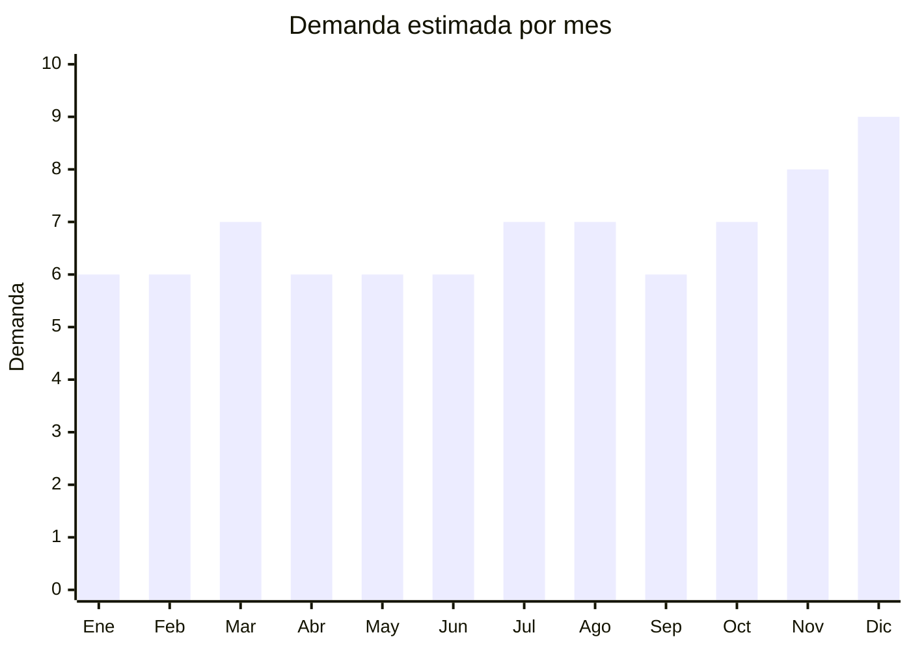

# Stickers, calcomanías y etiquetas decorativas

> **Capítulo NCM 48** — Papel y cartón; manufacturas de pasta de celulosa | **Temporada:** Atemporal

## Qué es y por qué importarlo

Los stickers decorativos incluyen packs temáticos de 50-100 calcomanías (anime, viajes, marcas, memes, animales, retro, aesthetic), stickers holográficos, calcomanías de vinilo resistentes al agua para notebooks/laptops, termos, maletas, skateboards y celulares. Es un producto de compra impulsiva con recompra frecuente.

El FOB es extremadamente bajo (USD 0.05-0.50 por pack de 50-100 stickers) y el margen supera el 400%. Yiwu (Zhejiang) es el centro mundial de producción de stickers decorativos. El producto es ultraliviano, ideal para envío aéreo incluso en pequeñas cantidades.

## Datos clave

| Dato | Valor |
|------|-------|
| **Posiciones NCM típicas** | 4821.10.00 (etiquetas impresas de papel/cartón), 4911.99.00 (impresos diversos) |
| **Derecho de importación** | 16% (DIE) + 3% tasa estadística |
| **Rango FOB típico** | USD 0.05 — USD 0.50 por pack de 50-100 stickers |
| **Precio de venta en Argentina** | ARS 2.000 — ARS 8.000 por pack |
| **Margen bruto estimado** | 400% — 800% |
| **MOQ típico** | 100 — 500 packs |
| **Demanda en MercadoLibre** | Alta |
| **Competencia en MercadoLibre** | Media |
| **Dificultad para importar** | Muy fácil |
| **Certificaciones necesarias** | Ninguna |
| **Antidumping** | No |

## Demanda y mercado en Argentina

- **Volumen de mercado:** Miles de resultados en MercadoLibre. Producto de compra impulsiva con alto volumen.
- **Tendencia:** Estable-Creciente — cultura de personalización de objetos (laptops, termos Stanley, botellas, celulares) impulsa demanda constante.
- **Perfil del comprador:** Jóvenes 15-35 años, comunidad anime/gaming, bullet journaling, estudiantes, público general que personaliza objetos.
- **Canales principales:** MercadoLibre, Instagram, ferias, kioscos, librerías.

<Note>
Los **packs temáticos** son el formato estrella: anime (Naruto, Dragon Ball, One Piece), viajes, marcas vintage, memes, aesthetic, naturaleza. Los stickers **waterproof/vinilo** tienen mayor ticket que los de papel común.
</Note>

## Competencia

| Aspecto | Situación |
|---------|-----------|
| **Cantidad de vendedores en ML** | +200 vendedores activos |
| **Hay marcas dominantes** | No — mercado atomizado |
| **Tipo de competidores** | Importadores directos, revendedores |
| **Rango de precios en ML** | ARS 1.500 — ARS 8.000 por pack |
| **Posibilidad de diferenciarse** | Media-Alta |

**Cómo diferenciarse:**
- Packs temáticos exclusivos (nichos: K-pop, cottagecore, dark academia)
- Stickers holográficos premium
- Stickers vinilo waterproof (mayor durabilidad)
- Combos temáticos (pack anime + pack gaming)

## Variantes y subtipos más comunes

| Subtipo / Variante | FOB aprox. | Venta AR aprox. | Nota |
|--------------------|-----------|-----------------|------|
| Pack x50 stickers temáticos papel | USD 0.05 — 0.15 | ARS 1.500 — 3.000 | **Más vendido** |
| Pack x100 stickers vinilo waterproof | USD 0.15 — 0.50 | ARS 3.000 — 8.000 | Premium |
| Stickers holográficos x50 | USD 0.10 — 0.30 | ARS 2.500 — 6.000 | Tendencia |
| Pack stickers grandes (laptop) x20 | USD 0.10 — 0.25 | ARS 2.000 — 5.000 | Para laptops |
| Stickers 3D relieve x10-20 | USD 0.15 — 0.40 | ARS 2.000 — 5.000 | Infantil/coleccionable |

## Regulaciones y requisitos

<Tabs>
  <Tab title="Certificaciones">
    Sin certificaciones especiales. Producto de importación libre.
  </Tab>
  <Tab title="Etiquetado">
    Estándar mínimo: datos importador, país de origen.
  </Tab>
  <Tab title="Restricciones">
    **Atención propiedad intelectual:** Stickers con logos de marcas registradas (Nike, Apple, etc.) o personajes con licencia (Disney, Marvel) pueden generar problemas legales por falsificación. Preferir diseños genéricos o con licencia.
  </Tab>
</Tabs>

## Logística

| Dato | Valor |
|------|-------|
| **Peso típico por pack** | 0.02 — 0.10 kg |
| **Volumen típico** | Muy bajo (planos, se apilan) |
| **Fragilidad** | Nula |
| **Envío recomendado** | Aéreo/Courier (producto ultraliviano) |
| **Tiempo total estimado** | 15 — 25 días (aéreo) / 45 — 70 días (marítimo) |

<Tip>
Por su peso mínimo, los stickers son **ideales para envío aéreo** incluso en lotes grandes. Un paquete de 500 packs pesa apenas 10-15 kg. Esto permite reposición rápida y test de mercado con bajo riesgo.
</Tip>

## Estacionalidad



| Aspecto | Detalle |
|---------|---------|
| **Meses pico** | Noviembre-Diciembre (regalos, CyberMonday), Marzo (vuelta a clases), Julio (vacaciones invierno — regalos) |
| **Meses valle** | Demanda base estable todo el año |

## Ventajas y riesgos

<CardGroup cols={2}>
  <Card title="Ventajas" icon="circle-check">
    - FOB extremadamente bajo
    - Margen excepcional (400-800%)
    - Ultraliviano (flete mínimo)
    - Sin regulaciones
    - Producto de recompra frecuente
    - Ideal para test de mercado
  </Card>
  <Card title="Riesgos" icon="triangle-exclamation">
    - Riesgo de propiedad intelectual con marcas/personajes
    - Calidad de impresión variable
    - Competencia de precio alta
    - Producto de bajo ticket unitario
  </Card>
</CardGroup>

## Palabras clave para buscar en Alibaba

```
sticker pack wholesale, waterproof vinyl stickers, anime sticker pack,
holographic stickers wholesale, laptop sticker set, decorative sticker lot,
aesthetic sticker pack, custom sticker printing
```

## Fuentes

- [MercadoLibre Argentina — Stickers decorativos](https://listado.mercadolibre.com.ar/stickers-decorativos)
- [Alibaba — Sticker pack wholesale](https://www.alibaba.com/showroom/sticker-pack-wholesale.html)
