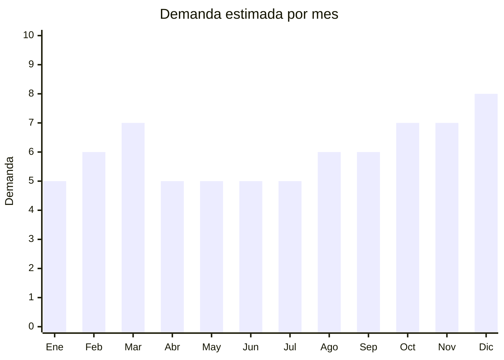

# Washi tape y cinta adhesiva decorativa

> **Capítulo NCM 48** — Papel y cartón; manufacturas de pasta de celulosa | **Temporada:** Atemporal

## Qué es y por qué importarlo

El washi tape es una cinta adhesiva decorativa de papel de arroz (originaria de Japón) con diseños impresos. Se usa para bullet journaling, scrapbooking, decoración de regalos, manualidades y personalización de objetos. Se vende en rollos individuales o sets de 5-20 rollos con diseños coordinados.

China (especialmente Yiwu y Wenzhou) produce la gran mayoría del washi tape del mercado mundial a precios FOB mínimos. El producto tiene una comunidad nicho muy fiel con alta tasa de recompra.

## Datos clave

| Dato | Valor |
|------|-------|
| **Posiciones NCM típicas** | 4811.41.00 (papel autoadhesivo), 3919.90.00 (cintas adhesivas de plástico impresas) |
| **Derecho de importación** | 14-16% (DIE) + 3% tasa estadística |
| **Rango FOB típico** | USD 0.05 — USD 0.30 por rollo |
| **Precio de venta en Argentina** | ARS 800 — ARS 3.000 por rollo / ARS 3.000 — ARS 12.000 por set |
| **Margen bruto estimado** | 300% — 600% |
| **MOQ típico** | 100 — 500 sets |
| **Demanda en MercadoLibre** | Media (nicho fiel) |
| **Competencia en MercadoLibre** | Baja-Media |
| **Dificultad para importar** | Muy fácil |
| **Certificaciones necesarias** | Ninguna |
| **Antidumping** | No |

## Demanda y mercado en Argentina

- **Volumen de mercado:** Nicho estable con comunidad fiel. No es masivo pero tiene alta recompra.
- **Tendencia:** Estable — comunidad bullet journal y scrapbooking consolidada. TikTok/Instagram impulsa nuevos adeptos constantemente.
- **Perfil del comprador:** Comunidad bullet journal, scrapbookers, manualistas, docentes (decoración de cuadernos/aulas), público joven.
- **Canales principales:** MercadoLibre, Instagram, tiendas de papelería creativa, ferias de manualidades.

## Variantes y subtipos más comunes

| Subtipo / Variante | FOB aprox. | Venta AR aprox. | Nota |
|--------------------|-----------|-----------------|------|
| Set x10 rollos washi tape diseños surtidos | USD 0.50 — 1.50 | ARS 3.000 — 8.000 | **Más vendido** |
| Set x20 rollos washi tape temático | USD 1.00 — 3.00 | ARS 5.000 — 12.000 | Premium |
| Washi tape ancho (3-5cm) decorativo | USD 0.10 — 0.30/rollo | ARS 1.000 — 3.000/rollo | Decoración |
| Washi tape foil dorado/plateado | USD 0.15 — 0.40/rollo | ARS 1.200 — 3.500/rollo | Elegante |
| Cinta adhesiva transparente con diseño | USD 0.08 — 0.25/rollo | ARS 800 — 2.500/rollo | Uso general |

## Regulaciones y requisitos

<Tabs>
  <Tab title="Certificaciones">
    Sin certificaciones especiales requeridas.
  </Tab>
  <Tab title="Etiquetado">
    Estándar mínimo: datos importador, país de origen.
  </Tab>
  <Tab title="Restricciones">
    Sin restricciones. Producto de importación libre.
  </Tab>
</Tabs>

## Logística

| Dato | Valor |
|------|-------|
| **Peso típico por set (x10)** | 0.05 — 0.15 kg |
| **Volumen típico** | Muy bajo |
| **Fragilidad** | Baja |
| **Envío recomendado** | Aéreo/Courier (ultraliviano) |
| **Tiempo total estimado** | 15 — 25 días (aéreo) / 45 — 70 días (marítimo) |

<Tip>
Al igual que los stickers, el washi tape es **ultraliviano** y ideal para envío aéreo. Un pedido de 200 sets de 10 rollos pesa apenas 10-20 kg. Perfecto para test de mercado sin gran inversión en flete.
</Tip>

## Estacionalidad



| Aspecto | Detalle |
|---------|---------|
| **Meses pico** | Marzo (vuelta a clases), Octubre-Diciembre (regalos, proyectos de fin de año) |
| **Meses valle** | Demanda base estable todo el año por comunidad nicho |

## Ventajas y riesgos

<CardGroup cols={2}>
  <Card title="Ventajas" icon="circle-check">
    - FOB mínimo, margen excepcional
    - Ultraliviano (flete mínimo)
    - Comunidad fiel con alta recompra
    - Sin regulaciones
    - Complementa cuadernos y stickers
    - Personalizable con diseños propios
  </Card>
  <Card title="Riesgos" icon="triangle-exclamation">
    - Mercado nicho (no masivo)
    - Ticket promedio bajo
    - Adhesivo puede perder calidad con calor
    - Competencia de precio con vendedores de Yiwu
  </Card>
</CardGroup>

## Palabras clave para buscar en Alibaba

```
washi tape wholesale, decorative tape set, washi tape bulk, masking tape decorative,
scrapbook tape wholesale, foil washi tape, custom washi tape printing,
bullet journal tape set
```

## Fuentes

- [MercadoLibre Argentina — Washi tape](https://listado.mercadolibre.com.ar/washi-tape)
- [Alibaba — Washi tape wholesale](https://www.alibaba.com/showroom/washi-tape-wholesale.html)
