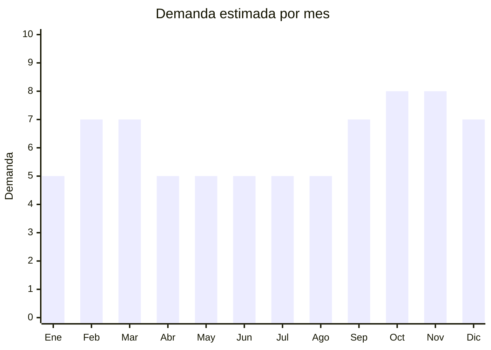

# Calendarios, planificadores y pósters educativos

> **Capítulo NCM 49** — Productos editoriales, de la prensa e industrias gráficas | **Temporada:** Atemporal (planificadores/pósters) + Estacional (calendarios anuales)

## Qué es y por qué importarlo

Esta categoría combina tres productos relacionados: (1) calendarios magnéticos y de pared, (2) planificadores semanales/mensuales borrables (pizarra magnética o plastificada) y (3) pósters educativos para niños (abecedario, mapa, sistema solar, tabla periódica, cuerpo humano). Los planificadores borrables y pósters educativos tienen demanda atemporal, mientras que los calendarios anuales son estacionales.

China ofrece producción a gran escala con FOB bajo y capacidad de personalización (idioma, diseño, contenido educativo en español).

## Datos clave

| Dato | Valor |
|------|-------|
| **Posiciones NCM típicas** | 4910.00.00 (calendarios impresos), 4911.10.00 (impresos publicitarios/comerciales), 4911.99.00 (otros impresos) |
| **Derecho de importación** | 0-16% (DIE) + 3% tasa estadística |
| **Rango FOB típico** | USD 0.30 — USD 3.00 por unidad |
| **Precio de venta en Argentina** | ARS 3.000 — ARS 15.000 |
| **Margen bruto estimado** | 200% — 400% |
| **MOQ típico** | 100 — 500 unidades |
| **Demanda en MercadoLibre** | Media |
| **Competencia en MercadoLibre** | Baja-Media |
| **Dificultad para importar** | Fácil |
| **Certificaciones necesarias** | Ninguna |
| **Antidumping** | No |

## Demanda y mercado en Argentina

- **Volumen de mercado:** Nicho con demanda segmentada: planificadores para oficinas/hogares, pósters educativos para escuelas/hogares con niños.
- **Tendencia:** Estable — los planificadores borrables magnéticos ganaron tracción post-pandemia con home office.
- **Perfil del comprador:** Profesionales (planificadores), padres/docentes (pósters educativos), oficinas (calendarios de pared).
- **Canales principales:** MercadoLibre, librerías, tiendas educativas, bazares.

<Note>
Los **planificadores magnéticos borrables** (para heladera o pared metálica) son el producto estrella del segmento atemporal. Los **pósters educativos** tienen demanda constante y se renuevan con cada ciclo escolar. Los calendarios anuales son estacionales (sept-dic).
</Note>

## Variantes y subtipos más comunes

| Subtipo / Variante | FOB aprox. | Venta AR aprox. | Nota |
|--------------------|-----------|-----------------|------|
| Planificador magnético borrable semanal | USD 1.00 — 3.00 | ARS 4.000 — 12.000 | **Atemporal estrella** |
| Planificador mensual borrable A3 | USD 1.00 — 2.50 | ARS 3.500 — 10.000 | Oficina/hogar |
| Póster educativo infantil (50x70cm) | USD 0.30 — 1.00 | ARS 2.000 — 6.000 | Abecedario, mapas |
| Set x5 pósters educativos | USD 1.50 — 4.00 | ARS 5.000 — 15.000 | Pack escolar |
| Calendario magnético anual | USD 0.50 — 2.00 | ARS 3.000 — 8.000 | Estacional (sept-dic) |

## Regulaciones y requisitos

<Tabs>
  <Tab title="Certificaciones">
    Sin certificaciones especiales. Los pósters educativos para niños no requieren certificación de juguetes (no son juguetes).
  </Tab>
  <Tab title="Etiquetado">
    Estándar: datos importador, país de origen. **Importante:** Todo el contenido debe estar en español (especialmente pósters educativos y planificadores).
  </Tab>
  <Tab title="Restricciones">
    Sin restricciones especiales. Verificar que el contenido educativo sea correcto y adaptado a Argentina (ej: mapas con Malvinas argentinas).
  </Tab>
</Tabs>

## Logística

| Dato | Valor |
|------|-------|
| **Peso típico por unidad** | 0.10 — 0.50 kg |
| **Volumen típico** | Bajo (planos, se apilan) |
| **Fragilidad** | Baja (planificadores magnéticos son flexibles) |
| **Envío recomendado** | Marítimo LCL |
| **Tiempo total estimado** | 50 — 80 días (marítimo) |

<Warning>
**Contenido en español obligatorio.** Los planificadores y pósters deben tener los días de la semana, meses y contenido educativo en español. Solicitar al proveedor chino la personalización del idioma antes de producir. La mayoría de fábricas pueden imprimir en español con archivo de diseño provisto por el comprador.
</Warning>

## Estacionalidad



| Aspecto | Detalle |
|---------|---------|
| **Meses pico** | Febrero-Marzo (vuelta a clases — pósters educativos), Septiembre-Noviembre (calendarios año siguiente, renovación planificadores) |
| **Meses valle** | Abril-Agosto — demanda base de planificadores borrables se mantiene |

## Ventajas y riesgos

<CardGroup cols={2}>
  <Card title="Ventajas" icon="circle-check">
    - Producto liviano y plano
    - Planificadores borrables: compra recurrente (marcadores)
    - Pósters educativos: demanda perenne
    - Personalizable en español
    - Sin regulaciones
  </Card>
  <Card title="Riesgos" icon="triangle-exclamation">
    - Calendarios anuales: producto perecedero (no sirven al año siguiente)
    - Requiere contenido adaptado a Argentina
    - Errores de traducción = producto invendible
    - Mercado relativamente pequeño
  </Card>
</CardGroup>

## Palabras clave para buscar en Alibaba

```
magnetic planner whiteboard, weekly planner magnetic, dry erase calendar board,
educational poster kids, wall calendar printing, magnetic whiteboard planner,
kids learning poster set, custom calendar printing
```

## Fuentes

- [MercadoLibre Argentina — Planificador magnético](https://listado.mercadolibre.com.ar/planificador-magnetico)
- [Alibaba — Magnetic planner board](https://www.alibaba.com/showroom/magnetic-planner-board.html)
