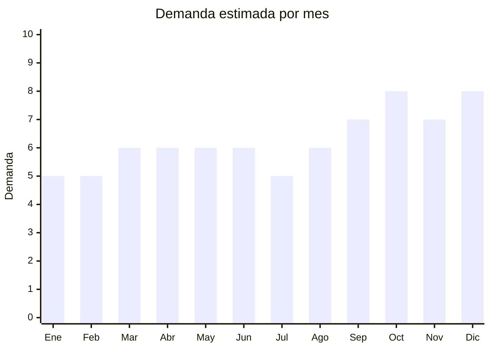

# Láminas, pósters y cuadros decorativos

> **Capítulo NCM 49** — Productos editoriales, de la prensa e industrias gráficas | **Temporada:** Atemporal

## Qué es y por qué importarlo

Esta categoría incluye láminas decorativas (art prints) sobre papel premium, pósters enmarcados, cuadros canvas (tela tensada sobre bastidor) y sets de láminas coordinadas para armar "gallery walls". China tiene imprentas de gran formato altamente competitivas con capacidad de producir sobre lienzo, papel fotográfico y papel artístico.

La tendencia "gallery wall" (pared de cuadros coordinados) explotó en Pinterest e Instagram y se consolidó como estándar de decoración moderna. Los sets de 3-4 láminas coordinadas en estilos abstracto, botánico y minimalista son los más vendidos.

## Datos clave

| Dato | Valor |
|------|-------|
| **Posiciones NCM típicas** | 4911.91.00 (estampas, grabados, fotografías), 4911.99.00 (otros impresos) |
| **Derecho de importación** | 0-16% (DIE) + 3% tasa estadística |
| **Rango FOB típico** | USD 0.50 — USD 5.00 por unidad |
| **Precio de venta en Argentina** | ARS 3.000 — ARS 20.000 |
| **Margen bruto estimado** | 200% — 400% |
| **MOQ típico** | 50 — 300 unidades |
| **Demanda en MercadoLibre** | Media-Alta |
| **Competencia en MercadoLibre** | Media |
| **Dificultad para importar** | Fácil |
| **Certificaciones necesarias** | Ninguna |
| **Antidumping** | No |

## Demanda y mercado en Argentina

- **Volumen de mercado:** Demanda sostenida, impulsada por renovación de decoración y mudanzas.
- **Tendencia:** Creciente — gallery wall, arte abstracto, estilo nórdico/escandinavo, botánico.
- **Perfil del comprador:** Personas 25-45 años, decoradores, nuevos hogares (mudanzas), compradores de regalos.
- **Canales principales:** MercadoLibre, Instagram, Etsy Argentina, tiendas deco, ferias.

<Note>
Los **sets de 3-4 láminas coordinadas** son el formato estrella. Estilos más demandados: abstracto (manchas, líneas), botánico (hojas tropicales, eucalipto), minimalista (line art), nórdico, frases motivacionales. El marco NO suele importarse (se agrega localmente).
</Note>

## Competencia

| Aspecto | Situación |
|---------|-----------|
| **Cantidad de vendedores en ML** | +200 vendedores activos |
| **Hay marcas dominantes** | No — mercado fragmentado con emprendedores |
| **Tipo de competidores** | Diseñadores locales + importadores |
| **Rango de precios en ML** | ARS 2.000 — ARS 20.000 |
| **Posibilidad de diferenciarse** | Alta (diseños exclusivos) |

## Variantes y subtipos más comunes

| Subtipo / Variante | FOB aprox. | Venta AR aprox. | Nota |
|--------------------|-----------|-----------------|------|
| Set x3 láminas papel premium (30x40cm) | USD 1.50 — 4.00 | ARS 5.000 — 15.000 | **Más vendido** |
| Canvas/lienzo tensado en bastidor | USD 2.00 — 8.00 | ARS 8.000 — 25.000 | Premium |
| Póster individual gran formato (50x70cm) | USD 0.50 — 2.00 | ARS 3.000 — 8.000 | Decorativo |
| Láminas enmarcadas (con marco) | USD 3.00 — 10.00 | ARS 10.000 — 30.000 | Listo para colgar |
| Set x4 láminas mini (20x25cm) | USD 1.00 — 3.00 | ARS 4.000 — 12.000 | Gallery wall |

## Regulaciones y requisitos

<Tabs>
  <Tab title="Certificaciones">
    Sin certificaciones especiales. Los impresos decorativos son de importación libre.
  </Tab>
  <Tab title="Etiquetado">
    Estándar mínimo: datos importador, país de origen.
  </Tab>
  <Tab title="Restricciones">
    **Propiedad intelectual:** No importar reproducciones de obras de artistas sin licencia. Usar diseños propios, con licencia o de dominio público.
  </Tab>
</Tabs>

## Logística

| Dato | Valor |
|------|-------|
| **Peso típico por unidad** | 0.10 — 1.00 kg (lámina vs canvas) |
| **Volumen típico** | Medio (planos se enrollan; canvas es voluminoso) |
| **Fragilidad** | Media (canvas con bastidor puede dañarse) |
| **Envío recomendado** | Marítimo LCL; láminas planas se envían mejor que canvas |
| **Tiempo total estimado** | 50 — 80 días (marítimo) |

<Tip>
Importar **láminas planas sin marco** es mucho más eficiente logísticamente que canvas enmarcado. Las láminas se apilan en tubos o cajas planas. El enmarcado se puede hacer localmente, lo que además permite ofrecer opciones de marco al cliente.
</Tip>

## Estacionalidad



| Aspecto | Detalle |
|---------|---------|
| **Meses pico** | Septiembre-Octubre (primavera, renovación deco), Octubre (Día de la Madre), Noviembre-Diciembre (regalos, mudanzas) |
| **Meses valle** | Enero-Febrero — demanda base estable |

## Ventajas y riesgos

<CardGroup cols={2}>
  <Card title="Ventajas" icon="circle-check">
    - Alto valor percibido vs FOB bajo
    - Tendencia gallery wall consolidada
    - Personalizable (diseños propios)
    - Láminas planas: logística eficiente
    - Producto regalo atractivo
  </Card>
  <Card title="Riesgos" icon="triangle-exclamation">
    - Canvas con bastidor es voluminoso/frágil
    - Calidad de impresión variable
    - Competencia con diseñadores locales
    - Riesgo de propiedad intelectual
  </Card>
</CardGroup>

## Palabras clave para buscar en Alibaba

```
canvas wall art wholesale, art print poster decoration, abstract wall art set,
botanical print set, gallery wall art, minimalist poster print,
custom canvas printing, Nordic style wall art
```

## Fuentes

- [MercadoLibre Argentina — Láminas decorativas](https://listado.mercadolibre.com.ar/laminas-decorativas)
- [Alibaba — Wall art canvas wholesale](https://www.alibaba.com/showroom/wall-art-canvas-wholesale.html)
