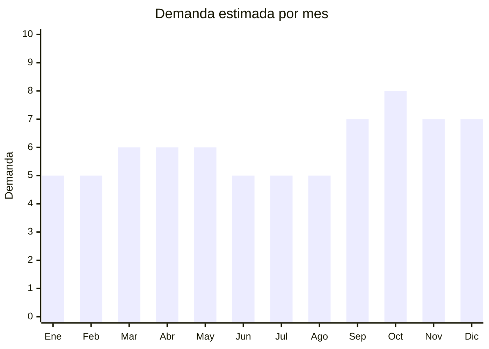

# Vinilos decorativos de pared

> **Capítulo NCM 49** — Productos editoriales, de la prensa e industrias gráficas | **Temporada:** Atemporal

## Qué es y por qué importarlo

Los vinilos decorativos de pared son adhesivos de PVC/vinilo con diseños impresos o troquelados que se aplican sobre paredes, muebles, vidrios y superficies lisas. Incluyen frases motivacionales, paisajes, diseños infantiles (árbol, animales), geométricos, florales y simulación de materiales (ladrillo, madera). Tamaños desde 50cm hasta 2 metros.

China es el mayor productor mundial con FOB extremadamente bajo (USD 0.30-2.00 por unidad). El producto es ultraliviano, plano (se enrolla) y no tiene regulaciones, lo que lo hace ideal para importar.

## Datos clave

| Dato | Valor |
|------|-------|
| **Posiciones NCM típicas** | 3919.90.00 (placas/láminas/tiras autoadhesivas de plástico) o 4911.91.00 (estampas) |
| **Derecho de importación** | 14-16% (DIE) + 3% tasa estadística |
| **Rango FOB típico** | USD 0.30 — USD 2.00 por unidad |
| **Precio de venta en Argentina** | ARS 3.000 — ARS 15.000 |
| **Margen bruto estimado** | 200% — 500% |
| **MOQ típico** | 50 — 300 unidades |
| **Demanda en MercadoLibre** | Media-Alta |
| **Competencia en MercadoLibre** | Media |
| **Dificultad para importar** | Muy fácil |
| **Certificaciones necesarias** | Ninguna |
| **Antidumping** | No |

## Demanda y mercado en Argentina

- **Volumen de mercado:** Demanda constante. Decoración de bajo costo accesible para inquilinos (se remueve sin dañar pared).
- **Tendencia:** Estable — producto consolidado que se renueva con diseños de moda.
- **Perfil del comprador:** Familias (habitaciones infantiles), jóvenes/inquilinos, emprendedores (decoración de locales), oficinas.
- **Canales principales:** MercadoLibre, Instagram, tiendas deco, bazares.

## Competencia

| Aspecto | Situación |
|---------|-----------|
| **Cantidad de vendedores en ML** | +150 vendedores activos |
| **Hay marcas dominantes** | No — mercado fragmentado |
| **Tipo de competidores** | Importadores directos, ploteos locales |
| **Rango de precios en ML** | ARS 2.000 — ARS 15.000 |
| **Posibilidad de diferenciarse** | Media |

**Cómo diferenciarse:**
- Diseños exclusivos/propios
- Vinilos grande formato (mural completo)
- Vinilos 3D con relieve óptico
- Vinilos glow-in-the-dark (brillan en la oscuridad — infantil)

## Variantes y subtipos más comunes

| Subtipo / Variante | FOB aprox. | Venta AR aprox. | Nota |
|--------------------|-----------|-----------------|------|
| Vinilo frase decorativa (60-90cm) | USD 0.30 — 1.00 | ARS 3.000 — 8.000 | **Más vendido** |
| Vinilo infantil (árbol, animales) | USD 0.50 — 1.50 | ARS 4.000 — 12.000 | Habitaciones niños |
| Vinilo paisaje/mural grande (150-200cm) | USD 1.00 — 3.00 | ARS 6.000 — 18.000 | Impacto visual |
| Vinilo geométrico/abstracto | USD 0.30 — 1.00 | ARS 3.000 — 8.000 | Moderno |
| Vinilo 3D efecto ladrillo/madera | USD 0.50 — 2.00 | ARS 4.000 — 15.000 | Simulación materiales |

## Regulaciones y requisitos

<Tabs>
  <Tab title="Certificaciones">
    Sin certificaciones especiales requeridas.
  </Tab>
  <Tab title="Etiquetado">
    Estándar: datos importador, país de origen, instrucciones de aplicación (recomendado incluir en empaque).
  </Tab>
  <Tab title="Restricciones">
    Sin restricciones. Si el vinilo se promociona como "no tóxico" para habitaciones infantiles, debe poder demostrarse.
  </Tab>
</Tabs>

## Logística

| Dato | Valor |
|------|-------|
| **Peso típico por unidad** | 0.05 — 0.30 kg |
| **Volumen típico** | Muy bajo (se enrolla o pliega plano) |
| **Fragilidad** | Baja |
| **Envío recomendado** | Aéreo/Courier para lotes chicos; Marítimo LCL para volumen |
| **Tiempo total estimado** | 15 — 25 días (aéreo) / 45 — 70 días (marítimo) |

## Estacionalidad



| Aspecto | Detalle |
|---------|---------|
| **Meses pico** | Septiembre-Octubre (primavera, renovación deco), Noviembre (CyberMonday) |
| **Meses valle** | Junio-Agosto (invierno — menos remodelaciones) |

## Ventajas y riesgos

<CardGroup cols={2}>
  <Card title="Ventajas" icon="circle-check">
    - FOB muy bajo, margen excelente
    - Ultraliviano y plano
    - Sin regulaciones
    - Demanda constante (decoración accesible)
    - Ideal para inquilinos (removible)
  </Card>
  <Card title="Riesgos" icon="triangle-exclamation">
    - Adhesivo de baja calidad no pega bien
    - Diseños genéricos muy copiados
    - Competencia con ploteo/corte local
    - Algunos diseños pasan de moda rápido
  </Card>
</CardGroup>

## Palabras clave para buscar en Alibaba

```
wall sticker wholesale, vinyl wall decal, 3D wall sticker, kids room wall sticker,
quote wall decal, tree wall sticker nursery, PVC wall decoration,
removable wall sticker, glow in dark wall sticker
```

## Fuentes

- [MercadoLibre Argentina — Vinilos decorativos](https://listado.mercadolibre.com.ar/vinilos-decorativos-pared)
- [Alibaba — Wall sticker wholesale](https://www.alibaba.com/showroom/wall-sticker-wholesale.html)
