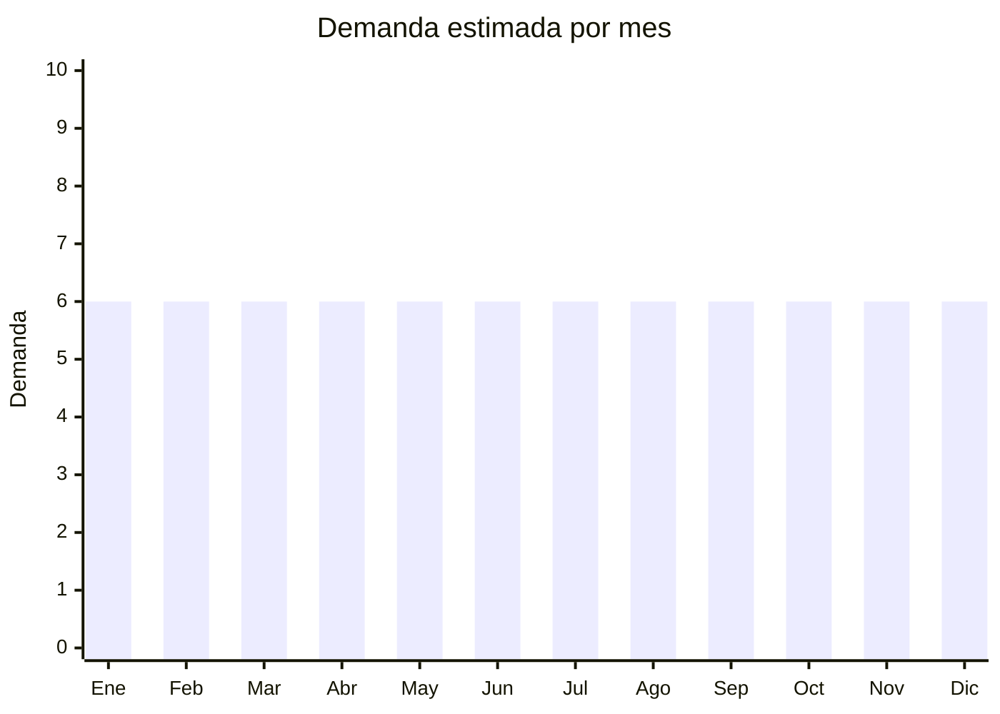

# Cuerdas, sogas y cordeles

> **Capítulo NCM 56** — Guata, fieltro y telas sin tejer; hilados especiales; cordeles y cuerdas | **Temporada:** Atemporal

## Qué es y por qué importarlo

Esta categoría incluye sogas de polipropileno, nylon y algodón para múltiples usos: hogar (tender ropa, sujeción), fitness (battle ropes, cuerdas de saltar), camping, jardinería, náutica y decoración (macramé). Se venden por metros o en rollos. China ofrece precios FOB competitivos. Las battle ropes para fitness y las cuerdas decorativas de macramé son nichos premium.

## Datos clave

| Dato | Valor |
|------|-------|
| **Posiciones NCM típicas** | 5607.49.00 (cordeles de polietileno/polipropileno), 5607.50.00 (de otras fibras sintéticas) |
| **Derecho de importación** | 18% (DIE) + 3% tasa estadística |
| **Rango FOB típico** | USD 0.05 — USD 0.50 por metro |
| **Precio de venta en Argentina** | ARS 500 — ARS 5.000 por rollo (según tipo) |
| **Margen bruto estimado** | 150% — 300% |
| **MOQ típico** | 500 — 2,000 metros |
| **Demanda en MercadoLibre** | Alta (27,300+ resultados) |
| **Competencia en MercadoLibre** | Media |
| **Dificultad para importar** | Fácil |
| **Certificaciones necesarias** | Ninguna especial |
| **Antidumping** | No |

## Variantes y subtipos más comunes

| Subtipo / Variante | FOB aprox. | Venta AR aprox. | Nota |
|--------------------|-----------|-----------------|------|
| Soga polipropileno rollo x100m | USD 5.00 — 15.00 | ARS 5.000 — 15.000 | Uso general |
| Battle rope 9-15m (fitness) | USD 8.00 — 25.00 | ARS 20.000 — 50.000 | **Nicho premium** |
| Cuerda de saltar (fitness) | USD 0.50 — 3.00 | ARS 3.000 — 10.000 | Fitness |
| Hilo de algodón macramé rollo | USD 2.00 — 8.00 | ARS 5.000 — 15.000 | Decoración/craft |
| Cuerda de tender ropa x20m | USD 0.50 — 1.50 | ARS 1.000 — 3.000 | Hogar básico |

## Regulaciones y requisitos

<Tabs>
  <Tab title="Certificaciones">
    Sin certificaciones especiales para uso doméstico. Sogas para uso profesional (escalada, carga) requieren certificación de resistencia.
  </Tab>
  <Tab title="Etiquetado">
    Material, largo, resistencia (si aplica), país de origen, datos importador.
  </Tab>
  <Tab title="Restricciones">
    Sin restricciones para uso doméstico/deportivo.
  </Tab>
</Tabs>

## Logística

| Dato | Valor |
|------|-------|
| **Peso típico por rollo** | 0.50 — 5.00 kg (según grosor y largo) |
| **Volumen típico** | Medio (rollos se apilan) |
| **Fragilidad** | Nula |
| **Envío recomendado** | Marítimo LCL |
| **Tiempo total estimado** | 50 — 80 días (marítimo) |

## Estacionalidad



| Aspecto | Detalle |
|---------|---------|
| **Meses pico** | Demanda completamente estable todo el año |
| **Meses valle** | No hay estacionalidad marcada |

## Ventajas y riesgos

<CardGroup cols={2}>
  <Card title="Ventajas" icon="circle-check">
    - Demanda permanente multiuso
    - Battle ropes: nicho fitness premium
    - Macramé: nicho decoración premium
    - Sin regulaciones
  </Card>
  <Card title="Riesgos" icon="triangle-exclamation">
    - Producto pesado para su valor (excepto fitness)
    - Mercado fragmentado
    - Competencia con fabricantes locales
    - Bajo margen en sogas básicas
  </Card>
</CardGroup>

## Palabras clave para buscar en Alibaba

```
polypropylene rope wholesale, battle rope gym, nylon rope bulk,
cotton macrame cord, jump rope fitness, rope roll wholesale
```

## Fuentes

- [MercadoLibre Argentina — Sogas cuerdas](https://listado.mercadolibre.com.ar/soga-cuerda)
- [Alibaba — Rope wholesale](https://www.alibaba.com/showroom/rope-wholesale.html)
