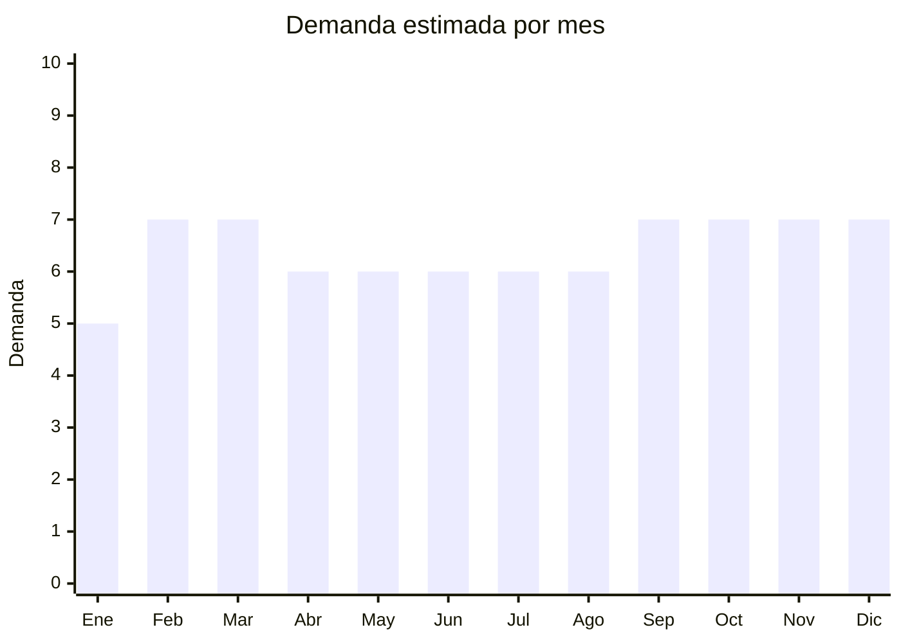

# Fieltro para manualidades

> **Capítulo NCM 56** — Guata, fieltro y telas sin tejer | **Temporada:** Atemporal

## Qué es y por qué importarlo

El fieltro para manualidades (panolenci) incluye hojas de fieltro en colores surtidos (packs de 10-42 hojas), fieltro en rollos para cortar, fieltro rígido para figuras troqueladas y kits de needle felting. Se usa en educación, cotillón, manualidades, decoración escolar y artesanías. China produce fieltro a costos muy competitivos.

## Datos clave

| Dato | Valor |
|------|-------|
| **Posiciones NCM típicas** | 5602.10.00 (fieltro punzonado), 5602.90.00 (demás fieltros) |
| **Derecho de importación** | 18% (DIE) + 3% tasa estadística |
| **Rango FOB típico** | USD 0.03 — USD 0.20 por hoja |
| **Precio de venta en Argentina** | ARS 2.000 — ARS 8.000 por pack |
| **Margen bruto estimado** | 200% — 400% |
| **MOQ típico** | 100 — 500 packs |
| **Demanda en MercadoLibre** | Alta (33,000+ resultados) |
| **Competencia en MercadoLibre** | Media |
| **Dificultad para importar** | Fácil |
| **Certificaciones necesarias** | Etiquetado textil básico |
| **Antidumping** | No |

## Variantes y subtipos más comunes

| Subtipo / Variante | FOB aprox. | Venta AR aprox. | Nota |
|--------------------|-----------|-----------------|------|
| Pack x42 hojas fieltro colores surtidos 20x30cm | USD 1.00 — 3.00 | ARS 3.000 — 8.000 | **Más vendido** |
| Fieltro panolenci x10 hojas 40x50cm | USD 0.50 — 1.50 | ARS 2.000 — 5.000 | Tamaño grande |
| Kit needle felting con agujas y lana | USD 2.00 — 5.00 | ARS 5.000 — 12.000 | Tendencia crafting |
| Fieltro rígido 2mm x10 planchas | USD 0.50 — 1.50 | ARS 2.000 — 5.000 | Para troquelado |
| Fieltro adhesivo (con pegamento) x10 | USD 0.50 — 1.50 | ARS 2.000 — 5.000 | Manualidades fáciles |

## Regulaciones y requisitos

<Tabs>
  <Tab title="Certificaciones">
    Sin certificaciones especiales.
  </Tab>
  <Tab title="Etiquetado">
    Etiquetado básico: composición (ej: "100% Poliéster"), país de origen, datos importador.
  </Tab>
  <Tab title="Restricciones">
    Sin restricciones.
  </Tab>
</Tabs>

## Logística

| Dato | Valor |
|------|-------|
| **Peso típico por pack** | 0.10 — 0.40 kg |
| **Volumen típico** | Bajo (hojas planas, se apilan) |
| **Fragilidad** | Nula |
| **Envío recomendado** | Marítimo LCL |
| **Tiempo total estimado** | 50 — 80 días (marítimo) |

## Estacionalidad



| Aspecto | Detalle |
|---------|---------|
| **Meses pico** | Febrero-Marzo (vuelta a clases, material escolar), Septiembre-Diciembre (cotillón, manualidades navideñas) |

## Ventajas y riesgos

<CardGroup cols={2}>
  <Card title="Ventajas" icon="circle-check">
    - FOB muy bajo
    - Liviano y plano
    - Demanda sostenida (educación + crafting)
    - Sin regulaciones complejas
  </Card>
  <Card title="Riesgos" icon="triangle-exclamation">
    - Mercado nicho
    - Ticket promedio bajo
    - Calidad variable (rigidez, color)
  </Card>
</CardGroup>

## Palabras clave para buscar en Alibaba

```
felt sheet wholesale, craft felt pack, polyester felt color, nonwoven felt fabric,
needle felting kit, felt sheet assorted colors, panolenci felt
```

## Fuentes

- [MercadoLibre Argentina — Fieltro manualidades](https://listado.mercadolibre.com.ar/fieltro-manualidades)
- [Alibaba — Craft felt wholesale](https://www.alibaba.com/showroom/craft-felt-wholesale.html)
