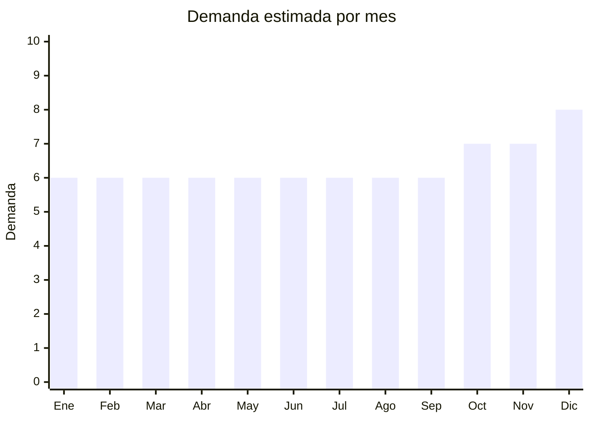

# Tela no tejida / friselina (TNT)

> **Capítulo NCM 56** — Guata, fieltro y telas sin tejer | **Temporada:** Atemporal

## Qué es y por qué importarlo

La friselina (tela no tejida / TNT - Tejido No Tejido) es un textil producido sin tejer ni tricotar, usado en confección (entretela), bolsas ecológicas para comercios, embalaje, cotillón y uso sanitario. Se vende por metros/rollos o como bolsas terminadas. China produce friselina de 45g a 120g/m² a costos muy competitivos. Las bolsas de friselina para comercios son el producto estrella del segmento.

## Datos clave

| Dato | Valor |
|------|-------|
| **Posiciones NCM típicas** | 5603.12.00 (tela sin tejer 25-70g/m²), 5603.13.00 (70-150g/m²) |
| **Derecho de importación** | 18% (DIE) + 3% tasa estadística |
| **Rango FOB típico** | USD 0.02 — USD 0.15 por bolsa; USD 0.50 — USD 2.00 por metro de rollo |
| **Precio de venta en Argentina** | ARS 1.500 — ARS 6.000 por pack x100 bolsas |
| **Margen bruto estimado** | 150% — 300% |
| **MOQ típico** | 1,000 — 10,000 unidades (bolsas) |
| **Demanda en MercadoLibre** | Alta (32,600+ resultados) |
| **Competencia en MercadoLibre** | Media-Alta |
| **Dificultad para importar** | Fácil |
| **Certificaciones necesarias** | Etiquetado textil básico |
| **Antidumping** | No |

## Variantes y subtipos más comunes

| Subtipo / Variante | FOB aprox. | Venta AR aprox. | Nota |
|--------------------|-----------|-----------------|------|
| Bolsas friselina riñón 20x30cm x100 | USD 2.00 — 5.00 | ARS 2.500 — 6.000 | **Producto estrella** |
| Bolsas friselina con asa x50 | USD 3.00 — 7.00 | ARS 4.000 — 10.000 | Comercios |
| Friselina rollo 120g x30 metros | USD 10.00 — 25.00 | ARS 15.000 — 40.000 | Confección |
| Friselina por metro (80g/m²) | USD 0.50 — 1.00/m | ARS 800 — 2.000/m | Costura |
| Bolsas TNT personalizables con logo | USD 0.10 — 0.30/u | ARS 500 — 1.500/u | B2B marca |

## Regulaciones y requisitos

<Tabs>
  <Tab title="Certificaciones">
    Sin certificaciones especiales.
  </Tab>
  <Tab title="Etiquetado">
    Composición ("100% Polipropileno" típicamente), gramaje, país de origen.
  </Tab>
  <Tab title="Restricciones">
    Sin restricciones. Producto que se beneficia de la tendencia de reducción de bolsas plásticas.
  </Tab>
</Tabs>

## Logística

| Dato | Valor |
|------|-------|
| **Peso típico por pack x100 bolsas** | 0.50 — 2.00 kg |
| **Volumen típico** | Bajo-Medio (se comprimen) |
| **Fragilidad** | Nula |
| **Envío recomendado** | Marítimo LCL |
| **Tiempo total estimado** | 50 — 80 días (marítimo) |

## Estacionalidad



| Aspecto | Detalle |
|---------|---------|
| **Meses pico** | Octubre-Diciembre (comercios preparan stock para fiestas) |
| **Meses valle** | Demanda muy estable todo el año |

## Ventajas y riesgos

<CardGroup cols={2}>
  <Card title="Ventajas" icon="circle-check">
    - FOB extremadamente bajo
    - Demanda masiva B2B (comercios)
    - Tendencia eco-packaging
    - Personalizable con logo
    - Alta rotación
  </Card>
  <Card title="Riesgos" icon="triangle-exclamation">
    - Ticket muy bajo
    - Necesita volumen para justificar flete
    - Competencia con fabricantes locales
    - Producto commodity (poca diferenciación)
  </Card>
</CardGroup>

## Palabras clave para buscar en Alibaba

```
non woven bag wholesale, TNT fabric roll, nonwoven fabric 80gsm, polypropylene bag,
eco bag non woven, reusable shopping bag nonwoven, custom non woven bag
```

## Fuentes

- [MercadoLibre Argentina — Bolsas friselina](https://listado.mercadolibre.com.ar/bolsas-friselina)
- [Alibaba — Non woven bag wholesale](https://www.alibaba.com/showroom/non-woven-bag-wholesale.html)
