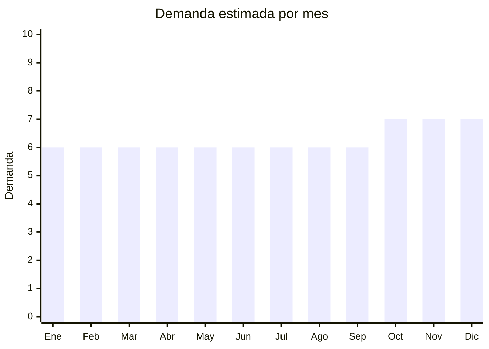

# Paños y trapos de microfibra

> **Capítulo NCM 56** — Guata, fieltro y telas sin tejer | **Temporada:** Atemporal

## Qué es y por qué importarlo

Los paños de microfibra son tejidos sintéticos (80% poliéster / 20% poliamida típicamente) utilizados para limpieza doméstica, automotor (detailing), industrial y profesional. Se venden por packs de 5-10 unidades. China domina la producción mundial de microfibra con FOB extremadamente bajo (USD 0.10-0.50 por unidad).

El producto tiene altísima rotación — es de consumo recurrente ya que los paños se desgastan con el uso y deben reponerse. El nicho de detailing automotor es un segmento premium donde paños de microfibra especializados (GSM alto, sin bordes) se venden a mayor precio.

## Datos clave

| Dato | Valor |
|------|-------|
| **Posiciones NCM típicas** | 6307.10.00 (trapos para limpieza de materias textiles) |
| **Derecho de importación** | 20% (DIE) + 3% tasa estadística |
| **Rango FOB típico** | USD 0.10 — USD 0.50 por unidad |
| **Precio de venta en Argentina** | ARS 3.000 — ARS 8.000 por pack x10 |
| **Margen bruto estimado** | 200% — 400% |
| **MOQ típico** | 500 — 2,000 unidades |
| **Demanda en MercadoLibre** | Muy Alta (18,600+ resultados) |
| **Competencia en MercadoLibre** | Media-Alta |
| **Dificultad para importar** | Fácil |
| **Certificaciones necesarias** | Etiquetado textil (composición fibra) |
| **Antidumping** | No |

## Variantes y subtipos más comunes

| Subtipo / Variante | FOB aprox. | Venta AR aprox. | Nota |
|--------------------|-----------|-----------------|------|
| Pack x10 paños microfibra 30x30cm | USD 1.00 — 2.50 | ARS 3.000 — 6.000 | **Más vendido** |
| Pack x5 paños microfibra 40x40cm | USD 1.00 — 2.00 | ARS 2.500 — 5.000 | Tamaño estándar |
| Paño microfibra premium detailing auto (400+ GSM) | USD 0.40 — 1.00/u | ARS 1.500 — 4.000/u | Nicho premium |
| Paño microfibra doble cara 40x80cm | USD 0.30 — 0.80/u | ARS 1.000 — 3.000/u | Limpieza profunda |
| Gamuza sintética secado rápido | USD 0.30 — 0.80/u | ARS 1.500 — 4.000/u | Auto/vidrios |

## Regulaciones y requisitos

<Tabs>
  <Tab title="Certificaciones">
    Sin certificaciones especiales más allá del etiquetado textil obligatorio.
  </Tab>
  <Tab title="Etiquetado">
    **Obligatorio (Res. 287/2000 + IRAM 12560):** composición de fibra (ej: "80% Poliéster, 20% Poliamida"), país de origen, datos del importador.
  </Tab>
  <Tab title="Restricciones">
    Sin restricciones especiales. Sin antidumping.
  </Tab>
</Tabs>

## Logística

| Dato | Valor |
|------|-------|
| **Peso típico por pack x10** | 0.15 — 0.40 kg |
| **Volumen típico** | Bajo (se comprimen) |
| **Fragilidad** | Nula |
| **Envío recomendado** | Marítimo LCL para volumen; Aéreo para lotes chicos |
| **Tiempo total estimado** | 15 — 25 días (aéreo) / 50 — 80 días (marítimo) |

## Estacionalidad



| Aspecto | Detalle |
|---------|---------|
| **Meses pico** | Demanda extremadamente estable todo el año. Leve incremento oct-dic por limpieza de fin de año |
| **Meses valle** | No hay — producto de consumo constante |

## Ventajas y riesgos

<CardGroup cols={2}>
  <Card title="Ventajas" icon="circle-check">
    - FOB extremadamente bajo
    - Altísima rotación (recompra constante)
    - Liviano y comprimible
    - Sin regulaciones complejas
    - Nicho detailing auto con margen premium
  </Card>
  <Card title="Riesgos" icon="triangle-exclamation">
    - Competencia de precio alta
    - Calidad variable (GSM, absorción)
    - Ticket promedio bajo
    - Marcas locales (Laffitte, Vileda) establecidas
  </Card>
</CardGroup>

## Palabras clave para buscar en Alibaba

```
microfiber cloth wholesale, microfiber cleaning towel, car detailing microfiber,
400 GSM microfiber cloth, microfiber pack 10, cleaning cloth bulk
```

## Fuentes

- [MercadoLibre Argentina — Paños microfibra](https://listado.mercadolibre.com.ar/panos-microfibra)
- [Alibaba — Microfiber cloth wholesale](https://www.alibaba.com/showroom/microfiber-cloth-wholesale.html)
