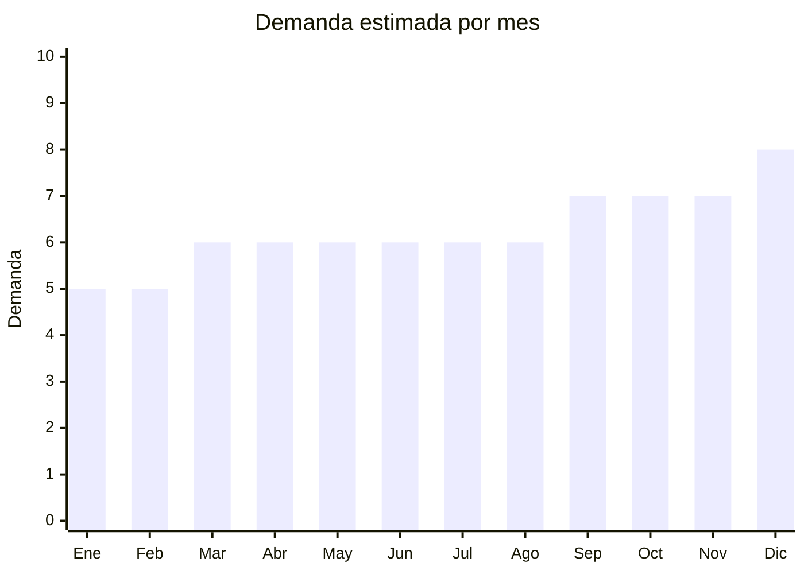

# Alfombras de baño (memory foam / antideslizantes)

> **Capítulo NCM 57** — Alfombras y demás revestimientos textiles para el suelo | **Temporada:** Atemporal

## Qué es y por qué importarlo

Las alfombras de baño incluyen alfombras de memory foam con base antideslizante, alfombras de microfibra absorbente, alfombras de chenille y sets de baño (alfombra + contorno inodoro). Los tamaños estándar son 40x60cm y 50x80cm. Memory foam es el material tendencia por su confort y absorción.

## Datos clave

| Dato | Valor |
|------|-------|
| **Posiciones NCM típicas** | 5703.30.00 (alfombras con mechón insertado), 5705.00.00 (demás alfombras) |
| **Derecho de importación** | 20% (DIE) + 3% tasa estadística |
| **Rango FOB típico** | USD 1.50 — USD 5.00 por unidad |
| **Precio de venta en Argentina** | ARS 5.000 — ARS 18.000 |
| **Margen bruto estimado** | 150% — 300% |
| **MOQ típico** | 100 — 500 unidades |
| **Demanda en MercadoLibre** | Alta |
| **Competencia en MercadoLibre** | Media |
| **Dificultad para importar** | Fácil |
| **Certificaciones necesarias** | Etiquetado textil |
| **Antidumping** | No |

## Variantes y subtipos más comunes

| Subtipo / Variante | FOB aprox. | Venta AR aprox. | Nota |
|--------------------|-----------|-----------------|------|
| Alfombra baño memory foam 40x60cm | USD 1.50 — 3.00 | ARS 5.000 — 10.000 | **Más vendido** |
| Alfombra baño memory foam 50x80cm | USD 2.50 — 5.00 | ARS 8.000 — 15.000 | Tamaño grande |
| Set baño x2 (alfombra + contorno) | USD 3.00 — 7.00 | ARS 8.000 — 18.000 | Pack completo |
| Alfombra baño microfibra chenille | USD 1.00 — 3.00 | ARS 4.000 — 10.000 | Económica |
| Alfombra antideslizante ducha (PVC) | USD 0.50 — 2.00 | ARS 3.000 — 8.000 | Seguridad |

## Regulaciones y requisitos

<Tabs>
  <Tab title="Certificaciones">
    Sin certificaciones especiales. La base antideslizante es una característica de producto, no un requisito regulatorio.
  </Tab>
  <Tab title="Etiquetado">
    Composición de fibra, tamaño, país de origen, datos importador.
  </Tab>
  <Tab title="Restricciones">
    Sin restricciones especiales.
  </Tab>
</Tabs>

## Logística

| Dato | Valor |
|------|-------|
| **Peso típico por unidad** | 0.30 — 1.00 kg |
| **Volumen típico** | Bajo-Medio |
| **Fragilidad** | Baja |
| **Envío recomendado** | Marítimo LCL |
| **Tiempo total estimado** | 50 — 80 días (marítimo) |

## Estacionalidad



| Aspecto | Detalle |
|---------|---------|
| **Meses pico** | Septiembre-Diciembre (renovación hogar, regalos) |

## Ventajas y riesgos

<CardGroup cols={2}>
  <Card title="Ventajas" icon="circle-check">
    - Producto de compra recurrente
    - Memory foam: alto valor percibido
    - Compacto (flete razonable)
    - Sin regulaciones complejas
  </Card>
  <Card title="Riesgos" icon="triangle-exclamation">
    - Memory foam de baja calidad pierde forma rápido
    - Base antideslizante puede despegarse
    - Competencia con marcas locales
  </Card>
</CardGroup>

## Palabras clave para buscar en Alibaba

```
memory foam bath mat wholesale, bathroom rug non slip, bath mat set,
chenille bathroom rug, absorbent bath mat, toilet mat set
```

## Fuentes

- [MercadoLibre Argentina — Alfombra baño](https://listado.mercadolibre.com.ar/alfombra-bano-memory-foam)
- [Alibaba — Bath mat wholesale](https://www.alibaba.com/showroom/bath-mat-wholesale.html)
