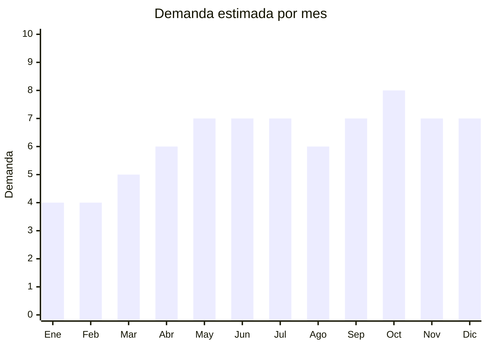

# Alfombras de pelo largo (shaggy / nórdicas)

> **Capítulo NCM 57** — Alfombras y demás revestimientos textiles para el suelo | **Temporada:** Atemporal

## Qué es y por qué importarlo

Las alfombras de pelo largo (shaggy) incluyen alfombras tipo nórdica de pelo suave, alfombras de pelo rizado (Berber), alfombras faux fur y alfombras de felpa gruesa. Los tamaños más vendidos son 140x200cm, 200x100cm y 60x40cm (pie de cama). China (Yiwu, Nantong, Tianjin) produce alfombras a costos muy competitivos.

La tendencia decorativa nórdica/escandinava convirtió estas alfombras en piezas clave de decoración. El valor percibido es alto comparado con el FOB.

## Datos clave

| Dato | Valor |
|------|-------|
| **Posiciones NCM típicas** | 5703.30.00 (alfombras de fibras sintéticas con mechón insertado) |
| **Derecho de importación** | 20% (DIE) + 3% tasa estadística |
| **Rango FOB típico** | USD 3.00 — USD 25.00 por unidad (según tamaño) |
| **Precio de venta en Argentina** | ARS 8.000 — ARS 60.000 |
| **Margen bruto estimado** | 150% — 300% |
| **MOQ típico** | 50 — 300 unidades |
| **Demanda en MercadoLibre** | Muy Alta (132,000+ resultados "alfombra") |
| **Competencia en MercadoLibre** | Alta |
| **Dificultad para importar** | Moderada (volumen) |
| **Certificaciones necesarias** | Etiquetado textil (composición fibra) |
| **Antidumping** | Verificar NCM exacto (no hay específico general) |

## Variantes y subtipos más comunes

| Subtipo / Variante | FOB aprox. | Venta AR aprox. | Nota |
|--------------------|-----------|-----------------|------|
| Alfombra shaggy 60x40cm (pie de cama) | USD 2.00 — 5.00 | ARS 5.000 — 12.000 | Impulso |
| Alfombra nórdica pelo largo 140x200cm | USD 10.00 — 25.00 | ARS 25.000 — 60.000 | **Más vendido** |
| Alfombra shaggy 200x100cm | USD 8.00 — 18.00 | ARS 15.000 — 40.000 | Living |
| Alfombra faux fur redonda 120cm | USD 5.00 — 12.00 | ARS 10.000 — 25.000 | Deco/Instagram |
| Alfombra Berber/rizada 160x230cm | USD 12.00 — 30.00 | ARS 30.000 — 70.000 | Premium |

## Regulaciones y requisitos

<Tabs>
  <Tab title="Certificaciones">
    Sin certificaciones especiales más allá del etiquetado textil.
  </Tab>
  <Tab title="Etiquetado">
    **Obligatorio:** Composición de fibra (ej: "100% Polipropileno", "100% Poliéster"), tamaño, país de origen, datos importador.
  </Tab>
  <Tab title="Restricciones">
    Verificar NCM exacto para antidumping. No hay antidumping general sobre alfombras textiles chinas, pero siempre confirmar la posición específica.
  </Tab>
</Tabs>

## Logística

| Dato | Valor |
|------|-------|
| **Peso típico por unidad** | 1.00 — 8.00 kg (según tamaño) |
| **Volumen típico** | Alto (alfombras grandes son voluminosas enrolladas) |
| **Fragilidad** | Baja |
| **Envío recomendado** | Marítimo LCL/FCL |
| **Tiempo total estimado** | 50 — 80 días (marítimo) |

<Warning>
Las alfombras grandes son **pesadas y voluminosas**. Una alfombra 200x140cm pesa 4-8 kg enrollada. El flete marítimo se cobra por CBM o peso, lo que sea mayor. Calcular cuidadosamente el costo logístico antes de importar tamaños grandes.
</Warning>

## Estacionalidad



| Aspecto | Detalle |
|---------|---------|
| **Meses pico** | Mayo-Julio (invierno — buscan calidez), Septiembre-Octubre (primavera — renovación deco) |
| **Meses valle** | Enero-Febrero (verano — menos interés en alfombras) |

## Ventajas y riesgos

<CardGroup cols={2}>
  <Card title="Ventajas" icon="circle-check">
    - Alto valor percibido vs FOB
    - Tendencia nórdica consolidada
    - Producto de decoración aspiracional
    - Márgenes atractivos en tamaños grandes
  </Card>
  <Card title="Riesgos" icon="triangle-exclamation">
    - Pesado y voluminoso (flete alto)
    - Competencia alta en MercadoLibre
    - Tamaño y color pueden no coincidir con expectativas
    - Difícil de devolver (costos logísticos de reverse)
  </Card>
</CardGroup>

## Palabras clave para buscar en Alibaba

```
shaggy rug wholesale, long pile carpet, faux fur rug, Nordic style rug,
soft plush carpet, fluffy area rug, polyester shaggy carpet
```

## Fuentes

- [MercadoLibre Argentina — Alfombras pelo largo](https://listado.mercadolibre.com.ar/alfombra-pelo-largo)
- [Alibaba — Shaggy rug wholesale](https://www.alibaba.com/showroom/shaggy-rug-wholesale.html)
